# AtomとMarkDownを使用する(for Windows)
1. [Install Atom](#install-atom)
2. [Short Cuts](#short-cuts)
3. [Setup](#setup)  
 3-1. [ATOMToJapanese](#atomtojapanese)  
 3-2. [PDF](#pdf)
4. [MarkDown](#markdown)
5. [CreateRepos](#CreateRepos)
6. [Git Install and Clone](#Git-install-and-clone)

※ページ内リンクは、日本語ではうまくいかなかった(日本語化していない状態です。)
## Install Atom
[Atomのダウンロード先](https://atom.io/)にアクセスして、対象のファイルをダウンロードします。
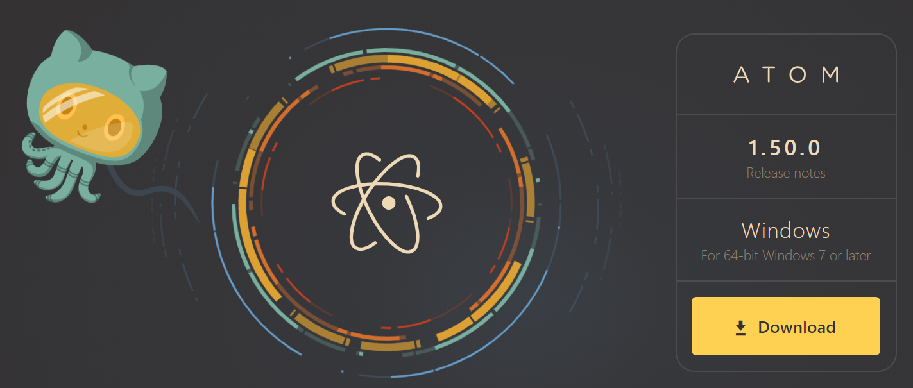

インストーラーをダウンロードできるので、簡単にインストールできます。ただし、Cドライブにインストールされてしまいます。
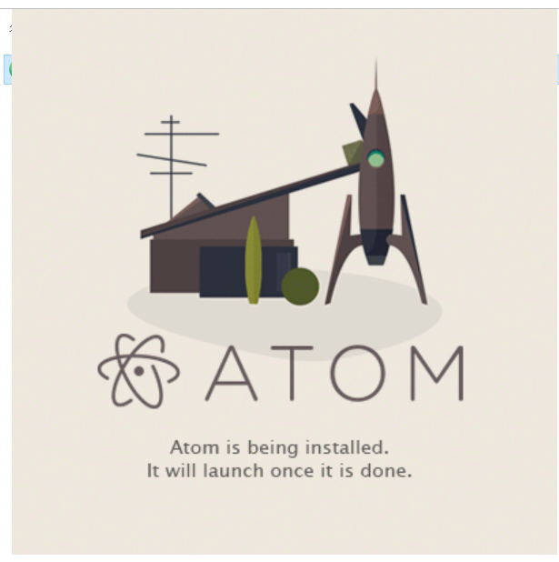

## Short Cuts
* プレビュー：Controll + Shift + M
* 設定：Controll + カンマ
* GitTab(Repository作成)：Controll + Shift + 9
* コマンドパレット: Controll + Shif + P  
  -> 色んなコマンド実行のリストが表示され、実行も可能
* プロジェクトフォルダ追加: Controll + Shit + A

## Setup
### AtomToJapanese
1. ヘッダメニュー、「Package -> Setting View -> install Packages/Themes」をクリック
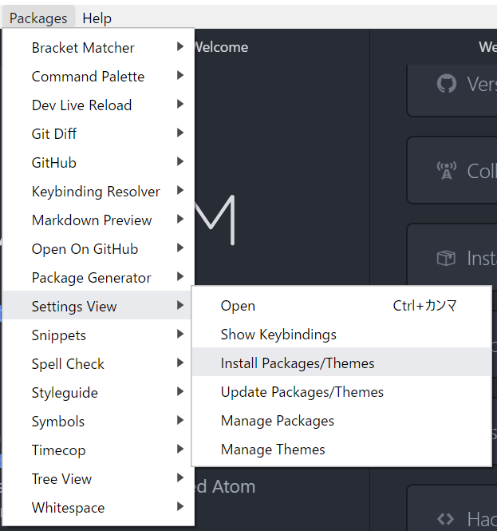
2. 検索部分に「japanese-menu」を入力。

3. 下のような画面が見れるのでインストールする

## PDF
1. パッケージのインストールを行います。日本語化の時と同様に検索部分に「md pdf」と入力すると、下のような画面が見れます。
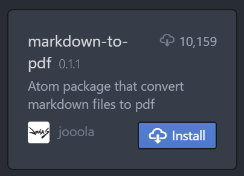
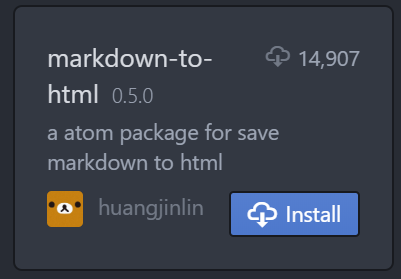
2. インストールされたら、下のように表示されます。htmlに関しても同様です。  

3. 使用するときは、ヘッダメニューから下のように選択して使用します。  
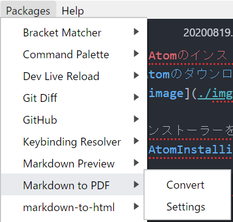

※PDFファイルを出力するときには、 [Abobe Acrobat Reader](https://acrobat.adobe.com/jp/ja/acrobat/pdf-reader.html?gclid=CjwKCAjwyo36BRAXEiwA24CwGTAkZGS3cYaC4rMrHb0gzrVbn4Yu5-X8cgXY0wJiSOxqiOslEPvpdBoCj30QAvD_BwE&mv=search&sdid=5JRH8JQH&ef_id=CjwKCAjwyo36BRAXEiwA24CwGTAkZGS3cYaC4rMrHb0gzrVbn4Yu5-X8cgXY0wJiSOxqiOslEPvpdBoCj30QAvD_BwE:G:s&s_kwcid=AL!3085!3!457428843740!b!!g!!%2Bpdf%20%2Breader!8270482224!84876563226)が必要なようです。
## 絵文字の設定
**現在調査中**
1. JSなどでインポートして使用
2. 絵文字定義ファイルをダウンロードして使用する

## MarkDown

| No | MDの記述 | 意味 |
| -- | ------- | ---- |
| 1  | #       | 見出し |
| 2  | - / *   | リスト |
| 3  | 1.      | 番号付きリスト |
| 4  | >       | 引用 |
| 5  | ** / __ | 強調 |
| 6  | *  / _  | イタリック |
| 7  | *** / --- | 水平線 |
| 8  | \\(バックスラッシュ) | エスケープ文字 |
| 9  | * [x]   | チェックリスト |
| 10  | ```     | コードブロック |
| 11  | ~~       | 打消し |
| 12  | \[リンク名\]\(URL\) | URLリンク |
| 13  | \<http:\//xxxx.com> | URLリンク |
| 14  | \!\[代替え文書\]\(画像URI\) | 画像参照 |
| 15  | :emoji名:       | 絵文字～調査中～ |
| 16  |   (末尾にスペース二つ)       | 改行する |

1. 見出し
# Hader1(#)
## Header2(##)
### Header3(###)
#### Header4(####)
##### Header5(#####)

2. リスト
 - アイテム1
    - アイテム2
 - アイテム3
  - アイテム4
    - アイテム5  
※スペースを入れることでインデントできる


 * アイテム１
 * アイテム２
 = 補助情報
 * アイテム３
 :詳細などを記載する
 * **ウルトラマン**
 M78星雲からやってきた正義のヒーロー

3. 番号付きリスト
 1. リスト1
  2. リスト2
 3. リスト3
 4. リスト4  
※スペースを入れることでインデントできる

4. 引用
> 引用文章です

5. 強調  
**強調文言**
6. イタリック
*Itaric font*
7. 水平線

\*\*\*
***
\---

---
8. エスケープ文字

9. チェックリスト
* [x] test1
* [x] test2
 * [ ] test2.1
 * [ ] test2.2
 * [ ] test2.3
* [ ] test3

10. コードブロック
```
public static void main(String[] args) {
   System.out.println("Hello World!");
}
```
11. 打消し戦
~打消し戦のサンプル~
12. URLリンク
[PGボックスのURL](https://zenryokuservice.com)
13. <https://zenryokuservice.com>
14. 画像参照
\!\[Test\]\(img/Test.png\)
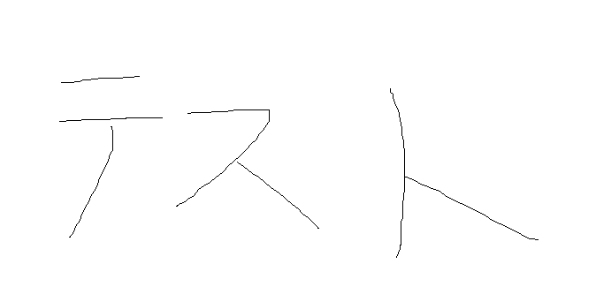
15. ~絵文字~ 調査中
:smile:

## CreateRepos
参照＝[Atomのリファレンスページ](https://flight-manual.atom.io)


1. ヘッダーメニューの「Packages -> Github -> Toggle Git Tab」をクリック
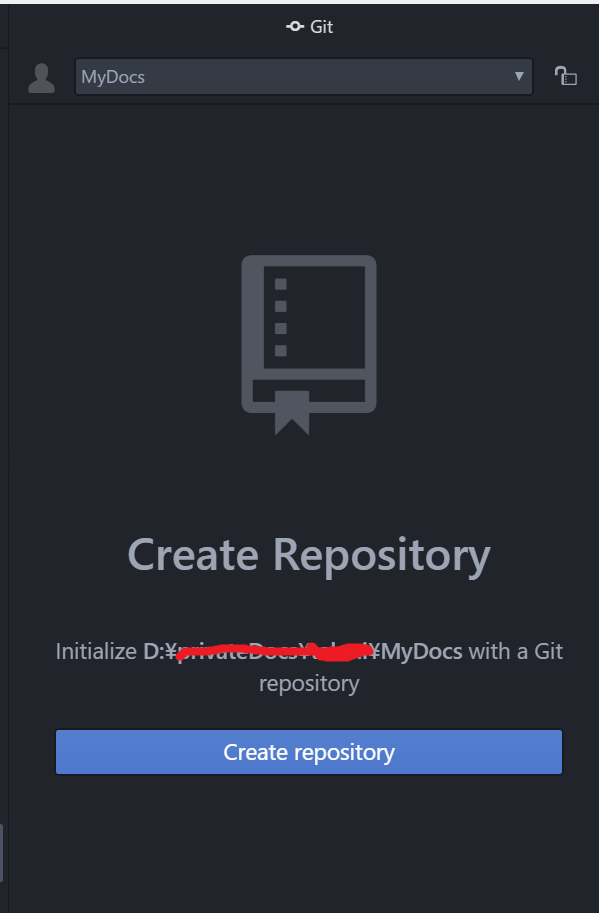

2. Create reposotoryをクリックして「+Init」をクリック
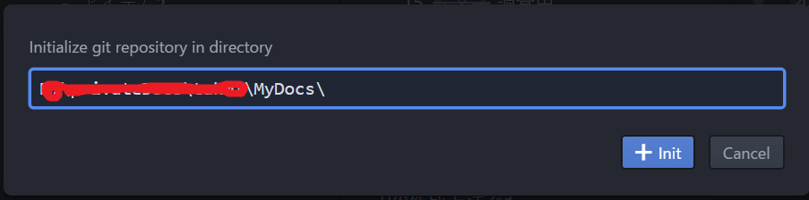

3. すると以下のように「.git」フォルダが作成され、下のような画面が表示される
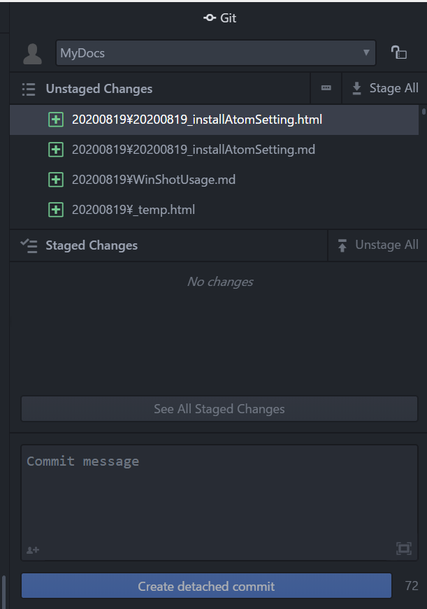
※正しい手順ではからの状態が望ましい

4. 「Unstaged」となっているのでこれらを「Staged」にする

## Git Install and Clone
上の手順で操作がうまくいかないときやCloneができないときは素直にコマンド実行したほうが早いので、その手順を記載します。

### Git install
1. [Gitのサイト](https://gitforwindows.org/)からアプリをダウンロードします。
2. インストーラがダウンロードできるので、そのままインストール(ダブルクリック)
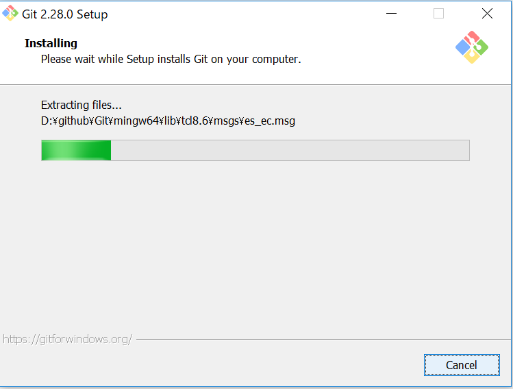   
※インストール画面ではすべてデフォルトでOK(そのまま次へ)
3. インストールが終わったら、ウィンドウズボタン+Rでコマンドプロンプトを開きます。
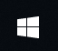 + R  
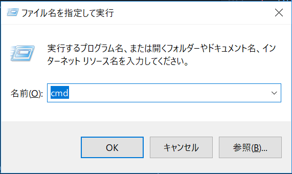
4. そしてgitコマンドでインストール確認
＞ ```git -V``` 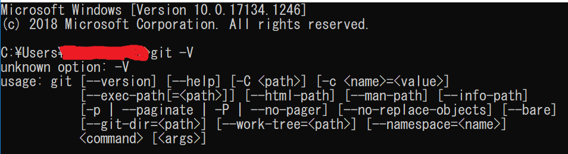

### リポジトリのクローン
**これは自分の場合です。**
コマンドプロンプトを立ち上げたらCドライブにいるので(カレントディレクトリがCドライブなので)以下のコマンドでDドライブに移動します。
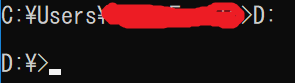

1. インストールしたgitに環境変数を設定します。(パスを通すなどと言ったりします。)
コントロールパネルを開き、検索部分に「環境変数」と入力すると候補が出てくるので「環境変数」を選択します。
そして、**自分(ウィンドウズユーザー)だけで使用するのなら「ユーザー環境変数」**
このPC全体で使用するのならシステム環境変数に設定します。
2. Github(ウェブサイト)に作成したリポジトリ(リモートリポジトリ)のURLをコピーして、ローカルリポジトリへ(自分のPCへ)クローンします。
  * ローカルリポジトリを配置するディレクトリに移動
    ```
    cd D:\privateDocs\MyDoc
    ```
  * git clone リモートリポジトリのURL
  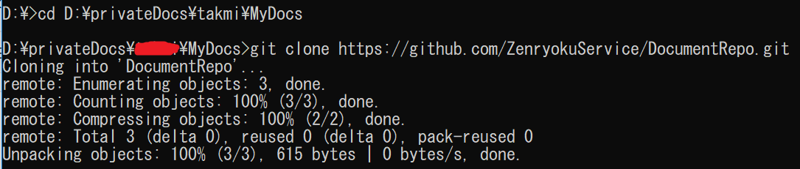
3. リポジトリをクローン出来たか確認
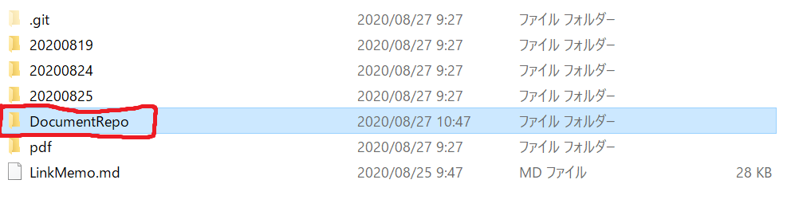

想定では、MyDocディレクトリをリポジトリとして使用したかったのですが、このディレクトリにリポジトリが作成されました。。。
まぁ、よしとして続けます。
今まで作成したドキュメントをコミットしたいのでこれらのファイルをリポジトリのディレクトリに移動します。
すると下のように、**Unstaged**とか**Staged**の文言を見ることができます。
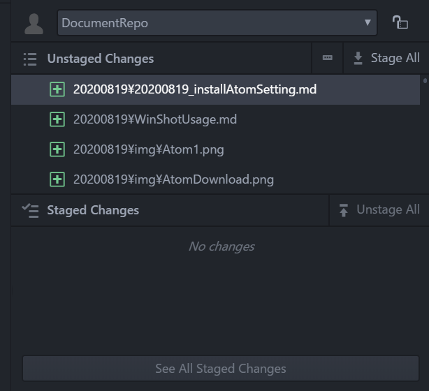
これらを選択、みぎっクリックすると下のような画面が見れます。
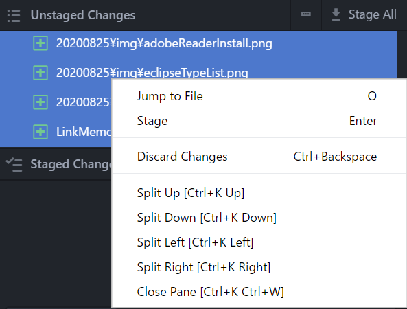
そして、Stageを選択、コミットします。
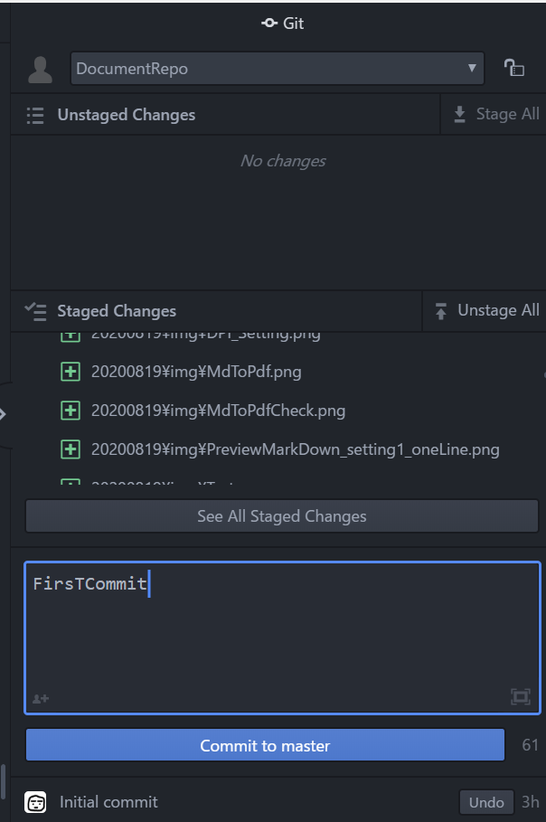
すると、下のエラーが出ました。
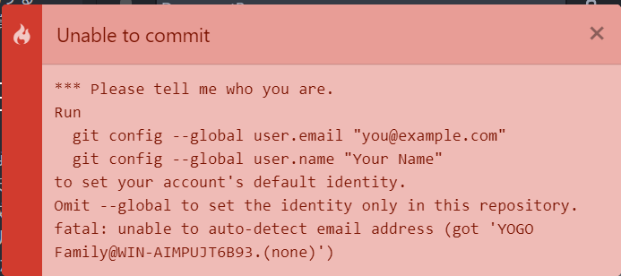

ちなみにうまくいった場合は、下のようにAtom側からPUSH出来ました。
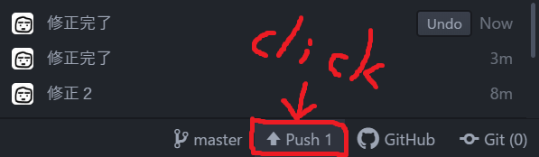

### GitError
上のエラーに対する対応を行います。結論から言うとユーザー情報が設定されていないので、それを設定します。コマンドは以下の通り
```
git --global user.email "自分のEメール"
git --global user.name "Githubのユーザー名"
```
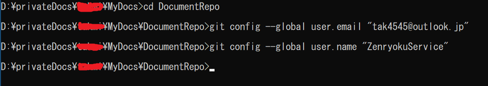

これで、コミットができました。しかし、これではローカルリポジトリに登録されただけなので、PUSHしてリモートリポジトリへ登録してやる必要があります。
```
git push
```
その実行結果が下のようになります。※Githubとコマンプロンプトを重ねてキャプチャしました。
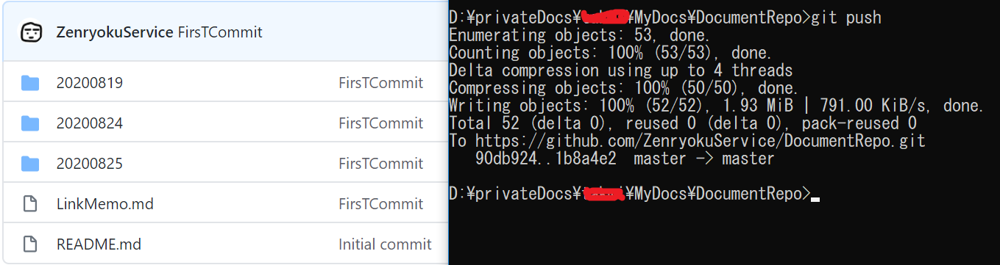

## コマンドのみでコミット
1. 「git status」で未コミットファイルを確認
2. 「git commit」で全体のコミット　※今回はファイル一つなので後ろにファイルのパスをつける
3. 「git commit -m "メッセージ"」コミットコメントをつける、上のものと使い分けるようにする
4. コミットしたらあとはPUSH

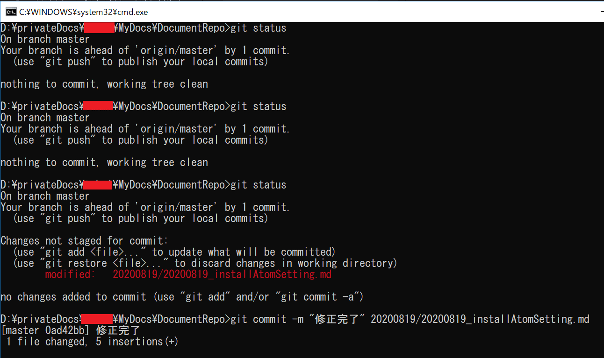
