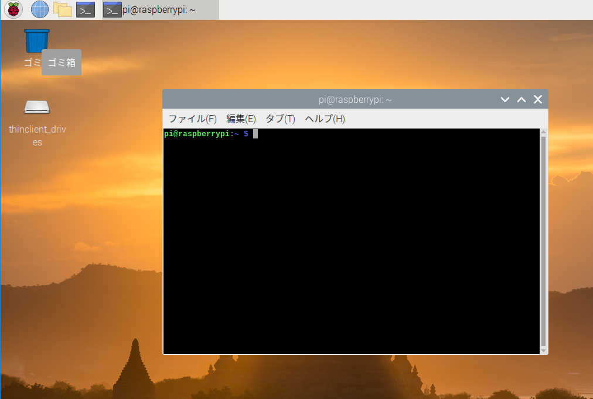
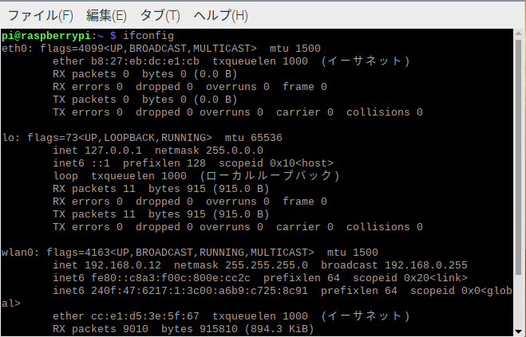
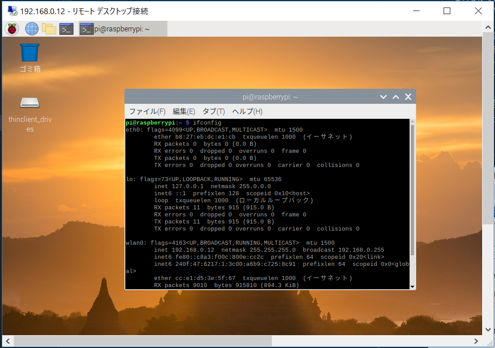
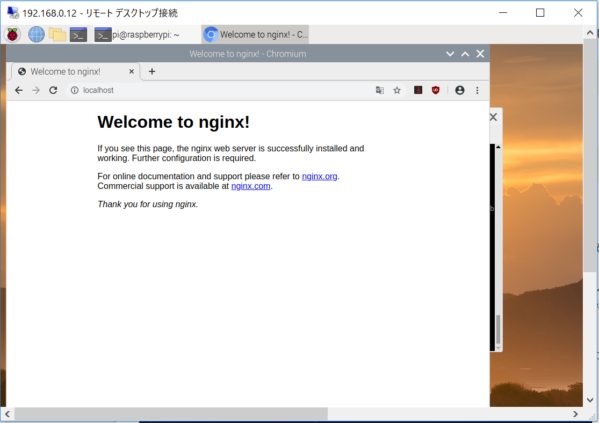

## Index
1. [ラズパイにリモートデスクトップ接続](#access-rpi)
2. [ラズパイのセッティング](#rpi-setting)
3. [ウェブサーバーのインストール](#instll-web-server)
4. [PHPのインストール](#install-php)
5. [ラズパイ起動時にサーバー起動の設定](#execute-on-start)
6. [Javaのインストール](#install-java)

ちなみに以下のアプリ(コマンド)はインストール済みでした。
* gitコマンド


# Access RPi
**ラズパイにリモートデスクトップ接続する方法**
[こちらのサイト](https://www.fabshop.jp/%E3%83%AA%E3%83%A2%E3%83%BC%E3%83%88%E3%83%87%E3%82%B9%E3%82%AF%E3%83%88%E3%83%83%E3%83%97%E3%81%A7%E3%80%81%E3%82%AD%E3%83%BC%E3%83%9C%E3%83%BC%E3%83%89%E3%80%81%E3%83%9E%E3%82%A6%E3%82%B9%E3%80%81/)を参考に実行してみました。

## RPi Setting
ラズパイのセッティングを行います。

1. ラズパイを起動して、コマンド画面(Terminal)を開きます。


2. 以下のコマンドを入力、Enterを押下
```
sudo apt-get install tightvncserver -y
```
コマンドの実行中に**y/n**の入力を求められるので「y」を入力します

3. 同様に以下のコマンドを入力
```
sudo apt-get install xrdp
```

4. 上のコマンド実行が終わったら、ラズパイの使用しているネットワークとIPアドレスを調べます。※192.168.0.10とあります。
具体的には、下のような形で確認、メモします。

  * Terminalで「ifconfig」とコマンドを入力すると上のように表示されるので、以下のパターン別に見分けます。
    1. LANケーブルの場合: eth0:の部分にある「inet」をみる。ちなみに上のキャプチャはWifi接続なので「inet」の部分がありません。
    2. Wifi接続の場合: wlan0:の部分にある「inet」をみる。キャプチャには接続しているので「inet」があります。そして「192.168.0.12」と表示されています。これをメモリます。
5. 改めてWindowsを立ち上げ、ラズパイは、ディスプレイを接続しない形で、再度立ち上げなおし(起動しなおし)**「アクセサリ　-> リモートデスクトップ接続」**のようにアプリを起動します。
6. 下のような画面が出るので先ほどメモしたIPアドレスを入力します。


そして接続してみると下のような画面が見れます。


これで、今後ラズパイ用ののディスプレイ、キーボードなどを用意しなくても、Windowsからリモートでラズパイを操作することができます。一応ですが、
**ラズパイの電源は入れ、ネットワークの接続を行う必要があります。**

## Install Web Server
ウェブサーバーのインストールを行います。参考サイトは[こちら](https://qiita.com/Brutus/items/27525deedb0eea1b35b8)
1. 以下のコマンドを叩きます(入力してEnter押下)
```
sudo apt-get install nginx
```
インストールが終了したら。。。
2. 下のコマンドでサーバーを起動します。※自分の場合はインストールしたら起動していました。。。
```
sudo /etc/init.d/nginx start
```
ブラウザで「localhost」と入力すれば確認できます。


逆に停止するときは下のコマンドです。
```
sudo /etc/init.d/nginx stop
```

## Install PHP
みんながよく使用するので(ウェブ系の人々)一応インストールします。あわよくばWordPressもインストールしようか？と思っています。
シンプルに以下のコマンドでインストールできるようです。
```
sudo apt-get install php
```
インストールの確認は以下のコマンド
```
php -v
```

## Execute On Start
ラズパイ起動時にウェブサーバーを起動する設定を行います。
やることは、OS起動時の設定です。具体的には

## Install Java
Javaのインストール配下のコマンドでOK、下のようなコマンドでインストールを行います。
参考サイトは[こちら](https://linuxize.com/post/install-java-on-raspberry-pi/)です
```
sudo apt install default-jdk
```

しかし、インストールされるのはOpenJDK11, 8なのでネットワーク環境の良いところで実行してください。
でないと、自分のように何時間も待つ羽目になります。。。

そして、実行してみたところ上のコマンドの次に
```
sudo apt install openjdk-8-jdk
```
を実行し、使用するJDKの選択を行う必要がありました。
```
sudo update-alternatives --config java
```
[Alternatives](./img/alternatives.png)
そして、JDK8を選択、javaコマンドが起動できました。
[JavaCommand](./img/javaCommand.png)
