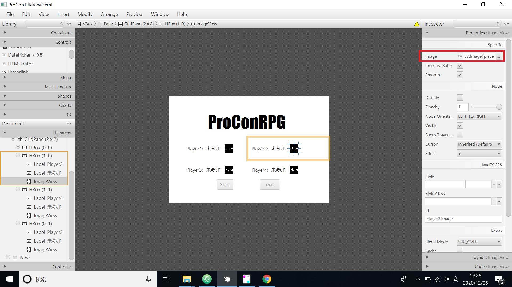
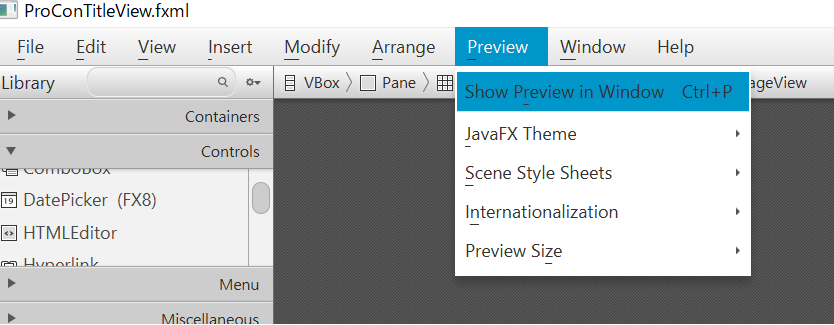
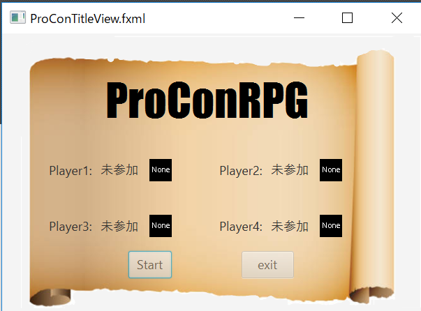

# JavaFX with SceneBuilder
参考サイトはこちら[オラクル・ドキュメント](https://docs.oracle.com/javase/jp/8/javafx/get-started-tutorial/fxml_tutorial.htm)です。

そして、参考になるページをリストアップしておきます。
1. [JavaFX CSSリファレンスガイド](https://docs.oracle.com/javase/jp/8/javafx/api/javafx/scene/doc-files/cssref.html#typeeffect)
2. [CSSによるUIコントロールのスタイル設定](https://docs.oracle.com/javase/jp/8/javafx/user-interface-tutorial/apply-css.htm)
3. [CSSを使用したレイアウト・ペインのスタイル設定](https://docs.oracle.com/javase/jp/8/javafx/layout-tutorial/style_css.htm#JFXLY161)
4. [JavaFX UIコントロールの使用](https://docs.oracle.com/javase/jp/8/javafx/user-interface-tutorial/ui_controls.htm#CIHBGEIH)(ボタンなどのリファレンス)
5. [SceneBuilder User Guide(英語)](https://docs.oracle.com/javase/8/scene-builder-2/user-guide/index.html)


手順としては以下の通りです。
1. SceneBuilderで画面の見た目を作成。
2. 出力したFXMLをJavaプログラムで読み込み画面を表示する
```
@Override
	public void start(Stage primaryStage) throws Exception {
    // 枠なしの画面を作成する
		primaryStage.initStyle(StageStyle.TRANSPARENT);
    // FXMLのロード
		FXMLLoader loader = new FXMLLoader(ClassLoader.getSystemResource("TestingCv.fxml"));
		BorderPane root = (BorderPane) loader.load();
    // シーンに登録、サイズ指定など。。。
		Scene scene = new Scene(root, 800, 600);
		scene.setFill(null);
    // JavaFX CSSの適用
		scene.getStylesheets().add(getClass().getResource("application.css").toExternalForm());
  }
```

## JavaFX CSS
定義したスタイルを適用するのに、ID・クラスを使用します。ここはHTMLで使用するCSSと同じです。
＜CSS(ID)＞
```
#welcome-text {
   -fx-font-size: 32px;
   -fx-font-family: "Arial Black";
   -fx-fill: #818181;
   -fx-effect: innershadow( three-pass-box , rgba(0,0,0,0.7) , 6, 0.0 , 0 , 2 );
}
#actiontarget {
  -fx-fill: FIREBRICK;
  -fx-font-weight: bold;
  -fx-effect: dropshadow( gaussian , rgba(255,255,255,0.5) , 0,0,0,1 );  
}
```

＜CSS(クラス)＞
```
.button { ... }
.check-box { ... }
.scroll-bar { ... }

.check-box .label { ... }
.check-box .box { ... }
.radio-button .dot { ... }

.check-box:focused {
    -fx-color: -fx-focused-base;
}
```

＜Java＞
```
Text scenetitle = new Text("Welcome");
scenetitle.setId("welcome-text");
// IDの割り当て
grid.add(actiontarget, 1, 6);
actiontarget.setId("actiontarget");

// クラスの割り当て
Button buttonAccept = new Button("Accept");
buttonAccept.getStyleClass().add("button1");

// Javaコード内での割り当て
Button buttonColor = new Button("Color");
buttonColor.setStyle("-fx-background-color: slateblue; -fx-text-fill: white;");
```

### 背景イメージの追加
> 背景イメージは.rootスタイルに適用されますが、これはSceneインスタンスのルート・ノードに適用されることを意味します。スタイル定義は、プロパティの名前(-fx-background-image)とプロパティの値(url("background.jpg"))で構成されます。

参考サイトにあるように、下のようなCSSを記述すると背景として画像を指定できるようです。
ファイルのパス指定の時にURLなので「file:」を忘れないようにしましょう。
```
.root {
     -fx-background-image: url("file:C:/documents/background.jpg");
}
```

### SceneBuilderでのイメージ設定
ImageViewを選択し、プロパティを表示し、指定の画像を設定します。



#### イメージの確認
イメージの確認には、「Preview」を使用します。


プレビュー結果



#### ラベルのスタイル設定
同様にラベルの指定方法です。
```
.label {
    -fx-font-size: 12px;
    -fx-font-weight: bold;
    -fx-text-fill: #333333;
    -fx-effect: dropshadow( gaussian , rgba(255,255,255,0.5) , 0,0,0,1 );
}
```

> この例では、フォント・サイズおよびフォントの太さを増し、灰色(#333333)のドロップ・シャドウを適用します。ドロップ・シャドウの目的は、濃い灰色のテキストと薄い灰色の背景の間にコントラストを追加することです。ドロップ・シャドウ・プロパティのパラメータの詳細は、JavaFX CSSリファレンス・ガイドの効果に関する項を参照してください。

#### テキストのスタイル設定
フォントサイズ、フォントファミリ、文字の色を指定した例です。
```
.playerText {
   -fx-font-size: 16px;
   -fx-font-family: "Arial Black";
	 -fx-text-fill: rgb(255, 255, 255);
}

```

#### シーンのスキニング
> .rootスタイル・クラスをカスタマイズすることにより、UIの外観を簡単に変更できます。スタイル・シートのサンプルでは両方とも、フォントのサイズとファミリ、他の色の導出元となる基本色、およびシーンの背景色が設定されています。例37-3に、controlStyle2.cssの.rootスタイルを示します。

* フォントファミリとは
font-familyとは？ 通常のフォントや太字、イタリック体、斜体など、デザインを統一した複数のフォントをまとめたものを「フォントファミリー」といいます。


```
.root{
    -fx-font-size: 16pt;
    -fx-font-family: "Courier New";
    -fx-base: rgb(132, 145, 47);
    -fx-background: rgb(225, 228, 203);
    -fx-background-image: url(/com/sun/javafx/scene/control/skin/Paste.png);
}
```
