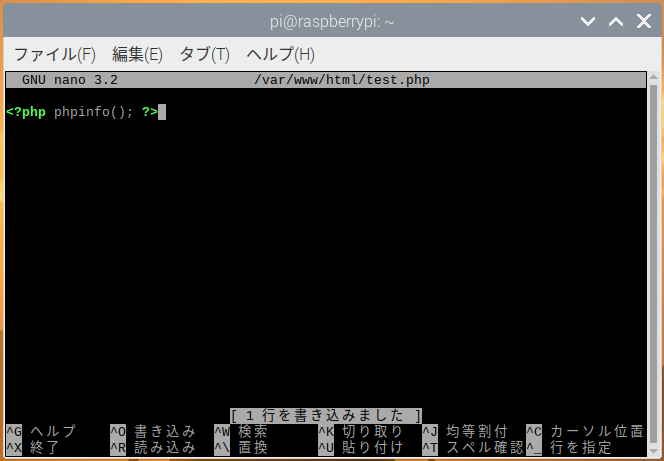
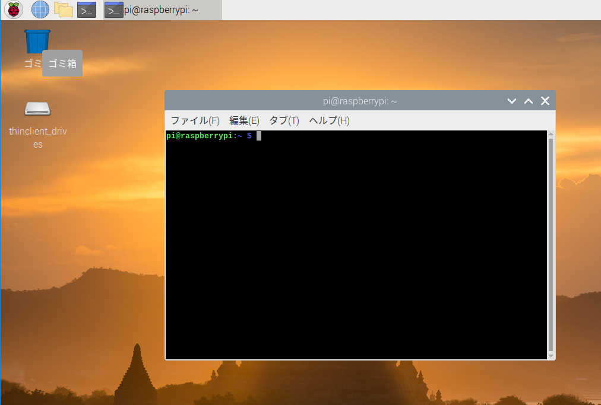
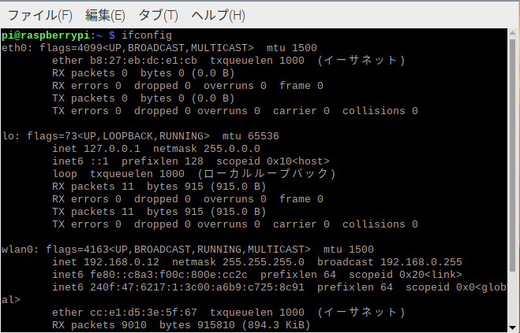
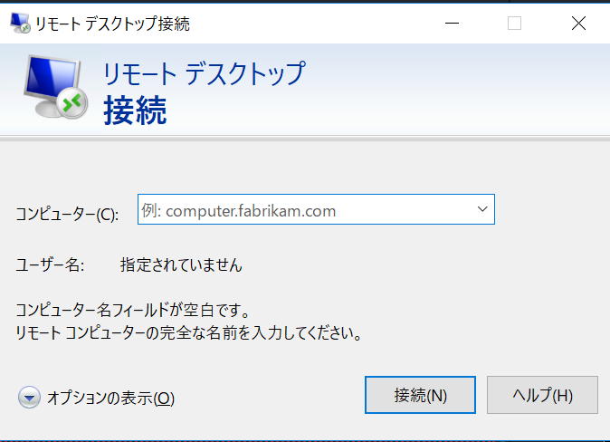
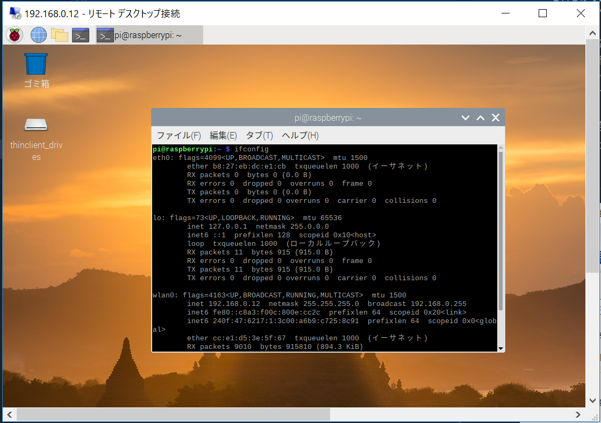
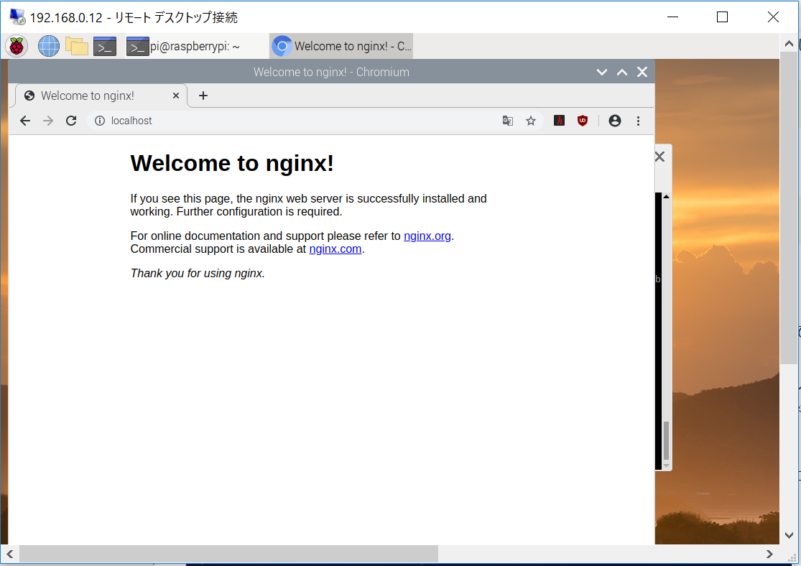
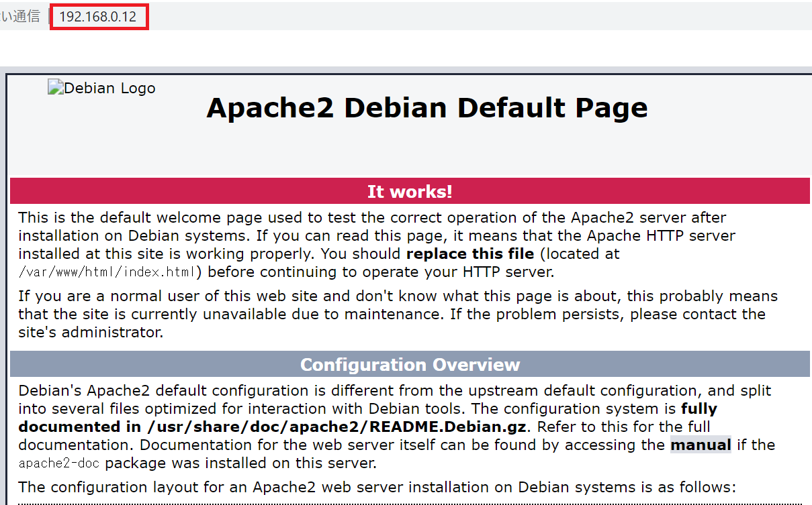
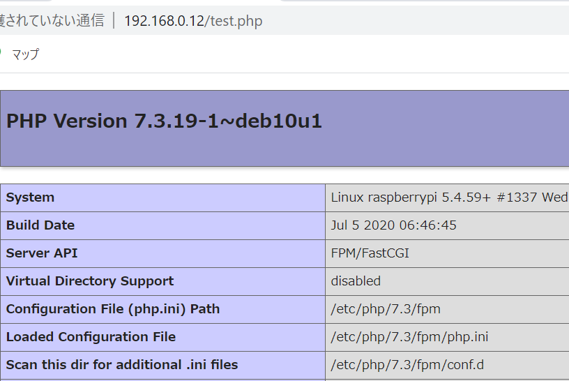
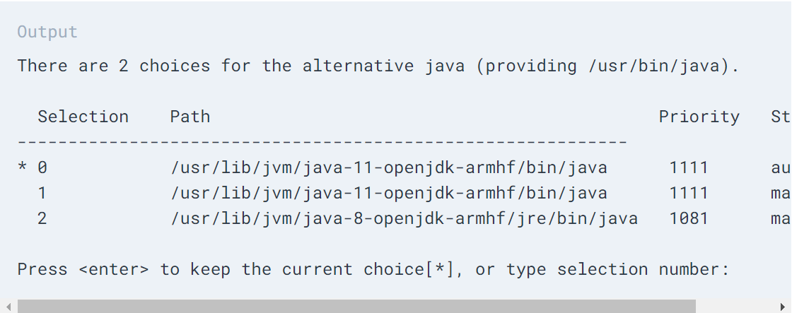
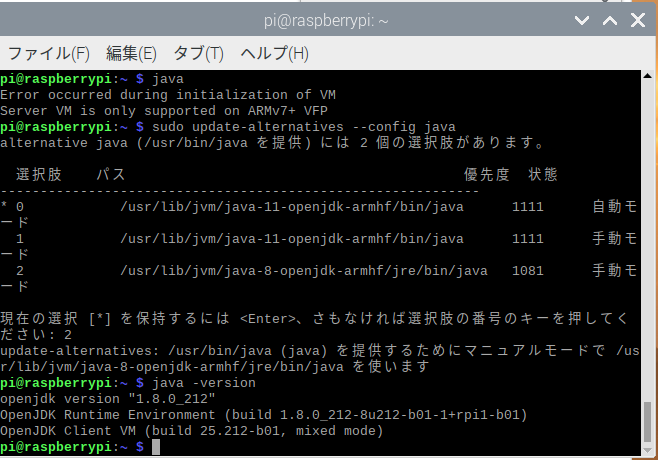

## Index
1. [ラズパイにリモートデスクトップ接続](#access-rpi)
2. [ラズパイのセッティング](#rpi-setting)
3. [ウェブサーバーのインストール](#instll-web-server)
4. [PHPのインストール](#install-php)
5. [ウェブサーバー(Apache2)の設定](#setting-apache)
6. [ウェブサーバー(NGINX)の設定](#setting-nginx)
7. [Javaのインストール](#install-java)

ちなみに以下のアプリ(コマンド)はインストール済みでした。
* gitコマンド
* Apache(アパッチウェブサーバー)
 ※ラズパイ起動時に自動で起動していました。

 参考サイト一覧
 * [Apache2の設定](https://www.howtoforge.com/how-to-set-up-apache2-with-mod_fcgid-and-php5-on-debian-etch)
* [Apach2コマンド操作について](https://web.just4fun.biz/?Apache/a2enmod%E3%81%A8a2dismod%E3%82%B3%E3%83%9E%E3%83%B3%E3%83%89%E3%81%AE%E5%8B%95%E4%BD%9C%E3%81%AB%E3%81%A4%E3%81%84%E3%81%A6)
* [Apache2 + php + MongoDBの設定](https://qiita.com/yukari-n/items/9922c2d8b1d673641763)
* [Apache2 + PHPの設定](http://www.linux.net-japan.info/install11.html)
* [Apach2名前ベースのバーチャルホスト](https://httpd.apache.org/docs/2.4/ja/vhosts/name-based.html)
* [ラズパイページ](https://arakoki70.com/?p=2148)
* [NGINX設定のラズパイページ](https://www.raspberrypi.org/documentation/remote-access/web-server/nginx.md)

#### ハマったところ
ブラウザにキャッシュが残っていて、修正自体は問題ないが、修正が反映されていない事件があったので
「おかしい！」と思ったらブラウザの履歴を削除してみるのもよいと思います。


#### テキストエディタNano
nanoコマンドでのテキストエディタをお勧めします。
その理由は、操作方法法が下に表示されているから。。。


終了するのはウィンドウズのキーボードならcntroll + Xで終了になります。
つまり「^」はcontrollボタンに相当するわけです。

##### 行番号の表示
修正対象ファイル：/etc/nanorc
> #set linenumbersのコメントアウトを解除する

# Access RPi
**ラズパイにリモートデスクトップ接続する方法**
[こちらのサイト](https://www.fabshop.jp/%E3%83%AA%E3%83%A2%E3%83%BC%E3%83%88%E3%83%87%E3%82%B9%E3%82%AF%E3%83%88%E3%83%83%E3%83%97%E3%81%A7%E3%80%81%E3%82%AD%E3%83%BC%E3%83%9C%E3%83%BC%E3%83%89%E3%80%81%E3%83%9E%E3%82%A6%E3%82%B9%E3%80%81/)を参考に実行してみました。

## RPi Setting
ラズパイのセッティングを行います。

1. ラズパイを起動して、コマンド画面(Terminal)を開きます。


2. 以下のコマンドを入力、Enterを押下
```
sudo apt-get install tightvncserver -y
```
コマンドの実行中に**y/n**の入力を求められるので「y」を入力します

3. 同様に以下のコマンドを入力
```
sudo apt-get install xrdp
```

4. 上のコマンド実行が終わったら、ラズパイの使用しているネットワークとIPアドレスを調べます。※192.168.0.10とあります。
具体的には、下のような形で確認、メモします。

  * Terminalで「ifconfig」とコマンドを入力すると上のように表示されるので、以下のパターン別に見分けます。
    1. LANケーブルの場合: eth0:の部分にある「inet」をみる。ちなみに上のキャプチャはWifi接続なので「inet」の部分がありません。
    2. Wifi接続の場合: wlan0:の部分にある「inet」をみる。キャプチャには接続しているので「inet」があります。そして「192.168.0.12」と表示されています。これをメモリます。
5. 改めてWindowsを立ち上げ、ラズパイは、ディスプレイを接続しない形で、再度立ち上げなおし(起動しなおし)**「アクセサリ　-> リモートデスクトップ接続」**のようにアプリを起動します。
6. 下のような画面が出るので先ほどメモしたIPアドレスを入力します。



そして接続してみると下のような画面が見れます。


これで、今後ラズパイ用ののディスプレイ、キーボードなどを用意しなくても、Windowsからリモートでラズパイを操作することができます。一応ですが、
**ラズパイの電源は入れ、ネットワークの接続を行う必要があります。**

## Install Web Server
ウェブサーバーのインストールを行います。参考サイトは[こちら](https://qiita.com/Brutus/items/27525deedb0eea1b35b8)

しかし、[Raspberry Pi Imager](https://www.raspberrypi.org/documentation/installation/installing-images/)でインストールしたもの(OS)には、Apacheが初めからインストールされているようで、さらにラズパイ起動時にウェーブサーバーも起動してくれるようになっていたんで今更インストールしなくてもよいかもしれません。。。

1. 以下のコマンドを叩きます(入力してEnter押下)
```
sudo apt-get install nginx
```
インストールが終了したら。。。
2. 下のコマンドでサーバーを起動します。※自分の場合はインストールしたら起動していました。。。
```
sudo /etc/init.d/nginx start
```
ブラウザで「localhost」と入力すれば確認できます。


逆に停止するときは下のコマンドです。
```
sudo /etc/init.d/nginx stop
```
インストールした時点で、自動起動する設定も反映されるようなので、もともと入っているApacheを使用しなくてもよいようです。

## Install PHP
みんながよく使用するので(ウェブ系の人々)一応インストールします。あわよくばWordPressもインストールしようか？と思っています。
シンプルに以下のコマンドでインストールできるようです。
```
sudo apt-get install php
php -v # phpのバージョンを確認後「X」にバージョン番号を対応させる
sudo apt install phpX.X-mbstring
```
インストールの確認は以下のコマンド
```
php -v
```

## Setting Apache
ウェブサーバーを起動した後に、自分の作成した画面を表示できるように設定を行います。
そして、以下のパッケージ？が必要なようですのでインストールします。※参考サイトより
```
sudo apt install apache2-dev # PHP動かすのに必要（と思う）
```
#### まずは、サーバーの起動確認
ラズパイの８０番ポートを使用しているアプリの確認を行うコマンド。※80の部分を8080に変更すれば、8080晩ポートの確認ができる
```
nc -v -w ラズパイのIPアドレス -z 80
```
そして、ブラウザでIPアドレスにアクセスしてみると下のように表示されました。


#### Apache起動と停止コマンド
```
# 起動
$ sudo service apache2 start
# 停止
$ sudo service apache2 stop
# 再起動
$ sudo service apache2 restart // エラーが出る場合がある

# エラーが出る場合は、stopとstartを別々に動かす方法もある

# 強制的に設定を再読み込みする
sudo /etc/init.d/apache2 force-reload
```
#### エラーになったときの対処
エラーメッセージの中に下のような文言があるはず。。。
> See systemctl status apache2.service

このコマンドを叩いてみると詳細な情報が表示されました。
自分の場合は下のように叩きました。
```
sudo systemctl status apache2.service
```
どうやらIPアドレスがバインド (関連付け)されていないようでした。。。
そして、初めにインストールしたNGINXがポートを使用していたためバインドできないエラーが出ていました。下のコマンドで確認しました。**つまるところApacheではなくNGINXが動いていた。。。**ということでした（笑）
```
sudo netstat -tlnp
```


#### 設定の変更
**ファイルを修正する前には必ずバックアップを取りましょう**
1. 修正対象ファイル: /etc/apache2/apache2.conf
バックアップを取るのには以下のコマンド
```
# cp コピーするファイル コピー後のファイル
cp /etc/apache2/apache2.conf /etc/apache2/bakup.apache2.conf
```

エラーページの設定
下のような文字列を追記する
```
<VirtualHost *:80>
    # 404エラーのとき、/error/404.htmlを表示する
    ErrorDocument 404 /error/404.html
    ErrorDocument 403 /error/403.html
</VirtualHost>
```

2. 修正対象ファイル: /etc/apache2/site-available/000-default.conf
```
<VirtualHost *:80>
        # /var/www/htmlディレクトリをドキュメントルートとする設定
        DocumentRoot /var/www/html  
</VirtualHost>
```
デフォルト(初期)設定で上のようになっているのでそのままにしようと思います。。。

3. PHPの設定を行う  
**PHPのインストールを確認後に作業してください**
以下のコマンドを実行します。使用している(インストール済みの)PHPのMODを下のコマンドで「php～.load」があるか確認してください、なければa2enmodコマンドで有効にしてください
```
ls -l /etc/apache2/mods-enabled
```
有効にするモジュール(MOD)
```
sudo a2enmod rewrite
sudo a2enmod suexec
sudo a2enmod include
sudo a2enmod fcgid
```

4. 修正が終わったらサーバーを再起動します。
```
$ sudo service apache2 stop
$ sudo service apache2 start
```

## Setting Nginx
Apacheの時と同様に、PHPの設定を行います。
ドキュメントルートはApacheと同様なので、割愛します。

#### PHPの設定
PHPを使用するのにphpX.X-fpmを使用するようなので今回は下のようにインストールしました。
```
sudo apt-get install php7.3-fpm
```

#### 設定ファイルの修正
[参考サイト](https://www.raspberrypi.org/documentation/remote-access/web-server/nginx.md)
修正対象ファイル: /etc/nginx/sites-enabled/default
* 下のようになっている行を
> index index.html index.htm;

次のように修正
> index index.php index.html index.htm;

そしてPHP部分の修正、下のようになっている所の{}のなかを
```
# pass the PHP scripts to FastCGI server listening on 127.0.0.1:9000
#
# location ~ \.php$ {
  ```

下のように修正
```
# pass the PHP scripts to FastCGI server listening on 127.0.0.1:9000
#
location ~ \.php$ {
        include snippets/fastcgi-php.conf;

# With php-fpm (or other unix sockets):
fastcgi_pass unix:/var/run/php/php7.0-fpm.sock;
# With php-cgi (or other tcp sockets):
#fastcgi_pass 127.0.0.1:9000;
}
```
そして、下のようなエラーが出る場合「nginx.conf」or「nginx/sites-enabled/default」
のファイルに下のような文字列が記述されているのでどちらかをコメントアウトします。
ちなみに自分の場合はdefaultの方を修正しました。
```
#listen 80 default_server;
#listen [::]:80 default_server ipv6only=on;
```


## Install Java
Javaのインストール配下のコマンドでOK、下のようなコマンドでインストールを行います。
参考サイトは[こちら](https://linuxize.com/post/install-java-on-raspberry-pi/)です
```
sudo apt install default-jdk
```

しかし、インストールされるのはOpenJDK11, 8なのでネットワーク環境の良いところで実行してください。
でないと、自分のように何時間も待つ羽目になります。。。

そして、実行してみたところ上のコマンドの次に
```
sudo apt install openjdk-8-jdk
```
を実行し、使用するJDKの選択を行う必要がありました。
```
sudo update-alternatives --config java
```


そして、JDK8を選択、javaコマンドが起動できました。

