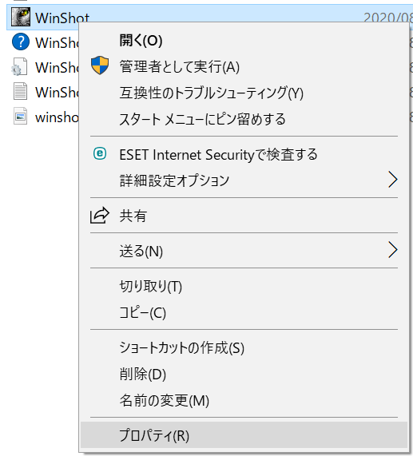
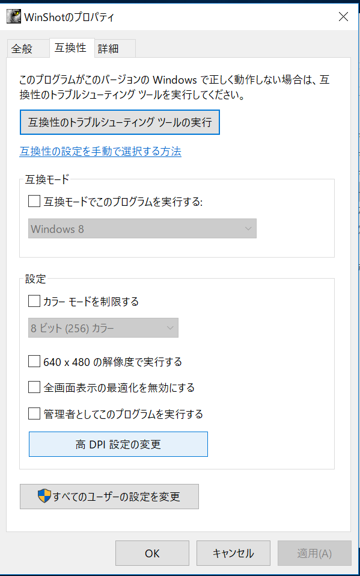
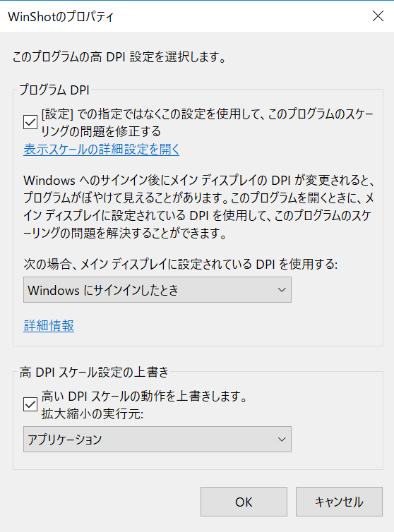

## イントロダクション
ウィンドウズでのキャプチャ用アプリとしてこのアプリが有名なので使用することにしたが、キャプチャの画面サイズがおかしく想定通りの画面範囲で範囲選択ができなかったので対応方法を記載しておきます。

# WinShotのインストール
[こちらのサイトからダウンロードすると](https://mari1999.com/archives/3593/)セキュリティに引っかからなかったので、こちらからダウンロードしました。

## WinShotの設定
1. WinShotのexeファイルを右クリック、互換性タブを開く  

2. 高DPI設定の変更をクリックする

3. 下のようにチェックボックスにチェックを入れる

4. あとはOKして設定を反映させればもんだなく使用可能

## ショートカットの設定
余談になるが、ドン・キホーテの２万円PCで実行したときにF1~F12が反応しないという事件があり、これに対処すべくショートカットキーを設定した。
1. Winshotを起動すると猫の顔がタスクバーに見える、もしくはメニューに隠れているのでそれをダブルクリック
2. 環境設定が開くので、ホットキータブを選択する
3. 「クリップボードへコピー(範囲指定)」を選択して使用できるキーを入力する(同時押しで内容がテキストで表示される)
4. あとはOKして閉じる、設定が反映されていることを確認する
