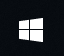
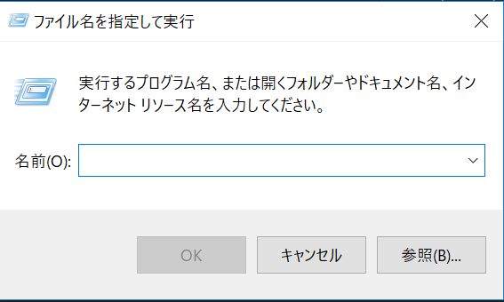

## Index
1. [画面(ウィンドウ)切り替えのショートカット(View Shortcut)](#view-shortcut)
 表示したい画面(エクセルとブラウザetc ...)をワンタッチで切り替えるショートカットです。
2. [ファイル操作のショートカット(File Controll)](#file-controll)
  コピペから
3. [Altキーについて(About Alt Key)](#about-alt-key)
4. 余談

## View Shortcut
### 画面(ウィンドウ)切り替えのショートカット
**こんな風に感じたことはないですか**
ウィンドウズを使用してパソコン作業などしていると「デュアルモニターだったらなぁ」と感じることがあるのではないでしょうか？

**打開策(解決策)**
しかし、現実には、スペースとお金の問題がありますので、ショートカットを使用する方法で画面の表示切替をしてみてはどうでしょうか？

＜ケース１＞
* ノートパソコンで、出先にてPC作業をするとき。。。
* 以下のファイルを見ながら3のファイルを作成する。必要がある。
 1. 自社のホームページ
 2. 自分の作成したドキュメント
 3. 顧客に提出するための作成中ドキュメント

画面上には、ファイルを一つしか表示できないのですが、下の図のように、アプリケーションを複数起動していると
マウスで、アプリを切り替えるのがとても面倒です。ここでは、以下のアプリを起動しています。
1. エクスプローラー(フォルダ)
2. Atom(テキストエディタ)
3. Chrome(ブラウザ)

とくに、自分は、マウスコントロールが苦手(思った場所にてクリックが出来ない。。。)

#### ここで使用したいショートカット
これらのアプリをウィンドウに表示しっぱなしにすると楽(⇒デュアルモニタのメリット)なのですが、ショートカットで以下のことができれば、画面(モニタ)への目線をを右、左と動かさなくてよいので自分としては楽です。

**「画面系のショートカット」**

| No | 効果 | ショートカットキー |
| -- | ------- | ---- |
| 1  | すべてのウィンドウを閉じる(デスクトップ表示) | ウィンドウズボタン() + D |
| 2  | 開いているウィンドウを切り替える | Alt + Tab |
| 3  | 逆方向にウィンドウを切り替える | Alt + Tab + Shift |
| 4  | 開いているウィンドウを一覧(再度入力で戻る) | ウィンドウズボタン() + Tab |

## File Controll
### ファイル操作などのショートカット
ファイルコントロールは、コピー、ペースト、カットのことです。
皆さんご存じだと思います。その他よく使うものも記載しておきます。

#### よく使うショートカットキー

| No | 実行したときの効果 | ショートカットキー |
| -- | ---- | ---- |
| 1  | コピー | Ctrl + C |
| 2  | ペースト | Ctrl + V |
| 3  | 切り取り | Ctrl + X |
| 4  | やり直し | Ctrl + Z |
| 5  | 保存 | Ctrl + S |
| 6  | ウィンドウズメニューを開く | ウィンドウズボタンウィンドウズボタン() |
| 7  | カタカナ変換 | F7 |
| 8  | 全角入力(入力がおかしい時にもチェック) | Shift + Caps Lock |
| 9 | コマンドプロンプト起動  | ウィンドウズボタン() + R でアプリ名の実行ウィンドウを開き  、「cmd」と入力してEnter、これでコマンドプロンプトが開く |

## About Alt Key
### Altキーについて
ショートカットキーは覚えていると便利だけど、使用しないのに覚えても仕方ない。。。と感じる人も多いと思います。
実際、ショートカットはアプリケーションごとに決まっている、もしくは、ユーザーが作成するものがほとんどです。

#### ここで言いたいこと
ほとんどのウィンドウズアプリケーションは、Altキーを開始点にして色んなショートカットが設定されています。Officeのことです。
つまるところは、Altを押下するとヘッダー部分にフォーカスされます。そのあと十字キーでヘッダーメニューを選択することができます。

**エクセルの場合**
ファイルを開き、Alt -> E -> S 通してみてください、コピーしたデータの張り付け方を指定する画面が開きます。
これは、Altキーを押したときに「E」に対応するヘッダーメニューを見ることができるので、それを見つけてみてください。
「S]に関しても同様です。
これは、Office以外のアプリに関しても見つけることができるのでここから、ショートカットを探し出してみるのもよいでしょう。

余談ですが、
#### ctrlを押しながら矢印を押下する
エクセルの場合ですが、これは、カーソルをデータのある最後の場所まで移動できます。
もちろんShiftと組み合わせれば、選択も可能です。

## 余談
アプリケーション(Officeとか、Notesとか、Slack ...)をしようして作業を行うことが多い世の中ですが、ショートカットを使えるだけで、作業もだいぶ楽になります。
そして、ショートカットは大体アプリケーションのヘッダーメニューなどに記載しているので、そこをかいつまんで使っていると勝手に覚えてしまうという流れが無難なのではないでしょうか？
むしろそんなもんでしょう（笑）
取り合えずは、画面切り替えのショートカットを使用すると画面切り替えが楽です。
