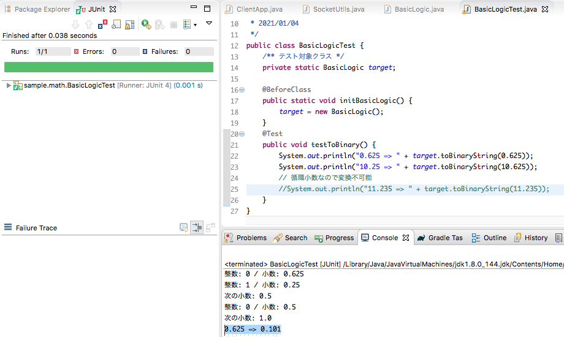

## イントロダクション
基本情報技術者試験の勉強を始めようと思いました。

[試験問題の切り抜き](https://zenryokuservice.com/#!/mondai)を切り替えて問題を解く事ができます。※イメージファイルなので切り抜きになります。

このページを作成したのも、試験対策の一つです。

## Javaで基本情報技術者の教科書を学ぶ
### 基数の単位
色々な記述がありましたが、パソコンは**2進数**で様々な処理を行います。

2進数は、2になると1桁繰り上がります。表にすると下のようになります。

|10進数|2進数|
| --- | ---- |
|0    | 0 |
|1    | 1 |
|2    | 10 |
|3    | 11 |
|4    | 100 |
|5    | 101 |
|6    | 110 |
|7    | 111 |
|8    | 1000 |
|9    | 1001 |
|10   | 1010 |

## データ量の単位
1. 2進数の1桁を1ビットと呼ぶ「101」は3ビット
2. 8ビット＝1バイト(byte)
3. 1000バイト(10の3乗)=1k(キロ)バイト
4. 1000000バイト(10の6乗)=1M(メガ)バイト

表にすると下のようになります。
|単位|10進数|2進数|
| --- | ---- | -- |
| k(キロ) | 10の3乗 | 2の10乗 |
| M(メガ) | 10の6乗 | 2の20乗 |
| G(ギガ) | 10の9乗 | 2の30乗 |
| T(テラ) | 10の12乗 | 2の40乗 |
| P(ペタ) | 10の15乗 | 2の50乗 |

## ２進数の変換
上記で記載したように、パソコンは２進数を基本にしてデータを扱いますが、実際のところは10進数とか、8進数などの表示も行います。

そこで、2進数 ⇔ 10進数、2進数 ⇔ 16進数などのように、変換しています。これは、簡単な計算で行うことができます。

具体的には、下のように行います。

## 10進数からr進数への変換
> 1. x を r で割った時の商 p とあまり q を求める
2. p が０ならば、計算終了、それ以外は p を x に置き換えて 1 を行う
3. 計算した結果を下から順に並べなおす

### 10進数から2進数への変換
11を2進数に変換する場合
> 1. 11を２で割る = 5 ... 1
2. 5を２で割る = 2 ... 1
3. 2を２で割る = 1 ... 0
4. 1を２で割る = 0 ... 1

計算した結果を下から順に並べなおす。

Javaプログラムの実行結果とコードを以下に示します。

```
public String toBinaryString(int num, int kisu) {
    int p = num / kisu;
    int q = num % kisu;
    StringBuilder build = new StringBuilder();
    while (p != 0) {
        p = num / kisu;
        q = num % kisu;
        System.out.println("商: " + p + " 余り: " + q);
        num = p;
        build.append(q);
    }
    return build.toString();
}
```


## 小数点以下の変換
同様に、10進数から2進数への変換で、小数点以下のケースを行います。
> 1. x を r で乗算した結果を整数部の i と i を除いた小数値 d に分ける。
2. d の値が0ならば終了、そうでなければ１から繰り返す。

**余談**、JavaAPIに小数点以下の2進数変換メソッドがあるかと思ったら見当たらなかった。
だいたい自分でコードを書いている記事だった。

そして、小数点は、割り切れない場合があるのでいつになっても2進数に変換できない場合がある

このような数値のことを循環小数と呼び、**2進数への変換ができない**。

Javaで実装した場合
```
public String toBinaryString(Double num) {
    int seisu = num.intValue();
    StringBuilder build = new StringBuilder();
    // 小数点第５位で切り捨て
    Double r = nextDouble(num, 2);
    build.append(r.intValue());
    while (r != 1.0 && r != 0.0) {
        r = nextDouble(r, 2);
        System.out.println("次の小数: " + r);
        build.append(r.intValue());
    }
    String bin = toBinaryString(String.valueOf(seisu));
    return bin + "." + build.toString();
}

public Double nextDouble(Double num, int kisu) {
    int i = num.intValue();
    double d = new BigDecimal(num - i).setScale(5, RoundingMode.DOWN).doubleValue();
    System.out.println("整数: " + i + " / 小数: " + d);
    return d * kisu;
}
```


## r進数を10進数に変換
これは、2進数の「１」担っている部分を塁上で計算する。

**2進数で「10」の場合**
|右からX番目|計算|計算結果の合計|
| -- | -- | -- |
| 1番目 | 0なので計算しない | 0 |
| 2番目 | 2 の 1 乘 | 2 |

合計は 2 となり、2進数「10」を10進数に変換すると「2」になる。

**2進数で「101」の場合**
|右からX番目|計算|計算結果の合計|
| -- | -- | -- |
| 1番目 | 2 の 0 乘 | 1 |
| 2番目 | 0なので計算しない | 0 |
| 3番目 | 2 の 2 乘 | 4 |

合計は 5 となり、2進数「101」を10進数に変換すると「5」になる。

**2進数で「1111」の場合**
|右からX番目|計算|計算結果の合計|
| -- | -- | -- |
| 1番目 | 2 の 0 乘 | 1 |
| 2番目 | 2 の 1 乘 | 2 |
| 3番目 | 2 の 2 乘 | 4 |
| 4番目 | 2 の 3 乘 | 8 |

合計は 15 となり、2進数「1111」を10進数に変換すると「15」になる。

## 数値表現
符号なしの値は使用しないので、無視します。

 byte型8ビットのデータならば、ビットの数が8つ、つまり、最大値が以下のようになります。
 ```
 //最大値は整数で127
byte maxByte = 1111111;
 ```
しかし、これを素直に計算すると、255になる。。。
これは、一番左のビット(2進数)の値を符号として見るためです。符号なしの場合は、255までの値になります。

C言語では「unsigned」修飾子で符号なしも使用できるようですが、Javaでは余り使用しませんので。。。
