# 環境構築(Windows)
初めに、使用しているPCが32bit、64bitどちらなのか確認します。
スタートメニュー⇒設定⇒システム⇒バージョン情報
「デバイスの仕様」という項目で確認できます。

筆者の場合は、ハードディスクの空き容量の問題で、Cドライブではなく、Dドライブにインストールしたので「D:\\」で始まっているパスが記載してあります。  
**パスの部分は読み替えて環境構築を行ってください。**

＜パス(Path)の例＞
> D:\Program Files\Java\JDKXXX\bin\javaw.exe

と書いてあれば、下のように読み替えます。

> C:\Program Files\Java\JDKXXX\bin\javaw.exe

## JDKインストール
JDK(Java Development Kit)は、Javaでの開発を行うために使用するファイルなどがまとまっているものです。

※32bit版と64bit版の違いに注意して下さい。自分の使用するPCが64bit、32bitどちらなの確認してから行ってください。

JDKのインストール方法は２つあります。

以下の１，２の内、どちらのJDKをダウンロードしてもよいです。筆者は「1. Amazonから」ダウンロードしました。

### 【方法１】 Amazonからのダウンロード

[Amazon](https://docs.aws.amazon.com/corretto/latest/corretto-8-ug/downloads-list.html)からダウンロードできます。
初めてJDKをダウンロードする人は「amazon-corretto-8-x64-windows-jdk.msi」を選択してください。

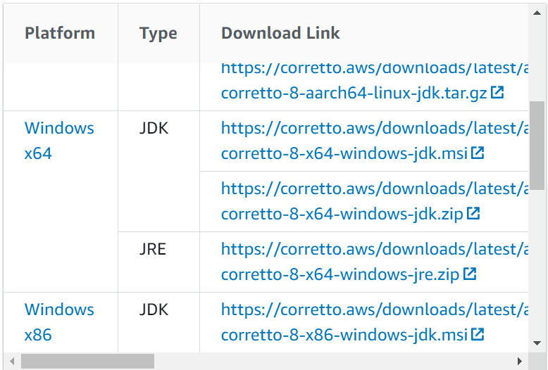


### 【方法２】 Red Hat Developerからダウンロード
[OpenJDK](https://developers.redhat.com/products/openjdk/download)を開いて、バージョン番号(widows 64bit jdk8)を選択します。
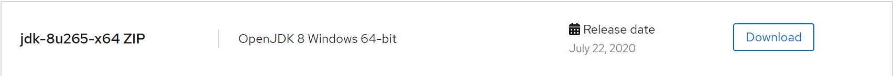


## Eclipseのインストール
Eclipseとは、開発ツールのことです。Javaの開発現場では使用することが多い開発ツール(※IDEともいう)です。

[MergeDoc](https://mergedoc.osdn.jp/)からダウンロードします。

以下の画面から最新版のものを選択します。
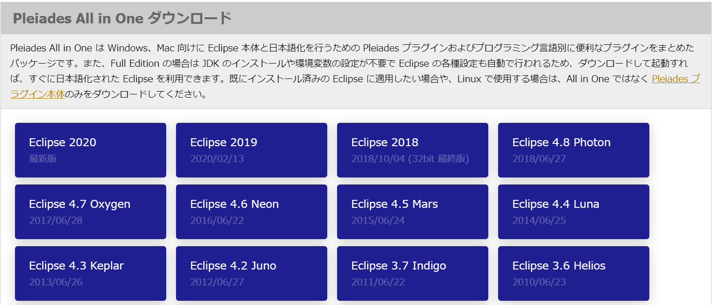

**最新版のものを選択します。すると下のようにダウンロードするEclipseを選択できる部分があるので、「Full Edition」を選択しましょう。**

※Full Editionのインストールには多少時間がかかります。

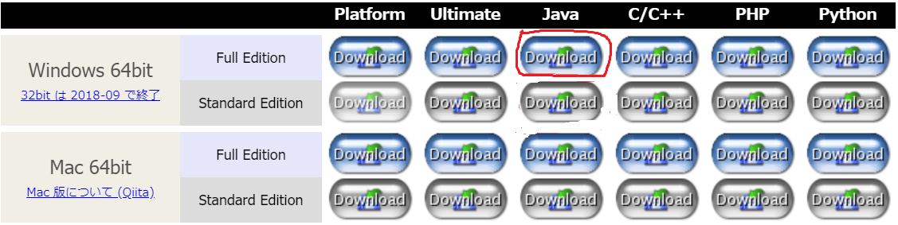

そして、ダウンロードが始まらない場合は、リンクの部分をクリックします。

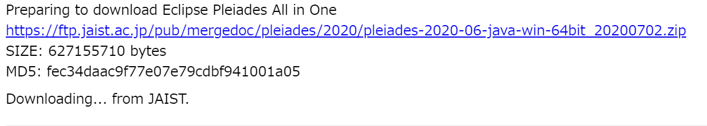

ダウンロードしたら、Cドライブ直下(C:\)に解凍します。パスが長くなるとEclipseが動かなくなる可能性があるためです。

筆者の場合は、解凍先を「D:\\(Dドライブ)」にしたので解凍後は「D:\\pleiades」となりました。

※ZIPファイルの解凍ができなかったら[７ZIP](https://sevenzip.osdn.jp/download.html)をインストールして実行してください。

※７ZIPの使い方に関しては以下のサイトを参考にしてください。

https://briarpatch.co.jp/wakaruni/7zip/


### eclipse.iniの設定

eclipseをインストール(解凍)したら「解凍先\\pleiades\\eclipse」のようなフォルダ構成になっているので、このディレクトリに「eclipse.exe」と「eclipse.ini」があります。ただし、ファイル拡張子が表示されていない場合は右のほうに「構成設定」とあるのでそれを確認してください。

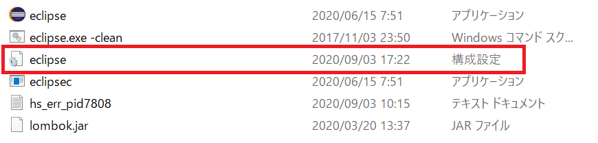

※これは設定の例ですので、javaw.exeなどのパスは自分のPCにインストールしたパスを記述してください。
  > 例「C:\Program Files\Java\bin\javaw.exe」

  * 使用するJVM(JDK)を指定します。
  先頭の行に以下のコードを追加して下さい。

    ```
    //==========ここから追加する==========
    -vm
    D:/Apps/jdk1.8.0_265/bin/javaw.exe
    //==========ここまで追加する==========
    -product
    org.eclipse.epp.package.jee.product
    --launcher.defaultAction
    ```

   * 使用するメモリの指定を行います。
   以下のコードを追加して下さい。

      ```
      -vm
      D:/Apps/jdk1.8.0_265/bin/javaw.exe
      -product
      org.eclipse.epp.package.jee.product
      --launcher.defaultAction
      openFile
      --launcher.appendVmargs
      //==========ここから追加する==========
      -vmargs
      -Xms512m # メモリの最小値
      -Xmx1024m # メモリの最大値
      //==========ここまで追加する==========
      -Dosgi.requiredJavaVersion=1.8
      -XX:+UseG1GC
      ```

最終的に以下のようになりました。

```text:pleiades/eclipse/eclipse.ini
-vm
D:/Apps/jdk1.8.0_265/bin/javaw.exe
-product
org.eclipse.epp.package.jee.product
--launcher.defaultAction
openFile
--launcher.appendVmargs
-vmargs
-Xms512m
-Xmx1024m
-Dosgi.requiredJavaVersion=1.8
-XX:+UseG1GC
-XX:+UseStringDeduplication
--add-modules=ALL-SYSTEM
-Dosgi.dataAreaRequiresExplicitInit=true
-Xverify:none
-javaagent:dropins/MergeDoc/eclipse/plugins/jp.sourceforge.mergedoc.pleiades/pleiades.jar
-javaagent:lombok.jar
```

ファイルを保存して「eclipse.exe」を実行して下さい。

以下の画面が表示されれば、Eclipseが正常に起動ができています。


- もし、JDKの32bitと64bitを間違えていたら、以下のようなエラーが出ます。

※Eclipseのインストール先はDドライブになっています。


上記のような表示が出る場合は、再度64ビット版を[ダウンロード](https://docs.aws.amazon.com/corretto/latest/corretto-8-ug/downloads-list.html)してください。
※Amazonからインストールしています。


## プロジェクトの作成
Eclipse(FullEdition)を起動すると下のような画面が見れると思います。

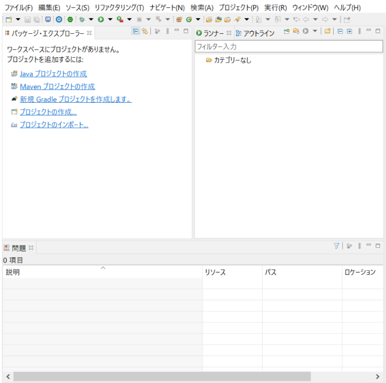

「シンプルなプロジェクトの作成」にチェックを入れて「次へ」をクリックしてください。

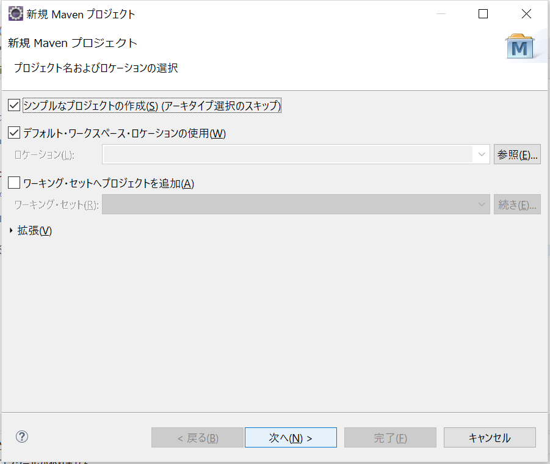


次に、アーティファクトId(プロジェクト名)を入力します。

**プロジェクト名、グループIdともに自分の好きなものを入力してください。**

※プロジェクト名や、Javaのクラス、ファイル名などは日本語で作成することもできますが、文字コードを設定しないと文字化けするので、半角英字を使用します。

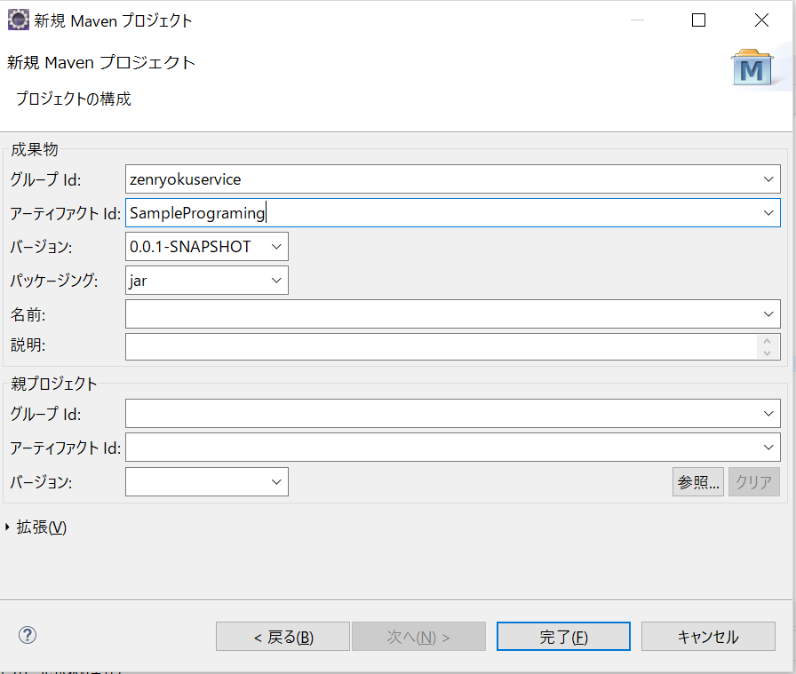

最後に完了をクリックします。

作成した結果は以下のようになっているはずです。パッケージ表示の方法の違いで、下のようになっていない場合がありますが、ポイントとしては以下の点です。

* main/javaフォルダがあること
* main/resourcesフォルダがあること
* test/javaフォルダがあること
* test/resourcesフォルダがあること

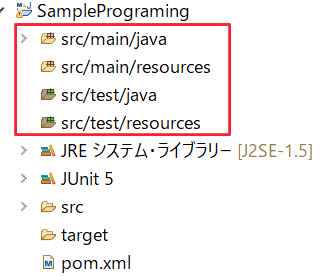


### JUnitの設定
そして、作成したらJUnitの設定を行います。
作成したプロジェクトを右クリックして「プロパティ」を選択します。すると下のような画面が開きます。
引き続き、Javaのビルドパス⇒ライブラリのタブを開き「ライブラリの追加」をクリックします。

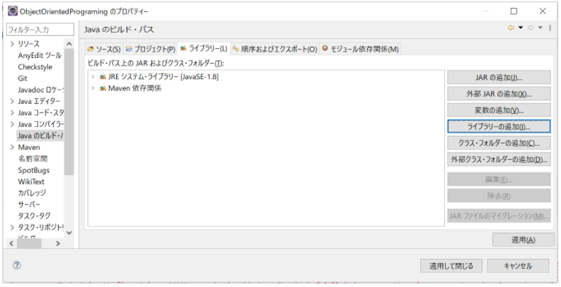

「JUnit」を選択します。

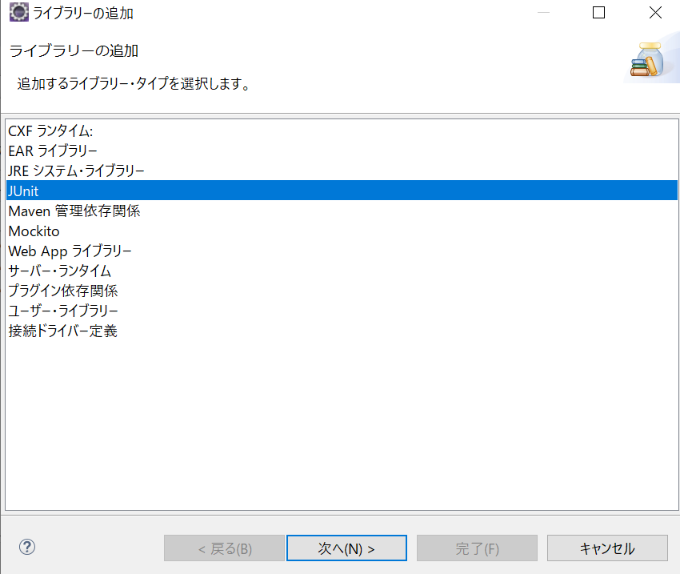

すると以下のような画面が表示されるので「完了」をクリックしましょう。

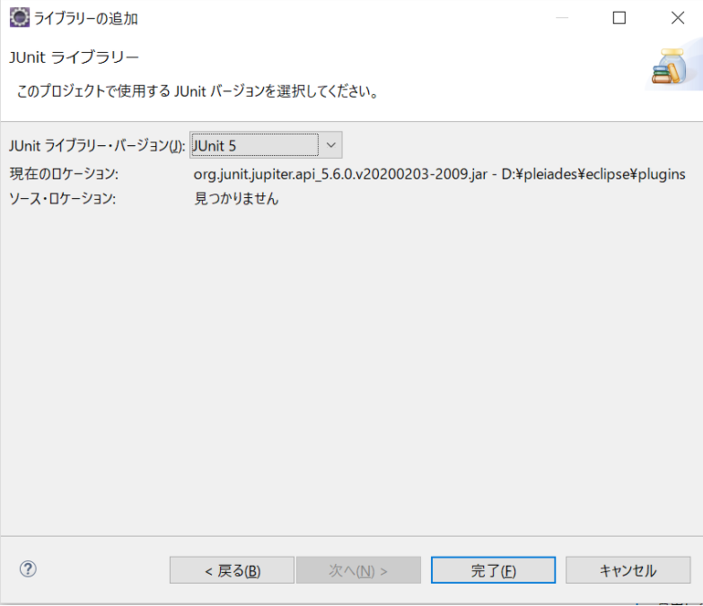

そうすると**JSUnit 5**というライブラリが追加されているかと思います。

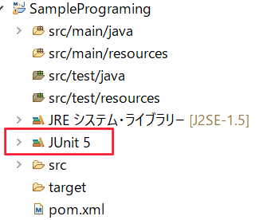


環境構築は以上になります。
本教材では、ここにJavaクラスを追加していきます。
