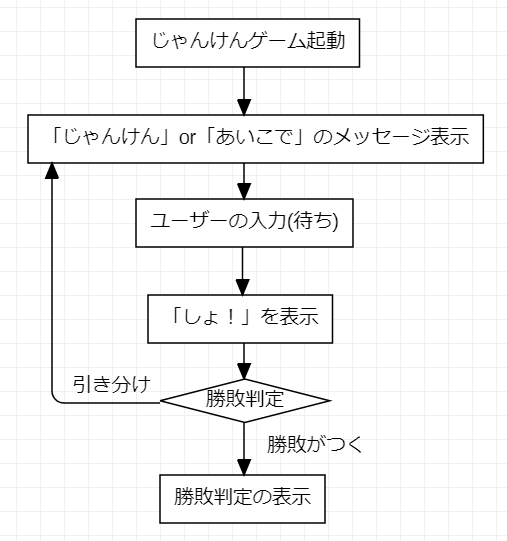
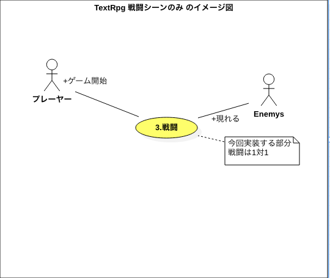
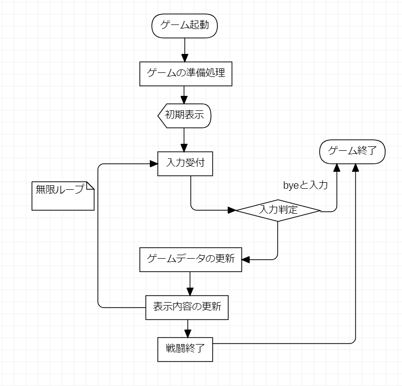
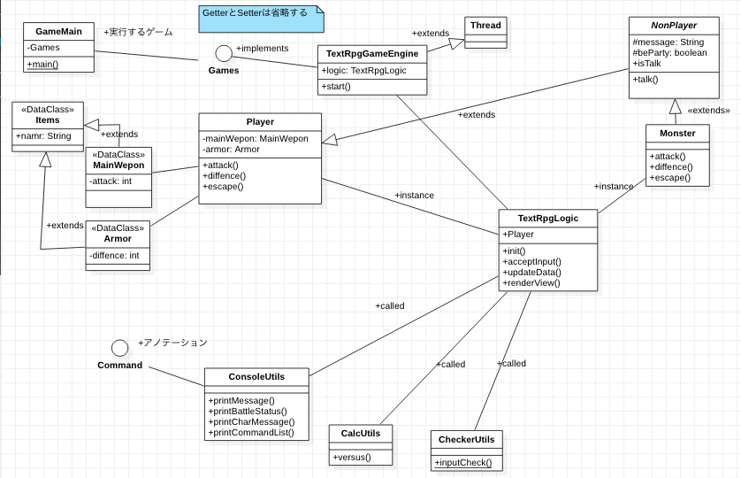

# 設計

本教材では、1~2章で**じゃんけんゲーム**を作成します。

そこで学んだ内容をもとに、3章では発展編として、**テキストRPG**を作成します。

以下の設計をもとに進めていきます。

## じゃんけんゲームの設計
作成するじゃんけんゲームイメージです。
初期表示時に、入力する値と対応する手（グー・チョキ・バー）の表を表示します。その後、判定を行い勝敗を決定いたします。

教材を進めていく中で作成したものを追加修正していきます。
サンプルで作成したものは大まかな設計図ですので、不足している部分があります。
教材を進めていく中で、設計図とプログラムコードの不足した部分を追加・修正するテクニックを学んでいきます。

＜イメージ動画＞

## 作成するもののサンプル
本教材では、下のような図を作成し、実装する際の「設計書」とします。

あくまでも下のものはサンプルです、教材を進める中で作成して行きます。

現状では、下の図はなんとなく眺めるだけで結構です。

### サンプルフローチャート

※これはサンプルです。教材を進めていく中で編集します。

## テキストRPGの設計
＜イメージ動画＞

### ユースケース図

※戦闘シーンのみなので、黄色の部分のみの実装です。
　そして、Enemys(敵、モンスター)は1体のみです。

### フローチャート

※これはサンプルです。教材を進めていく中で編集します。

### クラス図

※これはサンプルです。教材を進めていく中で編集します。

本パートは以上になります。次のパートでは、いよいよJavaの学習に着手します。

Javaの基本的なことにも触れていきます。
