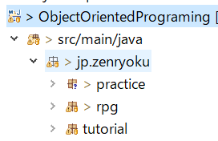
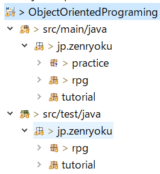
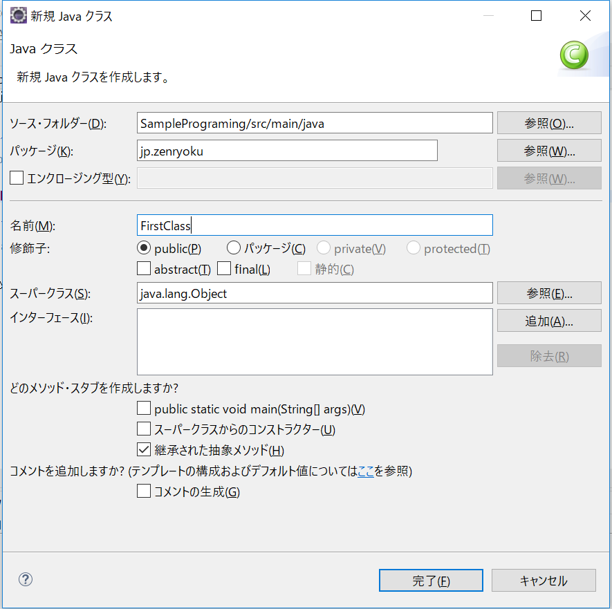
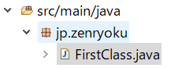

# 1-1 じゃんけんゲームの設計をする〜フローチャートの作成とJavaの基本〜

「オブジェクト指向プログラミング」という言葉をよく聞くと思いますが、

「つまりなんなの？」と聞かれると答えずらいことがあります。

オブジェクト指向プログラミングは早い話が**現実の『モノ』を使うのと同じように考える、プログラミングの考え方**です。

本パートでは、オブジェクト指向ではない考え方(手法)とオブジェクト指向の考え方(手法)で作成した
「じゃんけんゲーム」を作成して、オブジェクト指向プログラミングの基本を学びます。

そして、本パートで以下のことを学びます。

**本パートで行うこと**
1. 作成するプログラムのやることを順番にリストアップ
2. フローチャートを描く
3. 使用する部品
4. サンプル

## フローチャートを作る

まずは、プログラムを組む前に「何を作るか？」を明確にします。そこで役に立つのが

**フローチャート** です、正確には『**設計書**』ですが、今回は設計書の中の一つに着目します。
ちなみに、設計書には以下のような種類があります。
* ユースケース図(UMLに入っている)
* フローチャート(UMLではアクティビティ図)
* クラス図などUMLと呼ばれるもの
* 文章で書いた設計図


ちなみに、設計書にはフローチャートや文字で記述されたものや、ユースケース図、クラス図などUMLと呼ばれるものもあります。


早速フローチャートを作成しましょう。

### 1. 作成するプログラムのやることを順番にリストアップ

今回作成する「じゃんけんゲーム」を頭の中でイメージしてみてください。

どのような動きをしたらよいでしょうか？

単純に考えると下のような順序で動くとよいと思います。

もし、考えたものが不適切だった場合は修正すればよいので「まずは作ってみる」ことを念頭に置いて作成してください。**間違って作成したものを修正するテクニック**も学んでいきますので、遠慮なく間違ってください。

下のものはあくまでサンプルです。

**＜A.サンプルフロー＞**

1. 「じゃんけん ...」とコンソールに表示する
2. ユーザーの入力を受け付ける
3. 勝敗判定を行う
4. 判定結果によって以下の処理を行う
 1. 「YOU_WIN」と表示して処理を終了する
 2. 「YOU_LOSE」と表示して処理を終了する
 3. 「DRAW」と表示して再度ユーザー入力を受け付ける

ここで、一捻りあるのが『7「DRAW」と表示して再度ユーザー入力を受け付ける』です。
これはループするなどして処理を繰り返してやる必要があります。考え方によっては、また同じ処理を呼び出方法でも実装できますが、同じコードを書くのはできるだけ避けて実装する方が、可読性、処理効率のよい実装です。

とりあえずは、筆者が作成したフローチャートです。

参考になれば幸いです。


まずは、フローチャートというものを見てみましょう。

[ウィキペディアにあるフローチャート](https://ja.wikipedia.org/wiki/%E3%83%95%E3%83%AD%E3%83%BC%E3%83%81%E3%83%A3%E3%83%BC%E3%83%88)は下のようなものでした。


要点としては以下の部分です。

1. 開始～終了までにどのような処理を行うかわかる。
2. どのような順番で処理を行うかわかる。

なので、じゃんけんゲームの場合を「A.サンプルフロー」で箇条書きにしました。

次はフローチャートにします。

ちなみに、筆者の作成したものは以下のものです。

**＜B.筆者が書いた処理フロー＞**

1. 勝敗判定マップを作成しておく
2. 「じゃんけん ...」もしくは「あいこで ...」を表示する
3. ユーザーの入力待ちをする(標準入力受付)
4. 「しょ！」を表示する
5. **勝敗判定を行う**
6. 勝負がついた場合
  1. ユーザーの勝ち⇒「YOU_WIN」を表示
  2. CPUの勝ち⇒「YOU_LOSE」を表示
7. 勝負がつかない場合(あいこの時)
⇒「あいこで ...」を表示する
8. 3からもう一度同じ処理を繰り返す

ポイントとしては「具体的に書く」です。

筆者の書いたサンプルでは「勝敗判定を行う」というところが抽象的です。理由は、具体的に何をするのか記載していないためです。

最終的に、どのような処理フロー(箇条書き)を作るかはこの教材を読んでいる、あなたです。よく考えて、自分で納得できるように処理フロー(箇条書き)を、作成してみてください。

### 2．フローチャートを描く

ここでは、箇条書きにした**処理フローを図にする練習とサンプル**を示していきます。

フローチャートで使用する、四角、ひし形、矢印などの部品に関しては[こちらのページを参考](https://zenryokuservice.com/wp/2020/09/02/%E3%83%95%E3%83%AD%E3%83%BC%E3%83%81%E3%83%A3%E3%83%BC%E3%83%88%E3%81%AE%E6%9B%B8%E3%81%8D%E6%96%B9/)にしてみてください。

先ほど作成した「処理フロー(箇条書き)」を見ながらどのように、書き出した処理を行うか、図にします。

### 3. フローチャートで使用する部品
1. 処理の内容を示す


2. 矢印は省略します
3. 条件分岐


4. 事前準備された処理(サブルーチン)


5. セットアップ操作などの準備プロセスフロー


6. 処理の開始、終了など(端末)


7. データ


以下にフローチャートのサンプルを示しますので、考えて作成してみてください。

**＜処理フローサンプル１＞**

例えば以下のような処理フローを作成したとします。
1. プログラムを起動する(上の箇条書きでは省略していました)
2. コンソールに「Hello World」を表示する
3. プログラムを終了する

これは単純なのですぐにイメージがわくと思いますが、下のような図になります。


**＜処理フローサンプル２＞**

1. プログラムを起動する
2. int型の変数を宣言する
3. 11 × 22の計算結果を変数「i」に代入する
3. コンソールに変数「i」を表示する
4. プログラムを終了する


**＜処理フローサンプル３＞**

1. プログラムを起動する
2. プログラム引数を取得する
3. プログラム引数の0番目が「Hello」だった場合は「Hello World」をコンソールに表示する。
3. プログラム引数の0番目が「Hello」以外の場合は「Bye」を表示する。
4. プログラムを終了する


サンプルを参考にすれば、じゃんけんゲームのフローチャートを描くことができると思います。

もしも、もっと詳しく知りたいと思った場合は、[こちらのリンク先に詳細を記載](https://zenryokuservice.com/wp/2020/09/02/%e3%83%95%e3%83%ad%e3%83%bc%e3%83%81%e3%83%a3%e3%83%bc%e3%83%88%e3%81%ae%e6%9b%b8%e3%81%8d%e6%96%b9/)しましたのでご覧下さい。

## 2. フローチャートをコードにする
今までに作成した、じゃんけんゲームの処理フロー(箇条書き)とフローチャートをもとに

プログラムを作成します。

本教材は、Javaを初めて学ぶ人を基準にしていますのでJavaの基本に関しても記述いたします。

フローチャートの時と同様にサンプルを見ながらJavaを学習、フローチャートの実装

⇒フローチャートをコードにする作業、を行っていきます。

先ほどのフローチャートで作成した処理を順番に見ていきます。そして、コードに落とします。

### 実装準備
「[0章：開発環境構築]で作成したプロジェクトを開いてください。

作成したプロジェクトにはまだJavaクラスがない状態だと思います。

これからJavaクラスを作成していきます。

この動画は、クラスを作成してからHello Worldの実装を行った動画です。

参考にどうぞ。 ※動画には音が入っています。

[](https://www.youtube.com/watch?v=IWGK-acZVDg)


### パッケージの作成
「パッケージ」という言葉を聞いたことがあると思います。早い話が「まとまっている」ということです。

Javaもクラスを作り始めたら量が多くなると「なにがどこにあるのやら？」とごちゃごちゃになるので

「パッケージ」で管理します。

具体的には、フォルダが作成されます。

下のパッケージ構成は筆者が作成したパッケージです、本教材では、パッケージ構成を以下のように作成してください。
```
jp.zenryoku.practice: 練習用パッケージ
jp.zenryoku.tutorial: じゃんけんゲーム作成パッケージ
jp.zenryoku.rpg     : テキストRPG(戦闘シーンのみ)作成パッケージ

```

具体的に下のようになるはずです。



補足ですが、パッケージの上にあるフォルダ(ソースフォルダ)は**src/main/java**となっています。  

これはMaven用のフォルダ構成です。同様に**src/test/java**がありますのでこちらはテストクラス用のフォルダに使用します。

具体的には、以下のような構成です。
```
src/main/java: 実際に起動するアプリのためのソースコード
src/test/java: アプリのためのコードをテストするコード
```

例：筆者が作成したフォルダ構成



### practiceパッケージにクラスを追加

フローチャートをコードにする練習として、実際にクラスを作成、実行、確認を行っていきます。

作成したパッケージ**jp.zenryoku.practice**の下に「Lv1HelloWorld」というクラスを作成します。

Eclipseでの、クラスの作成方法に関しては、あえて説明しません。

<br/>

### 実装の練習

**==Lv1 Hello Worldの実装==**

標準出力(コンソール)に「Hello World」を表示するプログラムを作成します。

何度も記述しますが本教材では、Javaを初めて学習する人向けですので、基本から学習していきます。

フローチャートの**サンプル１**を見てください。この処理を実装します。

現段階では、とりあえず「クラスがあるんだな」、「メインメソッドが動くんだな」と理解してください。

「クラス」というのは、javaのコードを書くファイルです。今後、いろんな意味で使用しますので「現段階」ではこのように理解してください。

そして、クラスには書き方が決まっていて以下のように書くと決まっています。

```java
/**
 * クラスのJavaDocの記載をするスペース
 */
public class クラス名 {
   /** フィールド変数 */
   public String field;

  /**
   * メソッドのJavaDoc記載スペース
   */
   public static void main(String[] args) {
     // コメント
     System.out.println("Hello World");
     // 変数の宣言
     int num;
     // 変数の初期化(宣言して、値を代入している)
     int suji = 1;
     /*
      * 複数行のコメント
      * 「/**」で始まる場合はJavaDocなので注意
      * 下の「for」で始まるコードはループ文です。
      * 俗にいう「forループ」
      */
      for (int i = 0; i < 10; i++) {
         suji += i;
      }
  }
}
```
そして、JavaDocというのは、クラスやメソッドの説明をするコメントのことです。HTMLに出力することもできます。

<br/>

**==クラスの書き方==**

上のサンプルクラスのように、クラス名を書きます。
```
public class クラス名 {
  // クラスの中身
}
```
「public」というのは修飾子といいます。「公開している」という意味でプロジェクト内の、**どの場所からでも参照できる**という意味です。

つなげて読むと「公開しているクラス」と読むことができます。

下の例は、「FirstClass」というクラスを定義する場合です。

```
public class FirstClass {
  // クラスの中身
}
```

Eclipseで作成すると、下のようになります。

＜作成する時＞



＜作成後＞



<br/>

**==メインメソッドの書き方==**

これは**書き方が決まっています**。丸暗記してもよいです。
```java
/**
 * メインメソッドのJavaDocコメント
 */
public static void main(String[] args) {
  // 処理内容
}
```
ちなみに「{」と「}」は**スコープ**と呼び範囲を指定するものです。今後「変数のスコープ」という言葉が出てきます。

その時は、この「スコープの範囲に」という意味になります。

後でまた記述するので、ご安心を。。。

そして、メインメソッドの記述内容に関しては以下の通りです。
1. **public** はメソッドの修飾子「公開している」という意味です。
2. **static** は、「静的」という意味で、インスタンスを生成しなくても起動できます。
  ※後々に詳細を記述します。
3. **void** メソッドの返却値を示します。「void」は「返却値なし」という意味です。
4. **String[] args** の部分は **引数と** いいます、メソッドを起動するときに渡せるものです。
  ※これも後々に詳細を記述します。

まとめると以下のような形です。

```
// ()内は書かなくてもよい
修飾子 (static) 返却値 メソッド名(引数1, 引数2 ...) {
   // メソッドの処理内容
?
```

<br/>

**==処理の中身を実装する==**

上で作成したメインメソッドの中(スコープの中)に処理を書きます。

「サンプル１」を見るとプログラムの起動と終了以外は「『Helo World』を表示する」

しかありませんので、この部分を実装します。

<br/>

**Lv1:使用するJavaAPI**

[System.out.println()](https://docs.oracle.com/javase/jp/8/docs/api/java/lang/System.html#out)

このクラスの詳細は、JavaDocに記載があります。インターネット上で見ることができますので参考にどうぞ。

そして、このクラスの説明として以下のような記載があります。

> Systemクラスによって得られる機能には、標準入力、標準出力、およびエラー出力ストリーム、外部的に定義されたプロパティおよび環境変数へのアクセス、ファイルおよびライブラリのローディング方法、配列の一部をすばやくコピーするユーティリティ・メソッドがあります。

ちょっと難しいですが、このドキュメント(JavaDoc)を読んで理解できれば、**Javaを極めたといっても過言ではない**です。

なぜなら、JavaAPIで提供しているクラス、メソッドのすべてが[ここに記載](https://docs.oracle.com/javase/jp/8/docs/api/)されているからです。

初めに作成するプログラム「[Lv1HelloWorld.java](https://github.com/ZenryokuService/ObjectOrientedPrograming/blob/b43501d85d33749bc4badb7e3f3cb2e925df133f/src/main/java/jp/zenryoku/practice/Lv1HelloWorld.java)」のサンプルは左のリンク先にあります。

※難しくないのでリンクにしてあります。

早速、上のメソッドを使用してみましょう。

そして、以下に[練習問題](./練習問題集.md)のやり方を記述します。Javaの理解を深める、コード慣れしておきたい、など思うことがあれば、やってみてください。

＜補足＞

ここまでの記述内容で、Javaプログラミングの理解をもっとしたい、説明がよくわからなかったなど感じたら下に**練習問題集**を作成したのでこれをやってみるのも良いと思います。以降のパートで、JUnitも使用しますので、やっておくと本教材の理解もしやすくなると思います。

以下の内容を記述しています。
1. EclipseでのJavaプログラムの起動方法
2. 練習問題のやり方
3. サンプル１ Lv1練習問題：「Good Morning!」を表示する(Monadi1)
4. サンプル２ Lv2練習問題：足し算の計算結果を表示する
5. サンプル３ Lv3練習問題：プログラム引数の値によって処理を変える
 - 条件分岐処理を使う方法
6. データ型の種類


<br/>

**==EclipseでのJavaプログラムの起動方法==**

起動するクラスファイルを右クリック⇒起動⇒Javaアプリケーション

＜参考動画＞

[](https://www.youtube.com/watch?v=716dfk-eN7A)

### 練習問題集
**==練習問題のやり方==**

練習用パッケージ(jp.zenryoku.practice)の下に「lv1reshu」パッケージを追加します。

作成後は「jp.zenryoku.practice.lv1reshu」というパッケージができます。

その下に練習用のクラスを作成します。

例：「Lv1練習問題：「Good Morning!」を表示する(Mondai1)」の場合

Lv1練習問題なので「lv1reshu」パッケージの下にMondai1」クラスを作成します。

作成後は下のようになります。そして「NoMethodImplements.」は関係ないクラスですがキャプチャーに載っています。


作成後は下のようになります。


<br/>

**==Lv1練習問題：「Good Morning!」を表示する(Monadi1)==**

コンソール(標準出力)に文字列を表示(出力)する練習です。

先ほど紹介した「System.out.println」の引数に"Good Morning"を渡してあげればOKです。

筆者が作成したプログラムは[こちら](https://github.com/ZenryokuService/ObjectOrientedPrograming/blob/master/src/main/java/jp/zenryoku/practice/lv1reshu/Mondai1.java)です。

<br/>

**問題**

コンソールに「Good Morning!」を表示してください。


**==Lv2練習問題：足し算の計算結果を表示する==**

標準出力に文字列を標示する、足し算をプログラムで行う、これらの処理の実装を行う練習です。この部分の実装ができたら、引き算や掛け算もできるようになります。

ここで使用するのは「変数」と四則演算の処理です。

＜変数＞

プログラムが動いたときにデータを格納する箱のようなものです。実際にはパソコンという機械なのでデータを一時的に保存しておく「メモリ領域」を確保する処理を行います。

そして、この問題で使用するデータは整数なので、「int型」の変数を利用します。

変数を使用するときには、「宣言」もしくは「初期化」を行います。

それぞれ下の例のように記述します。

例：int型を使用する
```
// int型(整数を格納するデータ型)を宣言する
int i;
// int型を初期化する
int j = 0;
```

例：計算をする
```
// 足し算
int answer = 1 + 1;
// 引き算
int answer = 1 + 1;
// かけ算
int answer = 1 * 1;
// 割り算
int answer = 1 / 1;
```

**問題**

答えが「31」になるような計算を行い、コンソールに出力してください。

筆者が作成したプログラムは[こちら](https://github.com/ZenryokuService/ObjectOrientedPrograming/blob/master/src/main/java/jp/zenryoku/practice/lv1reshu/Mondai2.java)です。

ここまで、出来たら初めのサンプル２も問題なく作成できると思います。

ここにもサンプル２のフローチャートを記述しておきます。

＜再確認：フローチャートの内容確認＞

**==サンプル２==**

1. プログラムを起動する
2. int型の変数を宣言する
3. 11 かける 22の計算結果を変数「i」に代入する
3. コンソールに変数「i」を表示する
4. プログラムを終了する


<br/>

**==Lv3練習問題：プログラム引数の値によって処理を変える==**

「プログラム引数」という言葉が出てきました。Javaアプリケーションを起動するときに引数を渡すことができます。

コマンドのレベルでは下のようなコマンドでJavaを起動します。

※EclipseなどのIDEで起動するときもプログラム側で使用しています。

**問題**

プログラム引数に「aaa」と「bbb」を渡して、プログラム引数が「aaa」の時は「Hello」を、「bbb」の時には「Good Morning!」をコンソールに表示する処理を実装してください。

**ヒント**

```
java クラス名 プログラム引数１ プログラム引数２ ...
```
※ 実行する前にコンパイルとか必要です。詳細は以下の動画を参照ください。

＜動画へのリンク＞

[](https://www.youtube.com/watch?v=QTiz1F2g5_w)

そんなわけで、プログラム引数を使用してみます。

プログラム引数は、メインメソッドの引数に渡されます。データ型は文字列(String)で複数渡すことができるので配列になっています。配列は番号(添え字)が0から始まります。

＜例＞
```
String[] arr = new String[] {"0番目", "1番目", "2番目", "3番目" ...}
System.out.pritln("配列の数(長さ)：" + arr.length);
```

Eclipseでプログラム引数を渡すときは下のように行います。

1. 実行するJavaファイルを右クリック
2. 実行⇒実行の構成

3. 起動するクラスを選択、もしくは、検索
4. 引数タブの「プログラム引数」に引数(文字列)を渡す
    ※プログラム引数を複数渡すときは間にスペースを入れる
    

＜プログラム引数を取得するサンプルコード＞
```
public static void main(String[] args) {
  // プログラム引数の0番目を取得する
  String args0 = args[0];
  // プログラム引数の1番目を取得する
  String args0 = args[1];
  // プログラム引数の2番目を取得する
  String args0 = args[2];
}
```

<br/>

**条件分岐処理を使う**

フローチャートにある下のような部品がありますが、これは条件分岐を示します。


<br/>

**IF文を使う**

IF文を使用する前に、「論理式」について記述します。

論理式は、「TRUE、もしくはFALSEを返す式」です。

そして、TRUE / FALSEを格納する変数の型は**boolean**です。

| 演算子 | 意味 |
| ----- | ---- |
| +     | 加算・足し算 |
| -     | 減算・引き算 |
| *     | 乗算・かけ算 |
| /     | 除算・わり算 |

＜例＞
```java
/** int型を比較 プリミティブ型なのでそのまま比較 */
// 論理式１：TRUEを返す
boolean isTrue = 1 == 1;
// 論理式２：FALSEを返す
boolean isTrue = 1 == 2;

/** 文字列型を比較 */
// 文字列型(String)はクラスなのでメソッドで比較する
// 論理式３：TRUEを返す
boolean isSame = "aaa".equals("aaa");
// 論理式４：FALSEを返す
boolean notSame = "aaa".equals("aab");
```
文字列型の比較について、今まで整数値は「int型」文字列は「文字列型」を使ってきました。
これらは、大きな違いがあります。データ型は以下のように大きく2つに分類できます。
1. プリミティブ型
2. 参照型(クラス型)

それぞれ以下のようなデータ型あります。[詳細はこちら](https://docs.oracle.com/cd/F25597_01/document/products/workshop/docs70/help/guide/getstarted/ovwWhatIfIDontKnowJava.html)を参照ください。

＜**プリミティブ型**＞

|型|説明|
|:---|:---|
|short|整数値(intよりも小さい)|
|int|整数値(longより小さい)|
|long|整数値(intより大きい)※ short < int < longの順番になっている|
|boolean|ture / false(真偽値)|
|byte|バイト、8ビット分のデータ(整数の場合は0~127)    ※ファイルなども含めすべてのデータの土台になる|
|char|文字型、文字列と違い1文字のみ、整数値としても使用可能    ※整数としてはあまり使用しない|
|double|浮動小数点を扱う(64ビット)|
|float|浮動小数点を扱う(32ビット)|

＜**参照型**＞

* JavaAPIで提供しているjava.util.Listなど
* 同様にjava.lang.String(文字列型)
* [配列](https://docs.oracle.com/javase/jp/8/docs/api/java/lang/reflect/Array.html)、各データ型の配列がある ex: int型の配列、String型の配列 ...


例：

```java
// int型の配列
int[] aaa = new int[] {1, 2, 3};
// 参照型なので、メソッド(プロパティ)呼び出しができる
// ※プロパティ＝フィールド変数
int len = aaa.length;
```

＜IF文の使い方＞

「論理式」というのは、処理の結果にTRUE / FALSEを返却する式のことです。具体的には下のようなコードです。

下の変数に代入
```
// 論理式１
1 == 1;
// 論理式2
"aaa".equals("aaa");
// 論理式の結果を変数に代入する
boolean b = 12 != 3;
```

そして、IF文で使用する時は下のような書き方をします。
```
if (論理式) {
  // TRUEの場合
} else {
  // TRUE以外の場合
}
```

応用編で、複数の条件を指定する場合は「かつ(&&)」とか「また(||)」を使用します。
```
if ((論理式 && 論理式) ||  論理式) {
  // TRUEの場合
} else {
  // TRUE以外の場合
}
```

＜サンプルコード＞
```java
int num = 0;

if (num == 0) {
  System.out.println("numは" + num + "です");
} else if (num == 1) {
  System.out.println("numは1です");
} else {
  System.out.println("numは0でも、1でもありません");
}
```

それでは、サンプル３のフローチャートを実装してみましょう。

＜再確認＞

**==サンプル３==**

1. プログラムを起動する
2. プログラム引数を取得する
3. プログラム引数の0番目が「Hello」だった場合は「Hello World」をコンソールに表示する。
3. プログラム引数の0番目が「Hello」以外の場合は「Bye」を表示する。
4. プログラムを終了する


筆者が実装したコードは[こちら](https://github.com/ZenryokuService/ObjectOrientedPrograming/blob/6ce6ee6b61a62d6112e6ec6d0680716e7fc9ce76/src/main/java/jp/zenryoku/practice/lv1reshu/Mondai3.java)です。


### じゃんけんゲームのフローチャートを描いてみよう
ここまで来たら、細かい解説などは不要だと思います。

作成したフローチャートを比較するのに、[筆者が作成したもの](https://github.com/ZenryokuService/ObjectOrientedPrograming/blob/master/resources/JankenFllowChart1.png)があるのでご覧ください。

「こういう見方もあるか ...」というふうに思ってくれれば幸いです。


本パートでは以上になります。

フローチャートを書くときにコードに落とすことも考慮に入れて書くことができるようになったと思います。

今後は、設計しているときに「この部分はどのように実装しようか？」と疑問に思うことがあるでしょう。

その時は、実装方法や、必要な技術を理解すればよいと思います。


「何をどの順番でどのように処理をするか？」について考えることができるようになってきたのではないでしょうか？

また、何がわからないのか？を考えるときに「フローチャートのこの部分がわからない！」という見方・考え方ができるようになってきたと思います。

ポイントとしては、「何を、どの順番で、どのように処理をするか？」について考えることができるようになってきたのではないでしょうか？

「何がわからないのか？」を考えるときに「フローチャートの、この部分がわからない！」という見方・考え方ができるようになってきたと思います。

本パートでは以上になります。次のパートでは作成したフローチャートをプログラムに落とし込みます。
そのために、必要な技術、Javaの基本などを学習します。
