# 1-3 じゃんけんゲームの設計をする〜フローチャートをコードにする〜

1-1で作成したフローチャートをJavaプログラム・コードにします。早い話が、フローチャートで書いたものをプログラムに落とし込むということです。

本パートでは、以下のことをやります。

**本パートで行うこと**
1. 実装準備
2. パッケージの作成
3. practiceパッケージにクラスを追加

今までに作成した、じゃんけんゲームの処理フロー(箇条書き)とフローチャートをもとに

プログラムを作成します。

本教材は、Javaを初めて学ぶ人を基準にしていますのでJavaの基本に関しても記述いたします。

フローチャートの時と同様にサンプルを見ながらJavaを学習、フローチャートの実装

⇒フローチャートをコードにする作業、を行っていきます。

先ほどのフローチャートで作成した処理を順番に見ていきます。そして、コードに落とします。

## 1. 実装準備
「**0章：開発環境構築**」で作成した
プロジェクトを開いてください。

作成したプロジェクトには、まだJavaクラスがない状態の想定です。

これからJavaクラスを作成していきます。

この動画は、クラスを作成してからHello Worldの実装を行った動画です。

参考にどうぞ。 ※動画には音が入っています。

[](https://www.youtube.com/watch?v=IWGK-acZVDg)


## 2. パッケージの作成
「パッケージ」という言葉を聞いたことがあると思います。早い話が「まとまっている」ということです。

Javaもクラスを作り始めたら量が多くなると「なにがどこにあるのやら？」とごちゃごちゃになるので「パッケージ」で管理します。

具体的には、パッケージを作成すると、OSのファイルシステム上は、フォルダが作成されます。

下のパッケージ構成は筆者が作成したパッケージです、

**src/main/java**に以下のパッケージを作成してください。
```
jp.zenryoku.practice: 練習用パッケージ
jp.zenryoku.tutorial: じゃんけんゲーム作成パッケージ
jp.zenryoku.rpg     : テキストRPG(戦闘シーンのみ)作成パッケージ
```

以下のようになります。

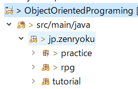

作成したパッケージをエクスプローラーで見てみると、下の画像のように、フォルダが作成されています。

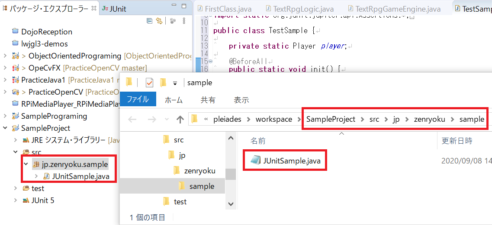

補足ですが、パッケージの上にあるフォルダ(ソースフォルダ)は**src/main/java**となっています。  

これはMaven用のフォルダです。同様に**src/test/java**がありますのでこちらはテストクラス用のフォルダとして使用します。

具体的には、以下のような構成です。
```
src/main/java: 実際に起動するアプリのためのソースコード
src/test/java: アプリのためのコードをテストするコード
```

例：筆者が作成したフォルダ構成

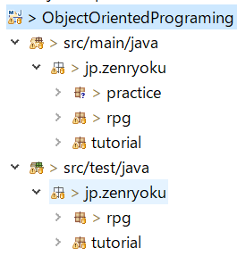

**==作成するパッケージに関して==**

これから作成していくファイルを格納するフォルダを先に作成します。

以下のように、**src/main/java** と**src/test/java**を作成して、それぞれのソースコードを格納します。

1. **src/main/java**=>作成するアプリ、今回は「じゃんけんゲーム」を動かすJavaファイルを格納します。
2.
※メインメソッドを実装するクラスのファイル(FirstJankenMain.javaなど)

2. **src/test/java**=>作成するコードを実行、確認するためのテストコードを格納するフォルダ

---
**==パッケージの作り方==**
1. パッケージを作成する場所を右クリック(srcフォルダを右クリック)
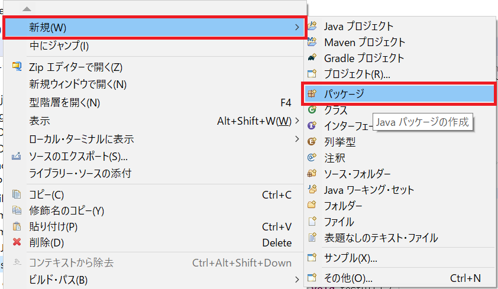

2. パッケージ名の入力(jp.zenryoku.sample)
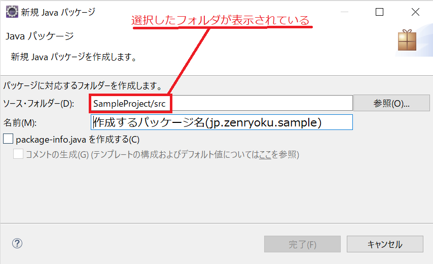

3. パッケージが作成されたことを確認
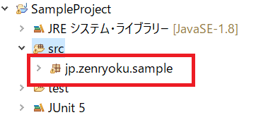


## 3. practiceパッケージにクラスを追加

フローチャートをコードにする練習として、実際に**クラスを作成、実行、確認**を行っていきます。

作成したパッケージ**jp.zenryoku.practice**の下に「Lv1HelloWorld」というクラスを作成します。

Eclipseでの、クラスの作成方法に関しては、あえて説明しません。

**==クラスの作成方法==**

パッケージの作成方法とほぼ同じです。

1. 作成するクラスのパッケージを右クリック
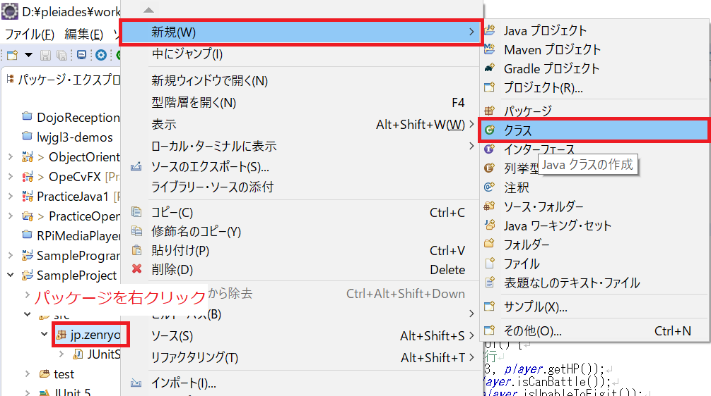

2. 作成するクラスの名前を入力する
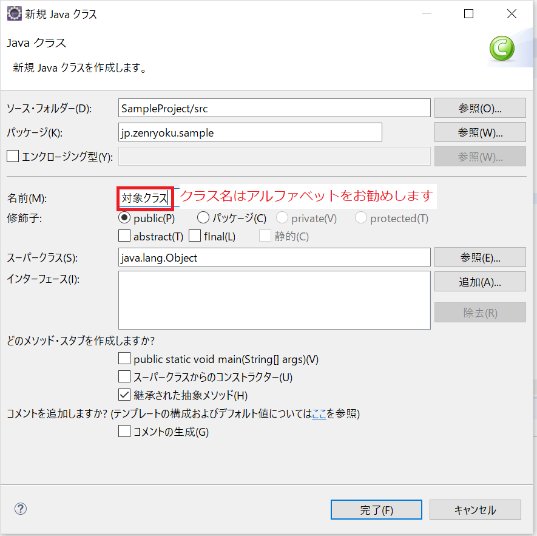


<br/>

**==Lv.1 Hello Worldの実装==**

何度も記述しますが本教材では、Javaを初めて学習する人向けですので、基本から学習していきます。

フローチャートの**サンプル１**を見てください。この処理を実装します。

**<再掲>サンプル1**

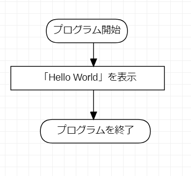

現段階では、とりあえず「クラスがあるんだな」、「メインメソッドが動くんだな」と理解してください。

「クラス」というのは、javaのコードを書くファイルです。今後、いろんな意味で使用しますので「現段階」ではこのように理解してください。

そして、クラスには書き方が決まっていて以下のように書くと決まっています。

**==コメントの書き方==**

* 「//」で始まる場合は1行コメント

* 「/*」で始まる場合は複数行コメント

* 「/**」で始まる場合はJavaDocなので注意

※JavaDocというのは、クラスやメソッドの説明をするコメントのことです。HTMLに出力することもできます。

**==forループの書き方**==
```java
for (カウンタの初期化; ループする条件(論理式); 1ループ後の処理) {
   // 何かしらの処理
}
```

// 修正開始

```java
/**
 * クラスのJavaDocの記載をするスペース
 */
public class クラス名 {
 /** フィールド変数 */
 public String field;

/**
 * メソッドのJavaDoc記載スペース
 */
 public static void main(String[] args) {
   // 1行コメント
   System.out.println("Hello World");
   // 変数の宣言
   int num;
   // 変数の初期化(宣言して、値を代入している)
   int suji = 1;

   /*
    * forループ
    */
    for (int i = 0; i < 10; i++) {
       suji += i;
    }
  }
}
```

<br/>

**==クラスの書き方==**

上のサンプルクラスのように、クラス名を書きます。
```java
public class クラス名 {
  // クラスの中身
}
```
「public」というのは修飾子といいます。「公開している」という意味でプロジェクト内の、　**どの場所からでも参照できる**という意味です。

つなげて読むと「公開しているクラス」と読むことができます。

下の例は、「FirstClass」というクラスを定義する場合です。

```java
public class FirstClass {
  // クラスの中身
}
```

Eclipseで作成すると、下のようになります。

＜作成方法＞

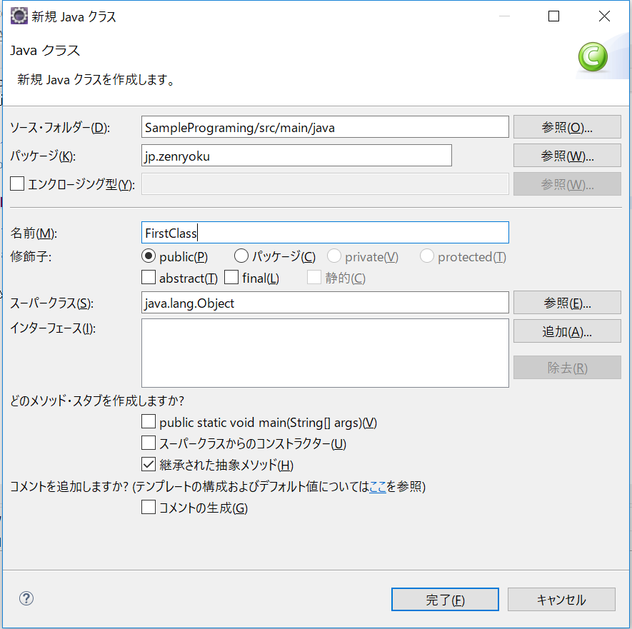

＜作成後＞

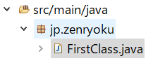

<br/>

**==メインメソッドの書き方==**

これは**書き方が決まっています**。丸暗記してもよいです。以下のように書きます。
```java
/**
 * メインメソッドのJavaDocコメント
 */
public static void main(String[] args) {
  // 処理内容
}
```
ちなみに`{}`に囲まれている範囲は**スコープ**と呼び範囲を指定するものです。今後「変数のスコープ」という言葉が出てきます。

その時は、この「スコープの中」という意味になります。

後でまた記述するので、ご安心を。。。

そして、メインメソッドの記述内容に関しては以下の通りです。

| コード | 説明 |カテゴリ|
| ------ | --- | ------ |
| public | メソッドの修飾子「公開している」という意味です。| 修飾子 |
| static | 「静的」という意味で、インスタンスを生成しなくても、staticをつけたメソッドは起動できます。<br/>※後々に詳細を記述します。| - |
| void | メソッドの返却値を示します。「void」は「返却値なし」という意味です。<br/>※その他の場合は返却するデータ型を書きます。「int」「double」「String」など |返り値 |
| String[] args| **引数と** いいます、メソッドを起動するときに渡せるものです。<br/>※これも後々に詳細を記述します。| 引数 |

まとめると以下のような形です。

```java
// ()内は書かなくてもよい
修飾子 (static) 返却値 メソッド名(引数1, 引数2 ...) {
   // メソッドの処理内容
}
```

<br/>

**==処理の中身を実装する==**

上で作成したメインメソッドの中(スコープの中)に処理を書きます。

「サンプル１」を見るとプログラムの起動と終了以外は「『Helo World』を表示する」しかありませんので、この部分を実装します。

<br/>

**「Lv.1 Hello Worldの実装」で使用するJavaAPI**

[System.out.println()](https://docs.oracle.com/javase/jp/8/docs/api/java/lang/System.html#out)

このクラスの詳細は、JavaDocに記載があります。インターネット上で見ることができますので参考にどうぞ。

そして、このクラスの説明として以下のような記載があります。

> Systemクラスによって得られる機能には、標準入力、標準出力、およびエラー出力ストリーム、外部的に定義されたプロパティおよび環境変数へのアクセス、ファイルおよびライブラリのローディング方法、配列の一部をすばやくコピーするユーティリティ・メソッドがあります。

少し難しいですが、このドキュメント(JavaDoc)を読んで理解できれば、**Javaを極めたといっても過言ではない** です。

なぜなら、JavaAPIで提供しているクラス、メソッドのすべてが[ここに記載](https://docs.oracle.com/javase/jp/8/docs/api/)されているからです。

初めに作成するプログラム「[Lv1HelloWorld.java](https://github.com/ZenryokuService/ObjectOrientedPrograming/blob/b43501d85d33749bc4badb7e3f3cb2e925df133f/src/main/java/jp/zenryoku/practice/Lv1HelloWorld.java)」のサンプルは左のリンク先にあります。

※難しくないので、わざわざサンプルコードを示しません、リンクを張っておきます。

早速、`System.out.println()`メソッドを使用してみましょう。

そして、以下に[練習問題](./練習問題集.md)のやり方を記述します。Javaの理解を深める、コード慣れしておきたい、など思うことがあれば、やってみてください。

**補足**

ここまでの記述内容で、Javaプログラミングの理解をもっとしたい、説明がよくわからなかったなど感じたら下に**練習問題集**を作成したのでこれをやってみるのも良いと思います。以降のパートで、[JUnit](https://www.techscore.com/tech/Java/Others/JUnit/index/)も使用しますので、やっておくと本教材の理解もしやすくなると思います。

プログラミングに自信のある方は、練習問題をやらなくても問題ありませんが、筆者としては、やってみることをお勧めします。

以下の内容を記述しています。
1. EclipseでのJavaプログラムの起動方法
2. 練習問題のやり方
3. 練習問題実行サンプル１ Lv.1練習問題：「Good Morning!」を表示する(Monadi1)
4. 練習問題実行サンプル２ Lv.2練習問題：足し算の計算結果を表示する
5. 練習問題実行サンプル３ Lv.3練習問題：プログラム引数の値によって処理を変える
   - 条件分岐処理を使う方法
6. データ型の種類


<br/>

**==EclipseでのJavaプログラムの起動方法==**

起動するファイルを右クリック⇒起動⇒Javaアプリケーション

＜参考動画＞

[](https://www.youtube.com/watch?v=4b4u5J9yag0)

本パートは以上になります。次のパートでは練習問題と称して今まで学習したことを確認するための問題を作成したので、そのやり方、サンプルを見てJUnitでのテスト方法とJavaプログラミングを行います。

そして、じゃんけんゲームを作成するために必要なJavaの技術を学習します。
