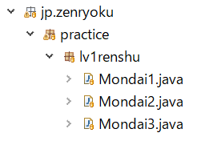
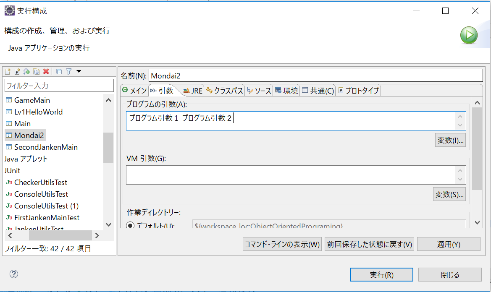
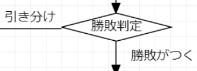
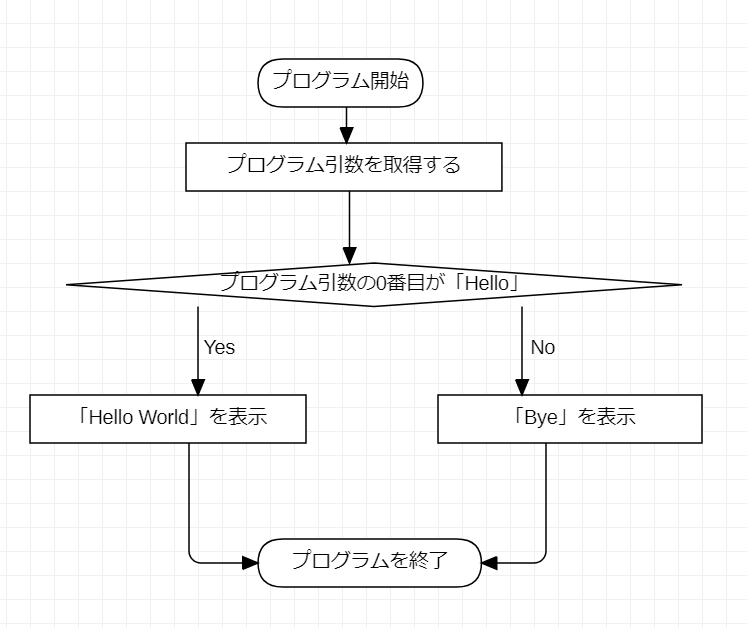

# 1-4 じゃんけんゲームの設計をする〜練習問題〜

## 練習問題のやり方

練習用パッケージ(jp.zenryoku.practice)の下に「lv1renshu」パッケージを追加します。

作成後は「jp.zenryoku.practice.lv1renshu」というパッケージができます。

その下に練習用のクラスを作成します。

例：「Lv1練習問題：「Good Morning!」を表示する(Mondai1)」を行う場合

Lv1練習問題なので「lv1renshu」パッケージの下に「Mondai1」クラスを作成します。

作成後は下のようになります。そして「NoMethodImplements.」は関係ないクラスなので無視してください。


作成後は下のようになります。




<br/>

## Lv2.練習問題のやり方
パッケージ「lv1renshu」の隣に「lv2renshu」パッケージを作成しその下に練習問題のクラスを作成してください。練習問題は下のように記述していますので、各パッケージ以下に、それぞれのクラスを作成してください。
> LvXX：~をする(クラス名)

1. 「LvXX: 」=>XXの部分がパッケージの頭の部分になります。
    jp.zenryoku.practice.lvXXrenshu
2. 「：~をする」=>実際にやることの概要 ※クラス名などとは関係ありません
3. 「(クラス名)」=>かっこの中にあるのがクラス名になります。
    (Mondai4)と記述があればMondai4のクラスを作成します。

練習問題用のパッケージとクラスの作成後は下のようになります。


※クラス名にあるリンクは筆者が作成したサンプルコードへのリンクです。


もし、説明部分を読んでもよく理解できない場合は、サンプルコードを書き写して、実行してみてください。

## Lv.1練習問題(チュートリアル)
### 問題
「Good Morning!」を表示してください(Monadi1)

### ヒント

先ほど紹介した「System.out.println」の引数に"Good Morning"を渡してあげればOKです。

筆者が作成したプログラムは[こちら](https://github.com/ZenryokuService/ObjectOrientedPrograming/blob/master/src/main/java/jp/zenryoku/practice/lv1renshu/Mondai1.java)です。
```java:Mondai1.java
public class Mondai1 {

	public static void main(String[] args) {
		System.out.println("Good Morning!");
	}
}
```
Javaに慣れていない方は、コードを書き写して動かしてみましょう。

<br/>

メソッドの書き方は下の通りです。

**＜メソッドの書き方＞**
```
アクセス修飾子 返却値 メソッド名(引数) {
  // 何かしらの処理
}
```

**＜実装サンプルコード＞**

メソッドの引数を使用したサンプルコードです。

```java
public int hello(String str) {
  System.out.println("引数は: " + str + "です。");
}
```

**＜メインメソッドからメソッドを呼び出す場合のサンプルコード＞**
```java
public class Mondai1 {

	public static void main(String[] args) {
		System.out.println("Good Morning!");// ポイントA

    // Moondai1クラスをインスタンス化
    Mondai1 main = new Mondai1(); // ポイントB

    // メンバメソッドを呼び出す
    main.hello(); // ポイントC
	}

  /**
   * 通常のメソッド(メンバ・メソッド)の定義
   * メインメソッドから直接呼び出すことはできない
   */
  public void hello() {
    System.out.println("Hello World");
  }
}
```

**処理内容について**

ポイントA：```System.out.println("Good Morning!");```の部分は[System](https://docs.oracle.com/javase/jp/8/docs/api/java/lang/System.html)クラスのフィールド変数「out([PrintStream](https://docs.oracle.com/javase/jp/8/docs/api/java/io/PrintStream.html))」を呼び出し、そのメソッド「println()」を呼び出しています。

これにより、標準出力への文字列出力を行います。Systemクラスに関しては、OSにアクセスする実装がしてあるので、深く記述しません。その代わりJavaDocに記載されている内容を書きに示します。

> Systemクラスによって得られる機能には、標準入力、標準出力、およびエラー出力ストリーム、外部的に定義されたプロパティおよび環境変数へのアクセス、ファイルおよびライブラリのローディング方法、配列の一部をすばやくコピーするユーティリティ・メソッドがあります。


ポイントB：```Mondai1 main = new Mondai1();```Mondai1クラスをインスタンス化しています。メインメソッドを実装しているクラスですが、メインメソッドはクラスの中にあっても特別な扱いになります。

つまり、Mondai1クラスをインスタンス化してからでないと「hello()」メソッドを呼び出すことができません。「static」をつけると、フィールド変数、メソッドへの参照方法が変わります。

現段階では、「static」に関しては**オマジナイなんだ**と思っておいてください。

そして、「インスタンス化」とは、「実体化する」という意味で、メモリ上にクラスオブジェクトを作成します。

**インスタンスに関しては、2-2の「インスタンス化について」で詳細を記述します。** ゆっくり理解していってください。

ポイントC：```main.hello()```Mondai1クラスに定義している「hello()」メソッド(メンバ・メソッド)を呼び出します。このメソッドの呼び出しで、下にあるメンバメソッドの```System.out.println("Hello World");```の処理が走ります。

```java:src/main/java/jp/zenryoku/practice/lv1renshu/Mondai1
/**
 * 通常のメソッド(メンバ・メソッド)の定義
 * メインメソッドから直接呼び出すことはできない
 */
public void hello() {
  System.out.println("Hello World");
}
```

## Lv.2練習問題
### 問題
下の計算処理フローを行い、コンソールに出力してください

**＜四則計算処理フロー＞**
1. int型の変数「num1」を宣言
2. int型の変数「answer」を宣言
2. int型の変数「num1」に0を代入
3. int型の変数「num2」を10で初期化
4. num1 + num2 + 2の計算(足し算)を行い「answer」に代入
5. num1 かける (num1 - num2)を行い「answer」に加算して代入
6. num1 かける 3を行い「answer」加算して代入
7. num1 わる 2を行い「answer」加算して代入
8. num1の値を表示

### ヒント
ここで使用するのは「変数」と四則演算の処理です。

**変数とは**

プログラムが動いたときにデータを格納する箱のようなものです。実際にはデータを一時的に保存しておく「メモリ領域」を確保する処理を行います。詳細に関しては、後の「**データ型について**」で記述します。

現段階では、整数(小数点を含まない数値)は「int型」を使用すると理解してください。

そして、この問題で使用するデータは整数なので、「int型」の変数を利用します。

「int型」の変数は、整数を扱うための**変数の型**です。小数点を扱うとき、文字列を扱うとき、クラスを扱うときのように「型」が存在します。クラスに関しては、```Mondai1 mondai = new Mondai1();```のように、クラスの名前をそのまま「型」として使用します。

具体的には、下のコードを見てほしいのです。

 JavaDocコメントにあるように、正数の四則計算を行う処理です。

処理としては、以下の通りです。


**＜四則計算サンプルコード＞**
```java
public static void main(String[] args) {
  // 変数宣言
  int num1;
  // 変数に値０を再セット、以前の値は削除される
  num1 = 0;

  /* 変数の初期化
   * 変数の宣言時に、値を代入する
   * 変数 = 値（代入）
   */
  int num2 = 10;

  // 1.足し算
  num1 = num1 + num2 + 2;

  // 2.引き算
  num1 = num1 - num2;

  // 3.掛け算
  num1 = num1 * 3;

  // 4.割り算
  num1 = num1 / 2;
  // 計算結果を表示
  System.out.println("計算結果" + num1);
}
```

変数を使用するときには、「宣言」もしくは「初期化」を行います。

それぞれ下の例のように記述します。

**＜int型を宣言するサンプルコード＞**
```java
// int型(整数を格納するデータ型)を宣言する
int i;
// int型を初期化する
int j = 0;
```

**＜計算をするサンプルコード＞**
```java
/* 変数を宣言した場合 */
int answer;
answer = 1 + 0;

/* 変数を初期化する場合 */
// 足し算
int answer = 1 + 1;
// 引き算
int answer = 1 + 1;
// かけ算
int answer = 1 * 1;
// 割り算
int answer = 1 / 1;
```

---
筆者が作成したプログラムは[こちら](https://github.com/ZenryokuService/ObjectOrientedPrograming/blob/master/src/main/java/jp/zenryoku/practice/lv1renshu/Mondai2.java)です。

ここまで、出来たら初めのサンプル２も問題なく作成できると思います。

ここにもサンプル２のフローチャートを記述しておきます。

**＜再確認＞**

**処理フローサンプル２**

1. プログラムを起動する
2. int型の変数を宣言する
3. 11 かける 22の計算結果を変数「i」に代入する
3. コンソールに変数「i」を表示する
4. プログラムを終了する


---

## Lv.3練習問題
### 問題
プログラム引数の値によって処理を変えるプログラムを作ってください

### ヒント

「プログラム引数」という言葉が出てきました。Javaアプリケーションを起動するときに引数を渡すことができます。

コマンドでの実行では下のようなコマンドでJavaを起動します。

※EclipseなどのIDEで起動するときもプログラム側で使用しています。

**＜コマンドでのプログラム引数の使用例＞**
```
java クラス名 プログラム引数１ プログラム引数２ ...
```

**＜コマンドでのjavaファイルのコンパイル方法＞**
 ```
 javac クラス名.java
 ```


※ 実行する前にコンパイルとか必要です。詳細は以下の動画を参照ください。

＜動画へのリンク＞

[](https://www.youtube.com/watch?v=QTiz1F2g5_w)

### プログラム引数の使用
そんなわけで、プログラム引数を使用してみます。

プログラム引数は、メインメソッドの引数に渡されます。データ型は文字列(String)で複数渡すことができるので配列になっています。配列は番号(添え字)が0から始まります。

**＜文字列型の配列の初期化方法＞**
```java
String[] arr = new String[] {"0番目", "1番目", "2番目", "3番目" ...}
System.out.pritln("配列の数(長さ)：" + arr.length);
```

Eclipseでプログラム引数を渡すときは下のように行います。

1. 実行するJavaファイルを右クリック
2. 実行⇒実行の構成

3. 起動するクラスを選択、もしくは、検索
4. 引数タブの「プログラム引数」に引数(文字列)を渡す
    ※プログラム引数を複数渡すときは間にスペースを入れる
    

**＜プログラム引数を取得するサンプルコード＞**
```java
public static void main(String[] args) {
  // プログラム引数の0番目を取得する
  String args0 = args[0];
  // プログラム引数の1番目を取得する
  String args0 = args[1];
  // プログラム引数の2番目を取得する
  String args0 = args[2];

  if ("aaa".equals(args0)) {
    System.out.println("第一引数は" + args0 + "です");
  } else if ("bbb".equals(args1)) {
    System.out.println("第二引数は" + args1 + "です");
  } else if ("ccc".equals(args2) {
    System.out.println("第三引数は") + args2 + "です");
  } else {
    System.out.println("想定外の値です。");
    System.out.println("プログラム引数 0: " + args0);
    System.out.println("プログラム引数 1: " + args1);
    System.out.println("プログラム引数 2: " + args2);
  }
}
```

<br/>

この様な形でプログラム引数を使用することができます。

### 今までに学習したことのまとめ

ちなみに、コマンドプロンプトから今回作成するテキストRPGを実行してみた動画のリンクを以下に貼り付けておきます。

**＜コマンドプロンプトからJavaの実行＞**

[](https://www.youtube.com/watch?v=716dfk-eN7A)

**・条件分岐処理を使う**

フローチャートにある下のような部品がありますが、これは条件分岐を示します。



<br/>

**・IF文を使う**

IF文は条件分岐処理を行います。

IF文を使用する前に、「**論理式**」について記述します。

論理式は、「TRUE、もしくはFALSEを返す式」です。

具体的には下のようなコードです。

**＜論理式のサンプルコード＞**
```java
// 「1」と「1」は等しいという論理式
boolean isTrue = 1 == 1;
// 「1」と「1」は等しくないという論理式
boolean isFalse = 1 != 1;　

if ("a".equals("b")) {
  // 論理式「"a".equals("b")」の結果がTrueの時の処理
} else {
  // 論理式「"a".equals("b")」の結果がFalseの時の処理
}
```

そして、TRUE / FALSEを格納する変数の型は**boolean**です。

**＜演算子とそれぞれの意味＞**

| 演算子 | 意味 |
| ----- | ---- |
| +     | 加算・足し算 |
| -     | 減算・引き算 |
| *     | 乗算・かけ算 |
| /     | 除算・わり算 |

**＜論理式を使用したサンプルコード＞**
```java
/** int型を比較 プリミティブ型なのでそのまま比較 */
// 論理式１：TRUEを返す
boolean isTrue = 1 == 1;
// 論理式２：FALSEを返す
boolean isFales = 1 == 2;

/** 文字列型を比較 */
// 文字列型(String)はクラスなのでメソッドで比較する
// 論理式３：TRUEを返す
boolean isSame = "aaa".equals("aaa");
// 論理式４：FALSEを返す
boolean notSame = "aaa".equals("aab");
```

**・データ型について**

文字列型の比較について、今まで整数値は「int型」文字列は「文字列型(String)」を使ってきました。
これらは、大きな違いがあります。データ型は以下のように大きく2つに分類できます。
1. プリミティブ型
2. 参照型(クラス型)

それぞれ以下のようなデータ型あります。[詳細はこちら](https://docs.oracle.com/cd/F25597_01/document/products/workshop/docs70/help/guide/getstarted/ovwWhatIfIDontKnowJava.html)を参照ください。

**プリミティブ型**

|型|説明|
|:---|:---|
|short|整数値(intよりも小さい)|
|int|整数値(longより小さい)|
|long|整数値(intより大きい)※ short < int < longの順番になっている|
|boolean|ture / false(真偽値)|
|byte|バイト、8ビット分のデータ(整数の場合は0~127)※ファイルなども含めすべてのデータの土台になる|
|char|文字型、文字列と違い1文字のみ、整数値としても使用可能※整数としてはあまり使用しない|
|double|浮動小数点を扱う(64ビット)|
|float|浮動小数点を扱う(32ビット)|


**参照型**

* JavaAPIで提供しているjava.util.Listなど
* 同様にjava.lang.String(文字列型)
* [配列](https://docs.oracle.com/javase/jp/8/docs/api/java/lang/reflect/Array.html)、各データ型の配列がある ex: int型の配列、String型の配列 ...

**＜各データ型の変数を使用するときの書き方＞**
```java
// int型の配列
int[] aaa = new int[] {1, 2, 3};
// 参照型なので、メソッド(プロパティ)呼び出しができる
// ※プロパティ＝フィールド変数
int len = aaa.length;
```

**IF文の使い方**

「論理式」というのは、処理の結果にTRUE / FALSEを返却する式のことです。具体的には下のようなコードです。

**＜論理式のサンプルコード＞**
```java
// 論理式１
1 == 1;
// 論理式2
"aaa".equals("aaa");
// 論理式の結果を変数に代入する
boolean b = 12 != 3;
boolean isSame = "aaa".equals("aaa");
```

そして、IF文で使用する時は下のような書き方をします。

**＜IF文のサンプルコード１＞**
```java
if (論理式) {
  // TRUEの場合
} else {
  // TRUE以外の場合
}
```

応用編で、複数の条件を指定する場合は「かつ(&&)」とか「また(||)」を使用します。

**＜応用編：IF文の書き方＞**
```java
if ((論理式 && 論理式) ||  論理式) {
  // TRUEの場合
} else {
  // TRUE以外の場合
}
```

**＜IF文のサンプルコード２＞**
```java
int num = 0;

if (num == 0) {
  System.out.println("numは" + num + "です");
} else if (num == 1) {
  System.out.println("numは1です");
} else {
  System.out.println("numは0でも、1でもありません");
}
```
---
それでは、サンプル３のフローチャートを実装してみましょう。

**==処理フローサンプル３==**

1. プログラムを起動する
2. プログラム引数を取得する
3. プログラム引数の0番目が「Hello」だった場合は「Hello World」をコンソールに表示する。
3. プログラム引数の0番目が「Hello」以外の場合は「Bye」を表示する。
4. プログラムを終了する



筆者が実装したコードは[こちら](https://github.com/ZenryokuService/ObjectOrientedPrograming/blob/6ce6ee6b61a62d6112e6ec6d0680716e7fc9ce76/src/main/java/jp/zenryoku/practice/lv1renshu/Mondai3.java)です。


## じゃんけんゲームのフローチャートを描いてみよう
ここまで来たら、細かい解説などは不要でしょう。

作成したフローチャートを比較するのに、[筆者が作成したもの](https://github.com/ZenryokuService/ObjectOrientedPrograming/blob/master/resources/JankenFllowChart1.png)があるのでご覧ください。

「こういう見方もあるか ...」というふうに思ってくれれば幸いです。


本パートでは以上になります。

フローチャートを書くときにコードに落とすことも考慮に入れて書くことができるようになったと思います。

今後は、設計しているときに「この部分はどのように実装しようか？」と疑問に思うことがあるでしょう。

その時は、実装方法や、必要な技術を理解すればよいと思います。


「何をどの順番でどのように処理をするか？」について考えることができるようになってきたのではないでしょうか？

また、何がわからないのか？を考えるときに「フローチャートのこの部分がわからない！」という見方・考え方ができるようになってきたと思います。

ポイントとしては、「何を、どの順番で、どのように処理をするか？」について考えることができるようになってきたのではないでしょうか？

「何がわからないのか？」を考えるときに「フローチャートの、この部分がわからない！」という見方・考え方ができるようになってきたと思います。


次のパートでは、クラス内のフィールド変数、メソッドの作成方法など。

自作クラスの扱い方と、じゃんけんゲームの詳細設計を行います。
