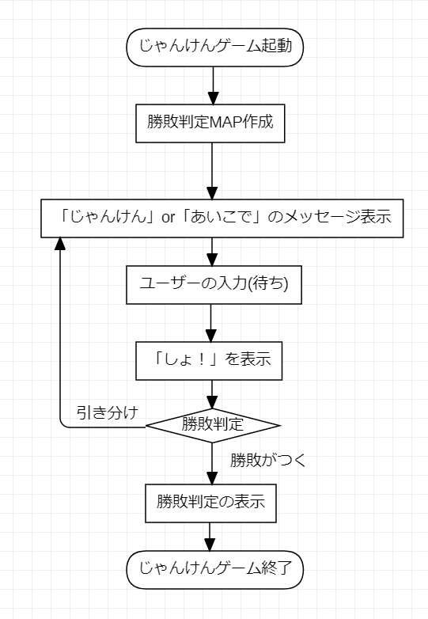

# 1-5 改めてメインメソッドを見る〜メンバ変数、ローカル変数の概念〜

本パートでは、メインメソッドの作成を行います。そのために今まで作成してきたものを

どのように反映していくか？について学習します。

**本パートで行うこと**
1. メインメソッドを作成する
2. メソッドの空実装を行う
3. 筆者の実装サンプルについて

## 1. メインメソッドを作成する
「1-2 じゃんけんゲームの詳細設計」で作成した、処理に使用するメソッドと、処理内容を

「1-1 じゃんけんゲームを設計する」で作成したフローチャートを見ながら、プログラムを起動する、メインメソッドを作ってみます。

### 処理を行う順番をメインメソッドに書く
この段階では、メインメソッドにコメントを書くだけです。つまり、フローチャートに作成した処理の内容をプログラムを書くファイル＝「javaファイル」に書き込む作業を行います。

具体的に行うことは、フローチャートで作成した処理の順番をコメントで書いていきます。

**筆者の書いたフローチャートの場合**

＜筆者の作成した処理フロー(箇条書き)＞

1. 勝敗判定マップを作成しておく
2. 「じゃんけん ...」もしくは「あいこで ...」を表示する
3. ユーザーの入力待ちをする(標準入力受付)
4. 「しょ！」を表示する
    ※**フローチャートを書いていた時に考慮が漏れていた**
5. 勝敗判定を行う
6. 勝負がついた場合
  1. ユーザーの勝ち⇒「YOU_WIN」を表示
  2. CPUの勝ち⇒「YOU_LOSE」を表示
7. 勝負がつかない場合(あいこの時)
⇒「あいこで ...」を表示する
8. 「あいこ」の場合、3からもう一度同じ処理を繰り返す



これをメインメソッドにコメントで書くと下のようになります。

**＜コメントの書き方１＞**
```
public static void main(String[] args) {
  // 1. 勝敗判定マップを作成しておく
  // 2. 「じゃんけん ...」もしくは「あいこで ...」を表示する
  // 3. ユーザーの入力待ちをする(標準入力受付)
  // 4. 「しょ！」を表示する※修正の必要あり
  // 5. 勝敗判定を行う
  // 6. 勝負がついた場合
  //   1. ユーザーの勝ち⇒「YOU_WIN」を表示
  //   2. CPUの勝ち⇒「YOU_LOSE」を表示
  // 7. 勝負がつかない場合(あいこの時)
  // 8. 3からもう一度同じ処理を繰り返す
}
```

いきなりプログラム・コードを書かずに、コメントから書くのはコードがぐちゃぐちゃにならないようにするためです。

### メンバメソッドについて
ここまで、これた方はメインメソッドの書き方、動かし方の理解ができていると思います。

ここで、**「メンバ・メソッド」に関して説明** をしようと思います。

「メンバ・メソッド」は**処理の塊**です。「塊」というのは、小さいですが何かしらの入力があり、処理結果が取得できるということです。

※処理結果がないものは「結果なし」を受け取るというイメージです。

「入力」というのは引数のこと、「処理結果」というのは返り値のことです。

メソッドの返り値がvoidの場合は、返り値がないので注意してください。

そして、メンバ・メソッドは、定義しているクラスを「new」してやらないと動かすことができません。

言葉を変えて同じことを記述すると**メンバ・メソッドはインスタンス化してからでないと使用することができません**。

**メンバ・メソッドの扱い方**
1. クラスをインスタンス化するときには「new」してやる必要があります。
2. クラスを「new」するとコンストラクタが動きます。
3. クラスの中に定義したメソッドは**メンバメソッド**と呼びます。
4. **メンバメソッド**と同じように定義しますが「static」がついている場合はインスタンス化しなくても使えます。 ``` クラス名.staticメソッド名(); ```のような形で使えます。これを「静的メソッド」と呼び**メンバメソッド**と区別します。

**＜メンバ・メソッドの扱い方サンプルコード＞**

```java
public class MethodTest1 {
  /** メインメソッド */
  public static void main(String[] args) {
    // クラスのインスタンス化
    MethodTest1 main = new MethodTest1();
    // メンバ・メソッドの呼び出し
    hello();
  }
  /** 返り値がint型、引数なしのメンバ・メソッド */
  public int hello() {
    int a = 1;
    int b = 2;
    return a + b;
  }
}
```

**＜具体例２＞**

```java
public class Mondai1 {

	public static void main(String[] args) {
		System.out.println("Good Morning!");

    //// メソッドを呼び出す場合 ////
    // Moondai1クラスをインスタンス化
    Mondai1 main = new Mondai1();
    // メンバメソッドを呼び出す
    main.hello();
    // hello(); とするとビルドエラーになる

    // staticメソッドを呼び出す
    Mondai1.goodBye("シーユー");
	}
  /** コンストラクタ */
  public Mondai1() {
    // インスタンス化(new)したときにここで定義している処理が走る
  }

  /**
   * 通常のメソッド(メンバ・メソッド)の定義
   * メインメソッドから直接呼び出すことはできない
   */
  public void hello() {
    System.out.println("Hello World");
  }

  /** staticメソッド */
  public static int goodBye(String str) {
    return 0;
  }  
}
```

メインメソッドは、クラスの中で定義していても、**メンバメソッド** を呼び出そうとしたときには「**クラスをインスタンス化する必要があります。**」

### インスタンスとオブジェクトについて
「インスタンス化」という言葉がでてきましたが、この言葉がとても抽象的で理解しずらいものです。

今理解できなくても、今後理解できるようになるのであわてる必要はありませんが、補足として説明いたします。

**インスタンス化**

クラスを「new」することです。そして、「new」することで、書いたコード(クラス)の実態が作成され、パソコン上のメモリを消費します。

(例)
1. Mondai1クラスを「new」する ``` Mondai1 str = new Mondai1();```
2. Mondai1クラスをパソコンのメモリ上に実体として作成される。これを**インスタンス化**といいます。
3. 実体なので、コピーはいくらでも作成できる。※メモリは消費するので注意

下のようなクラスがあったとします。

**＜インスタンス化のサンプル「ユーザークラス」＞**
```java
public class User {
  private String name;
  private int age;

  public User(String name, int age) {
    this.name = name;
    this.age = age;
  }
  public String getName() {
    return name;
  }  
  public void setName(String name) {
    this.name = name;
  }  
  public int getAge() {
    return age;
  }  
  public void setAge(int age) {
    this.age = age;
  }  
}
```

Userクラスは、「new」すると、メモリ上にインスタンスが作成されます。しかし、コンストラクタの引数にあるように、このインスタンスの持っている「name」に設定されている値は、インスタンス化したときに渡した値が設定されています。下のコードでは、Userクラスのインスタンスが2つ作成され、変数user1のnameには「太郎」、user2には「次郎」が設定されます。

**＜インスタンス化のサンプル「メインメソッド」＞**
```java
public static void main(String[] args) {
  User user1 = new User("太郎", 12);
  User user2 = new User("次郎", 10);
}
```
## 2.メソッドの空実装を行う
まず先に、「1-2 じゃんけんゲームの詳細設計」で作成したメソッドを実装します。

正確には、**メソッドを空実装します**。具体的には下のような形です。

中身がないので「空」実装です。**空実装では、引数(入力)と返却値(出力)を定義します。**

下のコードは、メソッド定義(空実装)の例です。

**＜メソッド定義(空実装)のサンプルコード＞**
```java
/** 引数なし、返却値なし */
public void createJudgeMap() {
}

/** 引数あり、返却値なし */
public void createJudgeMap(String input) {
}

/** 引数あり、返却値あり */
public int createJudgeMap(String input) {
}

```

全部のメソッドを空実装したらメインメソッドに戻ります。

メインメソッドは、**静的メソッド**なのでクラス内に定義していても、「new」してやる必要があります。

**静的メソッド**は、**メンバメソッド**と別扱いなのです。

逆に、静的メソッドの場合はインスタンス化しないで呼び出します。

**＜静的メソッド呼び出しのサンプルコード１＞**
```java
FirstJankenMain.myStaticMethod();
```

**＜静的メソッド呼び出しのサンプルコード２＞**
```java
public class FirstJankenMain {
  public static void main(String[] args) {
    // クラスをインスタンス化する
    FirstJankenMain main = new FirstJankenMain();
    // 空実装したメソッドを呼び出す
    main.createJudgeMap();
  }
}
```

つまりクラス内にあっても、静的メソッド(メインメソッドなどstaticのついたメソッド)内ではクラスを「new」してインスタンス化してからメソッドを呼び出してやる必要があるということです。

言葉を変えて言うと「インスタンス化してから『メンバメソッド』を呼び出す」という言い方になります。

**メンバメソッド**はクラスの中に定義された「static」ではないメソッドのことです。

その他、フィールド変数は**メンバ変数**とも呼びます。

つまり「メンバ」というのは「クラス内の」という意味になります。

具体的には下のような形です。

**＜メンバの実装サンプルコード＞**
```java
public class FirstJankenMain {
  /** フィールド変数 */
  private final int TEST = 0;

  /**
   * 静的(static)メソッドなのでクラスをnewする
   */
  public static void main(String[] args) {
    FirstJankenMain main = new FirstJankenMain();
    main.createJudgeMap();
  }

  public void createJudgeMap() {
    // メンバメソッド内からメンバメソッドは参照できる
    sampleMethod();
  }

   public void sampleMethod() {
     // メンバメソッド内からフィールド変数(メンバ変数)は参照できる
     System.out.println("フィールド変数TESTの値：" + TEST);
   }  
}
```

上のように、クラス内のフィールド変数やメンバメソッド(staticメソッドを除くメソッド)は

メンバメソッド内から参照することができます。

しかし、下のように実装するとビルドエラーが出ます。

**＜メンバメソッド呼び出しでエラーになるパターン１＞**
```java
public class FirstJankenMain {
  /** フィールド変数 */
  private final int TEST = 0;

  /**
   * 静的(static)メソッドなのでクラスをnewする
   */
  public static void main(String[] args) {
    //FirstJankenMain main = new FirstJankenMain();
    createJudgeMap(); // この行でビルドエラー
  }

  public void createJudgeMap() {
    // メンバメソッド内からメンバメソッドは参照できる
    sampleMethod();
  }

   public void sampleMethod() {
     // メンバメソッド内からフィールド変数(メンバ変数)は参照できる
     System.out.println("フィールド変数TESTの値：" + TEST);
   }  
}
```
### アクセス修飾子
ところで、メソッドに定義している修飾子は「public」フィールド変数の修飾子は「private」です。

この二つの違いは何でしょうか？修飾子の意味は前に記述しましたが確認のため。。。

* 「public」はどこからでも参照できる
* 「private」は**クラス内の**どこからでも参照できる

つまるところは下のよう名コードを書くとエラーになるということです。

**＜メンバメソッド呼び出しでエラーになるパターン２＞**
```java
public class FirstJankenMain {
  /** フィールド変数 */
  private final int TEST = 0;

  /**
   * 静的(static)メソッドなのでクラスをnewする
   */
  public static void main(String[] args) {
    FirstJankenMain main = new FirstJankenMain();
    main.createJudgeMap();
    main.TEST; // この行でビルドエラー
  }

  public void createJudgeMap() {
    // メンバメソッド内からメンバメソッドは参照できる
    sampleMethod();
  }

   public void sampleMethod() {
     // メンバメソッド内からフィールド変数(メンバ変数)は参照できる
     System.out.println("フィールド変数TESTの値：" + TEST);
   }  
}
```

> オブジェクト指向プログラミングの考え方で「カプセル化」というものがあります。

外部から参照する必要のない情報(メンバ)は外部から参照できないようにする。

現状では、メンバメソッドは外部から参照する必要がありませんので、「private」に修正するのが正しいのですが説明のため「public」にしています。

sampleMethodの修飾子を「public」にした場合は、下のように実装します。

ビルドエラーになる部分は、コメントアウトしています。

**＜sampleMethodの修飾子を「public」にした場合＞**
```java
public class FirstJankenMain {
  /** フィールド変数 */
  private final int TEST = 0;

  /**
   * 静的(static)メソッドなのでクラスをnewする
   */
  public static void main(String[] args) {
    FirstJankenMain main = new FirstJankenMain();
    main.createJudgeMap();
    main.sampleMethod(); // publicの時はビルドエラーにならない
  }

  public void createJudgeMap() {
    // メンバメソッド内からメンバメソッドは参照できる
    sampleMethod();
  }

   public void sampleMethod() {
     // メンバメソッド内からフィールド変数(メンバ変数)は参照できる
     System.out.println("フィールド変数TESTの値：" + TEST);
   }  
}
```

sampleMethodの修飾子を「private」にした場合は、下のように実装します。

**＜sampleMethodの修飾子を「private」にした場合＞**
```java
public class FirstJankenMain {
  /** フィールド変数 */
  private final int TEST = 0;

  /**
   * 静的(static)メソッドなのでクラスをnewする
   */
  public static void main(String[] args) {
    FirstJankenMain main = new FirstJankenMain();
    main.createJudgeMap();
    main.sampleMethod(); // privateの時はビルドエラー
  }

  public void createJudgeMap() {
    // メンバメソッド内からメンバメソッドは参照できる
    sampleMethod();
  }

   private void sampleMethod() {
     // メンバメソッド内からフィールド変数(メンバ変数)は参照できる
     System.out.println("フィールド変数TESTの値：" + TEST);
   }  
}
```

各メンバメソッドの空実装、メインメソッドの実装ができたと思います。


## 3. 筆者の実装サンプルについて

筆者の場合は下のようになりました。一応動くけれど、あくまでもサンプルです。

前提として、以下のコードにおける、 **main.XXXX()** のメソッドはすべて空実装の想定です。

**＜筆者の実装サンプルコード＞**
```java
public static void main(String[] args) {
	// 0.じゃんけんゲーム起動
	FirstJankenMain main = new FirstJankenMain();
	// 1.勝敗判定MAP作成
	main.createJudgeMap();
	Random random = new Random();

	// 無限ループ
	while(true) {
		// 2.「じゃんけん」or「あいこで」のメッセージ表示
		main.printJankenAiko(isJanken);
		// 3.ユーザーの入力(待ち)
		String input = main.acceptInput();
		if (main.inputCheck(input) == false) {
			System.out.println("0-2の値を入力してください。");
			continue;
		}
		// CPUの手を取得する(JavaSEのAPIを使用するのでテストしない)
		String cpuTe = String.valueOf(random.nextInt(2));
		// 4.「ポン！」or「しょ！」を表示
		main.printPonOrSho(isJanken);
		// 5.勝敗判定
		int judge = main.judgeWinLose(input, cpuTe);
		// 6.勝敗判定の表示
		main.printJudge(judge);
	}
	// 7.じゃんけんゲーム終了
}
```

本パートでは以上になります。

ここまで作成したら、フローチャートをコードにする作業は完了です。

そして、フィールド、メソッド、それぞれの修飾子がどのような意味を持っているか理解できて来たと思います。

次は、空実装になっている各メソッドのテストと実装を同時に進めていきます。

実装を先にしてしまうと、動かしてみたら想定通りに動かなかったということは多々あるので動かすたびに修正しなくてはなりません。だから先にテストケースを作成します。そしてこの実装方法を「**テストファースト**」といいます。

そして、「どのように動くけばよいか？」を明確にしてから実装するところが「テストファースト」で行うことのメリットになります。修正に関しても問題ありません。なぜならテストコードがあるからです。

今までは設計(詳細設計)レベルでの処理、実装方法など学習してきました。

次からは、どのような仕様で、どのように処理の確認をするか？

それらに対する、疑問を解決しながらテストの作成と実装をしていきます。

そして、JUnitの使い方も学習します。
