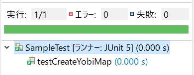

# 1-6 実装とテスト〜JUnitを使用して、テストケースから作成〜

本パートでは、JUnitの使い方とテストケースの作成、実行方法について学習します。

実装部分に関しては、ほとんど言及しません。今までのパートで学習済みなので割愛します。

もし、理解不足を感じたら[練習問題集](./練習問題集.md)をやってみることをお勧めします。

前のパートで、メインメソッドには呼び出す順番を実装(コメントの記述)をしたので、今度は各処理の中身を実装していきます。

ですが、先にテストケースを作成します。そして、「どのように動くか？」を明確にします。

この様なプログラムの作成方法のことを「テストファースト」と呼び、世界でも標準的な考え方になってきています。

そして、今までに作成した詳細設計での、メソッドの処理内容(コメント)を見ながら作成していきます。

**本パートで行うこと**
1. テストクラスを作成する
2. テストケースの作成方法(\@Testアノテーション)
3. テストクラスの準備処理の実装方法(\@BeforeClass(\@BeforeAll)アノテーション)
4. テスト準備処理の実装方法(\@Before(\@BeforeEach)アノテーション)

筆者が作成したものを例にしてテストクラスの作成方法を見ていきます。

同時に、テストで行うべき確認内容、つまりテストの内容を考えていきますので

自分で作成したメソッドに関しても同じように「何を確認したらよいか？」を念頭に入れて

読み進めてください。

**前提**

筆者の作成したフローチャートの場合は下のように動くメソッドがあります。

**筆者の書いたフローチャートの場合**

1. 勝敗判定マップを作成
    * createJudgeMap()
2. 「じゃんけん ...」もしくは「あいこで ...」を表示する
    * printJankenAiko()
3. ユーザーの入力待ちをする(標準入力受付)
    * acceptInput()
4. 「しょ！」を表示する
    ※**フローチャートを書いていた時に考慮が漏れていた**
    * printPonOrSho() // メソッド名は修正しました。
5. 勝敗判定を行う
    * judgeWinLose()
6. 勝敗判定結果を表示する
    * printJudge()

上記のメソッドは、現段階では空実装になっています。

※createJudgeMap(), printJankenAiko(), printPonOrSho(), printJudge()

サンプルとして「勝敗判定Mapの作成」に関してテストケースの作成を行っていきます。

他のメソッドに関しては割愛します。

そして、「フローチャートを書いていた時に考慮が漏れていた」部分に関しては、わざと残しておきます。

それは、考慮が漏れていた、もしくは抜けていた部分に関して修正するテクニックも記述したいからです。

**やるべきこと**

自分で考えた処理の中から切り出した「メソッド」を、一覧化して以下のような手順で作成してみてください。

1. 実装するべきメソッドを空実装で実装

2. メインメソッドにコメントでよいので処理を順番に並べてみる

	**＜コメントの実装サンプルコード＞**
	```java
	public static void main(String[] args) {
	  // 1. 勝敗判定マップを作成
	  // 2. 「じゃんけん ...」もしくは「あいこで ...」を表示する
	  // 3. ユーザーの入力待ちをする(標準入力受付)
	  // 4. 「しょ！」を表示する
	  // 5. 勝敗判定を行う
	}
	```

3. 空実装したメソッドをメインメソッドの中に実装

4. テストケースの作成 ⇒ **本パートで解説します**

**createJudgeMapの動き**

[Map](https://docs.oracle.com/javase/jp/8/docs/api/java/util/Map.html)に勝敗パターンをすべて登録するので、下のように作成しました。
1. Map型の変数にHashMapをインスタンス化
2. Mapにすべての勝敗パターンを登録する
     - Mapに「ユーザー：グー」、「CPU：チョキ」＝ユーザーの勝ちという情報をセット
     - 「グー：0」「チョキ：1」⇒キー("01"), 値(YOU_WIN)
     - 「チョキ：1」「パー：2」⇒キー("12"), 値(YOU_WIN)
     - 「パー：2」「グー：0」⇒キー("20"), 値(YOU_WIN)
     - 「グー：0」「パー：2」⇒キー("02"), 値(YOU_LOSE)

    　　・

    　　・

    　　・
3. フィールド変数に作成したMapを設定(代入)

ちなみに、[Mapインターフェース](https://docs.oracle.com/javase/jp/8/docs/api/java/util/Map.html)の使い方に関しては、左のリンク先にある、JavaDocと下記を参考にしてください。

そして、MapインターフェースはHashMapクラス実装(implements)されているので、インターフェース型の辺巣として使用することができます。

マップの使い方としては下のようなコードになります。マップのキーに文字列、値に数値を設定しています。

**＜マップの使い方サンプルコード＞**
```java
public Map createMap() {
    // Mapの実体クラスをインスタンス化
    Map<String, Integer> map = new HashMap();
    map.put("グー", 0);
    map.put("チョキ", 1);
    map.put("パー", 2);

    // 作成したMapを返却する
    return map;
}
```

そして、これらの値がセットできていることを確認するためのテストケースを作成します。

**テストで確認する内容**
> createJudegeMap()を呼び出して、
取得したMapからキー＝"01"の時はYOU_WIN(0)が取得できることを確認します。


筆者が作成したテストケースは以下になります。JUnitを使用して確認を行います。

JUnitはJavaでの開発でよく使用するテスト・フレームワークです。補足として[こちらのリンク](https://zenryokuservice.com/wp/2020/09/09/junit%E3%81%AE%E4%BD%BF%E3%81%84%E6%96%B9%EF%BD%9E%E3%83%86%E3%82%B9%E3%83%88%E3%82%AF%E3%83%A9%E3%82%B9%E3%81%AE%E4%BD%9C%E6%88%90%E3%81%A8%E5%AE%9F%E8%A1%8C%EF%BD%9E/)に使い方など記載しています。

Mapを使用したテストケースのサンプルを作成しました。Sampleクラスは、月～日曜日の文字が入ったMapを作成し、MON～SUNのフラグでそれぞれの値を取得できるMapを作成しています。

**＜テスト対象クラスサンプルコード＞**
```java
/**
 * サンプルクラス、サンプルコードを実行する。
 *
 * @author 実装者の名前
 */
public class Sample {
	/** 月曜を示すフラグ */
	public final int MON = 0;
	/** 月曜を示すフラグ */
	public final int TUE = 1;
	/** 月曜を示すフラグ */
	public final int WED = 2;
	/** 月曜を示すフラグ */
	public final int THU = 3;
	/** 月曜を示すフラグ */
	public final int FRI = 4;
	/** 月曜を示すフラグ */
	public final int SAT = 5;
	/** 月曜を示すフラグ */
	public final int SUN = 6;

	/** 曜日のMap */
	private Map<String, Integer> hantei;


	/**
	 * @return hantei
	 */
	public Map<String, Integer> getHantei() {
		return hantei;
	}


	/**
	 * @param hantei セットする hantei
	 */
	public void setHantei(Map<String, Integer> hantei) {
		this.hantei = hantei;
	}


	/**
	 * 月曜から日曜までのマップを作成する。
	 */
	public void createYobiMap() {
		hantei = new HashMap<String, Integer>();
		hantei.put("MON", MON);
		hantei.put("TUE", TUE);
		hantei.put("WED", WED);
		hantei.put("THU", THU);
		hantei.put("FRI", FRI);
		hantei.put("SAT", SAT);
		hantei.put("SUN", SUN);
	}
}
```
**＜テストケースの実装サンプルコード＞**
```java
/**
 * JUnitのサンプル実装クラス
 *
 * @author 実装者の名前
 */
@TestInstance(Lifecycle.PER_CLASS)
public class SampleTest {
	/** 月曜を示すフラグ */
	public final int MON = 0;
	/** 月曜を示すフラグ */
	public final int TUE = 1;
	/** 月曜を示すフラグ */
	public final int WED = 2;
	/** 月曜を示すフラグ */
	public final int THU = 3;
	/** 月曜を示すフラグ */
	public final int FRI = 4;
	/** 月曜を示すフラグ */
	public final int SAT = 5;
	/** 月曜を示すフラグ */
	public final int SUN = 6;

	/** テスト対象クラス */
	private static Sample target;

	@BeforeAll
	public static void initClass() {
		// テスト対象クラスのインスタンス化
		target = new Sample();
	}

	/**
	 * テストの前処理
	 */
	@BeforeEach
	public void init() {
		// 曜日マップの作成
		target.createYobiMap();
	}

	/**
	 * 曜日マップの作成結果の確認テスト
	 */
	@Test
	public void testCreateYobiMap() {
		// 作成した予備マップを取得する
		Map<String, Integer> yobi = target.getHantei();
		// int型とInteger型で「あいまい」なのでintからInteger型に変換する
		assertEquals(new Integer(MON), yobi.get("MON"));
		assertEquals(new Integer(TUE), yobi.get("TUE"));
		assertEquals(new Integer(WED), yobi.get("WED"));
		assertEquals(new Integer(THU), yobi.get("THU"));
		assertEquals(new Integer(FRI), yobi.get("FRI"));
		assertEquals(new Integer(SAT), yobi.get("SAT"));
		assertEquals(new Integer(SUN), yobi.get("SUN"));
	}
}
```

取得する値の確認を行っているのは、「testCreateYobiMap()」です、「@Test」をつけているのでテストケースとして処理が実行されます。クラスに付けているアノテーション「\@TestInstance(Lifecycle.PER_CLASS)」は現状では無視してよいです。

処理の順番を記述すると下のようになります。

1. BeforeClass(BeforeAll)アノテーションの処理が走り、テスト対象クラスのインスタンス化を行います。このアノテーションはテストクラスを起動するときに一度だけ走ります。

2. Before(BeforeEach)アノテーションの処理が走り、曜日のMapが作成されます。このアノテーションはテストケース(\@Test)の処理が走る前に毎回実行されます。

3. Testアノテーションのついたメソッド(テストケース)が走り、対象になるテストが実行されます。

このように、特定のルールに則り実装することで、細かい処理を行ってくれるもののことを**フレームワーク**と呼びます。フレームワークの種類としては、JUnitの他に、コレクションフレームワーク、Executorフレームワークなどがあります。

これらは、JDKの中に組み込まれていて特に意識しなくても使用することができます。

他には、外部ライブラリを取得して使用するフレームワーク「Springframework」やPlayフレームワークなどがあります。

## 1.テストクラスを作成する
クラスの作成方法は、通常のクラスを作成する方法と同じです。

注意点としては、作成するフォルダーが違います。

通常作成するクラスは**src/main/java**以下のフォルダーに作成しました。


今回作成するクラスは、**src/test/java**に作成します。


## 2.テストケースの作成方法(\@Testアノテーション)
クラスを作成したら、テスト起動できるように@**Test**アノテーションをつけたメソッドを作成します。

アノテーションはサンプルコードにある `import org.junit.Test;`のようにインポートします。

もしくは、 `import static org.junit.jupiter.api.Assertions.*;`のようにインポートします。これらの違いはJUnitのライブラリの違いであり、後者のほうが新しものなります。(JUnit5)

どちらも動かせるので、どちらを使用しても構いません。

```java:src/test/java/FirstJankenMainTest.java
import org.junit.Test;

public class FirstJankenMain {
  @Test
  public void test1() {
    // テスト対象クラスのインスタンス化
    FirstJankenMain target = new FirstJankenMain();
    // テストするメソッドを呼び出す
    target.createJudgeMap();
  }
}
```
上のコードでは、実行するテストケースを実装しています。処理の内容としては以下の通りです。
1. テスト対象クラスのインスタンス化
2. テストするべきメソッドの呼び出し

## 3. テストクラスの準備処理の実装方法(\@BeforeClass(BeforeAll)アノテーション)
上のサンプルコードでは、テストケース(\@Testのついたメソッド)のなかでテスト対象クラスをインスタンス化しています。

「オブジェクト指向プログラミングの考え方」では、 **なるべく同じコードは書かない** というのがあります。なので、テストを起動する前のテストの準備処理メソッドを作成します。

しかし、何も工夫をしないのでは、テストケースを作成するたびに「同じコード」を書かなくてはいけません。

※テスト対象クラスはテストを実行するのにインスタンス化する必要があります。

早い話が、テストクラスを起動するときに「テスト対象クラス」のインスタンスを保持してしまえば「同じコード」を書かなくてよい⇒作業効率、可読性、ともに良好、となるわけです。

※「可読性」というのは読みやすいということですが、テストクラスの起動準備処理は「\@BeforeClass(BeforeAll)」のアノテーションがあるメソッドに書いてあるということがわかれば、

必然的にこのメソッドで準備処理を行うことになります。⇒このメソッドを見ればテストクラスを起動するときにどのような準備をしているかわかる、ということです。

具体的には以下のように実装します。注意点としてこのメソッドは「静的メソッド(static)」ですので通常のフィールド変数と違います。

※**static**修飾子に関しては2章で学習します。
```java
import org.junit.BeforeClass;
import org.junit.Test;

public class FirstJankenMainTest {
  /** テスト対象クラス */
  private static FirstJankenMain target;

  /** テストクラスを起動するときに1回だけ動く */
  @BeforeClass
  public static void initClass() {
    // テスト対象クラスのインスタンス化
    target = new FirstJankenMain();
  }
}
```
処理内容は以下の通りです。
1. フィールド変数にテスト対象クラスを宣言
2. \@BeforeClassのメソッドでテスト対象クラスのインスタンス化

## テスト準備処理の実装方法(\@Before(BeforeEach)アノテーション)
上の「\@BeforeClass」と似ていますが、今度はテストを実行する前の処理です、具体的には「\@Test」のついたテストケースの実行前に行う処理です。

「 **\@Before** アノテーション」を使用します。

「\@BeforeClass」でテストの全体で使用するクラスや、前もって読み込んでおくファイル、接続しておくDBなどの準備を行いますが、テストケースを実行する前と後で行っておきたいことがあります。

筆者が作成したテストでは「勝敗判定Map」を使用しているので、クラスのインスタンスを作成したらMapの作成も行わなくてはいけません。

「2章 オブジェクト指向プログラミングで実装」で記述しますが、コンストラクタで勝敗判定Mapを作成するのが妥当ですが、

学習の順番的にもう少し後なので「コンストラクタ」は使用しません。

改めて、\@Beforeアノテーションを使用したサンプルコードです。
```java
import org.junit.Before;
import org.junit.BeforeClass;
import org.junit.Test;

public class FirstJankenMainTest {
  /** テスト対象クラス */
  private FirstJankenMain target;

  /** テストクラスを起動するときに1回だけ動く */
  @BeforeClass
  public static void initClass() {
    // テスト対象クラスのインスタンス化
    target = new FirstJankenMain();
  }

  /**
   * テストケースを実行する前に動く(テストケースの数だけ動く)
   */
   @Before
   public void initTest() {
     // テストを起動する度に勝敗判定Mapを作成する ※テストを行う必要もある
     target.createJudgeMap();
   }
}

```
処理内容は以下の通りです。
1. フィールド変数にテスト対象クラスを宣言
2. \@BeforeClassのメソッドでテスト対象クラスのインスタンス化
3. \@Beforeメソッドで勝敗判定Mapの作成処理を呼び出す

## 4. テストケースの実装
ここまでで、テストの実行準備ができました。

いよいよテストを行います。というか実装とテストケースを作成します。

筆者の作成したテストケースを例に解説していきます。

ちなみに、JUnitの実行するときは下のように

テストクラスを右クリック⇒実行⇒JUnitテストをクリックします。


**createJudgeMapのテスト**

勝敗判定Mapの作成と作成した結果が想定通りか確認するためのテストを行います。

なので、以下のような確認を行います。

まずは、以下のような前提があります。
1. 勝敗判定Mapのキーは「ユーザーの手」と「CPUの手」を連結した文字列
    * 「ユーザーの手がグー」と「CPUの手がチョキ」ならばキーは"01"になる
    * グー～パーまでの各手は「グー＝1」「チョキ＝1」「パー＝2」のようにint型のフラグで判定する
2. 勝敗判定Mapのキーから取得するのは勝敗結果とする
    * 「ユーザーの手がグー」と「CPUの手がチョキ」ならば値は「YOU_WIN」となる
    * 「YOU_WIN＝0」「YOU_LOSE＝1」「AIKO＝2」のようにint型のフラグを判定結果とする

なので、確認する内容としては以下のようになります。
1. 「ユーザーの手がグー」と「CPUの手がチョキ」ならば、結果は「YOU_WIN」
2. 「ユーザーの手がチョキ」と「CPUの手がパー」ならば、結果は「YOU_WIN」
3. 「ユーザーの手がパー」と「CPUの手がグー」ならば、結果は「YOU_WIN」
4. 「ユーザーの手がグー」と「CPUの手がパー」ならば、結果は「YOU_LOSE」
5. 「ユーザーの手がチョキ」と「CPUの手がグー」ならば、結果は「YOU_LOSE」
6. 「ユーザーの手がパー」と「CPUの手がチョキ」ならば、結果は「YOU_LOSE」
7. 「ユーザーの手がグー」と「CPUの手がグー」ならば、結果は「AIKO」
8. 「ユーザーの手がチョキ」と「CPUの手がチョキ」ならば、結果は「AIKO」
9. 「ユーザーの手がパー」と「CPUの手がパー」ならば、結果は「AIKO」

表にまとめるとわかりやすいです。

|テストケース|ユーザーの手|CPUの手|勝敗結果|
| --------- | --------- | ----- | ----- |
| ケース１　 |　グー　　　|　チョキ|　YOU_WIN　|
| ケース２　 |　チョキ　　|　パー　|　YOU_WIN　|
| ケース３　 |　パー　　　|　グー　|　YOU_WIN　|
| ケース４　 |　グー　　　|　パー　|　YOU_LOSE |
| ケース５　 |　チョキ　　|　グー　|　YOU_LOSE |
| ケース６　 |　パー　　　|　チョキ|　YOU_LOSE |
| ケース７　 |　グー　　　|　グー　|　AIKO |
| ケース８　 |　チョキ　　|　チョキ|　AIKO |
| ケース９　 |　パー　　　|　パー　|　AIKO |

そして、JUnitの結果の確認用コードはAssertクラスにまとまってあります。

なので、下のように実行結果を確認する事ができます。
```java
Assert.assertTrue(1 == 1);
Assert.assertFalse(1 == 1);
Assert.assertEquals("aaa", "aaa");
Assert.assertEquals(1, 1);
```

確認が成功すると緑色になります。



逆に失敗すると茶色になります。


**privateメソッドのテスト方法**

今まで作成したメソッドはすべて、下のように「public」になっていたと思います。
```java
public void createJudgeMap() {
}
```
これは、オブジェクト指向プログラミングの考え方的に不適切です。

本来であれば、外部から参照する必要がないので「private修飾子」をつけるべきです。

つまり、外部から呼び出しても意味がない、用途が限られているので**汎用的でない**メソッドになります。

この様なメソッドは「private修飾子をつけるべき」ということです。

しかし、「private」メソッドで実装するとテストケースを実装するときにそのまま呼び出すことができないというような問題が出ます。

```java
public class FirstJankenMain {
  private void createJudgeMap() {
  }  
}

public class FirstJankenMainTest {
  @Test
  public void test01() {
    FirstJankenMain target = new FirstJankenMain();
    target.createJudgeMap(); // ビルドエラーが出る
  }
}
```
createJudgeMapメソッドの修飾子が「private」なので

「外部から参照できませんよ！」というエラーが出ます。

「それではテストできないのか？」と不安に思った方ご安心ください。

Javaには、この問題を解決する手段があります。

しかし、この実装は、初心者でなくても使用する人が少ない実装ですので、「こんな実装もあるんだな」と思ってもらえればよいです。


**java.lang.refrectを使う**

テストしたいメソッドが「private」の場合は下のように

Methodクラスを取得して**アクセス制限を解除**します。

※「private修飾子」を使用して外部からのアクセスを禁止していた部分を変更します。このような実装は、テストケースの実装以外では、セキュリティ的にアウトです。

　初めからprivateを使用するべきではありませんし、プログラムの設計を見直してアクセス修飾子の設定をどのようにするべきか検討する必要があります。

そしてメソッドの実行。

まとめると以下の手順になります。
1. テスト対象クラスのクラスオブジェクト(クラス)を取得
2. クラスオブジェクト(クラス)からメソッドクラスを取得
3. メソッドクラスの**アクセス制限を解除**
4. メソッドの実行

具体的なコードは下のようなものです。※FirstJankenMainTestを[GitHubにアップ](https://github.com/ZenryokuService/ObjectOrientedPrograming/blob/20201226/src/test/java/jp/zenryoku/tutorial/FirstJankenMainTest.java)してあります。

```java
/**
 * java.lang.refrectionを使用してプライベート修飾子のメソッドを取得します。
 * ※privateは外部から参照することができないのでアクセス権を変更する必要がある。
 * 　実装方法: clazz.setAccessible(true);
 *
 * @param clazz テスト対象クラス
 * @param methodName テストするメソッド名
 * @args 起動するメソッドの引数
 */
private Method getPrivateMethod(Class clazz, String methodName, Class<?> ... paramType) {
	// テスト対象クラスを返却する
	Method testMethod = null;
	try {
    // 指定した名前のメソッドを取得する
		testMethod = clazz.getDeclaredMethod(methodName, paramType);
	} catch (NoSuchMethodException e) {
		e.printStackTrace();
	} catch (SecurityException e) {
		e.printStackTrace();
	}
	return testMethod;
}

/**
 * 勝敗判定MAP作成処理。
 */
@Before
public void testInit() {
	// テストするメソッドを取得する ※警告が出るが、引数なし、返却値なしのメソッドなので良しとする
	Method test = getPrivateMethod(target.getClass(), "createJudgeMap", null);
	// テストを実行する
	try {
		// プライベートメソッドのアクセスを可能にする(テストの時だけ使用するようにする)
		test.setAccessible(true);
		// ※警告が出るが、引数なし、返却ちなしのメソッドなので良しとする
    // 取得したメソッドの実行
		test.invoke(target, null);
	} catch (IllegalAccessException e) {
		e.printStackTrace();
		Assert.fail("アクセスの仕方に問題があります。");
	} catch (IllegalArgumentException e) {
		e.printStackTrace();
		Assert.fail("引数に問題があります。");
	} catch (InvocationTargetException e) {
		e.printStackTrace();
		Assert.fail("メソッドの起動時に問題が発生しました。");
	}
}
```
1. getPrivateMethod()にテスト対象クラスの、クラスオブジェクト(クラス)、対象のメソッド名、引数(引数なしなのでNULLを渡す)
```java
// testInit()の処理
Method test = getPrivateMethod(target.getClass(), "createJudgeMap", null);
```

2. getPrivateMethod()では、テスト対象クラスのクラスオブジェクト(クラス)からメソッドクラスを取得し返却
```java
// getPrivateMethod()の処理
testMethod = clazz.getDeclaredMethod(methodName, paramType);
```

3. 取得したメソッドのアクセス制限を変更する
```java
// testInit()の処理
test.setAccessible(true);
```

4. 取得したメソッドの実行
```java
// testInit()の処理
test.invoke(target, null);
```
※メソッドの取得時、起動時に例外が発生する可能性のでtry~catchで例外処理を行っています。
　これは、JavaDocにて```throws```文で定義されているのですぐにわかります。

**[Method#invoke](https://docs.oracle.com/javase/jp/6/api/java/lang/reflect/Method.html#invoke(java.lang.Object,%20java.lang.Object...))**
```java
public Object invoke(Object obj,
                     Object... args)
              throws IllegalAccessException,
                     IllegalArgumentException,
                     InvocationTargetException
```

ここまで学習したら、自分の考えた処理のテストケースを作成することができると思います。

実際、テストケースを1行分の作成したら、実装も行ってしまいがちですが。。。

ポイントとしては、「どのように動けばよいか？が明確になっている」ということです。

つまるところ、テストケースの結果が緑色になるようにメソッドの中身を実装すれば要件を満たしているということです。

テストケースが作れれば、実装はさほど難しくないと思います。

### try~catchについて
下のようにtry~catchで囲むとtryのスコープ内で起きた例外(Exception)をキャッチして処理を継続することができます。

```java
try {
   // 例外を投げるメソッドなどの、何かしらの処理  
} catch(例外クラス 例外クラスの変数名) {
   // 例外をキャッチしたときの処理
}
```

### 不足分の修正に関して
フローチャート、処理フロー(箇条書き)を見ながらプログラムの実装を進めてきましたが、

コードを書いている最中に「ここの処理が足りない！」などのように想定外の部分が出てきます。

具体的には、前提の部分で「※**フローチャートを書いていた時に考慮が漏れていた**」と記述した内容に関して、「じゃんけん」「あいこで」の後には「ポン！」もしくは「しょ！」を表示する必要があります。

しかし、フローチャートにはその部分の考慮が漏れていました。

これを考慮漏れのまま作成すると下のようなメソッドになります。

```java
private void printPonOrSho() {
	// 「あいこで」の場合は「しょ！」
	System.out.println("しょ！");
}
```

しかし、処理を「塊」としてメソッド分けしているので、このメソッドを下のように修正すれば考慮漏れの部分も問題なく解決することができます。

```java
private void printPonOrSho(boolean isJanken) {
	if (isJanken) {
		// 「じゃんけん」の場合は「ポン！」
		System.out.println("ポン！");
	} else {
		// 「あいこで」の場合は「しょ！」
		System.out.println("しょ！");
	}
}
```

メソッドに引数を追加して、「じゃんけん」と「あいこで」の2パターンに対応できるようにします。

単純にこれで解決します。メソッドでいちいち切り分けしているのは、この様な対応が可能になるので少し面倒ですが、この様にプログラムを作成していきます。

※現実でもプログラム・コードでも頭の中だけでは、物事は解決しません。

今回の処理は、単純なものですので、メソッドを切り分けする程度でよいですが、例えばネットワーク通信処理などを実装したとき、ウェブサーバーを作成したときはメソッドを切り分けるだけでは、修正箇所がものすごく多くなるので、クラス別に役割分担を行います。この部分に関しては、2章以降に記述しますので、楽しみにしていてください。

そして、今までやってきたことを見返してみると。

不足、考慮漏れがあり、修正、追加する部分があったときは、どこを直せばよいか、おのずと見えてくると思います。

処理はメソッド別に「塊」になっていますし、各処理を呼び出す順番はメインメソッドで定義しています。

同じことを繰り返すようですが、筆者が作成したものは『「じゃんけん ...」と「あいこで ...」を表示するときにどちらを表示するかの判定』を行っていませんでした。※「考慮漏れ」の部分についてです。

なので、修正する部分はメインメソッドで「printJankenAiko()」を呼び出すときに

引数へ渡しているbooleanの処理を追加・修正すればOK。となりました。下のように修正しました。

※赤い行は削除・修正した行です。修正後は緑色の行です。


他にも、「ここがイマイチ。。。」と感じる部分があったので修正しました。

まとめると、処理をメソッドで分割、整理しておくと以下のようなメリットがあります。
1. 修正箇所をすぐに見つけることができる
2. 修正時にほかの処理への影響が少ない⇒その部分だけ修正すればよい

ここまで、勢いよく進んできたので「もう少し理解を深めたい」という人向けに

練習問題を集めてみました。[練習問題集](./練習問題集.md)です。復習的にも使用できます。

※ネーミングに捻りはありません。

本パートでは以上になります。設計レベルで考えていた処理が実装レベルになると

少し違った形で見えてきたと思います。

今まで作成したものは1つのクラスにメソッドで処理を分割して作成しました。

「設計」から「実装」までを行ったので、開発の大まかな流れが見えたと思います。

そして「設計レベル」と「実装レベル」の違いが少し理解できたのではないでしょうか？

「設計レベル」では、人と人で話し合い「どのような機能を実装するか？」など話し合うときに使用するものの見方(言い方)をします。

「実装レベル」では、実際にプログラムを組むときの見方(言い方)で詳細設計や実装するときに「ここの処理が・・・」などのような会話をしたりします。

**余談：プログラマー失敗談**

仕事で、プログラムを作成するときには「認識合わせ」がとても大切です。

もし、「認識」が違ってしまうと作成するプログラムが「不要なプログラム」になってしまいます。

当然作業はやり直しになりますので「認識合わせ」は念入りにやったほうが良いです。

筆者も「認識合わせ」で苦労したことがあります。現場に行って「表現が独特な人」がいることがあります。

早い話が「その人の認識がよくわからない」という事件に遭遇することがあります。

何回話し合っても「認識が合わない」という事件に遭遇したのですが、このような時には

プログラムでも、ドキュメントでも作成して「このような形でよいですか？」と確認したほうが早く片付きます。

次は、実装が漏れている部分があるのでそれを追加で実装します。

具体的には、メソッド追加、テストケース追加の２つを行います。

そして、最終的にじゃんけんゲームが動くかどうか、メインメソッドの起動確認を行います。
