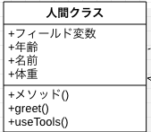
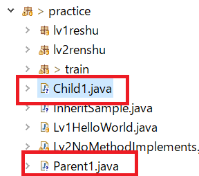
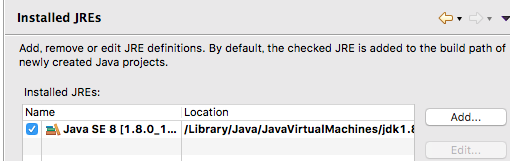
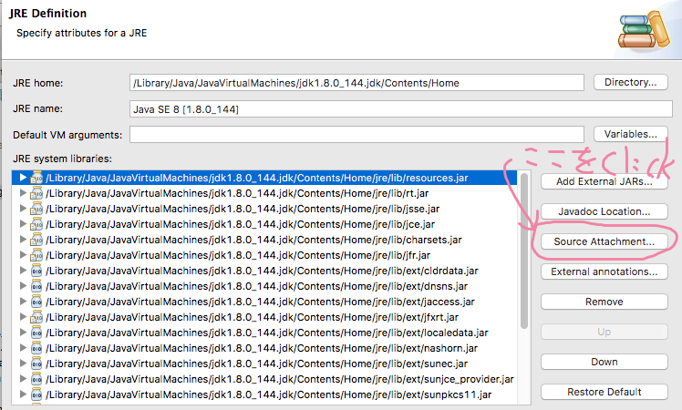

# 2-1 じゃんけんゲームの設計をする〜1章と同じものを使用する〜

本パートでは、1章で作成したじゃんけんゲームをオブジェクト指向プログラミングの考え方に

則り再度作成することを考えます。

なので、フローチャート、処理フロー(箇条書き)は全く同じものを使用します。

1章で作成したものと本章で作成するものの大きな違いは**クラスの役割分担を行う**というところです。

ちなみに、設計レベル(詳細設計レベルを除く)の内容は、1章で作成したものと同じなので

実は、設計に関して学習することがありません。。。

なので、**Javaのクラスの扱い方** に関して掘り下げて学習します。

本パートではクラスとクラスの関連を学びます。

具体的には、以下のことを学びます。
1. クラスの作成方法(復習)
2. カプセル化について
4. クラスの継承方法
4. クラス継承の意味と考え方
5. インターフェースクラスについて

## 1. クラスの作成方法(復習)

前の章でも記述しましたが、確認のため記述します。

＜クラスの書き方＞
```java
public class クラス名 {
  // クラスの中身
}
```
「public」は修飾子といいます。「公開している」という意味でプロジェクト内の、**どの場所からでも参照できる**という意味です。

つなげて読むと「公開しているクラス」と読むことができます。

＜クラスの書き方：例＞
```java
public class FirstClass {
  // クラスの中身
}
```
上の例は、「FirstClass」というクラスを定義する場合です。

## 2. カプセル化について
＜クラスの書き方＞にあるように、クラスを作成しますが、クラスの中身には下のようなものを定義します。

A. フィールド変数
B. コンストラクタ
C. メソッド

### A. フィールド変数
クラスの中に持っている(管理している)変数のことです。図で示すと下のようになります。



これは、日本語では「属性」という言い方をします。英語では「Attribute」です。日本語では「属性」というと他のものをイメージしてしまいがちですが「クラスで保持している情報」という意味なので混乱しないようにしてください。

### B. コンストラクタ
コンストラクタは、クラスを「new」するときに動くものです。メソッドという解釈をする人もいますが、とりあえずは「new」するときに動くという認識で良いです。

コードにすると下のようになります。クラス名と同じ名前でメソッドを作るという形になります。メソッドと同様にオーバーロードができます。
```Java
public class Sample2 {
    /** 属性１ */
    private String attribute1;
    /** 属性2 */
    private  int attribute2;

    /** コンストラクタ */
    public Sample2() {
        attribute1 = "属性１";
        attribute2 = 10;
    }

    /** コンストラクタのオーバーロード */
    public Sample2(String attribute1, int attribute2) {
        this.attribute1 = attribute1;
        this.attribute2 = attribute2;
    }

    /** アクセさーメソッド */
    public String getAttribute1() {
        return this.attribute1;
    }

    /** アクセさーメソッド */
    public void setAttribute1(String attribute1) {
        this.attribute1 = attribute1;
    }

    /** アクセさーメソッド */
    public int getAttribute2() {
        return this.attribute1;
    }

    /** アクセさーメソッド */
    public void setAttribute1(int attribute2) {
        this.attribute2 = attribute2;
    }

}
````　
フィールド変数は、アクセス修飾子のスコープを「private」にします。外部から直接アクセスできないようにするためです。

ここがカプセル化の本題になります。クラスを作成したときに「属性」はメソッドを介してアクセスするようにします。このようにクラスをカプセル化することで、セキュリティーを向上させます。

直接フィールド変数への**アクセスは危険**というのは下のようなコードです。

＜危険なアクセスのサンプル＞
```java
public static void main(String[] args) {
    Sampl2 sample = new Sample2("太郎", 10);
    // このようなアクセスが危険
    sample.attribute1 = "二郎";
}
```
＜危険なアクセスのサンプル＞にあるような、コードはフィールド変数「attribute1」に直接アクセスしています。

フィールド変数のアクセス修飾子は「private」ではなく「public」や「package」などのクラス外からでもアクセスが可能なものをつけます。

これは、```setAttribute1()```などの**アクセさーメソッド**を使用しない形でフィールド変数にアクセスするので**危険**ということですが。

```sample.attribute1 = "二郎";```

このコードと下のコードのような違いがセキュリティー的に大きく違うのは、メソッド(「操作」)を行なってフィールド変数にアクセスするか、しないか？の違いです。

```sample.setAttribute1("二郎");```

プログラムのコードだけ見ると**大した違いはない**と思うかもしれませんが、実際の動きで考えるとどうでしょうか？

つまりは、「言葉にしてみる」と大きく違うことがわかります。

**==＜危険なアクセスのサンプル＞の場合==**
> **例１：**アクセサーメソッドを使用する場合
「Sample2の、attribute1に「二郎」という値をセットする」
>
> **例２：**アクセサーメソッドを使用しない場合
> Sample2の中身、『attribute1』に直接値を代入する」

**==＜銀行口座のユーザー＞の場合==**
> **例１：**アクセサーメソッドを使用する場合
> 「Aさんの銀行口座情報クラスにある、パスワードに『二郎』という値をセットする」
>
> **例２：**アクセサーメソッドを使用しない場合
> 「Aさんの銀行口座情報クラスの中身、パスワードに『二郎』を直接代入する」

銀行の情報(口座のパスワードなど)は、漏れてはいけません。その漏洩してはいけない情報が、「**管理するクラスから「操作」を経由しないで、直接変更できる**」という状況は**大変危険**というわけです。

なので、「**フィールド変数のアクセス修飾子は基本的に「private」にしましょう**」ということです。

例外もあります。クラスの中(属性)で、公開しても良い情報を持たせることもあります。

＜公開しても良い情報を持つクラス＞
> 例：  会社の中にある部署の情報を持つクラス

このようなクラスは、値が変わることは滅多にないので「定数を管理するクラス」として定義することが多いです。
なので、下のような書き方で**定数クラス**を作成することもあります。

```java
public class Busho {
    /** 営業部 */
    public static String BUSHO_EIGYO =  "0";
    /** 購買部 */
    public static String BUSHO_KOBAI = "1";
    /** 開発部 */
    public static String BUSHO_KAIHATSU = "2";
}
```

定数クラスは下のように、使用することが多いです。データ型は文字列以外にも、整数型(int)などもよく使います。

```java
public static void main(String[] args) {
    // プログラム引数を取得する
    String param1 = args[0];
    if (Busho.BUSHO_EIGYO.equals(param1)) {
        // 営業部の時の処理
    } else if (Busho.BUSHO_KOBAI.equals(param1)) {
        // 購買部の時の処理
    } else if (Busho.BUSHO_KAIHATSU.equals(param1)) {
        // 開発部の時の処理
    } else {
        System.out.println("0〜2の値をプログラム引数に渡してください");
    }
}
```

### C. メソッド
これは、１章で学んだ事なので、詳細は割愛いたします。

## 3. クラスの継承方法

おまちかね、クラスの継承方法です。

上記のクラス作成方法に加えて「extends クラス名」とするだけです。

＜クラス継承の書き方＞
```java
public class FirstClass extends クラス名{
  // クラスの中身
}
```

クラスを継承すると、親クラス(上記のコードでは「クラス名」の部分)に書いてあるコードをそのまま受け継ぐことができます。※全部ではありませんので注意！

**==継承されるもの==**
* private修飾子以外の修飾子がついたフィールドとメソッド

**==継承されないもの==**
* private修飾子のついたフィールドとメソッド


＜継承サンプル１＞
```java
/** 親クラス */
public class Parent1 {
  private int age;
  protected String name;
  public final GROUP_A = "groupA";

  /** コンストラクタ */
  public Parent1() {
    age = 40;
    name = "Gonbe";
  }

  /** オーバーライドなし */
  public void say() {
    System.out.println("私の名前は" + name + "です。");
    System.out.println("私の年齢は" + age + "です。");
  }
}

/** 子クラス */
public class Child1 extends Parent1 {
	private int age;

	/** コンストラクタ */
	public Child1() {
		age = 10;
		name = "Taro";
	}

    /** オーバーライドしている */
	@Override
	public void say() {
        System.out.println("私の名前は" + name + "です。");
		System.out.println("私の年齢は" + age + "です。");
	}
}


```

**==Parent1のコード解説==**
1. フィールド変数に以下を作成
    * このクラス内でのみアクセス可能な整数型の変数ageを宣言;
    * パッケージ内、継承関係のあるクラスのみアクセス可能なString型の変数nameを宣言;
    * どこからでもアクセス可能な定数GROUP_Aを"groupA"で初期化
2. コンストラクタで、ageに 40を代入、nameに"Gonbe"を代入
3. say()メソッドに、ageとnameを表示する処理を実装

**==Child1のコード解説==**
1. フィールド変数に以下を作成
    * このクラス内でのみアクセス可能な整数型の変数ageを宣言;
2. コンストラクタで、ageに 10を代入、親クラスにあるフィールド変数、nameに"Taro"を代入
3. say()メソッドに、ageとnameを表示する処理を実装

### アクセス修飾子
前章までは「修飾子」という言い方をしていました。今後は「アクセス修飾子」という言い方をします。

具体的には「public」「protected」「private」というキーワードのことです。

そして、継承サンプル１では複数クラスをまとめて書いてありますが、実際に作成するときは
**1クラス1ファイル**で作成してください。
具体的には以下の画像のような形です。



そして、上記の二つのクラスの実行クラスです  

＜[InheritSample.java](https://github.com/ZenryokuService/ObjectOrientedPrograming/blob/master/src/main/java/jp/zenryoku/practice/InheritSample.java)＞
```java
public class InheritSample {
	public static void main(String[] args) {
		Parent1 parent = new Parent1();
		Child1 child = new Child1();

		System.out.println("親クラス：");
		parent.say();
		System.out.println("子クラス：");
		child.say();
	}
}
```

上のクラスではサンプルコードのクラス「[Parent1](https://github.com/ZenryokuService/ObjectOrientedPrograming/blob/master/src/main/java/jp/zenryoku/practice/Parent1.java)」「[Child1](https://github.com/ZenryokuService/ObjectOrientedPrograming/blob/master/src/main/java/jp/zenryoku/practice/Child1.java)」を実行しています。

実行結果は、下のようになります。

> 親クラス：
私の名前はGonbeです。
私の年齢は40です。
子クラス：
私の名前はTaroです。
私の年齢は10です。

親クラスの起動順序は以下の通りです。
1. 親クラスのコンストラクタ
2. Parent1#say()が起動

子クラスも同様に
1. 子クラスのコンストラクタ
2. Child1#say()が起動

上記の実行結果から以下３つのことがわかります。
* 子クラスのフィールド```private int age```は親クラスにも同じフィールド変数があるけど別物として使われている
* 子クラスにない変数```name```は親クラスにあるフィールド変数を使用している
* Parent1#say()をオーバーライドしているので親クラスのsay()とは別のメソッドとなっている

**==オーバーライドとは==**

作成したメソッド(抽象メソッドを含む)を継承した子クラスで同じメソッドを定義することです。

Child1#say()を参照してください。実装時にはわかりやすいように「\@Override」をつけることが多いです。

そして、親クラスとこクラスで処理内容が同じように見えますが、ageとnameで定義しているクラスが違うところに着目して見てください。

## 4. クラス継承の意味と考え方
継承関係を作成し、クラスを作成することを学習したので次はその意味と考え方を学習します。

意味としては、親クラスを拡張して別のクラスを作ることができる。ということで

考え方としては、親クラスを拡張してどのように使うか？というところです。

サンプルとして、継承関係を作った時にどのような挙動をするか見てみるのが早いと思います。

### 親クラスと子クラスのサンプルコードと実行結果

試しに、継承サンプル１に書いた子クラスのsay()をコメントアウトして実行してみると以下のような出力が得られます。
＜修正したクラス＞
```java  
/** 子クラス */
public class Child1 extends Parent1 {
	private int age;

	/** コンストラクタ */
	public Child1() {
		age = 10;
		name = "Taro";
	}

//	@Override
//	public void say() {
//		System.out.println("私の名前は" + name + "です。");
//		System.out.println("私の年齢は" + age + "です。");
//	}
}
```
そして、同じクラス(InheritSample)を起動します。

＜出力結果＞
> 親クラス：  
私の名前はGonbeです。  
私の年齢は40です。  
子クラス：  
私の名前はTaroです。  
私の年齢は40です。  

フィールド変数```age```の値が子クラスのものではなく親クラスのものを使用している状態なので上のように「年齢は40です」と表示されます。

この様に、クラスの継承関係を作成したときに、変数名を同じにすると、とても間違えやすい状態になります。

結局、Child1クラスにある、メソッドをコメントアウト(削除)した為に、親クラスのメソッドを呼び出すようになってしまったというわけです。

くれぐれも、気を付けるようにしてください。しかし、Javaの資格試験では、この様な実装がテスト問題としてでてきます。アクセス修飾子の理解をしておけば、問題ありませんが実際にコードを書くときには見ずらいし、いわゆる「頭の悪いコード」になるのでやめましょう。

**==アクセス修飾子の詳細==**  
親クラスと子クラスにある```private int age;```は、アクセス修飾子が「private」なので別々の変数として扱われています。なので、継承関係のあるParent1とChild1で重複した変数になります。

同様に、``` protected String name;```に関して、アクセス修飾子が「protected」なので継承関係にあるChild1クラスから参照することができます。

なので、フィールド変数、ローカル変数の宣言をしなくても変数として機能します。

### 子供を増やす

上記で作成した「[Child1](https://github.com/ZenryokuService/ObjectOrientedPrograming/blob/master/src/main/java/jp/zenryoku/practice/Child2.java)」と同じように「[Child2](https://github.com/ZenryokuService/ObjectOrientedPrograming/blob/master/src/main/java/jp/zenryoku/practice/Child2.java)」を作成します。

＜子クラス２＞
```java
/** 子クラス2 */
public class Child2 extends Parent1 {
	private int age;
	private int tall;
	private int weight;
	private String favorit;

	/** コンストラクタ */
	public Child2() {
		age = 5;
		name = "Jiro";
		favorit = "プログラミング";
	}

	@Override
	public void say() {
		System.out.println("私の名前は" + name + "です。");
		System.out.println("私の年齢は" + age + "です。");
	}

	public void hello() {
		System.out.println("こんにちは、私の名前は" + name + "です。");
		System.out.println("私の身長は" + tall + "で、体重は" + weight + "です。");
		System.out.println("趣味は" + favorit + "です。");
	}
}
```
Child2は、Child1の実装に、フィールド変数、メソッドを追加したものです。考え方は、Child1と同じです。

子クラス2は、hello()メソッドを追加しています。オーバーライドもしていないのでこのクラスにしか存在しないメソッドになります。

そして、メインメソッドを以下のように書き換え実行しました。子クラス1と子クラス2を実行しています。

＜Child1とChild2を実行したサンプルコード＞
```java
public static void main(String[] args) {
  Child1 child = new Child1();
  Child2 child2 = new Child2();

  System.out.println("子クラス１：");
  child.say();
  // child.hello(); ビルドエラー
  System.out.println("子クラス２：");
  child2.say();
  child2.hello();
}
```
子クラス１はhello()メソッドを持っていないので呼び出そうとすると、ビルドエラーになりますのでコメントアウトしました。

＜実行結果＞
> 子クラス１：
私の名前はTaroです。  
私の年齢は10です。  
子クラス２：  
私の名前はJiroです。  
私の年齢は5です。  
こんにちは、私の名前はJiroです。  
私の身長は160で、体重は50です。  
趣味はプログラミングです。  

余談ですが、子クラスは親クラスへと変身できます。つまりキャストできるということです。

＜クラスキャストの例＞
```java
public static void main(String[] args) {
  Child1 child = new Child1();
  Child2 child2 = new Child2();

  System.out.println("子クラス１：");
  child.say();
  // child.hello(); ビルドエラー
  System.out.println("子クラス２：");
  Parent1 parent = (Parent1) child2;
  parent.say();
  // parent.hello(); ビルドエラー
}
```
この様に、キャストして子クラス２から親クラスに変身したので「hello()」メソッドを持っていません。

親クラスはhello()メソッドを持っていないため、ビルドエラーになりましたのでコメントアウトしました。

継承関係を作ると、親クラスと子クラスの関係をうまく使い多様な実装が可能になります。

現段階では、あまりメリットを感じないと思いますが、試しに下のようなケースを考えてみてください。

＜テストケースの例＞
* DBに作成したテーブルからデータを取得するクラスを作る
    ※現実にはすでに実装されたフレームワークを使用することが多いです。
* 各テーブルから各データのIDをキーにして取得、登録、更新、削除を行う。

上記のような要件があったとします。そうした場合(自分の場合ですが)下のような継承関係を作成します。

＜親クラス＞
* IDをキーにして取得、登録、更新、削除を行うメソッドを実装
* フィールド変数にテーブル名を(場合によってはスキーマ名も)保持

＜子クラス＞
* コンストラクタにテーブル名をフィールドへ設定する処理を実装

このようなクラス同士の関係を作ってやれば、あとは子クラスを量産するだけです。

しかも、子クラスはテーブル名を設定する**コンストラクタのみを実装すればSQLが実行できる状態**です。

抽象クラスの実装サンプルです。親クラスのメソッド「getTableName()」をオーバーライドすることで

子クラスで定義したテーブル名を取得、SELECTなどの処理を親クラスで実行します。

この様にすると、細かい処理はできませんが、テーブルからデータを取ってくる、などのCRUD(Insert, Select, Update, Delete)の処理はいちいち作成しなくても親クラスのメソッドで行うことができます。

＜抽象クラスの説明＞
抽象クラスとは、抽象メソッドを１つ以上持つクラスです。 抽象クラスは、自身だけでは意味をもたず、サブクラスに継承されることで初めて機能します。

＜抽象クラスのサンプルコード＞

Prent2クラス
```java
/** 親クラス */
public abstract class Parent2 {
	/** テーブル名 */
	protected String tableName;
	/** DBコネクション */
	protected Connection con;

	public Parent2() {
		try {
			// DBコネクションの取得
			con = DriverManager.getConnection("DBへのURI");
		} catch (SQLException e) {
			// TODO Auto-generated catch block
			e.printStackTrace();
		}
	}
    /** 抽象メソッド */
    protected abstract String getTableName();

	/** SQLの実行メソッド */
	protected void execute(String sql) {
		try {
			Statement stm = con.createStatement();
			// SQLの実行
			stm.execute(sql);
		} catch (SQLException e) {
			// TODO Auto-generated catch block
			e.printStackTrace();
		}
	}

	/** データの取得メソッド */
	public void select(int id) {
		// DBからデータを取得する処理
		String sql = "select * from " + this.tableName + " where " + this.tableName + ".id";
		execute(sql);
	}

	/** データの登録メソッド */
	public void insert(int id) {
		// DBからデータを登録する処理
	}

	/** データの更新メソッド */
	public void update(int id) {
		// DBからデータを更新する処理
	}

	/** データの削除メソッド */
	public void delete(int id) {
		// DBからデータを削除する処理
	}
}
```
**==Parent2のコード解説==**

抽象クラスは通常のクラスに「抽象メソッド」を持っているクラスのことです。
1.フィールド変数に、以下のものを持つ
    * テーブル名
    * DBコネクションを表すクラス
2. コンストラクタで、DBコネクションを取得
3. execute()で引数に渡されたSQLを実行する
4. select()の引数に渡されたIDで抽象メソッド「getTableName()」で取得したテーブルからデータを取得する
5. そのほかのメソッドは処理の実装を行なっていない

＜抽象クラスの継承をするサンプルコード＞

＜ChildTable1クラス＞
```java
/** 子クラス１: test1テーブル用クラス */
public class ChildTable1 extends Parent2{
	/** コンストラクタ */
	public ChildTable1() {
		super();
		super.tableName = "test1Table";
	}

	/** SQLの実行 */
	public void execute() {
		// 取得
		select(1);
		// 登録
		insert(2);
		// 更新
		update(3);
		// 削除
		delete(4);
	}

    /** 親クラスのメソッドをオーバーライド */
    @Override
    protected String getTableName() {
      return "Table Name";
    }
}
```
**==ChildTable1のコード解説==**

抽象クラスのParent2を継承して作成したChildTable1クラスは、getTableName()をオーバーライドする必要があります。

そして、実際に使用する時には、実装が異なってくるので注意してください。

実装が異なるのは、説明のために、メソッドのオーバーライド、実際に動かすためにコンストラクタでフィールド変数にテーブル名を設定しています。

このために実装が異なってくるので注意が必要というわけです。
1. コンストラクタで親クラスのtableNameに"test1Table"を設定します。
2. execute()でSQLを事項します。ここでは、わかりやすいように全てのメソッドを呼び出しています。通常はどれか１つの処理を行います。
3. getTableNameをオーバーライドしています。親クラスが抽象クラスの場合は、抽象メソッドをオーバーライドする必要があります。

＜ChildTable2クラス＞
```java
/** 子クラス2: test1テーブル用クラス */
public class ChildTable2 extends Parent2{
	/** コンストラクタ */
	public ChildTable2() {
		super();
		super.tableName = "test2Table";
	}

	/** SQLの実行 */
	public void execute() {
		// 取得
		select(1);
		// 登録
		insert(2);
		// 更新
		update(3);
		// 削除
		delete(4);
	}
}
```

この様に、クラス関係を作り、このクラス関係を利用して特定の設計モデルを作ります。

このような設計モデルのことを「**[テンプレート・メソッドパターン](https://ja.wikipedia.org/wiki/Template_Method_%E3%83%91%E3%82%BF%E3%83%BC%E3%83%B3)**」と呼び、「**デザインパターン**」内のひとつになります。

このデザインパターンを使うことで、色んな処理を実現することができます。しかも修正が楽！

### デザインパターン
現在では、JavaAPIとしてすでに実装済みのものがほとんどですが、これから示すのは**GOFのデザインパターン**といいます。XXXFactroyという名前で実装されています。見かけたら調べてみるのもよいと思います。

**==FactoryMethodパターン==**
いかにデザインパターンのサンプルを記述します。デザインパターンの内容に関しては別途学習してください。

今後の参考になるので、記述いたしました。

＜デザインパターン・サンプル１＞

一言でいうとクラスを生成するデザインパターンです。生成されたクラスはそのFactoryクラスとペアにして使用できるものを生成します。

**デザインパターンの実装サンプル**として、[MessageFactory](https://docs.oracle.com/javase/jp/8/docs/api/javax/xml/soap/MessageFactory.html)クラスのJavaDocを紹介します。これは、SOAP通信処理を行う時に使用するデザインパターンです。概要に関して核になるクラスにJavaDocとして処理の概要がまとめれています。

> クラスの定義：public abstract class MessageFactory  extends Object  
> * SOAPMessage オブジェクトを作成するファクトリです。  
> * SAAJ クライアントは、newInstance メソッドを使用して MessageFactory オブジェクトを作成できます。このコードの例を次に示します。  
> * MessageFactory mf = MessageFactory.newInstance();  
> * MessageFactory mf12 = MessageFactory.newInstance(SOAPConstants.SOAP_1_2_PROTOCOL);  

その作成方法に関係なく、すべての MessageFactory オブジェクトは、デフォルトで次の要素を持つ SOAPMessage オブジェクトを生成します。  
* SOAPPart オブジェクト  
* SOAPEnvelope オブジェクト  
* SOAPBody オブジェクト  
* SOAPHeader オブジェクト  

場合によっては、SOAPHeader オブジェクトや SOAPBody オブジェクトに、追加のエントリであらかじめ作成されたメッセージを生成する特殊な MessageFactory オブジェクトが含まれていることがあります。新しい SOAPMessage オブジェクトのコンテンツは、作成時に次の 2 つの MessageFactory メソッドのうちどちらが使用されるかによって異なります。  

* createMessage()  

クライアントが通常の要求メッセージの作成に使用するメソッド。  

createMessage(MimeHeaders, java.io.InputStream) -- InputStream オブジェクトのコンテンツと MimeHeaders オブジェクトのヘッダーを持つメッセージ

このメソッドを使用すると、内部的に、サービス実装で要求の応答メッセージを作成できます。  

このファクトリクラスが作成するクラスを使用してSOAP通信(XMLデータ通信)に使用するメッセージクラスを作成します。

なるほど、データ送信するために、必要なものが初めから決まっているのならそのように作成するメソッドがあったほうが実装するコードも減ります。

例として、下にコードを示します。[参考サイトはこちら](https://ja.wikipedia.org/wiki/Factory_Method_%E3%83%91%E3%82%BF%E3%83%BC%E3%83%B3)です。

＜ファクトリメソッドパターンを使用したサンプルコード＞
```java
import java.util.ArrayList;
import java.util.Arrays;
import java.util.Collections;
import java.util.Comparator;
import java.util.List;

// Creatorに相当する
abstract class ListPrinter {
    // anOperationに相当する
    public void printList(List<String> list) {
        Comparator<String> comparator = createComparator();
        list = new ArrayList<String>(list);

        Collections.sort(list, comparator);

        for (String item : list) {
            System.out.println(item);
        }
    }

    // factoryMethodに相当する
    protected abstract Comparator<String> createComparator();
}

// ConcreteCreatorに相当する
class DictionaryOrderListPrinter extends ListPrinter {
    @Override
    protected Comparator<String> createComparator() {
        return new DictionaryOrderComparator();
    }
}

// java.util.ComparatorがProductに相当する

// ConcreteProductに相当する
class DictionaryOrderComparator implements Comparator<String> {
    @Override
    public int compare(String str1, String str2) {
        return str1.compareTo(str2);
    }
}

// ConcreteCreatorに相当する
class LengthOrderListPrinter extends ListPrinter {
    @Override
    protected Comparator<String> createComparator() {
        return new LengthOrderComparator();
    }
}

// ConcreteProductに相当する
class LengthOrderComparator implements Comparator<String> {
    public int compare(String str1, String str2) {
        return str1.length() - str2.length();
    }
}

// メインクラス
public class FactoryMethodSample {
    public static void main(String args[]) {
        List<String> list = Arrays.asList("いちご", "もも", "いちじく");

        System.out.println("五十音順で表示:");
        new DictionaryOrderListPrinter().printList(list);

        System.out.println();

        System.out.println("長さ順で表示:");
        new LengthOrderListPrinter().printList(list);
    }
}
```

まだ理解する必要はありませんが、この様な「デザインパターン」というものがあり、それを実現したもの(コード)がJavaAPIに組み込まれています。

## 5 インターフェースクラスについて

インターフェースクラスについて学習します。

既に使用したことがあるjava.util.Mapやjava.util.Listはインターフェースクラスです。

なのでjava.util.Listの実装コードを見てみると下のようなコードがあります。よく使うメソッドをピックアップしました。

※src.zipを添付すれば見れますが、自分のところはデフォルトで参照できました。

**==ソースのアタッチ方法==**
1. Eclipseの環境設定画面を開きます(メニューの【Window → Preferences】の【Java → Installed JREs】)


2. 引き続き、Source Attachmentを選択して、src.zipを指定してあげればOK


＜Listインターフェースのソース＞
```java
public interface List<E> extends Collection<E> {
    // Query Operations

    /**
     * Returns the number of elements in this list.  If this list contains
     * more than <tt>Integer.MAX_VALUE</tt> elements, returns
     * <tt>Integer.MAX_VALUE</tt>.
     *
     * @return the number of elements in this list
     */
    int size();

    /**
     * Returns <tt>true</tt> if this list contains no elements.
     *
     * @return <tt>true</tt> if this list contains no elements
     */
    boolean isEmpty();
    　・
    　・
    　・
    　・
    // Modification Operations

 /**
  * Appends the specified element to the end of this list (optional
  * operation).
  *
  * <p>Lists that support this operation may place limitations on what
  * elements may be added to this list.  In particular, some
  * lists will refuse to add null elements, and others will impose
  * restrictions on the type of elements that may be added.  List
  * classes should clearly specify in their documentation any restrictions
  * on what elements may be added.
  *
  * @param e element to be appended to this list
  * @return <tt>true</tt> (as specified by {@link Collection#add})
  * @throws UnsupportedOperationException if the <tt>add</tt> operation
  *         is not supported by this list
  * @throws ClassCastException if the class of the specified element
  *         prevents it from being added to this list
  * @throws NullPointerException if the specified element is null and this
  *         list does not permit null elements
  * @throws IllegalArgumentException if some property of this element
  *         prevents it from being added to this list
  */
 boolean add(E e);
```

この様に、フィールドと、メソッド(実装なし)が定義してあります。

今まで見てきた(作成してきた)クラスはメソッドの中身がありましたが、インターフェースクラスにはありません。

このインターフェースも、クラス関連を作るのに使用できます。クラスよりも汎用的な扱いが可能なのでより便利なデザインパターンを実現することができます。

本パートは以上になります。

じゃんけんゲーム(オブジェクト指向版)の具体的な、実装イメージが見えてきたのではないでしょうか？


次のパートでは、クラスの役割分担を行います。
