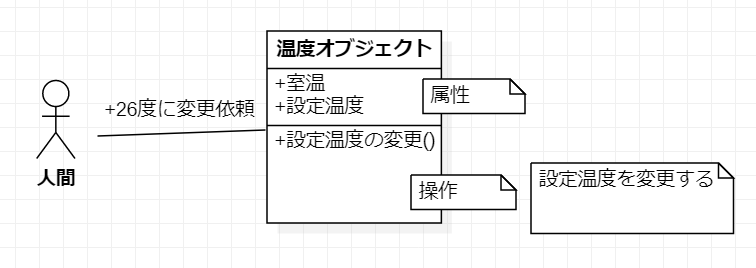
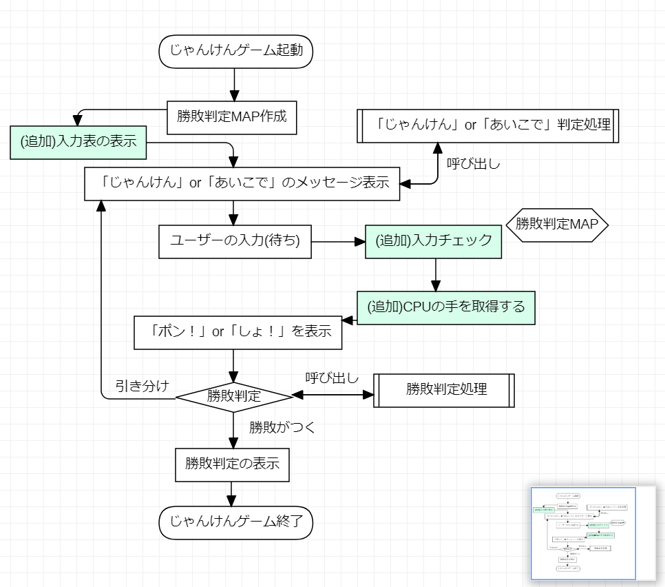

# 2-2 クラスの役割分担を考える〜処理の塊一覧から分担を考える〜

本パートでは、クラス関係を作ることと、クラスの役割分担を行います。

前のパートでクラス関係の作り方を学習したので、「役割分担」を中心に学習します。

役割分担というのは、作成したクラスに役割を与えることです。例えば、クラスは現実にある様々なものを表現する事ができます。

＜例：[参考サイト](https://zenryokuservice.com/wp/2020/11/19/java-%e3%82%aa%e3%83%96%e3%82%b8%e3%82%a7%e3%82%af%e3%83%88%e6%8c%87%e5%90%91%e5%9f%ba%e7%a4%8e-%ef%bd%9e%e3%82%aa%e3%83%96%e3%82%b8%e3%82%a7%e3%82%af%e3%83%88%e6%8c%87%e5%90%91%e3%82%b3%e3%83%b3/)＞
エアコンクラスを作成する場合に関して見ていきます、エアコンには、「電源ボタン」があります。そして、l機能としては「温度調節」「風量調節」などがあります。これを実現するために必要な役目を切り出して表にすると下のようになります。そして、クラスには **属性(状態を示す情報)** と **振る舞い(機能、動き)** を持たせます。

この「属性」と「振る舞い」は実装レベルでは「フィールド」と「メソッド」に相当します。UMLで書くときも下のように、属性と振る舞いを記載します。

＜エアコンクラスの例＞



| 係(役目) | 情報(状態) | 機能 |
| ------- | --------- | ---- |
| 電源係   | 電源      | 電源をON、OFFにする |
| 温度係　   | 設定温度      | 設定温度の変更 |
| 温度係　   | 現在の室温      | 現在の室温を測る |
| 運転係　   | 運転モード      | 運転モードを切り替える |
| 運転係　   | 運転モード      | 温度差によって動作を変える |

この様に、クラスの役割分担を行います。

そして、以下のことを行います。
1. 設計書の見直し
2. 作成するクラスの各役割をリストアップ
3. 役割分担を行う

## 1.設計書の見直し

１章で作成したフローチャートと処理フロー(箇条書き)を見直してみてください。

そして、「不明確だな」と思った部分の修正と不足分の修正を行えば、より明確な設計書になっているはずです。

１章では、処理の塊に焦点を当てて考えましたが、今度は「役割」に焦点を当てます。

「不明確だな」と思った部分に関して、そこには必ず不明確な部分と説明や実装の不足が出るはずです。なので不足分は「不明確だな」と思った部分に対する補足や足りなかった処理を追記することになります。

このように、作成した設計書を見直すことで、より良い設計ができるようになります。今後の学習として、デザインパターンなどを学習してみるのも良いと思います。

先人たちのアイディアが凝縮されているのでそのアイディアを取り込んだ上でさらに良い設計ができるようになることを祈っております。

例の如く、筆者が作成したものをサンプルにして解説します。

### サンプル処理一覧
**==筆者の書いたフローチャート==**



**==筆者の作成した処理の塊(メソッド)一覧==**
1. 勝敗判定マップを作成
    * createJudgeMap()
2. 「じゃんけん ...」もしくは「あいこで ...」を表示する
    * printJankenAiko() ※入力表の表示処理も実装します
3. ユーザーの入力待ちをする(標準入力受付)
    * acceptInput()
4. 入力チェック
    * inputCheck()
5. CPUの手を取得 ※Java APIのjava.util.Radomを使用   
6. ユーザーとCPUの手を表示
    * printTe()
7. 「ポン!」もしくは「しょ！」を表示する
    * printPonOrSho()
8. 勝敗判定を行う
    * judgeWinLose()
9. 勝敗結果を表示
    * printJudge()

上記のものは「処理の塊」を一覧化したものです。

これらを眺めてみると、各処理の特徴というか、役割というかうまく表現できませんが

各メソッド機能の線引きが見えてくるのではないでしょうか？

筆者の場合は、上記のリストアップした項目に対して、単純にメソッドを切っただけで

特に難しいこともないので、各処理の解説をいたします。

### 処理の内容

※＜筆者の作成した処理の塊(メソッド)一覧＞に記載しているので、acceptInputは割愛します。

＜createJudgeMap()＞
```java
/**
 * 1.勝敗判定MAP作成
 */
private void createJudgeMap() {
    // 勝敗判定MAPのインスタンスを生成する
    judgeMap = new HashMap<String, Integer>();
    // プレーヤーの勝ちケース
    judgeMap.put(GU + CHOKI, YOU_WIN);
    judgeMap.put(CHOKI + PA, YOU_WIN);
    judgeMap.put(PA + GU, YOU_WIN);
    // プレーヤーの負けケース
    judgeMap.put(GU + PA, YOU_LOSE);
    judgeMap.put(CHOKI + GU, YOU_LOSE);
    judgeMap.put(PA + CHOKI, YOU_LOSE);
    // あいこのケース
    judgeMap.put(GU + GU, AIKO);
    judgeMap.put(CHOKI + CHOKI, AIKO);
    judgeMap.put(PA + PA, AIKO);

    // 手のマップ
    teMap = new HashMap<String, String>();
    teMap.put(GU, "グー");
    teMap.put(CHOKI, "チョキ");
    teMap.put(PA, "パー");
}
```

**==処理内容==**
1. Mapインターフェース型の変数に、HashMapをインスタンス化
2. マップのキーに出される手の全ケースを登録
グー(0), チョキ(1), パー(2)として、ユーザーがグー、CPUがチョキならばユーザーの勝ちなので「YOU_WIN(値=0)」をマップの値にセットほか同様に負けのケース、あいこのケースを登録する
3. もう１つMapを用意して、表示するためのデータを登録
4. judgeMapとteMapはフィールド変数とする

＜printJankenAiko()＞
```java
/**
 * 2.「じゃんけん」or「あいこで」のメッセージ表示
 *
 * @param isJanken true: 「じゃんけん」false: 「あいこ」
 */
private void printJankenAiko(boolean isJanken) {
    // 追加実装、各手と入力値の票を表示する
    System.out.println("****************");
    System.out.println("*グー   = 0    *");
    System.out.println("*チョキ = 1    *");
    System.out.println("*パー   = 2    *");
    System.out.println("****************");
    // isJankenがtrueの時は「じゃんけん」を表示する
    if (isJanken) {
        System.out.println("じゃんけん ...");
    } else {
        System.out.println("あいこで ...");
    }
}
```

**==printJankenAiko()の処理内容==**
1. 引数に boolean型の変数isJankenを持つ
2. ユーザーが入力する手と値を表の表示
3. 引数にあるisJankenがtrueの場合は「じゃんけん ...」を表示
4. 引数にあるisJankenがfalseの場合は「あいこで ...」を表示

＜inputCheck()＞
```java
/**
 * ＜追加実装＞
 * じゃんけんの手として適当な値であるか判定する。
 *
 * @param input ユーザー入力
 * @return true; じゃんけんの手として適当な値 / false: じゃんけんの手として不適当な値
 */
private boolean inputCheck(String input) {
    // 判定フラグ
    boolean isJankenTe = false;
    // 正規表現で判定する
    if (input.matches("[0-2]")) {
        isJankenTe = true;
    }
    return isJankenTe;
}
```
**==printJankenAiko()の処理内容==**
1. 引数に文字列を持つ
2. boolean型の変数isJankenをfalseで初期化
3. 文字列inputが0〜2の数字であれば、isJankenにtrueを代入
4. isJankenを返却する

※[正規表現](https://ja.wikipedia.org/wiki/%E6%AD%A3%E8%A6%8F%E8%A1%A8%E7%8F%BE)（せいきひょうげん、英: regular expression）は、文字列の集合を一つの文字列で表現する方法の一つである。

「[0-2]」は、「ユーザーの入力した値を引数に入力値が「0〜2」の場合はTRUEを、そうでない場合はFALSEを返却」という意味になります。

なので、```boolean isJankenTe = input.matches("[0-2]");```という処理は、ユーザーの入力した値を引数に入力値が"0", "1", "2"の場合は```isJankenTe = true```となります。それ以外の場合は```isJankenTe = false```になります。

＜printTe()＞
```java
/**
 * ＜追加実装＞
 * プレーヤーの手とCPUの手を表示する。
 *
 * @param playerTe プレーヤーの手
 * @param cpuTe CPUの手
 */
private void printTe(String playerTe, String cpuTe) {
    System.out.println("ユーザー：" + teMap.get(playerTe));
    System.out.println("CPU：" + teMap.get(cpuTe));
}
```

引数にユーザーの入力値とCPUの手を持ち、それぞれを```teMap```より取得してコンソールに表示する。

**==teMap(手のマップ)の中身==**
|キー|値|
| ---- | ---- |
|0(=定数:GU)|"グー"|
|1(=定数:CHOKI)|"チョキ"|
|2(=定数:PA)|"パー"|

＜printPonOrSho()＞
```java
/**
 * 4.「ポン！」or「しょ！」を表示
 */
private void printPonOrSho(boolean isJanken) {
    if (isJanken) {
        // 「じゃんけん」の場合は「ポン！」
        System.out.println("ポン！");
    } else {
        // 「あいこで」の場合は「しょ！」
        System.out.println("しょ！");
    }
}
```
**==printPonOrSho()の処理内容==**

引数にisJanken(boolan)を持ち、isJankenがTRUEの場合は「ポン！」、FALSEの場合は「しょ!」を表示

＜judgeWinLose()＞
```java
/**
 * 5.勝敗判定
 *
 * @param playerTe プレーヤーの手
 * @param cpuTe CPUの手
 * @return 勝敗判定 true: プレーヤーの勝ち false: プレーヤーの負け
 */
private int judgeWinLose(String playerTe, String cpuTe) {
    // 勝敗判定MAPのキーはプレーヤーの手とCPUの手を連結したもの
    // 例：「01」＝ プレーヤー「グー」、CPU「チョキ」
    // 勝敗判定マップから勝敗判定結果を取得する。
    String key = playerTe + cpuTe;
    int result = judgeMap.get(key);
    return result;
}
```
**==judgeWinLose()の処理内容==**

勝敗判定マップから判定キー(ユーザーの手+CPUの手)を作成し、値(勝敗結果)を取得、返却する

＜printJudge()＞
```java
/**
 * 6.勝敗判定の表示
 *
 * @param resultJudge 判定結果
 * @return true: 終了 false: もう一度
 */
private boolean printJudge(int resultJudge) {
    boolean isFinish = true;
    // 勝敗判定結果を表示する
    switch(resultJudge) {
    case YOU_WIN:
        System.out.println("YOU WIN!");
        break;
    case YOU_LOSE:
        System.out.println("YOU LOSE!");
        break;
    case AIKO:
        isFinish = false;
        System.out.println("DRAW!");
        break;
    }
    return isFinish;
}
```
**==printJudge()の処理内容==**

引数に、勝敗判定結果(勝敗判定マップの値)を持ち、その値に応じて結果を標準出力に表示、終了するしないのフラグを返す

## 2. 作成するクラスの各役割をリストアップ

今度は、各処理(メソッド)をどのクラスに作成するか整理します。各クラスに役割分担をさせるということです。ここが本パートのメイン部分になります。

### サンプル役割分担
処理数も多くないので、大まかな分類として以下のように分けることができると思います。
1. 「標準出力(コンソール出力)する処理」
2. 「演算処理を行う(標準出力(コンソール出力)しない)処理」

これは筆者の分け方なので、あくまでもサンプルです。

そして、それぞれ以下のようにクラスに名前をつけました。
1. ConsoleUtilsクラス =「標準出力する処理」
2. JankenUtilsクラス =「演算処理を行う(標準出力しない)処理」

つまるところ、メソッドを以下のように標準出力のするしないで分類して移植するというわけです 。

**==ConsoleUtilsクラス==**
* printJankenAiko()
* printTe()
* printPonOrSho()
* printJudge()

**==JankenUtilsクラス==**
* createJudgeMap()
* acceptInput()
* judgeWinLose()

**==SecondJankenMain==**
* main() -> メインメソッド

※現時点では、SecondJankenMainクラスにメインメソッドのみを配置している状態です。今後、メソッドが増える可能性があります。

### インスタンス化について
createJudgeMap()メソッドの処理で、HashMapクラスのインスタンスを2つ作成しています。judgeMap変数に代入したHashMapクラスのインスタンスには、じゃんけんの勝ちパターンと負けパターンを登録しました。

同様に、teMap変数には、じゃんけんの手＝「グー(0)」「チョキ(1)」「パー(2)」を登録しています。

同じHashMapクラスに「勝敗パターン」と「じゃんけんの手」の情報を登録しそれぞれ勝敗判定、とユーザー、CPUの出した手をコンソール表示するために使用しています。

この様に、インスタンス化するとクラスが実体化(メモリ上に領域を確保)して、judgeMapとteMapの変数に代入して、別々に扱うことができます。


## 3. 役割分担を行う
これまで処理の内容を見てきましたが、これらの処理は「〜を行う」という部分を作成してきました。

この「〜を行う」という部分を部品として見たときに、それぞれの部品を持っているクラスはどのようなクラスであるべきか？それを考えます。

つまり、「部品」を持っているクラスに役割を分担するということです。

ここは、実際に考えて自分なりの答えを出すしかありません。


メインメソッドでは、じゃんけんゲームの起動を行います。1章で作成したメインメソッドと同じ処理を行います。が今回はクラスを作成しているので、コードの量が全然違います。

具体的には、処理を行うメソッドの数が少なくなっています。

本パートは以上です、作成するメソッドの一覧や作成するクラスの一覧を作成することで「どのクラスにどんな役割を与えようか？」と考えることができるようになったと思います。

そして、クラス別に作成したメソッドを振り分ける。

つまり役割分担を行うことで、一体何が変わったのでしょうか？

それを次のパートでみていきます。
