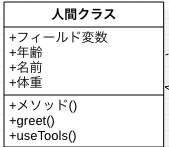

# 2-3 役割ごとのクラスを作る〜クラス図の作成〜

本パートでは、役割分担したものを「クラス図」というものにします。

作成するクラスが増えてくると、頭の中ではまかないきれませんので図にします。

ちなみに、筆者の頭のキャパシティでは３クラスまでしか考えられません。これ以上は図にしないと頭が動きません。

はじめの方で触れましたが、 UMLと言う世界共通の設計言語があり、その中にある図の一つが「クラス図」です。

オランダ人でもブラジル人でも通じます。

### UMLの種類　
**==分類レベル==**

**構造図（structure diagram）**、**振る舞い図（behavior diagram）**の2種類に分類される。

|構造図（structure diagram）|振る舞い図（behavior diagram）|
| ------------------------ | --------------------------- |
|オブジェクト図（object diagram）|アクティビティ図（activity diagram)<br/>※フローチャートに似ている|
|コンポーネント図（component diagram）|ユースケース図（use case diagram）|
|パッケージ図（package diagram）|ステートマシン図（state machine diagram）|
|配置図（deployment diagram）|相互作用図（interaction diagram）|
|複合構造図（composite structure diagram）|シーケンス図（sequence diagram）|
|クラス図(class diagram)|コミュニケーション図（communication diagram)|
|                      |相互作用概要図（interaction overview diagram）|

上の相互作用概要図に関してはあまり見かけません。。。

**==クラス図==**

現状で使いたいのは「クラス図」です。クラスとクラスの関係、相互にどんな処理を行うか？

詳細設計レベルでの記述を行いたいのでこのUMLを中心に記載します。

「設計レベル」というのは、実際の処理はプログラムを書いて動かしてみないことにはわからないので「頭で考えるレベルでこの様な関係ですよ」ということを示すために作成します。

### クラス図の書き方
例として、人間をクラスとして表現してみました。



四角でくくっている部分にそれぞれ、クラス名、プロパティ(フィールド変数)、メソッドを描きます。実際には、「人間」をこんな単純には表現できませんが、部分的に表現しています。

人間を表すには、以下のプロパティ(要素)があります。

**==人間をクラス==**
1. 年齢(age)
2. 名前(name)
3. 体重(weight)

もちろん、その他にもたくさんあり、数えきることができないくらいですが、一部抜粋しました。

そして、もう１つ行動(アクション)があります。上記と同様に。。。
1. 挨拶(greet())
2. 道具を使う(useTooles())

というように行動(=メソッド)を定義しています。

このように、プロパティ(属性)と、行動や振る舞い(メソッド)を定義してクラスの内容を書きます。そして、これが、UMLでの「クラスの書き方」になります。

ちなみにJavaで実装、プログラムコードで表現すると下のようになります。

＜人間をクラスをコードにした例＞
```java
public class 人間クラス {
   private int age;
   private String name;
   private int weight;

   public void greet() {
       System.out.println("Hello!");
   }
   public void useTools() {
      // 実装内容が決まっていないので空実装
   }
}
```
**==人間クラス==**
1. フィールド変数に年齢(age)を持つ
2. フィールド変数に名前(name)を持つ
3. フィールド変数に体重(weight)を持つ
4. 振る舞いとして挨拶(greet())を持つ
5. 振る舞いとして道具を使う(useTools())を持つ


下のクラス図は、呼び出し、継承、インタフェースの実装についての書き方を示しました。

親クラスと、兄クラス、弟クラスの図を書きました。

弟クラスは、Interface1を実装しており、これは「手品をする」という振る舞い(メソッド)を実装しています。

親クラスと同じメソッドを定義するときは、「オーバーライド」して親クラスのメソッドではなく子クラスの方のメソッドが動くようにします。

インタフェースの時も同様で、中身のないメソッド定義のみのメソッドを「オーバーライド」します。

コードで書くと下のようになります。

＜インターフェース＞
```java
public interface Interface1 {
  /** 手品をする */
  public abstract doMagic();
}
```

＜弟クラス＞

```java
public class ChildOtoto implements Interface1 {
  /** 年齢 */
	private int age;
	/** 名前 */
	private String name;

	public ChildOtoto() {
		name = "jiro";
		age = 10;
		favorit = "鼻を膨らます";
	}

	@Override
	public void say() {
    System.out.println(lastName + "といいます。");
		System.out.println("親です。名前は" + name + "です。年齢は" + age + "です。");
		System.out.println("特技は、「" + favorit + "」です。");
	}

  @Override
	public void funny() {
		super.funny();
	}  
}
```

**==他のクラスを呼び出すときの書き方==**


**==クラスを継承するときの書き方==**


**==インタフェースを実装する==**


**==余談==**

現場にいたインド人は英語では話が通じるのですが、日本語が通じませんでした。

なのでUML(クラス図)を使って話をし、細かい部分に関しては身振りそぶりで通じました。

**==本題==**

今回のやることは以下の通りです。
1. サンプルのクラス図を見る
2. クラスの扱い方を考える
3. 自分のクラス図を作成する


## 1. サンプルのクラス図を見る
**==筆者が作成したもの==**

前のパートでは、以下のようにクラスに役割分担を行いました。

**==ConsoleUtilsクラス==**
* printJankenAiko()
* printTe()
* printPonOrSho()
* printJudge()

**==JankenUtilsクラス==**
* createJudgeMap()
* acceptInput()
* judgeWinLose()

**==SecondJankenMain==**
* main() -> メインメソッド


そして、メインメソッドを持つクラスを「SecondJankenMain」としました。

これに、メインメソッドで呼び出さなくてはならないメソッドをSecondJankenMainに追加しました。

**==ConsoleUtils==**
* printJankenAiko
* printTe
* printPonOrSho
* printJudge

**==JankenUtils==**
* createJudgeMap
* acceptInput
* judgeWinLose

**==SecondJankenMain==**
* メインメソッド
* **printJankenAiko**
* **printPonOrSho**
* **printJudge**

筆者が作成したクラス図です。


クラス関係はどのようになっているでしょうか？

大まかに、SecondJankenMainクラスにJankenUtilsを継承し、ConsoleUtilsのメソッドを呼び出している

ような関係になっていると思います。

## 2. クラスの扱い方を考える

### メインメソッドの解説
＜[SecondJankenMain](https://github.com/ZenryokuService/ObjectOrientedPrograming/blob/master/src/main/java/jp/zenryoku/tutorial/SecondJankenMain.java)＞

メインメソッドを以下のように実装しました。

※Githubにアップロードしてあります。

＜SecondJankenMain.java＞
```java
public class SecondJankenMain extends JankenUtils {

    /**
     * メインメソッドの実装をオブジェクト指向プログラミングっぽく
     * クラスの継承を使用して実装しなおしてみる。
     * @param args
     */
    public static void main(String[] args) {
        // 0.じゃんけんゲーム起動
        SecondJankenMain main = new SecondJankenMain();
        // 1.勝敗判定MAP作成 -> JannkenUtilsで行っているので処理なし

        // CPUの手を生成する部品(JavaSE APIを使用) ※「JavaSE API」という言い方はあまりしない。。。
        Random random = new Random();

        // 追加実装: 「じゃんけん」と「あいこ」の判定が行えてない
        boolean isJanken= true;
        // 無限ループ
        while(true) {
            // 2.「じゃんけん」or「あいこで」のメッセージ表示
            main.printJankenAiko(isJanken);
            // 3.ユーザーの入力(待ち)
            String input = main.acceptInput();
            // 追加実装する(入力チェック)
            if (main.inputCheck(input) == false) {
                System.out.println("0-2の値を入力してください。");
                continue;
            }
            // 追加実装する(プレーヤーとCPUの手を表示する)
            // CPUの手を取得する(JavaSEのAPIを使用するのでテストしない)
            String cpuTe = String.valueOf(random.nextInt(2));
            // 4.「ポン！」or「しょ！」を表示
            main.printPonOrSho(isJanken);
            //main.printSho();
            // <追加実装>
            main.printTe(input, cpuTe);
            // 5.勝敗判定
            JankenConst judge = main.judgeWinLose(input, cpuTe);
            // 6.勝敗判定の表示
    //			main.printJudge(judge);
            if (main.printJudge(judge)) {
                // 追加実装：「じゃんけん」と「あいこ」の判定が行えてない
                isJanken = true;
                break;
            } else {
                // 追加実装：「じゃんけん」と「あいこ」の判定が行えてない
                isJanken = false;
            }
        }
        // 7.じゃんけんゲーム終了
    }
}
```

コメントアウトしている部分は、一度実装してから、考え直し再度修正した部分です。そして、処理の内容を以下に示します。

1. SecondJankenMainのインスタンスを生成
2. CPUの手を生成するためのクラス(Random)のインスタンスを生成
3. 「じゃんけん ...」と表示することを示すフラグ(true: じゃんけん false: あいこ)を初期化
4. ユーザーが入力する項目を一覧表示と、「じゃんけん」もしくは「あいこで」を表示
5. ユーザー入力を受ける
6. 入力チェックを行う
7.  CPUの手を取得
8. 「ポン！」もしくは「しょ！」を表示
9. ユーザーとCPUの手を表示
10. 勝敗判定処理
11. 判定結果を表示し、処理を終了するかどうかのフラグを受け取り、TRUEなら終了、FALSEならループする


### JankenUtilsクラスを継承するメリット
サンプルのクラス図では、メインクラスにユーティリティクラスを継承しています。

実は、継承するメリットはあまりありません。今回はじゃんけんゲームを作成しつつJavaの基本を学習するという目的があるので、**あまり意味がないけど** 継承しました。

本来であれば、次のサンプルコードのように、フィールド変数として定義してその処理を呼び出す方がメソッドの定義がどこにあるのかわかりやすいです。

＜JankenUtilsを継承しないサンプルコード＞

フィールド変数としてユーティリティクラスなどを保持する場合の実装サンプル

```java
public class SecondJankenMain {
	/** じゃんけんゲームのユーティリティクラス */
	private JankenUtils util;
	/** コンソール表示のユーティリティクラス */
	private ConsoleUtils console;

	/**
	 * フィールド変数にインスタンスを生成して設定する。
	 */
	public SecondJankenMain() {
		// フィールド変数のクラスをインスタンス化
		util = new JankenUtils();
		console = new ConsoleUtils();
	}

 	/**
	 * 入力受付。
	 *
	 * @return 入力した値
	 */
	private String acceptInput() {
		return util.acceptInput();
	}

 	/**
	 * 勝敗判定を取得する
	 *
	 * @param playerTe プレーヤーの手
	 * @param cpuTe CPUの手
	 * @return 勝敗結果(JankenConstで定義)
	 * @see jp.zenryoku.class.JankenConst
	 */
	private JankenConst judgeWinLose(String playerTe, String cpuTe) {
		return util.judgeWinLose(playerTe, cpuTe);
	}
}
```
目的としては、継承した時に実装上どのようになるか？を具体的に示したかったからです。

**==JankenUtilsを継承しないサンプルの解説==**
1. コンストラクタで、JankenUtilsとConsoleUtiilsをインスタンス化してフィールド変数に代入
2. acceptInput()でJankenUtilsのacceptInput()を呼び出し、標準入力を受け付ける
3. judgeWinLose()は列挙型のクラスJankenConstを返り値にもつ
JankenConstの値で勝敗判定の結果を判断します。


### 継承することで変わったコード
**==変更箇所==**
* JankenUtilsをSecondJankenMainの親クラスにした
* ConsoleUtilsのメソッドをstaticメソッドに変更

上記のクラス名に貼ってあるリンク先のコードの抜粋ですが、メインメソッド以外のコードを以下に示します。そして、**コメントアウトしている行は継承することで不要になったコード**です。

＜不要になったコードはコメントアウト＞
```java
//	/** じゃんけんゲームのユーティリティクラス */
//	private JankenUtils util;
//	/** コンソール表示のユーティリティクラス */
//	private ConsoleUtils console;

/**
 * フィールド変数にインスタンスを生成して設定する。
 */
public SecondJankenMain() {
    // 親クラスのコンストラクタを起動する
    super();
//		console = new ConsoleUtils();
}

/**
 * 「じゃんけん」、「あいこを表示する」
 */
private void printJankenAiko(boolean isJanken) {
    // 追加実装: で修正した部分だが、設計時には判定フラグを引数に持っていた。
    ConsoleUtils.printJankenAiko(isJanken);
}

//	/** 親クラスにて実装しているのでコメントアウト
//	 * 入力受付。
//	 *
//	 * @return 入力した値
//	 */
//	private String acceptInput() {
//		return util.acceptInput();
//	}
//
//	/**
//	 * 「しょ！」を表示する
//	 */
//	private void printSho() {
//		// TODO-[追加実装の時に引数を追加、「ポン！」のケースも追加する]
//		System.out.println("Sho!");
//	}

/**
 * 4.「ポン！」or「しょ！」を表示
 */
private void printPonOrSho(boolean isJanken) {
    if (isJanken) {
        // 「じゃんけん」の場合は「ポン！」
        System.out.println("ポン！");
    } else {
        // 「あいこで」の場合は「しょ！」
        System.out.println("しょ！");
    }
}

//	/** 親クラスにて実装しているのでコメントアウト
//	 * 勝敗判定を取得する
//	 *
//	 * @param playerTe プレーヤーの手
//	 * @param cpuTe CPUの手
//	 * @return 勝敗結果(JankenConstで定義)
//	 * @see jp.zenryoku.class.JankenConst
//	 */
//	private JankenConst judgeWinLose(String playerTe, String cpuTe) {
//		return util.judgeWinLose(playerTe, cpuTe);
//	}

/**
 * 勝敗判定を表示し、繰り返すかどうかを返却する。
 *
 * @param judge 勝敗結果
 * @return boolean true: 終了する / false 繰り返す
 */
private boolean printJudge(JankenConst judge) {
    boolean isFinish = true;
    try {
        isFinish = ConsoleUtils.printJudge(judge);
    } catch (Exception e) {
        // TODO 自動生成された catch ブロック
        e.printStackTrace();
        // 想定外の入力があったのでアプリを強制終了する
        System.exit(-1);
    }
    return isFinish;
}

//	/** 親クラスにて実装しているのでコメントアウト
//	 * ＜追加実装＞
//	 * 入力チェックを行う
//	 *
//	 * @param input 入力した値
//	 * @return true: 入力OK / false 想定外の入力
//	 */
//	private boolean inputCheck(String input) {
//		return util.inputCheck(input);
//	}
//
//	/** 親クラスにて実装しているのでコメントアウト
//	 * ＜追加実装＞
//	 * プレーヤーの手とCPUの手を表示する。
//	 *
//	 * @param playerTe プレーヤーの手
//	 * @param cpuTe CPUの手
//	 */
//	private void printTe(String playerTe, String cpuTe) {
//		util.printTe(playerTe, cpuTe);
//	}
```
コンストラクタとメンバメソッドがあり、コメントアウトしているメソッドが何個かあります。

**==コメントアウトした部分の解説==**
1. JankenUtilsを継承することで、printTe()のようなJankenUtilsのメソッドを呼び出す処理が不要になった
2. 不要になったメソッドは、親クラス(JankenUtils)に実装しているのでそれを直接呼び出す形になる

**初期実装**(コメントアウトしている部分)は以下のような実装をしていました。

1. JankenUtilsクラスをメンバ変数にしていた
2. ConsoleUtilsのメソッドはメンバメソッドにしていた

なので、SecondJankenMainクラスの中で、フィールド変数のメソッドを呼び出す処理を作成する必要がありました。これは、メインメソッドからSecondJankenMainクラスのメンバメソッドを呼び出すために必要な処理になるので、この様に実装しました。

**修正後の実装**(コメントアウトしてない部分)は以下のように実装しました。
1. JankenUtilsをSecondJankenMainの親クラスに変更
2. ConsoleUtilsのメソッドをstatic(静的)メソッドに変更

こちらの実装方法では、SecondJankenMainクラスにフィールド変数のメソッドを呼び出すためのメソッドを定義する必要がありません。どちらの実装が良いのか？これは、はっきり言って「リンゴが好きかバナナが好きか？」という問答をしているのと変わらないように思います。

答えは「どちらもうまい」なので、好きな方でよいと思います。しかし、今回のじゃんけんゲームはここから拡張して実装する予定がないので、修正後の実装のままでもよいですが、拡張しようとしたときには、初期実装の方が対応しやすいはずです。

なぜならば、クラス同士の依存関係が初期実装の方が少ないからです。JankenUtilsクラスを継承している時点で、SecondJankenMainクラスは、JankenUtilsに大きく依存しています。

初期実装と修正後の違いを具体的に見ていきます、初期実装から以下のような修正を行いました。

JankenUtilsとConsoleUtilsをコンストラクタでフィールド変数にインスタンスを代入していた

→修正後にはフィールド変数をコメントアウト、JankenUtilsは親クラス(extends JankenUtilsとした)、ConsoleUtilsは静的メソッドに変更

※親クラスはメソッドを直接参照でき、ConsoleUtilsは静的呼び出し(ConsoleUtils.XXXXX())を行うように変更

正直のところ、メリットがあるようには思えないのですが「クラスの扱い方を見る」という意味で継承してみました。

今回のじゃんけんゲームでは、継承関係を作るほど処理の量が多くないのでシンプルに作るには余計な継承関係は作らないほうが良いです。

くどいようですが**継承の実装サンプル**としてJankenUtilsを親クラス(スーパークラス)として実装しました。

## 3. 自分のクラス図を作成する
今まで学習してきたことをまとめると、自分のクラス図が作れるようになります。

具体的には、下のようにやることをまとめます。

**==まとめ==**

1. サンプルのクラス図を見る
2. クラスの扱い方を考える
3. 自分のクラス図を作成する

ここまでやると具体的に実装のイメージが描けると思います。クラス図の作成中にもっと良い実装方法を思いつくかもしれません。

ここまでに、細かい部分はあまり重要ではありませんが、UMLのルールを守っておけば難しいことはありません。

具体的には、クラスとクラスの関係がわかるように書ければOKということです。

本パートでは以上になります。サンプルで示していることはあくまでもサンプルで**自分で考えて行う**ための参考でしかありません。

サンプルを参考にしつつ、自分の作成したじゃんけんゲームを作り上げられるように、考えてみてください。

次のパートでは、テストケースの実装とクラスの実装を行います。

※JUnitでの実装方法が前の章でやった方法と変わります。しかし、テストで確認する内容は変わりません。
