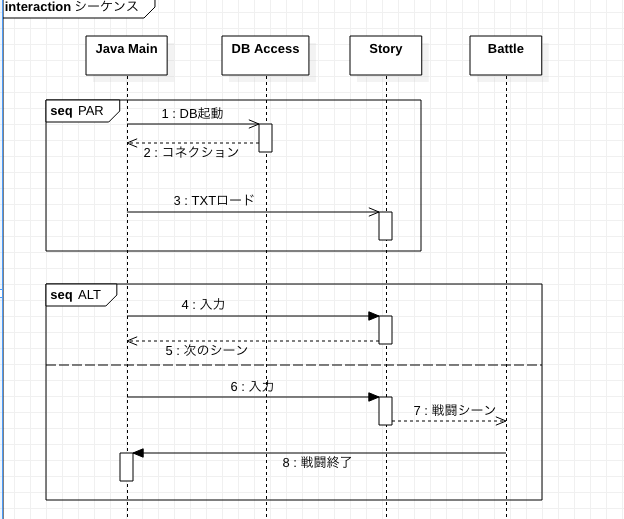

# 3-1 テキストRPG(戦闘シーンのみ)を作ってみよう

本パートでは、作成するテキストRPG(戦闘シーンのみ)の仕様について記述します。

前章で作成したじゃんけんゲームと同様に、以下のことを明確にしていきます。

      A. まずはどんなものを作るのか？

      B. 作成するためにどんな仕組みが必要か？

      C. 必要な技術について

      D. マルチスレッド処理

### A. まずはどんなものを作るのか？
テキストRPG(戦闘シーンのみ)なので、ポイントを整理します。
1. プレーヤーとモンスターがいる
2. 両者が戦い、決着がついたら終了

筆者も「わりかし簡単そうだな」と思いました。

しかし、これを「**まともに動かしたい**」という思いがあるので、**拡張** することも考慮に入れます。

実装計画としては以下のような順序(ロードマップ)です。※今回は１の戦闘シーンのみ
1. 戦闘シーンのみの実装(敵が１匹、プレーヤーも１人)
2. タイトルを表示して、序章からストーリー展開を行う
    * 戦闘は「１」のものを使用するので１対１の戦闘のみ
3. ステータス表示、装備の切り替えを可能にする
    * 戦闘は「１」のものを使用するので１対１の戦闘のみ
4. このほか仕様をどんどん追加していき「まともに」動くようにする

ここまでは、考えて(イメージして)いるのですが、これからどのようにしようか検討中です。

**==Step1 2つのリストを作る==**

自分が作成するものに関しては、このようなイメージを頭の中に描いたら以下のようなリストを作ってください。
1. このアプリに登場するキャラクター(戦闘シーンは１対１です)のリスト
2. 役割分担をするために、必要になる機能(クラス)のリスト。 例: 標準出力機能, 演算処理機能

ノートと鉛筆を用意して、イメージの落書きを書いてみるのもよいと思います。筆者は、棒人間で勇者とか魔王とか書きました。

### B. 作成するためにどんな仕組みが必要か？
プレーヤーとモンスターの戦いのみを実装するので、複雑なことは不要な**予感**がします。

つまりは、もしかしたら**複雑な処理が必要になるかもしれない**、ということです。

しかし、今後拡張することを考えると以下の処理が必要であろうことが予想できます。
* マルチスレッド処理
* シーン切り替え
* DBの使用
* テキストファイルの読み込み(ファイルのロード)
* 戦闘シーンとストーリー展開の実装を分断(別々に)する必要がある

ここの部分を見ると、何か複雑そうに見えます。しかし、内容を分解し、整理してやれば簡単なレベルまで落とせます。

わかりやすいレベルまで分解する、それだけの「役割分担」を行えば良いのです。そのために必要な技術もあります。

### C. 必要な技術について
主に必要になる技術としては、以下の通りです。
1. マルチスレッド処理の実装
2. インターフェースの扱い(ポリモーフィズムの実装)
3. (今回は実装しません)ファイル読み込み処理の実装
4. (今回は実装しません)DBアクセス処理の実装

これらの技術を使用して、「クラスの役割分担」を行えば**シンプルなロジックのみで実装することが可能**です。

逆に、複雑な仕様になってしまうのは設計としてよくありません。補足として、人工知能処理のように「統計学」や図形・３D描画のような「数学の知識」が必要な処理を行う時は、その知識が必要な部分を限定するように実装します。

具体的には、以下のような形です。
1. モンスターを発生させるための処理や自然言語を使った処理などは、モンスターなどが使用する、メッセージを取得するときに呼び出すクラスに処理をまとめる。
2. プレーヤーが画面上で動く時の描画処理は描画用のクラスに処理をまとめる
※実際は、TensorflowやOpenCVのようにライブラリ化されていますのでそれらのライブラリを使用して実装すると全て自分でやるよりは、楽に実装ができます。

### D. マルチスレッド処理
**本パートでは、マルチスレッド処理について学習します。**

## 1. マルチスレッド処理の実装

マルチスレッド処理は、俗にいう「並行処理」のことです。

今後のことを考えてマルチスレッドでアプリケーション(テキストRPG)を作成することを考えます。

具体的には、今回作成する「戦闘シーン」と今後作成する「ストーリー展開」、「DBを起動する」この３つの処理を行う想定です。

そのために「マルチスレッド」なのですが、具体的な実装方法に関して記述したいと思います。

### Step1: Threadクラスをオーバーライド
マルチスレッドは下のシーケンス図(※2-3で記術したUMLです)が示すように複数の処理が並行して走るイメージです。

「PAR」と記述している部分(範囲)は並行して処理を走らせるという意味です。「PAR」で囲った処理が２つあるので「DB起動」と「TXTロード」が並行した走ることを示しています。

「ALT」は条件分岐した時の処理を示します。点線で区切った別々の処理が条件により別れて実行される、というような処理を示します。



実際にはプロセス(CPUの処理)は１つですが、 **処理を待機している時間があるのでその「待機中」の時間**を使用して処理が同時に走っているかようにプログラムを動かします。

これが『マルチスレッド処理』です。

シーケンス図では、Java Mainから処理が始まり、他のクラスを呼び出し、処理を行った上で、最終的にJava Mainの処理を行ってプログラムが終了します。

### シーケンス図の見方
図に関して、右上から、縦にそれぞれのスレッド(ライフライン)が並んでいます。具体的に以下の３つです。
1. Java Main: 作成するJavaプログラムの起動スレッド(メインの処理)
2. DB Access: DBへのコネクションを作成し、DBとJavaアプリ間のやり取りを行う
3. Story    : ストーリ展開用のスレッド、戦闘シーンが起動するときは、スレッドを待機する
4. Battle   : 戦闘シーンのスレッド、戦闘シーン用のスレッド、戦闘が終了したらストーリ展開用のスレッドに戻る
5. seq:PAR  : スレッド1で動く部分を示します
6. seq:ALT  : スレッド2で動く部分を示します

### マルチスレッドの実装
例のごとくサンプルコードから入ります。

実行結果は下の動画をみてください。

[](https://www.youtube.com/watch?v=86CecebhdXE)

＜[メインメソッド](https://github.com/ZenryokuService/ObjectOrientedPrograming/blob/master/src/main/java/jp/zenryoku/practice/ThreadMain.java)※リンクは全体のソースコードです＞
```java
public class ThreadMain {
	public static void main(String[] args) {
		Thread1Cls thread1 = new Thread1Cls();
		Thread2Cls thread2 = new Thread2Cls();

		thread1.start();
		thread2.start();
	}
}
```
**==メインメソッド(メインスレッド)の解説==**
1. TreadCls1を起動して、スレッド１を動かします
2. TreadCls2を起動して、スレッド２を動かします

＜スレッド１：[主軸(メイン)になるスレッド](https://github.com/ZenryokuService/ObjectOrientedPrograming/blob/master/src/main/java/jp/zenryoku/practice/Thread1Cls.java)※リンクは全体のソースコードです＞
```java
public class Thread1Cls extends Thread {
	@Override
	public void run() {
		Scanner scan = new Scanner(System.in);
		System.out.println("Thread1Cls: 処理を開始します");

		while(true) {
			System.out.println("＜Thread1Cls＞ 入力してください：");
			String input = scan.nextLine();
			if ("bye".equals(input)) {
				System.out.println("Thread1Cls: 終了します");
				break;
			}
			System.out.println("Thread1: [" + input + "] 5秒待機します");
			try {
				Thread.sleep(3000);
			} catch (InterruptedException e) {
				e.printStackTrace();
			}
			System.out.println("Thread1: 待機終了");
		}
	}
}
```
**==Thread1の解説==**
1. Threadクラスを継承してマルチスレッド対応のクラスとします
2. 標準入力を受け付ける用意をします。(Scannerクラスもインスタンス化)
3. 標準入力を受け付ける
4. 入力した文字列が「bye」の場合は無限ループを抜け、処理を終了する
5. 入力された文字列を標準出力へ表示、３秒待機する※「5秒」と出力しているがこれは間違い
6. 「Thread1: 待機終了」と標準出力へ出力

＜スレッド２：[付随するスレッド](https://github.com/ZenryokuService/ObjectOrientedPrograming/blob/master/src/main/java/jp/zenryoku/practice/Thread2Cls.java)※リンクは全体のソースコードです＞
```java
public class Thread2Cls extends Thread {
	@Override
	public synchronized void run() {
		Scanner scan = new Scanner(System.in);
		System.out.println("Thread2Cls: 処理を開始します");

		while(true) {
			System.out.println("Thread2: 5秒待機します");
			try {
				Thread.sleep(3000);
			} catch (InterruptedException e) {
				e.printStackTrace();
			}
			System.out.println("Thread2: 待機終了");
			System.out.print("＜Thread2Cls＞ 入力してください：");
			String input = scan.nextLine();
			System.out.println("Thread2Cls: " + input);
			if ("bye".equals(input)) {
				System.out.println("Thread2Cls: 終了します");
				break;
			}
		}
	}
}
```
**==Thread2の解説==**
1. Threadクラスを継承してマルチスレッド対応のクラスとします
2. 標準入力を受け付ける用意をします。(Scannerクラスもインスタンス化)
3. 入力された文字列を標準出力へ表示、３秒待機する※「5秒」と出力しているがこれは間違い
4. 「Thread2: 待機終了」と標準出力へ出力
5. 標準入力を受け付ける
6. 入力した文字列が「bye」の場合は無限ループを抜け、処理を終了する

Thread2Clsの「run()」メソッドに関しては、**「synchronized」修飾子**をつけています。

この修飾子は、複数スレッドで処理が動いている時に、この修飾子のついたメソッドの処理を待機(同期)させる機能があります。

もし「synchronized」をつけないと、２つの処理が並行して走るようになるのですが、スレッド１とスレッド２の優先順位が

決まっていないので、処理が想定通りに動いてれません。筆者がテストした時は「処理が途中で止まってしまう」というバグが発生しました。

処理が止まってしまう原因は、**標準入力を受ける処理が、各スレッドで動いてしまうために、入力させるタイミングが想定とずれてしまう**というものでした、

そして、サンプルコードの処理内容としては、以下の通りです。

**==マルチスレッドのサンプルコードの解説==**
1. メインメソッド(ThreadMain)から処理を起動
2. 主軸(メイン)になるスレッド(Thread1Cls)と付随するスレッド(Thread2Cls)を起動
3. 主軸(メイン)になるスレッド(Thread1Cls)で以下の処理を行う
   - ”Thread1Cls: 処理を開始します"を表示
   - 入力受付、入力値の表示
   - ３秒待機(出力には「５秒」とあるが実装ミス)
4. 付随するスレッド(Thread2Cls)で以下の処理を行う
   - ３秒待機(出力には「５秒」とあるが実装ミス)
   - ”Thread2Cls: 処理を開始します"を表示
   - 入力受付、入力値の表示

ここで「synchronized」をつけたメソッドはThread2Cls#run()は具体的に下のようなシグニチャです。「シグニチャ」という言葉はメソッド定義のことです。基本情報などの国家試験ででてきそうな言葉なので使用しました。ちなみに「開発現場」で使ったことはありません。

＜シンクロナイズド(synchronized)文のサンプル＞
```java
public synchronized void run() {
```
こうすることで、Thread1Cls#run()の処理が終わるまでThread2Cls#run()は処理を待機します。

なので、処理の起動順序が順番に走るようになったわけです。

本パートでは以上になります。マルチスレッドの実装は今回の実装でも行いますので

サンプルコードを動かしてみるもの良いと思います。

以下にリンクを貼っておきます。
* [メインメソッド](https://github.com/ZenryokuService/ObjectOrientedPrograming/blob/master/src/main/java/jp/zenryoku/practice/ThreadMain.java)
* スレッド１：[主軸(メイン)になるスレッド](https://github.com/ZenryokuService/ObjectOrientedPrograming/blob/master/src/main/java/jp/zenryoku/practice/Thread1Cls.java)
* スレッド２：[付随するスレッド](https://github.com/ZenryokuService/ObjectOrientedPrograming/blob/master/src/main/java/jp/zenryoku/practice/Thread2Cls.java)

次のパートでは、ユースケース図とフローチャートを作ります。今までやってきたことを再度行うようなイメージです。
