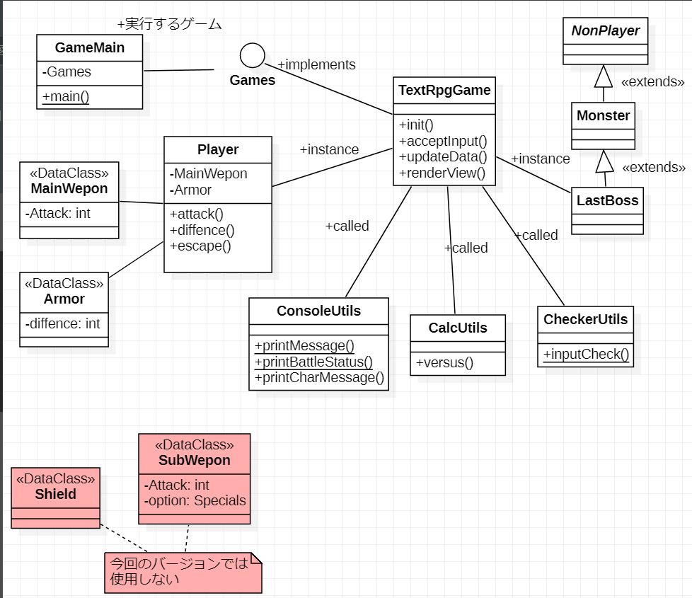
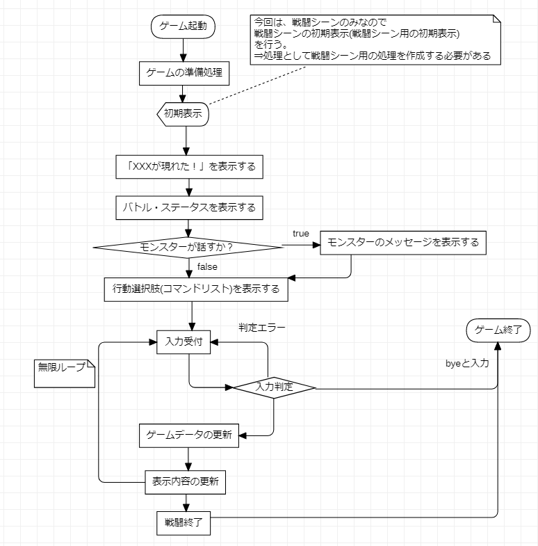
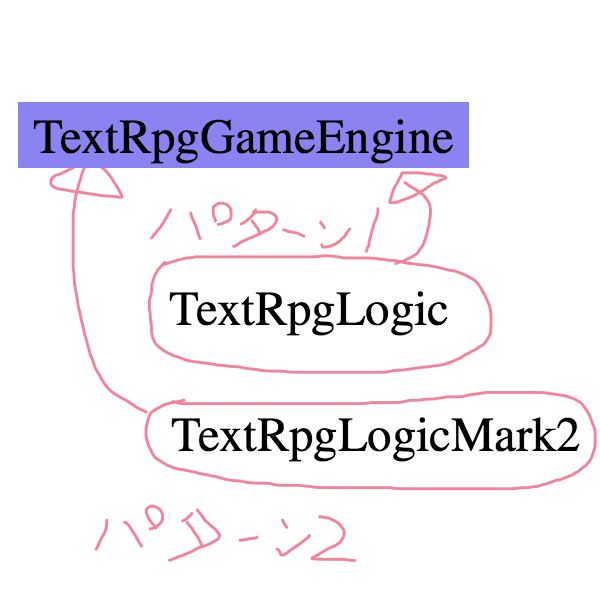
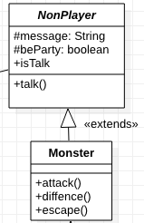
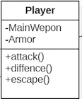

# 3-3 テキストRPG(戦闘シーンのみ)を詳細設計する〜③クラス図〜

本パートでは、クラス図を作成し、実装する時の具体的な設計図とします。

フローチャートで描いた、処理通りに動かすための各部品(クラス)を一覧化して、どのような機能を持たせるのか？

これを一覧化します。具体的にものを見ないとイメージがわかないと思うので、**筆者が作成したもの**を以下に示します。



そして、以下のことを行います。
1. フローチャートから登場人物を考える
2. 拡張することを考える
3. マルチスレッド対応
4. クラス図の作成

## 1.フローチャートから登場人物を考える
前のパートでフローチャートを描いたので、プログラムの大まかな処理のイメージがついたと思います。

次は登場人物について考えてみます。「人物」と言ってもキャラクター以外も含みます。

つまりは「登場するクラス」について考えます。筆者の書いたフローチャートを例に記述します。

フローチャートを見ると、「ゲーム起動」の後に「ゲームの準備処理」がありますので、そのところで登場人物を作成(インスタンスの生成を)行います。



**==登場人物について==**

まずは、テキストRPG(戦闘シーンのみ)なのでプレーヤーと敵(モンスター)がいますので、登場人物に以下を追加します。
* プレーヤー
* モンスター

「XXXを表示する」という文言が多いので表示用クラス、入力チェックも追加します。
* 表示用クラス
* 入力チェッククラス

あとは、標準出力に表示しない処理があるだけなので、「〜ユーティリティ」となりそうですが、**そうしません**。

その理由は、**まだどんな処理が必要になるか、わからないから**です。

**==全体処理の流れを考える==**

まずは、メインメソッドで処理を行うことを考えます。

フローチャートに習い、コメントを並べて見ると下のようなコードになります。

※ゲーム起動はメインメソッドを起動しすることで解決するのでコメントには書きません。そして、クラス名は変更する予定です。ゲーム開始処理は、メインメソッドの実行に当たるので、記述していません。

＜処理フローをコードに実装するサンプル＞
```java
public class TextRpg {
    public static void main(String[] args) {
        //2. ゲームの準備処理
        //3. 初期表示
        //4. 「XXXXがあらわれた!」を表示する
        //5. バトルステータス(プレーヤの名前やHP, MP, LV)の表示
        //6. モンスターが話をする場合、モンスターのメッセージを表示する
        //7. モンスターが話をしない場合、何もしない
        //8. 入力受付を行う
        //9. 入力判定(チェック)を行う
        //10. 入力チェックエラーの場合は、もう一度入力を促す
        //11. 「bye」と入力された場合は、ゲームを終了する
        //12. それ以外の場合は、ゲームデータの更新を行う
        //13. 表示の更新
        //14. モンスターを倒していないならもう一度8から処理を行う
        //15. モンスターを倒していたらゲームを終了する
    }
}
```

TextRpgクラスにメインメソッドを作成し、動かす内容をコメントで記述しました。

そして、上のコードに条件分岐や、ループ処理などを加えてやると下のようになります。

※現状、作成したコードに関しては条件分岐がありませんが、読者の皆さんが作成するときには条件分岐も考慮に入れて考えて見てください。

＜条件分岐を追加したサンプルコード＞

```java
public class TextRpg {
    public static void main(String[] args) {
        // メインクラスのインスタンス化
        TextRpg main = new TextRpg();
        //2. ゲームの準備処理(3～7が準備処理になる)
        //3. 初期表示
        //4. 「XXXXがあらわれた!」を表示する
        //5. バトルステータス(プレーヤの名前やHP, MP, LV)の表示
        //6. モンスターが話をする場合、モンスターのメッセージを表示する
        //7. モンスターが話をしない場合、何もしない
        main.init();

        while(true) {
            //8. 入力受付を行う
            //9. 入力判定(チェック)を行う
            //10. 入力チェックエラーの場合は、もう一度入力を促す
            //11. 「bye」と入力された場合は、ゲームを終了する
            //12. それ以外の場合は、ゲームデータの更新を行う
            //13. 表示の更新
            //14. モンスターを倒していないならもう一度8から処理を行う
            //15. モンスターを倒していたらゲームを終了する
        }
    }
}
```
**==メインメソッドにどのような動きをするか記述==**
1. 初期処理として、init()メソッドで処理を行う、番号としては1〜7を実行する
2. 無限ループの中で番号の8〜15を行う

処理としては以下のようなものです。
1. ゲーム起動クラス(メインメソッドを持つクラス)のインスタンス生成
2. ゲームの準備処理
3. 無限ループでゲームを走らせる(**ゲームループ** と呼ぶことにします)
※[筆者が参考にしたページ](https://github.com/SilverTiger/lwjgl3-tutorial/wiki/Game-loops)からの引用です。英語なのでGalmeLoopと記述されています。


そして、登場人物は、今の所、以下の通りです。
* プレーヤー
* モンスター
* 表示用クラス
* 入力チェッククラス

そして、コメント・コードを見てみると登場人物はこれだけで良さそうです。「これも必要では？」と疑問に思ったら

追加してみてください。修正すれば良いので、問題ありません。

## 2. 拡張することを考える

表題の通り「テキストRPG(戦闘シーンのみ)」は、この部分を完成させた後に、「せっかくだから**冒険もさせてみたい**」と思うのが人情

そのように思った人もいると思います。。。筆者は思いました。。。

なので、今後拡張するために以下の**欲望**を考えます。
* DBに武器とか防具、アイテム、魔法などを登録して使用したい
* ストーリー展開を行い、エンディングを表示したい

この時点で、 **DBを起動する必要**がありますので、マルチスレッドで動かせるようにします。

**マルチスレッド**に関しては、3-5で詳しく記述します。

現段階では以下の3つのスレッドを起動する構想があるということを認識してもらえばOKです。
1. 「これから作成するアプリを起動するスレッド」
2. 「DBを起動するスレッド」
3. 「ストーリーを展開するスレッド」

そして、言葉を変えて表現すると以下のようになります。
1. スレッド１にて現在作成している処理を動かす※戦闘シーンのことです
2. スレッド２にてDBを動かす
3. シーン展開の処理を動かす

## 3.マルチスレッド対応
「マルチスレッド」と聞いて「？？？」が頭に浮かんだ方、**正常でございます**。

「マルチスレッド」は、「並行処理」の一種で１つのプロセス上で、処理の待ち時間を利用して、あたかも「処理が同時に動いているように見せる」ものです。

類似する言葉には「[マルチタスク]()」とか「マルチプロセス」というのがありますが、Javaでは「マルチスレッド」の方を使うことが多いです。※マルチタスクは使わないので記述しません。

そして「プロセス」とは、つまるところアプリケーションを動かしているプログラムのことです。

「マルチプロセス」は、同様に、アプリケーションを２つ以上、動かすことなので、重いのです。

以上のことから、マルチスレッドでの実装を考えますが、マルチスレッドで処理を実行する手段としてJavaの場合は以下のような形で行います。

つまり「Threadクラスを継承して、「run()」メソッドで処理を行うようにする必要がある。」ということです。他にもRunnableインターフェースを使用する方法がありますが、別の機会に紹介します。

＜Threadクラスを頚使用してマルチスレッドの実装を行うサンプル＞

```java
public class TextRpg extends Thread {
    @Override
    public void start() {
        // 上のコードの、メインメソッドの処理
    }
}
```

そのようなわけで、クラス名を変更します。

そして、[LWJGLというフレームワーク](https://lwjglgamedev.gitbooks.io/3d-game-development-with-lwjgl/content/chapter02/chapter2.html)があるのですが、その実装方法を参考にすることにします。

その実装方法とは、以下のようなクラスを用意してXXXLogicクラスに処理(じゃんけんゲームでは、ユーティリティクラスとして使用しました。)をまとめて

ゲームを起動する処理、つまりゲームループ処理はXXXEngineクラスに実装するというものです。

**==LWJGLを参考にした時に出てくるクラス==**
1. メインクラス => メインメソッドを持地、XXXXGameEngine、XXXXLogicを動かす
2. XXXXGameEngine => メインの処理(戦闘シーンの処理)をこなう(ゲームループ処理を持つ)
3. XXXXLogic => ゲームの各処理を実装(準備処理、入力処理、表示処理など)
    参考にしたページでは、IGameLogicインターフェースにゲームループを行うのに必要な処理(抽象メソッド)を定義しています。
    * init(): 初期表示
    * input(): 入力処理
    * update(): データの更新（HPなど)
    * render(): 表示内容の更新

ゲームの処理は、どのゲームも上の処理を繰り返して動いているということです。
1. 初期表示(準備も含む)
2. 入力処理
3. データの更新
4. 表示内容の更新

なるほど、大まかに定義するならそのようになっていると思います。

そんなわけで**==メインクラスとロジッククラスを作成することにします==**ので登場人物のリストは、以下のように修正します。
* プレーヤー(Player)
* モンスター(Monster)
* 表示用クラス(ConsoleUtils)
* 入力チェッククラス(CheckerUtils)
* メインクラス(GameMain)
* ロジッククラス(TextRpgLogic)
* ロジックインターフェースクラス(Games)
* ゲームエンジンクラス(TextRpgGameEngine)

補足として、具体的にな実装サンプルを以下に示します。

＜メインクラス・メインメソッド＞
```java
/**
 * ゲームを起動するクラス。メインメソッドがある。
 * 今後、DBなど使用するときにはここでDBを起動する。
 * ※Derbyを使用する予定
 *
 * @param args プログラム引数
 */
public static void main(String[] args) {
	Games gameLogic = new TextRpgLogic();
	TextRpgGameEngine engine  = new TextRpgGameEngine(gameLogic);

	try {
		engine.start();
	} catch (Exception e) {
		e.printStackTrace();
		System.out.println("想定外のエラーで終了します。：" + e.getMessage());
			System.exit(-1);
		}
	}
 }
```
**==メインメソッドの説明==**
1. Gamesインターフェースを実装したクラスTextRpgLogicクラスをインスタンス化してGames型の変数に代入
2. TextRpgGameEngineクラスにGames型の変数を引数に渡し、TextRpgGameEngineのコンストラクタの引数に渡しインスタンス化します
3. そして、TextRpgGameEngineはThreadクラスを継承しているので、start()メソッドでスレッドを実行します※run()メソッドの処理が動きます

＜ゲームロジッククラス＞
```java
public class TextRpgLogic implements Games {
	/** 標準入力 */
	private Scanner scan;
	/** タイトル画面デザイン */
	private BufferedReader reader;

	/**
	 * コンストラクタ。
	 * フィールド変数のインスタンスを生成
	 */
	public TextRpgLogic() {
		scan = new Scanner(System.in);
		try {
			reader = Files.newBufferedReader(Paths.get("src/main/resources", "title.txt"));
		} catch (IOException e) {
			e.printStackTrace();
			System.exit(-1);
		}
	}
}
```
**==TextRpgLogicクラスの解説==**
1.コンストラクタで標準入力用のクラスScannerをインスタンス化してフィールド変数scanに代入
2. title.txtを読み込む -> 今後コンソールに表示する予定

フィールド変数にGameインターフェース型を持っていますのでGameインターフェースを実装したクラスならば、どのようなクラスでも使用することが可能。

つまりは、別の戦闘シーンクラスを作成しても使えるということです。

＜ゲームエンジンクラス＞

```java
/**
 * テキストRPG(戦闘シーンのみ)を実装する。
 *
 * @author 作成者の名前
 */
public class TextRpgGameEngine extends Thread {
	/** テキストRPGクラス */
	private Games textRpgLogic;

	/**
	 * コンストラクタ。テキストRPGのロジックを実装したクラスを保持する。
	 *
	 * @param gameLogic ロジックを実装したクラス
	 */
	public TextRpgGameEngine(Games gameLogic) {
		textRpgLogic = gameLogic;
	}
}
```
**==TextRpgGameEngineの解説==**
1. コンストラクタで、TextRpgGameEngineクラスのフィールド変数Games型の変数に代入

これで、Gamesインターフェースを実装したクラスを実行するようにしてやれば、TextRpgの処理内容を取り替えることが簡単にできます。

例えば、TextRpgLogicMark2というクラスを新たに作成し、TextRpgLogicの代わりにし使用することが簡単にできます。

具体的に、使用するLogicクラスを変更する修正を行うならば、下のような修正を行います。TextRpgLogicMark2クラスを作成し、Logicクラスを切り替える場合です。

＜もともとのコード＞
 ```java
 Games gameLogic = new TextRpgLogic();
 ```
「new TextRpgLogic();」と書いたコードを下に示すクラスに取り替えてやると下のようなコードになります。

＜別クラスを呼び出すように修正するサンプルコード＞
```
Games gameLogic = new TextRpgLogicMark2();
```
「new TextRpgLogic**Mark2**();」と修正するだけでよいです。

つまるところは、ゲームの処理内容をロジッククラスに作成するので、処理の内容を変更したければ、ロジッククラスを取り替えてやれば**全てを書き換える必要はない**ということです。

＜イメージ図＞



＜メインクラス・メインメソッドを修正＞

```java
/**
 * ゲームを起動するクラス。メインメソッドがある。
 * 今後、DBなど使用するときにはここでDBを起動する。
 * ※Derbyを使用する予定
 *
 * @param args プログラム引数
 */
public static void main(String[] args) {
	Games gameLogic = new TextRpgLogicMark2();
	TextRpgGameEngine engine  = new TextRpgGameEngine(gameLogic);

	try {
		engine.start();
	} catch (Exception e) {
		e.printStackTrace();
		System.out.println("想定外のエラーで終了します。：" + e.getMessage());
			System.exit(-1);
		}
	}
 }
```

これで実行する処理の内容を**TextRpgLogicMark2クラス**のものに切り替えることができます。

これもインターフェースの使い方の一種です。

このような実装をすることで、今後のクラスを拡張する時に苦労しなくても追加・修正することができます。

これは、プログラムの依存関度を小さくした状態になります。

## 4.クラス図の作成
登場人物＝登場するクラスとした上で、登場人物のリストを作成しました。これはあくまでも、サンプルですので

自分で作成したリストを眺めていただきたく思います。

作成したリストを眺めて、はじめに目に止まるのが「キャラクター」だと思われます。

筆者は、キャラクターに目がいきました。

そんなわけで、キャラクター(＝ **プレーヤーとモンスター**)から考えていきます。

クラス図に書く場合は、メソッドもプロパティ(フィールド変数)も一行で事足りるので修正も楽です。

**==プレーヤーを考える==**

プレーヤーは、ゲームをプレーする人がコントロールするキャラクターなので、某RPGゲーム同様、以下のプロパティ(フィールド変数)を持ちます。
1. 名前
2. レベル
3. 生命力
4. 特殊能力(技能)の使用時に消費
5. 攻撃力
6. 防御力

そして、それはモンスターも同じです。しかし、モンスターのようなCPUがコントロールするキャラクターは

モンスター以外に出てくるので、「NonPlayer」というクラスも作成することにしました。

TRPGで言う所の「[NPC](https://ja.wikipedia.org/wiki/%E3%83%8E%E3%83%B3%E3%83%97%E3%83%AC%E3%82%A4%E3%83%A4%E3%83%BC%E3%82%AD%E3%83%A3%E3%83%A9%E3%82%AF%E3%82%BF%E3%83%BC)」です

なので、クラス関係は「NonPlayer→「Monster」→「LastBoss」としました。

しかしこの時点でも足りないプロパティがあります。それは自分で考えて見てください。

ちなみに、筆者の場合、最終的にはクラス関係を上のものとは違うものになりました。

くどいようですが、「**間違っても修正が容易にできる**」テクニックを紹介するために、この様な記述をしています。

### 作成する内容を考える
**==必要な処理を考える==**

今度はキャラクターにどのような動きをさせるのか？について考えます。

今回作成するのは「戦闘シーンのみ」なので、実装することは限定されてきます。

現状で思いつくのは、以下の通りです。
1. 標準出力に表示する処理
2. 戦った時の各種計算処理

そんなわけで、計算処理のクラスを作成することにしました。

そして、プレーヤーには「装備」が必要です。

プレーヤーのプロパティに装備するものがありませんでしたので追加します。装備するものには複数の情報が必要になるので、クラスとしてフィールド変数に持たせることにしました。

そして、作成するクラスは以下のようなクラスを作成します。

* MainWepon => メイン武器(サブ武器も作る予定)
* Armor     => 鎧(防具)

さらに、戦闘が終了するタイミングを見るためにプレーヤーとモンスターのプロパティに戦闘可能フラグを追加します。

作成するクラスが増えたので、ここで整理すると以下のようになります。

**==作成するクラス一覧==**
* プレーヤークラス(Player)
* モンスタークラス(Monster)
* 表示用クラス(ConsoleUtils)
* 入力チェッククラス(CheckerUtils)
* メインクラス(GameMain)
* ロジッククラス(TextRpgLogic)
* ロジックインターフェースクラス(Games)
* ゲームエンジンクラス(TextRpgGameEngine)
* メイン武器クラス(MainWepon)
* 防具クラス(Armor)

それでは、自分の考えたクラスの一覧を作成したら、今度はそれぞれを線で結びます。

ちょっと特殊なのが「継承」を示す矢印です。下のように書きます。


継承の関係を描いたサンプルは下のものになります。




**==クラスの中身を書く==**

クラス図のクラスには「プロパティ(フィールド変数)」とオペレーション(メソッド)を書きます。

四角で囲った最上部にはクラス名、次の段には、属性(プロパティのこと)、一番下の段にはオペレーション(メソッド(振る舞い))を書きます。

プレーヤーだったら、下のようなプロパティとオペレーションを持っています。不足を感じたら追加・削除してより良いものを作ってください。



プロパティには「メイン武器」「防具」があり、オペレーションには「攻撃」「防御」「逃げる」があります。

そして、プロパティ、オペレーションの左側にある「+」はpublicを示します。以下のような種類があります。プログラムと同じです。
* \+ : publicを意味する：外部からの参照が可能
* \- : privateを意味する：クラス内でのみ参照可能
* \# : protectedを意味する：継承関係のあるクラス内のみ参照可能

このように、クラスのプロパティ(オペレーション(メソッド)も含む)を作成して１つのクラスとして機能するようにクラス図を作成します。

補足として、プロパティというのは、属性、フィールド、要素 etc ... 「～中に含まれるもの」という意味で、幅広く使用される言葉です。

ちなみに、具体的なものの言い方としては以下のようになります。
* 属性: attribute
* フィールド: メンバ変数(C言語などJava以外の言語で使用される言葉)
* 要素: HTMLやXMLなどのようにタグで囲った中身、クラスで定義しているメンバ・変数、メンバメソッドなど、これも幅の広い言葉です。

本パートは以上です。クラス図の書き方が大まかに分かったと思います。細かい書き方には触れませんでしたが、

クラス図に関して、現状では、自分にわかるようにかければ良いです。　※細かいところは現場でのルール決めがあります

次のパートでは、これらのクラスを動かすためのメインメソッドを作成します。
