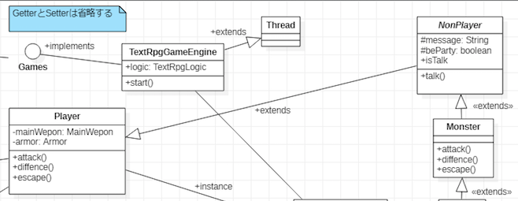
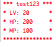

# 3-4 クラス図を眺める〜①〜③を眺めてメイン処理を考える〜

## 今までのやったことを整理する
今まで作成してきたもの、改めて確認するのは以下のものです。
* ①フローチャート
* ②ユースケース
* ③クラス図

２章で行ったように、マルチスレッド対応にする必要がありますので、クラス構成から考えます。

まずは、前回作成した、クラスのリストを眺めます。筆者が作成したものは以下になります。
* プレーヤー(Player)
* モンスター(Monster)
* 表示用クラス(ConsoleUtils)
* 入力チェッククラス(CheckerUtils)
* メインクラス(GameMain)
* ロジッククラス(TextRpgLogic)
* ロジックインターフェースクラス(Games)
* ゲームエンジンクラス(TextRpgGameEngine)

そして、以下のことについて整理します。
* 1.メインクラスについて
* 2.ゲームエンジンクラスについて
* 3.プレーヤー、モンスタークラスについて
* 4.表示用クラスについて

### 1.メインクラスについて
※筆者の考えたものを例に記述しています。

ここで、クラスを起動するメインメソッドを開始点にして以下のような順序で処理を実装するイメージが湧きました。

これは[LWJGLというフレームワーク](https://lwjglgamedev.gitbooks.io/3d-game-development-with-lwjgl/content/chapter02/chapter2.html)の実装を参考にしました。

1. ゲームエンジンクラスのコンストラクタに引数、ロジッククラスを渡してインスタンス生成
    ただし、ロジククラスは、インターフェースを実装するので引数はインターフェース型になる
2. メインメソッドでゲームエンジンクラスを起動(THread#start())する
3. ゲームエンジンクラスのrun()メソッドをオーバーライドしてメイン処理(処理フロー(箇条書き))を実装
4. ここから処理フローの内容を実装する(各処理クラスの実装をする)

そして、メインメソッド(GameMain)からゲームエンジンクラスを起動してゲームを開始するように実装します。

この部分は、固定の処理になります。つまり「ほぼこのような形の実装になる」ということです。

具体的には、メインメソッドから、ゲームエンジンクラスを起動しようとしたら、下のような実装になるということです。

＜メインメソッドのサンプルコード＞
```java
/**
 * ゲームを起動するクラス。メインメソッドがある。
 * 今後、DBなど使用するときにはここでDBを起動する。
 * ※Derbyを使用する予定
 *
 * @param args プログラム引数
 */
public static void main(String[] args) {
	Games gameLogic = new TextRpgLogic();
	TextRpgGameEngine engine  = new TextRpgGameEngine(gameLogic);

	try {
		engine.start();
	} catch (Exception e) {
		e.printStackTrace();
		System.out.println("想定外のエラーで終了します。：" + e.getMessage());
			System.exit(-1);
		}
	}
 }
```
**==メインメソッドの解説==**
1. TextRpgLogicクラスをインスタンス化し、Games型の変数gameLogicに代入します
2. TextRpgGameEngineクラスにgameLogicを引数に渡してインスタンス化します
3. そして、run()メソッドを実行します ※マルチスレッド処理なので複数スレッド起動することが可能です
　ちなみにこの状態は１つのスレッドのみです

ポイントとしては、Gamesインターフェースを実装したクラスを引数にゲームエンジンクラスのインスタンスを生成するところですが、これは、Gamesインターフェースを実装したクラスであれば、どんなクラスでも起動できるということで、作成するゲームを変えてもよいということです。

**まとめると下のようなことです。**
1. マルチスレッドで動かすためにゲームエンジンクラスにThreadクラスを継承
2. 処理の内容を変更、取り替えできるように、Gamesインターフェースを使用
3. 他にDBなどを起動したい場合は、このメインメソッドに追記する

具体的には下のような実装になります。「DBAccesserクラス」は実際に作成していませんので、仮の名前です。

＜GameMainクラスの全体像サンプル＞
```java
public class GameMain {
	/**
	 * ゲームを起動するクラス。メインメソッドがある。
	 * 今後、DBなど使用するときにはここでDBを起動する。
	 * ※Derbyを使用する予定
	 *
	 * @param args プログラム引数
	 */
	public static void main(String[] args) {
		Games gameLogic = new TextRpgLogic();
		TextRpgGameEngine engine  = new TextRpgGameEngine(gameLogic);
        // DBへのアクセスクラスをThreadクラスを継承して作成
        DBAccesser db = new DBAccesser();

		try {
			engine.start();
            // DB用のスレッドを起動
            db.start();
		} catch (Exception e) {
			e.printStackTrace();
			System.out.println("想定外のエラーで終了します。：" + e.getMessage());
			System.exit(-1);
		}
	}
 }
```
もし、作成するゲームを別なものにしようとした場合は、Gamesインターフェースを実装したクラスを新たに作成し、TextRpgLogicの代わりに作成したクラスをインスタンス化してやればよいです。

作成したクラスを「NewGameLogic」とするのであれば、下のような実装になります。

＜GameLogicクラスを取り替える時のサンプル＞
```java
public class GameMain {
	/**
	 * ゲームを起動するクラス。メインメソッドがある。
	 * 今後、DBなど使用するときにはここでDBを起動する。
	 * ※Derbyを使用する予定
	 *
	 * @param args プログラム引数
	 */
	public static void main(String[] args) {
		Games gameLogic = new NewGameLogic();
		TextRpgGameEngine engine  = new TextRpgGameEngine(gameLogic);
        // DBへのアクセスクラスをThreadクラスを継承して作成
        DBAccesser db = new DBAccesser();

		try {
			engine.start();
            // DB用のスレッドを起動
            db.start();
		} catch (Exception e) {
			e.printStackTrace();
			System.out.println("想定外のエラーで終了します。：" + e.getMessage());
			System.exit(-1);
		}
	}
 }
```

変更しているのは1行だけです。

ちなみに上のサンプルコードは、DBAccesserを作成した程で実装しています。

### 2.ゲームエンジンクラスについて
※筆者の考えたものを例に記述しています。

このクラスの役割は、テキストRPGを実行することです。そして、今後拡張するためのマルチスレッド処理を実行するためのクラスです。

実装としては、下のようにThreadクラスを継承してrun()メソッドをオーバーライドします。

＜Threadクラスを継承したときのサンプルコード＞

```java
public class TextRpgGameEngine extends Thread {
	/** テキストRPGクラス */
	private Games textRpgLogic;

	/**
	 * コンストラクタ。テキストRPGのロジックを実装したクラスを保持する。
	 *
	 * @param gameLogic ロジックを実装したクラス
	 */
	public TextRpgGameEngine(Games gameLogic) {
		textRpgLogic = gameLogic;
	}
	/**
	 * Threadクラスのメソッドをオーバーライド。
	 * これで、マルチスレッドでの処理が可能になる。
	 * @see フローチャート
	 */
	@Override
	public void run() {
		// 0.ゲーム起動のための準備処理
		// 1. 戦闘開始の文言「XXXがあらわれた！」を表示する
		textRpgLogic.init();
		// 2.ゲームループ開始
		// 3.初期表示(ステータスの表示)
		while(true) {
			// 4. 入力受付
			String input = textRpgLogic.acceptInput();
			if ("bye".contentEquals(input)) {
				System.out.println("ゲームを終了します。");
				break;
			}
			// 5. データの更新処理
			if (textRpgLogic.updateData(input) == false) {
				continue;
			}
			// 6. 画面(コンソール)の更新
			if (textRpgLogic.render()) {
				// TRUEが返ってきた場合は、戦闘終了
				System.out.println("たたかいが、おわりました。");
				break;
			}
		}
	}
}
```

**==TextRpgGameEngineの解説==**

最終的に今までに作成していたメインメソッドの内容をrun()メソッドに移植する形で考えていききます。

そして、初期処理や必要になる処理をTextRpgLogicに実装します。
1. メインメソッドでTextRpgGameEngineを起動するようにします
2. そして、メインメソッドでTextRpgGameEngineのスレッドを起動します(run()メソッドを実行)
3. run()メソッドで①フローチャートで作成した処理順を実装する
    * 0.ゲーム起動のための準備処理
    * 1. 戦闘開始の文言「XXXがあらわれた！」を表示する
    * 2.ゲームループ開始
    * 3.初期表示(ステータスの表示)
    * 4. 入力受付
    * 5. データの更新処理
    * 6. 画面(コンソール)の更新


ここで、テキストRPGのフローチャートで作成した処理を走らせるようにします。

### 3.プレーヤー、モンスタークラスについて
プレーヤークラスやモンスタークラスに関しては共通する部分が多いので下のようなクラス関係を作りました。



モンスタークラスの下に矢印がありますが、気にしないでください。

そして、プレーヤークラスを開祖にして、ノンプレーヤー、モンスターと継承の系譜ができています。

プレーヤークラスのフィールドはノンプレーヤーも使用、モンスターも使用するということです。

不足分や余計な部分は、オーバーライドしないとか、フィールド変数のアクセス修飾子をprivateにして

アクセサーメソッドで参照するようにすると、必要なデータのみを取得できます。アクセス修飾子に注意して想定する動きになるよう、クラスの関係を作ってみてください。

具体的には、PlayerクラスもNonPlayerクラスもフィールド変数はprivateで実装し、アクセサーメソッドで各値を参照するようにしました。

これで、継承したクラスで使用しないなら各値をオーバーライドしなければ、アクセスすることができません。

＜一部抜粋: Player＞
```java
public class Player {
	/** 名前 */
	private String name;
	/** レベル */
	private int level;
	/** 生命力 */
	private int HP;
	/** 特殊能力(技能)の使用時に消費 */
	private int MP;

    /**
	 * @return name
	 */
	public String getName() {
		return name;
	}
	/**
	 * @param name セットする name
	 */
	public void setName(String name) {
		this.name = name;
	}
}
```
**==Playerクラスの解説==**

以下の内容を定義
1. プレーヤーの名前
2. プレーヤーのレベル
3. プレーヤーのHP
4. プレーヤーのMP
5. それぞれのGetterとSetterメソッドを定義

＜一部抜粋: NonPlayer＞
```java
public class NonPlayer extends Player {
	/** 話すときに表示するメッセージ */
	private String message;
	/** パーティに参加するフラグ */
	private boolean beParty;
	/** 話すかどうかのフラグ */
	private boolean isTalk;

    /**
	 * @return message
	 */
	public String getMessage() {
		return message;
	}
	/**
	 * @param message セットする message
	 */
	public void setMessage(String message) {
		this.message = message;
	}
}
```
**==NonPlayer==**

Playerクラスを継承して作成します、必要になるHP、MPなどがPlayerと同じだからです。

このクラスは子供のクラスにMonsterクラスを持つ予定です。なのでMonsterクラスに実装する前に必要な処理などを実装します。

そして、Monster以外にも、王様、王女様、通行人などをこクラスを作ることで、表現することもできます。
1. 話すときに表示するメッセージ
2. パーティに参加するフラグ
3. 話すかどうかのフラグ

上記のフィールド変数を持ちます。

＜全部: Monster＞
```java
public class Monster extends NonPlayer {

	/** 改行コード */
	private final String SEP = System.lineSeparator();

	/**
	 * コンストラクタ。
	 * 今回は、まおうのみなので、コンストラクタプロパティ設定を行う。
	 * @param name
	 */
	public Monster(String name) {
		// 名前
		super(name);
		// レベル
		setLevel(1);
		// HP
		setHP(30);
		// MP
		setMP(5);
		// 攻撃力
		setAttack(5);
		// 防御力
		setDiffence(3);
		// 話をする
		setTalk(true);
		// 表示するメッセージ
		setMessage("「がっはっは！よくきたなぁ、おまえのゆうきに、さんじをおくろう。" + SEP
				+ "しかし、ここがおまえのさいごだ！わがちからにくっぷくするがよい。」");
	}

	/**
	 * モンスターの場合、武器を使用しないケースがある。
	 */
	@Override
	public int attack() {
		int attackValue = getAttack();
		MainWepon mainWepon = getMainWepon();
		if (mainWepon != null) {
			attackValue = getAttack() + getMainWepon().getOffence();
		}
		return attackValue;
	}

	/**
	 * モンスター防御。
	 */
	public int diffence() {
		Armor armor = getArmor();
		int diffenceValue = getDiffence();
		if (armor != null) {
			diffenceValue = armor.getDiffence() + getDiffence();
		}
		return diffenceValue;
	}

}
```
上のような感じで実装しました。

**==Monsterクラス==**
1. コンストラクタでPlayerクラスのメソッドを使用してHPなどのステータスを設定
2. 攻撃、防御のメソッドを実装

### 4.表示用クラスについて
これは、処理を実装するだけなので細かい説明はいらないと思います。

ただし。バトルステータスの表示に関して、結構苦労したので説明をつけておきます。

ステータスを表示する枠(アスタリスク)などの最大数を決めてしっかりと仕様を作らないととても面倒です。

筆者が作成した仕様は、以下のようなものです。
1. 表示する文字は、全角４文字、半角８文字とする
2. 全体の長さ(文字数)はプレーヤー名が奇数の場合は、15文字
3. 全体の長さ(文字数)はプレーヤー名が奇数の場合は、14文字
4. 全角は２半角２文字分の長さを使用する

このような形で、バトルステータスを表示することにしました。

プレーヤー１人分のイメージは下のようなものです。



人数が増えたらこの文字列を横につなげます。　※今回は実装しません


本パートは以上になります。

各クラスの実装イメージができたかと思います。くどいようですが、あくまでも筆者が作成したものはサンプルですので、自分のイメージしたテキストRPGを是非作ってみてください。やってみると結構面白いと思います。

拡張して、ストーリーつけて、各種プレーヤー(主人公キャラクター)などを作成すると、もっと面白いかもしれません。

しかし、まだ実装していないので、サクッと作ってしまいましょう。

次のパートでは、「各クラスが、どのように動いたら良いか？」を明確にします。
