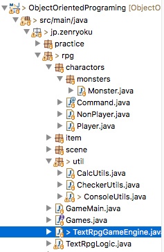
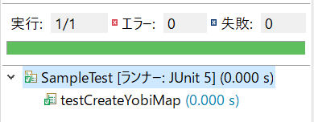
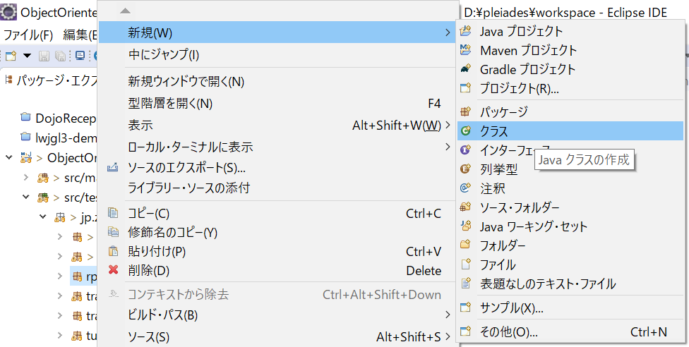
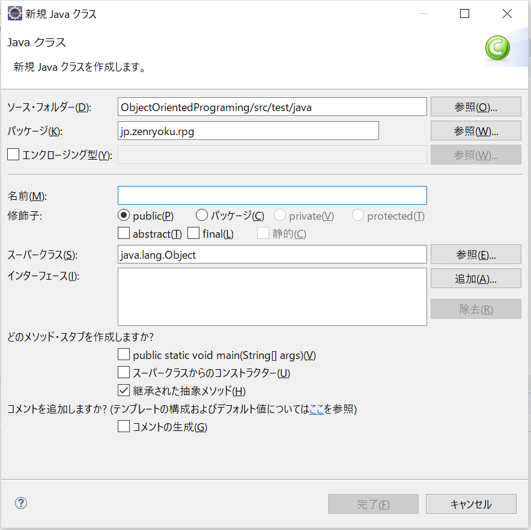
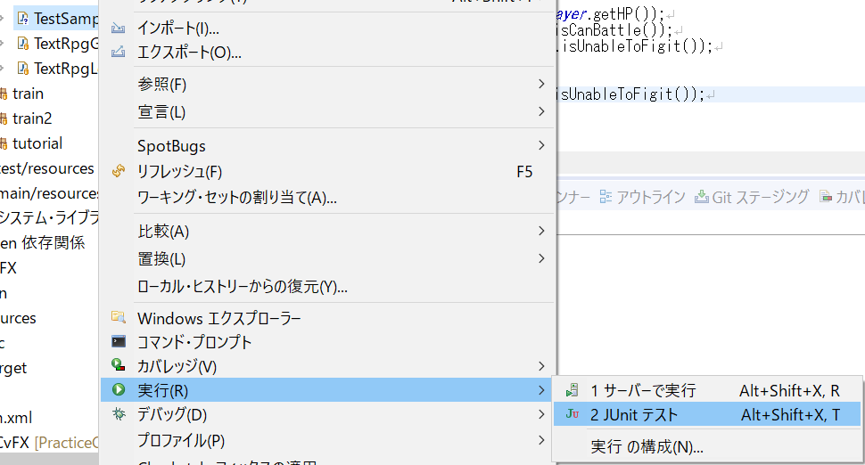
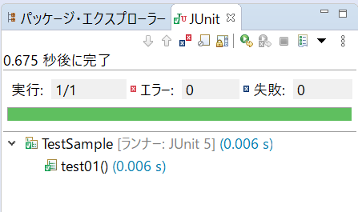

# 3-5 メインメソッドを作る〜マルチスレッド対応を考えメイン処理を作成する〜
本パートでは、メインメソッドを作成します。このメインメソッドで各クラスがどのように動いたら良いか明確にします。

まず行うことは、１章で行ったことと同じです。違うのは、マルチスレッド対応になっていることです。

マルチスレッドに関しては、前述しているので割愛します。

今回の実装は、以下のような手順で行います。
1. 処理フロー(箇条書き)をもとにコメントをメインメソッドに書く
2. クラス図を参照して、必要なクラスのハコを作る(クラス名とメソッドの空実装)
3. テストケースを作成
4. 実装とテスト

## 1.処理フロー(箇条書き)をもとにコメントをメインメソッドに書く
前のパートで筆者が作成した、処理フロー(箇条書き)配下のようなものです。
1. ゲームを起動する
2. ゲームの準備処理
3. 初期表示
4. 「XXXXがあらわれた!」を表示する
5. バトルステータス(プレーヤの名前やHP, MP, LV)の表示
6. モンスターが話をする場合、モンスターのメッセージを表示する
7. モンスターが話をしない場合、何もしない
8. 入力受付を行う
9. 入力判定(チェック)を行う
10. 入力チェックエラーの場合は、もう一度入力を促す
11. 「bye」と入力された場合は、ゲームを終了する
12. それ以外の場合は、ゲームデータの更新を行う
13. 表示の更新
14. モンスターを倒していないならもう一度8から処理を行う
15. モンスターを倒していたらゲームを終了する

これをフローチャートにすると、下のようになります。


前回は、ここまできたら、メインメソッドに処理フローをコピペしましたが今回はしません。

先にクラスの作成を行います。

そして、作成するクラスの一覧は以下のようなものです。前のパートで作成しました。
* プレーヤー(Player)
* モンスター(Monster)
* 表示用クラス(ConsoleUtils)
* 入力チェッククラス(CheckerUtils)
* メインクラス(GameMain)
* ロジッククラス(TextRpgLogic)
* ロジックインターフェースクラス(Games)
* ゲームエンジンクラス(TextRpgGameEngine)

筆者の場合は、Eclipse([IDE(開発ツール)](https://zenryokuservice.com/wp/2019/05/12/eclipse-%E3%82%A4%E3%83%B3%E3%82%B9%E3%83%88%E3%83%BC%E3%83%AB%E6%96%B9%E6%B3%95%EF%BD%9Ewindows%E3%81%B8%E3%81%AE%E3%82%A4%E3%83%B3%E3%82%B9%E3%83%88%E3%83%BC%E3%83%AB%EF%BD%9E/))でクラスを作成すると下のようになりました。


他にも、作成したものがありますが、それは今後作成するものです。

その部分に関しては、本パートで後述します。

## 2.クラス図を参照して、必要なクラスのハコを作る(クラス名とメソッドの空実装)
１章でのじゃんけんゲームで行なった実装では、マルチスレッドの対応を実装しませんでした。

今回は、ゲームエンジンクラスをThreadクラスを継承して実装、ロジックインターフェースを実装(implements)したロジッククラスを引数にしてゲームエンジンクラスを生成します。このゲームエンジンクラスがメインメソッドの代わりをします。

なので、このクラスの「run()」メソッドに処理フロー(箇条書き)を記述します。

具体的には下のようなコードです。

＜Threadクラスrunメソッドのオーバーライド＞
```java
/**
 * Threadクラスのメソッドをオーバーライド。
 * これで、マルチスレッドでの処理が可能になる。
 * @see フローチャート
 */
@Override
public void run() {
	// 0.ゲーム起動のための準備処理
	// 1. 戦闘開始の文言「XXXがあらわれた！」を表示する
	textRpgLogic.init();
	// 2.ゲームループ開始
	// 3.初期表示(ステータスの表示)
	while(true) {
		// 4. 入力受付
		String input = textRpgLogic.acceptInput();
		if ("bye".contentEquals(input)) {
			System.out.println("ゲームを終了します。");
			break;
		}
		// 5. データの更新処理
		if (textRpgLogic.updateData(input) == false) {
			continue;
		}
		// 6. 画面(コンソール)の更新
		if (textRpgLogic.render()) {
			// TRUEが返ってきた場合は、戦闘終了
			System.out.println("たたかいが、おわりました。");
			break;
		}
	}
}
```
**== run()メソッドの解説==**

処理の内容は、以下の通りです。処理フロー(箇条書き)と似たようなもののはずです。
* 0.ゲームの準備処理
* 1. 戦闘開始の文言「XXXがあらわれた！」を表示する
* 2.ゲームループ開始
* 3.初期表示(ステータスの表示)
* 4. 入力受付
* 5. データの更新処理
* 6. 画面(コンソール)の更新

多少違うのは、実装するのに追加した部分です、設計レベルでは見えてこなかった部分です。

それは、ロジッククラスに実装します。このクラスは、ゲームでの具体的な処理部分を実装します。

つまり、ロジッククラスは処理フロー(箇条書き)の「ゲームの準備処理」などの実装を行います。

＜初期化処理のサンプルコード＞

```java
/**
 * 初期表示を行う。
 * 1. バトルステータスを表示
 * 2. 初期表示: 「XXXXが現れた」
 * 3. コマンドの入力を促す
 * 4. コマンドの一覧を表示する
 *
 * @see フローチャート
 */
@Override
public void init() {
	// プレーヤーの作成
	player = new Player("プレーヤ");
	// 装備
	player.setMainWepon(createMainWepon());
	player.setArmor(createArmor());
	// 攻撃力と防御力を設定
	player.setAttack(player.getMainWepon().getOffence());
	player.setDiffence(player.getArmor().getDiffence());
	// モンスターの作成
	monster = new Monster("まおう");
	// 初期表示: 「XXXXが現れた」
	console.printMessage("まおうがあらわれた！" + SEP);
	if (monster.isTalk()) {
		// 魔王のセリフを表示
		console.printMessage(monster.getMessage() + SEP);
	}
	// バトルステータスを表示
	console.printBattleStatus(player);
	// コマンドの入力を促す
	console.printMessage("こうどうを、せんたくしてください。");
	// コマンドの一覧を表示する
	commandMap = console.printCommandList(player);
}
```
**==初期化メソッドの解説==**
1. プレーヤーの生成(Playerクラスのインスタンス化)
2. プレーヤーの装備、攻撃力と防御力を設定
3. モンスターの作成(Monsterクラスのインスタンス化)
4. バトルステータスを表示(プレーヤーのHP, MPを表示する)
5. コマンドの入力を促す
6. コマンドの一覧を表示する

筆者の場合は、このように実装しました。

そして、次のゲームループ処理が始まったら、ユーザーの入力を開始します。

### 筆者の実装した実装の解説
処理内容に関しては、以下の通りです。
1. プレーヤークラスを生成(プレーヤークラスのコンストラクタでステータスなどを設定)
```java
/**
 * コンストラクタ。
 * @param name
 */
public Player(String name) {
	this.name = name;
	// レベル1の設定
	setLevel(1);
	setHP(20);
	setMP(10);
}
```
2. 武器(クラス)などの生成を行いプレーヤークラスに設定
3. 同様に攻撃力、防御力を設定
4. モンスタークラスを生成
```java
/**
 * コンストラクタ。
 * 今回は、まおうのみなので、コンストラクタでプロパティ設定を行う。
 * @param name
 */
public Monster(String name) {
	// 名前
	super(name);
	// レベル
	setLevel(1);
	// HP
	setHP(30);
	// MP
	setMP(5);
	// 攻撃力
	setAttack(5);
	// 防御力
	setDiffence(3);
	// 話をする
	setTalk(true);
	// 表示するメッセージ
	setMessage("「がっはっは！よくきたなぁ、おまえのゆうきに、さんじをおくろう。" + SEP
			+ "しかし、ここがおまえのさいごだ！わがちからにくっぷくするがよい。」");
}
```
6. 初期表示: 「XXXXが現れた」
7. モンスターのisTalkがtrueの場合はメッセージを表示する
8. バトルステータスを表示
9. コマンドの入力を促す
10. コマンドの一覧を表示する

上記のような処理を行っています。

これはあくまでもサンプルですので、初期処理のみを記述いたします。

しかし、コマンドの一覧を表示する部分に関してはちょっとややこしい手法を使ったので解説いたします。

これも、筆者が作成した実装なので、サンプルとして紹介するものです。

これは、アノテーションを使用して、プレーヤーの選択できる実行コマンドを取得するための仕組みです。

### Commandアノテーション
結論から記述すると、「@Command」をつけたメソッドを取得するように実装しました。

アノテーションは以下のように作成しました。自分で実装したものです。JavaAPI等には入っていませんので、ご注意ください。

＜アノテーションのサンプルコード＞
```java
/**
 * 行動を表すアノテーション
 * 。
 * @author 実装者の名前
 */
@Target(ElementType.METHOD)
@Retention(RetentionPolicy.RUNTIME)
public @interface Command {
	/** 表示順 */
	public int index();
	/** 実行選択肢 */
	public String commandName();
}
```
**この部分はリフレクションを使用しているのでちょっと難しいかもしれません**が解説します。

このアノテーションはメソッドにつけるもの(「@Target(ElementType.METHOD)」)で、

アプリが起動してから使用可能(「@Retention(RetentionPolicy.RUNTIME))というような設定です。

そして、アノテーションの引数にindexとcommandNameを設定しています。

使用するときは、下のように実装します。
```java
/**
 * 攻撃コマンド。
 *
 * @return 武器の攻撃力
 */
@Command(index=1, commandName="たたかう")
public int attack() {
	return mainWepon.getOffence();
}
```

取得した、メソッドの順番とコマンド名を指定しています。

そして、このコマンドを表示するための処理は下のように実装しました。
```java
/**
 * プレーヤーの行動選択肢を一覧表示する。
 *
 * @param player
 * @return コマンドマップ(indexでソート済み)
 */
public Map<Integer, String> printCommandList(Player player) {
	Method[] mess = player.getClass().getDeclaredMethods();
	// 並び替え機能付きのMAP
	Map<Integer, String> commandMap = new TreeMap<>();
	for(Method mes : mess) {
		Command ano = mes.getAnnotation(Command.class);
		if (ano != null) {
			// マップにインデックス(順番)とコマンド名を登録
			commandMap.put(ano.index(), ano.commandName());
		}
	}
	// 並び替え後に表示
	commandMap.forEach((Integer index, String value) -> {
		System.out.println(index + ": " + value);
	});
	return commandMap;
}
```
処理には、java.lang.refrectionを使用しています。

この実装は、初心者でなくても使用する人が少ない実装ですので、「こんな実装もあるんだな」と思ってもらえればよいです。

そして、自分が実装する場合には**別な方法を考えてみるのもよい**です。筆者の発想力ではこの様な実装が精いっぱいだったのでリフレクションを使用しました。

1. プレーヤークラスから定義しているメソッドを取得
2. ソート機能つきのMapを生成(java.util.TreeMap)
3. 取得したメソッドをループ処理で１つずつ取得
4. Commandアノテーションがついているメソッドの場合は、マップにインデックス(順番)とコマンド名を登録
5. 全てのメソッドからコマンドを取得したら、並び替え後に表示

このように実装しました。細かい部分は自分で考えてやってみてください。

必要な技術に関しては全て記述していますので、このほかは、自分で調べてやってみてください。

## 3.テストケースを作成
次は、テストケース(仕様)の作成を行います。

初期処理の場合を解説します。初期処理で使用している、処理は、ほとんどが簡単なものですが、下のメソッドの実装に手こずりました。
* ①バトルステータスを表示
* ②コマンドの一覧を表示する

**テストケースの作成方法に関しては、１章、２章で記述していますので割愛します**。

作成したメソッドに対して「どのように動けば良いか？」を先に決めてそれを確認するテストコードを書く。

最後に実装してテストの実行結果をオールグリーンにする.下のような感じです。



## 4.実装とテスト
この部分に関しては、試行錯誤を行い頑張るのみです。テストを行い全てグリーンになれば。実装完了です。

ここで、テストの作り方を復習しておきます。(Eclipseを使用した場合)

1. テストクラスを作成します。



＜クラス名の指定＞



2. テストコードを作成します。

```java
public class TestSample {

	private static Player player;

	@BeforeAll
	public static void init() {
		// テストクラスの起動時に1度、呼ばれる
		player = new Player("test");
		player.setHP(3);
		player.setCanBattle(true);
	}

	@BeforeEach
	public void stanbyTest() {
		// テストの実行準備
	}

	@Test
	public void test01() {
		// テストの実行
		assertEquals(3, player.getHP());
		assertTrue(player.isCanBattle());
		assertFalse(player.isUnableToFigit());

		player.setHP(0);
		assertTrue(player.isUnableToFigit());
	}
}
```
これで実行した結果が緑色になればOK





※**テストケースの作成方法に関しては、１章、２章で記述しています**。

本パートは以上になります。

ここまでやってきて、設計、クラスの作成、テストケースの作成と実装。大まかなに開発の工程をほぼ全てを行なった形になります。

実際の業務でも行う工程は変わりません。ただし、[テストファースト](https://ja.wikipedia.org/wiki/%E3%83%86%E3%82%B9%E3%83%88%E9%A7%86%E5%8B%95%E9%96%8B%E7%99%BA#:~:text=%E3%83%86%E3%82%B9%E3%83%88%E9%A7%86%E5%8B%95%E9%96%8B%E7%99%BA%20(%E3%81%A6%E3%81%99%E3%81%A8%E3%81%8F%E3%81%A9%E3%81%86,%E3%81%95%E3%81%9B%E3%82%8B%E3%80%81%E3%81%A8%E3%81%84%E3%81%86%E7%9F%AD%E3%81%84%E5%B7%A5%E7%A8%8B%E3%82%92)ではなく[ウォーターフォール](http://www.okapiproject.com/computer/leran_comp/sysdev/sd_01_003_0.htm#:~:text=%E3%82%A6%E3%82%A9%E3%83%BC%E3%82%BF%E3%83%BC%E3%83%95%E3%82%A9%E3%83%BC%E3%83%AB%E5%9E%8B%E3%81%A8%E3%81%AF%E3%80%81%E3%82%B7%E3%82%B9%E3%83%86%E3%83%A0%E3%81%AE%E9%96%8B%E7%99%BA%E3%82%92%E3%80%8C%E5%9F%BA%E6%9C%AC,%E3%81%A8%E5%91%BC%E3%81%B0%E3%82%8C%E3%81%A6%E3%81%84%E3%81%BE%E3%81%99%E3%80%82)での作業をすることになるかもしれません。

この部分は現場によるのでなんとも言えませんが、テストファーストの経験があれば、ウォーターフォールでの実装は問題なくできると思います。

何故ならば、設計から順に行っていくのがウォーターフォールであり、肝になるところはテストです。

つまりは、テストケースを考えることを経験しているので、軽視されがちな「テスト」をちゃんと行うことができるであろうからです。

さらに、楽しくプログラミングができるように祈っています、お疲れ様でした。
