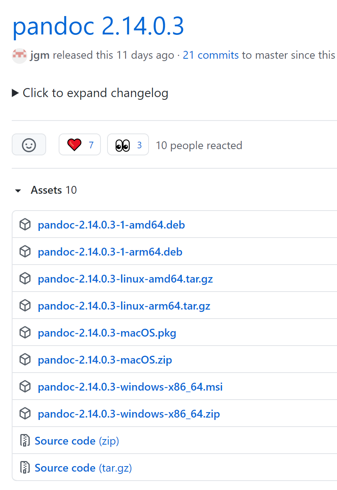
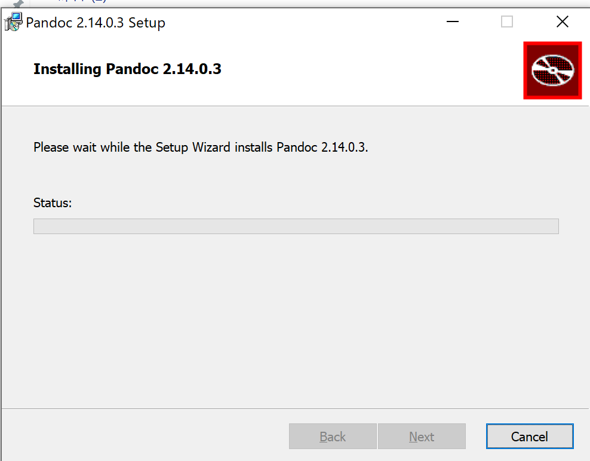
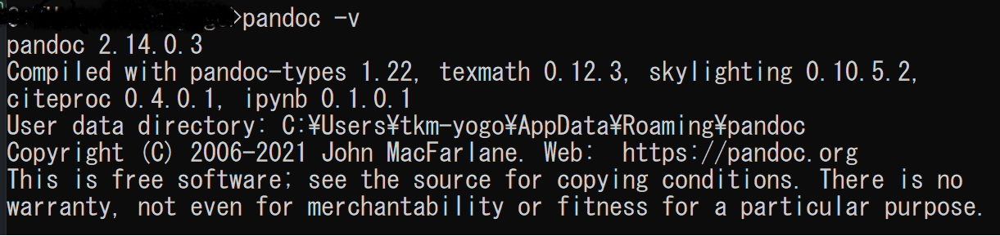

# WordをMarkDownに変換する
結論、[PANDOC](https://pandoc-doc-ja.readthedocs.io/ja/latest/users-guide.html)を使用するとできるようです。

Windowsの場合は、PANDOCのインストールには[こちらのページ](https://github.com/jgm/pandoc/releases/tag/2.14.0.3)からインストーラーをダウンロード、ほかのものはそれぞれのパッケージなどをダウンロードするようです。

インストーラーが動くと下のようにインストールが始まります。

インストールができたら、下のようにコマンドをたたき確認します。
1. ウィンドウズボタンと「R」ボタンを押下
2. ダイアログが表示されるので、cmdと入力してEnterキーを押下
3. コマンドプロンプトが開くので「pandoc -v」と入力してEnterキーを押下

そして、PowerShellを使用したほうが良いみたいなので、インストールします。

PowerShellはコマンドプロンプトと同じように使用できるのでそのままコマンドをたたきます。
