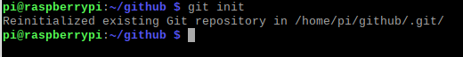
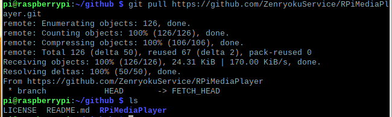
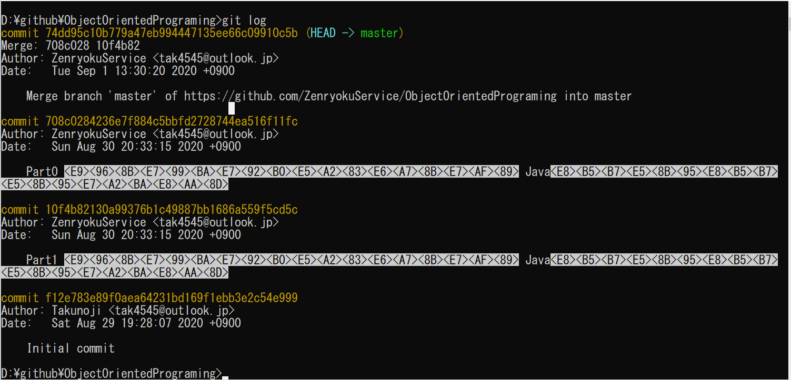
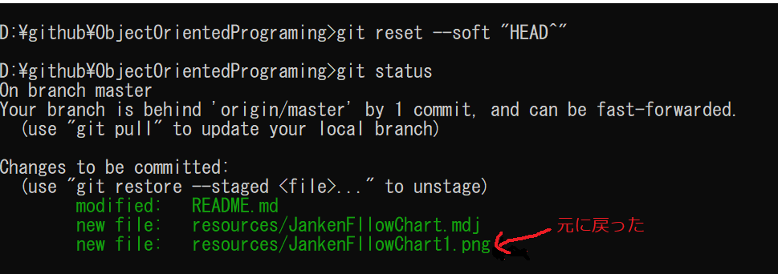
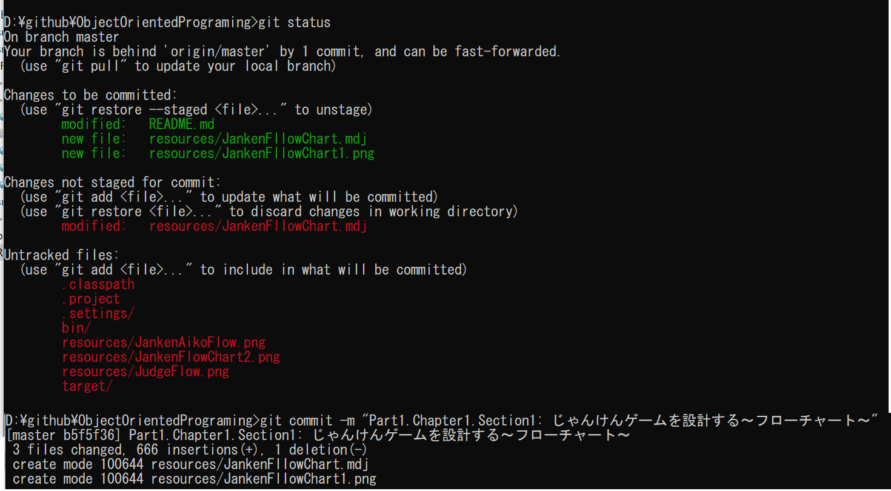
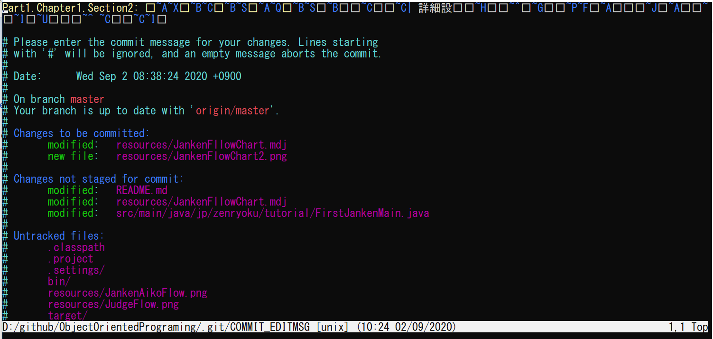

## Introduction
前提として、Gitをインストールしてリモート・リポジトリに接続した状態での実行を想定しています。

## Index
* [Git 初期化](#git-init)
* [Git Command](#git-command)

## Git Config
A． ```Authentication failed for``` がでるとき
1. コントロールパネル→ユーザーアカウント→資格情報マネージャー→Windows資格情報を開く
2. Web資格情報を選択
3. 対象リポジトリのURLをクリックし削除する
4. 再度クローンする
5. ユーザー名とパスワードを入力


## Git init
Git 初期化方法、リポジトリとして使用するディレクトリに移動して下のコマンドを叩きます。
ラズパイ上で実行してみました。ただし、一度初期化していたので「再初期化」になっています。

```
git init
```
## Git pull
リモートリポジトリからソースを取得します。[参考サイトはこちら](https://yu8mada.com/2018/06/07/how-to-use-git-s-pull-command/)
```
git pull <対象のURL>
```
＜実行結果＞


# Git Command
* log: [参考サイト](https://git-scm.com/book/ja/v2/Git-%E3%81%AE%E5%9F%BA%E6%9C%AC-%E3%82%B3%E3%83%9F%E3%83%83%E3%83%88%E5%B1%A5%E6%AD%B4%E3%81%AE%E9%96%B2%E8%A6%A7)
  ＜コマンドサンプル＞
  

* reset: [参考サイト](https://qiita.com/shuntaro_tamura/items/06281261d893acf049ed)
  --hard：コミット取り消した上でワークディレクトリの内容も書き換えたい場合に使用。
  --soft：ワークディレクトリの内容はそのままでコミットだけを取り消したい場合に使用。
    * HEAD^：直前のコミットを意味する。
    * HEAD~{n} ：n個前のコミットを意味する。
    * HEAD^やHEAD~{n}の代わりにコミットのハッシュ値を書いても良い。
    * gitのv1.8.5からは、「HEAD」のエイリアスとして「＠」が用意されている。
    * HEAD~とHEAD^と@^は同じ意味。
    * HEAD^^^とHEAD~3とHEAD~~~とHEAD~{3}と@^^^は同じ意味。
    ＜コマンドサンプル＞
    ```
    git reset --soft "HEAD^"
    ```
    

* status: 現在の状態を表示する上記キャプチャ参照
  ```
  git status
  ```

* commit: [参考サイト](https://www.atmarkit.co.jp/ait/articles/2003/19/news018.html)
  -m(--message): コミットコメントを設定する
  ＜コマンドサンプル＞
  ```
  git commit -m "Part1.Chapter1.Section1: じゃんけんゲームを設計する～フローチャート～"
  ```
  

  --amend: コミットした時のコメント内容を修正する
  ＜コマンドサンプル＞
  ```
  git commit --amend
  ```
  

* stash:変更した内容を一時的に退避させるのに使います
