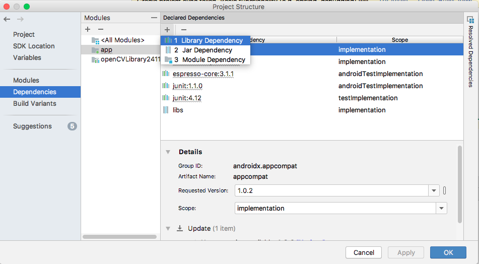

# AndroidでOpenCV
[参考サイト](https://android.jlelse.eu/a-beginners-guide-to-setting-up-opencv-android-library-on-android-studio-19794e220f3c): Android Pub

## Step 1: Download OpenCV Android Library
### ライブラリのダウンロード
1. [OpenCV + Android](https://docs.opencv.org/2.4/doc/tutorials/introduction/android_binary_package/O4A_SDK.html)のチュートリアルページを開きます。

2. そして、[OpenCV-android-sdk](https://sourceforge.net/projects/opencvlibrary/files/opencv-android/3.4.3/)をダウンロードします。ZIPファイルをAndroid開発用のフォルダに展開します。

## Step 2: Setup project
### プロジェクトの作成
1. Android Studioを開き、Emptyプロジェクトを作成する


2. プロジェクトの名前などを設定する


## Step 3: Import OpenCV Module
### OpenCVの取り込み
1. 作成したプロジェクトを開いた状態で、File -> New -> Import Moduleを選択する


2. プロジェクトの作成でダウンロード、展開した、ZIPファイルから「sdk/java」を指定する
  


3. モジュールをインポートしたらビルドが始まるがエラーになる


## Step 4: Fixing Gradle Sync Errors
### build.gradleファイルを修正する  

使用する実機がバージョン4.XだったのでminSdkVersion、targetSdkVersionを4に修正します。  


## Step 5: Add the OpenCV Dependency
  

### OpenCVの依存性追加
5. OpenCVライブラリの追加、ProjectStructure->Dependencies  





## Step 6: Add Native Libraries
### ネイティブライブラリをコピーする
1. OpenCVライブラリからAndroidプロジェクトのmainフォルダにペースト  
2. ペーストしたフォルダの名前を「jniLibs」に修正


## Step 7: Add Required Permissions
### AndroidManifest.xmlの修正
作成するプロジェクトのappフォルダにあるAndroidManifest.xmlに以下のコードを追記する
```
<uses-permission android:name="android.permission.CAMERA"/>

<uses-feature android:name="android.hardware.camera" android:required="false"/>
<uses-feature android:name="android.hardware.camera.autofocus" android:required="false"/>
<uses-feature android:name="android.hardware.camera.front" android:required="false"/>
<uses-feature android:name="android.hardware.camera.front.autofocus" android:required="false"/>
```

最終的に下のようなファイルになる
```
<?xml version="1.0" encoding="utf-8"?>
<manifest xmlns:android="http://schemas.android.com/apk/res/android"
    package="jp.zenryokuservice.androidopencv">

    <application
        android:allowBackup="true"
        android:icon="@mipmap/ic_launcher"
        android:label="@string/app_name"
        android:roundIcon="@mipmap/ic_launcher_round"
        android:supportsRtl="true"
        android:theme="@style/AppTheme">
        <activity android:name=".MainActivity">
            <intent-filter>
                <action android:name="android.intent.action.MAIN" />

                <category android:name="android.intent.category.LAUNCHER" />
            </intent-filter>
        </activity>
    </application>


    <uses-permission android:name="android.permission.CAMERA"/>

    <uses-feature android:name="android.hardware.camera" android:required="false"/>
    <uses-feature android:name="android.hardware.camera.autofocus" android:required="false"/>
    <uses-feature android:name="android.hardware.camera.front" android:required="false"/>
    <uses-feature android:name="android.hardware.camera.front.autofocus" android:required="false"/>
</manifest>
```

### adbコマンド準備
1. AndroidSDKのインストール場所を確認する
* File -> androidOtherSettings -> DefaultProjectStructure...

2. ターミナルを立ち上げて、パスを通す
* viコマンドで「.bash_profile」を開く
* sdk/platform-toolsを追加する  

