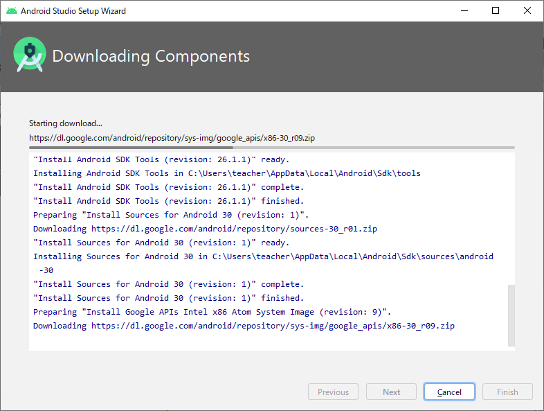
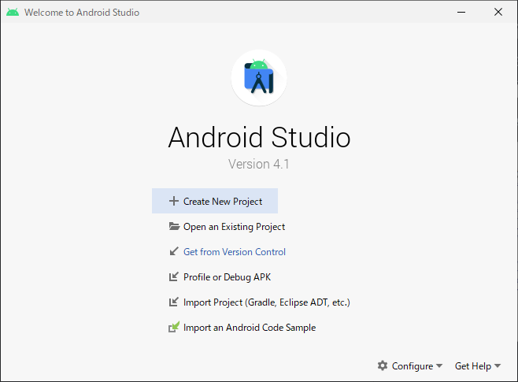
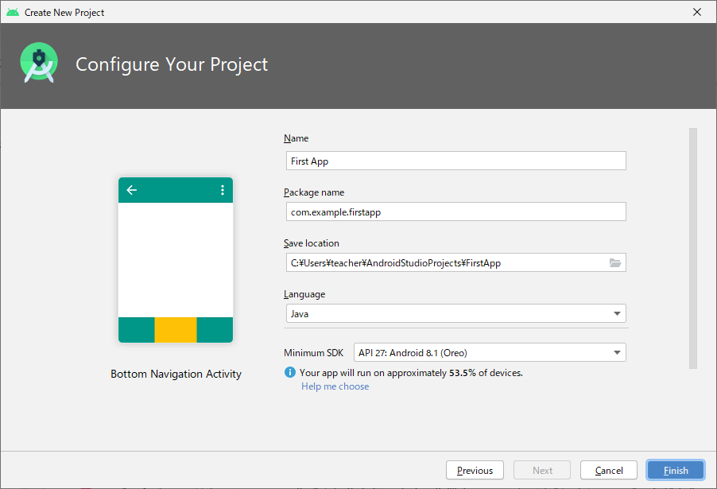
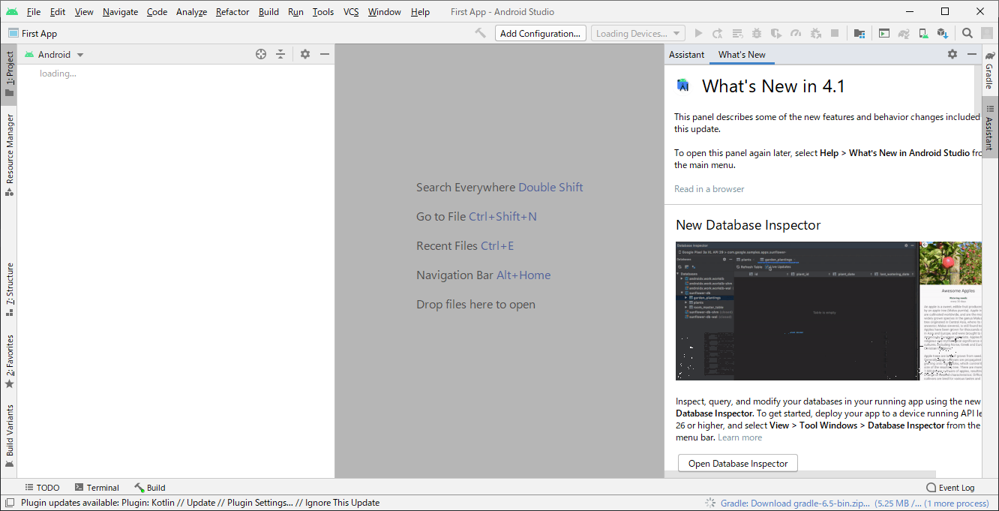
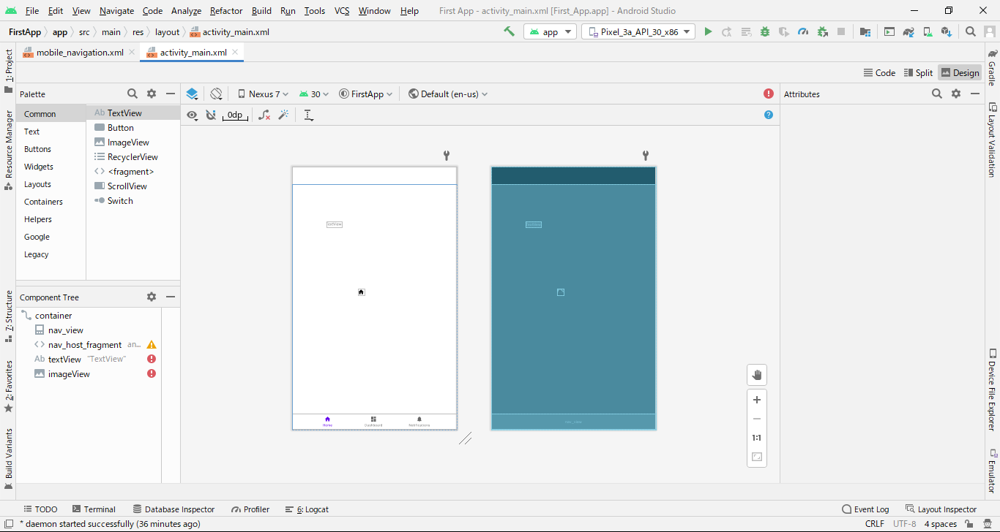
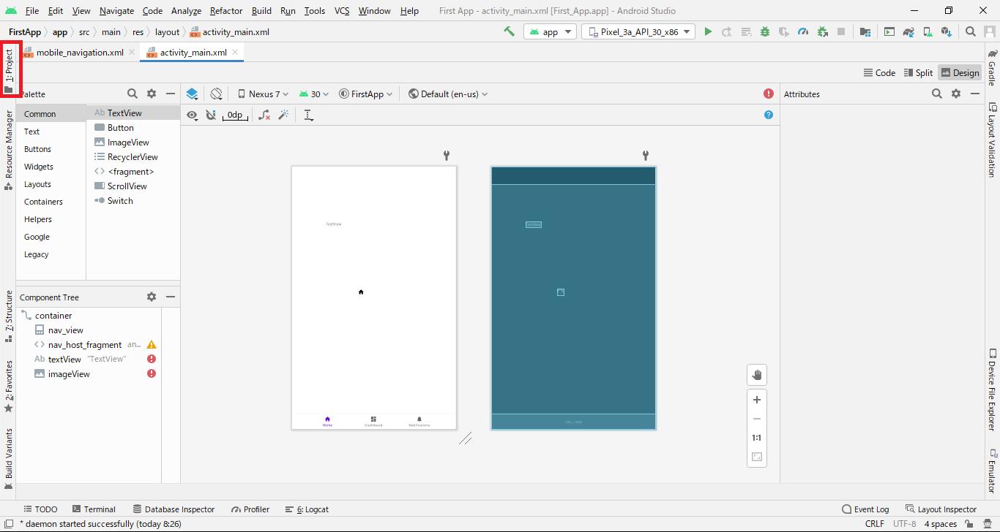
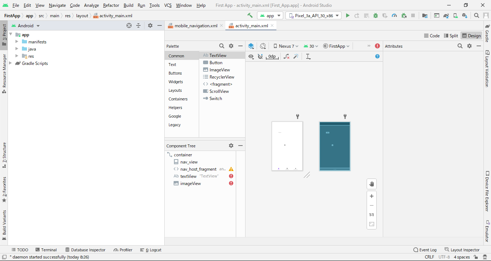

## Android Studioのインストール(Windows)
※結構重いので時間がかかる

1. [Androidのページ](https://developer.android.com/studio)からインストーラーをダウンロード
2. インストーラーを起動したら、そのまま次へを押下し続ける

3. インストール完了

## プロジェクト作成
Create New Projectを押下する

Gradleでのインストール処理などが走るので結構待つ。。。

## 初期画面
プロジェクトを作成して、起動したら下のような画面が表示されました。  
※バージョンにより変わるかもしれない

この状態は、画面の作成を行うためのものですが、開いているファイルは「**activity_main.xml**」でXMLファイルです。
具体的には、下のようなものです。

そして、プロジェクト(パッケージ)を開く場合は下の赤線で囲った部分をクリックします。

