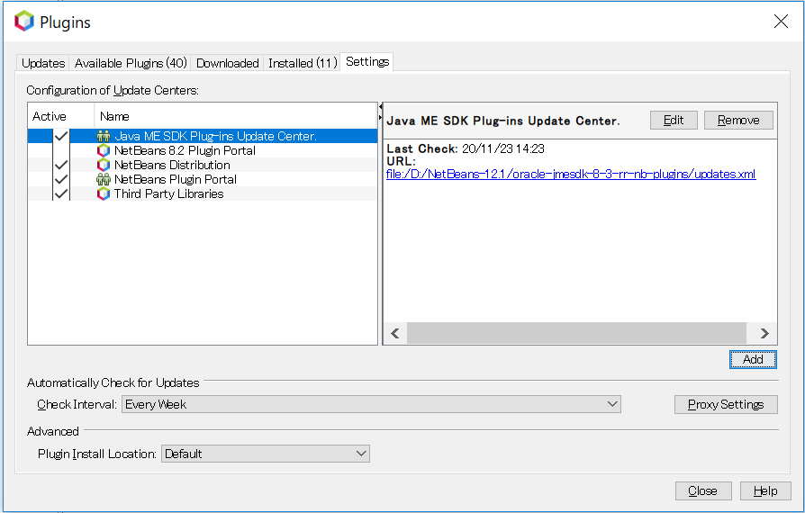

## Java ME Embedded Emulator
[こちらのページ](https://www.oracle.com/java/technologies/sdk-downloads.html)からダウンロードします。

自分の作業マシンはWindowsなので「oracle-jmesdk-8-3-1-rr-win-bin.exe」を選択しました。
そして、ダウンロードしてインストーラーを起動、特に問題もなくインストールできました。

インストール後は下のようなアイコンがデスクトップにできていると思います。

## NetBeansのインストール
まずは、環境変数「JAVA_HOME」が設定されていることを確認してください。

[こちらのページ](https://docs.oracle.com/javame/8.3/javame-dev-tool.htm)から必要なものをダウンロードできます。
そして、Windowsでの作業なので、[Apache-NetBeans-12.1-bin-windows-x64.exe](https://downloads.apache.org/netbeans/netbeans/12.1/Apache-NetBeans-12.1-bin-windows-x64.exe)をインストールします。

しかし、自分の場合はインストーラーが起動せず、下のようなメッセージが出ました。

なので、コマンドプロンプトから以下のようなコマンドでインストーラーを起動しました。

> Apache-NetBeans-12.1-bin-windows-x64.exe --javahome D:\Apps\jdk1.8.0_265

そして、問題なくインストーラーを起動

インストールした場所がデフォルトではありませんが、その他はデフォルトでインストールしました。
※インストール場所以外は、なにも変更しないでインストール

インストールするとデスクトップに以下のようなアイコンができると思います。

## NetBeansのセットアップ
JavaMEの[NetBeansでのセットアップ](https://docs.oracle.com/javame/8.3/sdk-dev-guide/java-me-embedded-application-projects-netbeans-ide.htm#MESDD146)を行います。

NetBeansを起動すると下のような画面が見れます。

文字が小さく見ずらいのでフォントサイズを変更しました。
・NetBeans自体のフォント
[このページ](http://wiki.netbeans.org/FaqFontSize)を参考にしました。
下のように実行時にパラメータを渡してやるようにする
ショートカットを右クリック -> プロパティ で開き、下のようにパラメータを渡す。

・エディタのフォント
1. 画面上部の Tools -> Options を選択します。
2. Fonts & Colorsのタブよりサイズを変更します。

・プラグインのインストール
1. [こちらのページから](https://www.oracle.com/java/technologies/sdk-downloads.html)プラグインをダウンロードします。(oracle-jmesdk-8-3-rr-nb-plugins.zip)

2. NetBeansの上部 Tools -> Plugins を開く

3. 「Settings」タブを開きAddボタンを押下

4. 上記でダウンロードしたプラグインを展開したあとのupates.xmlを指定する
> file///D:/NetBeans-12.1/oracle-jmesdk-8-3-rr-nb-plugins/updates.xml

5. Available Pluginsタブを選択しJava ME SDKを選択、インストール

6. Installedタブを確認してJava MEがあることを確認

7. 見つからない場合は下のように、「User Installed plugins」をチェック、インストール

8. NetBeansを再起動する

しかし、JavaMEのプラグインのインストールができず。。。

##
Tools -> Pluginから、Settingタブを開き、「NetBenas8.2 Portal」を選択
[PluginOK](./img/netbeansAddJavaME.png)

この方法で、JavaMEのプラグインがインストールできた。

[org-jdesktop-layout](http://137.254.56.27/nexus/content/groups/netbeans/org/netbeans/api/org-jdesktop-layout/RELEASE65/)

## プロジェクトの作成
参考にするページは[このページ](https://docs.oracle.com/javame/8.3/sdk-dev-guide/setting-development-environment.htm#MESDD120)です。各手順のリンクが集まっています。
File -> New Project　を選択して、「Java ME Embedded」がない時は上記の手順を見直してみてください。
うまくいくと下のように表示されます。

次へをクリックすると

なんやらエラーが出ています。調べてみるとJavaME SDKの構成が悪いようです。
カスタムする必要がありそうです。

