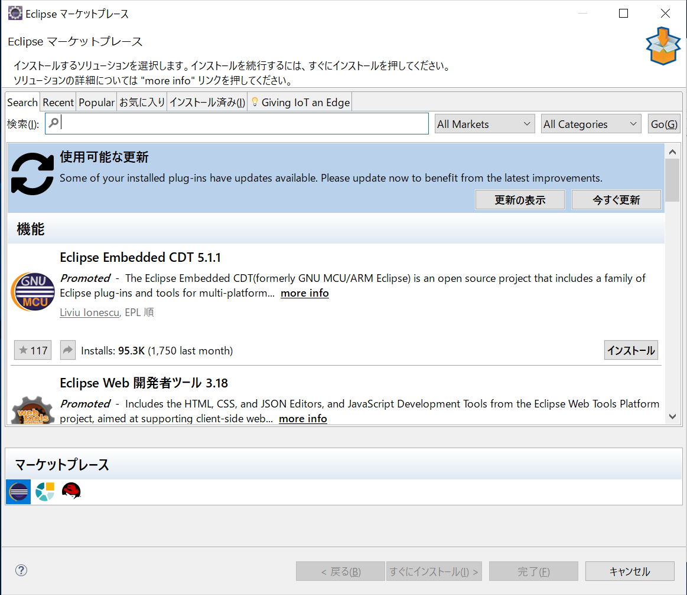
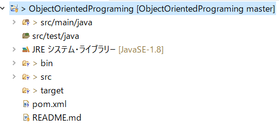

## Index
* [Eclipseのインストール](#install-eclipse)
* [Eclipseの起動](#execute-eclipse)
* [eclipseの設定](#setting-eclipse)
* [JUNITの設定](#setting-junit)

## Install Eclipse
[MergeDoc](https://mergedoc.osdn.jp/)からダウンロードします。


最新版のものを選択します。すると下のようにダウンロードするEclipseを選択できる部分が見つけられるので、迷ったら「Standerd Edition」を選択しましょう。細かいプラグインなどはいつでもインストールできます。


そして、ダウンロードが始まらない場合は、リンクの部分をクリックします。


今回は、「20200702.zip」というファイルをダウンロードしました。
ダウンロードしたら、Cドライブ直下(C:\)に解凍します。パスが長くなってEclipseが動かなくなる可能性があるためです。

ちなみに、自分の場合ZIPファイルの解凍ができなくてつまずきました。
７ZIPをインストールして実行したらうまくいきました。ちなみに解凍先は。「D:\\」です。なので解凍後は「D:\\pleiades」となりました。

##### Eclipseを動かす
試しに、eclipse.exeを起動してみてください。うまく動けばそれでよし。もし動かない場合はエラーメッセージが出るのでそれをちょっと眺めます。


早話が、「JDK(JRE)がないですよ！」というエラーです。JDKをダウンロードしてください。
解凍したフォルダにある「eclipse.ini」を開きバーチャルマシン＝JDKを設定します。(追記してください。)

ちなみにエラーログの場所は以下になります。
**WORKSPACE_HOME/.metadata/.log**
自分の環境だと以下になります。
> D:\pleiades\workspace\.metadata\.log

```
-vm
JAVA_HOME¥bin¥javaw.exe
```
#### JDKがない場合は
1. [OracleのHPから](https://www.oracle.com/java/technologies/javase-downloads.html)ダウンロードできます。※この場合はOracleのユーザー登録が必要です。


2. [OpenJDK](https://developers.redhat.com/products/openjdk/download)を開いてほしいバージョン番号(widows 64bit jdk8)を選択します。


3. eclipse.iniの設定を行う。
  * 使用するJVM(JDK)を指定します。
    ```
    -vm
    D:/Apps/jdk1.8.0_265/bin/javaw.exe
    ```
  * 使用するメモリの指定を行います。
    ```
    -vmargs
    -Xms512m # メモリの最小値
    -Xmx1024m # メモリの最大値
    ```
最終的に以下のようになりました。

```
-vm
D:/Apps/jdk1.8.0_265/bin/javaw.exe
-product
org.eclipse.epp.package.jee.product
--launcher.defaultAction
openFile
--launcher.appendVmargs
-vmargs
-Xms512m
-Xmx1024m
-Dosgi.requiredJavaVersion=1.8
-XX:+UseG1GC
-XX:+UseStringDeduplication
--add-modules=ALL-SYSTEM
-Dosgi.dataAreaRequiresExplicitInit=true
-Xverify:none
-javaagent:dropins/MergeDoc/eclipse/plugins/jp.sourceforge.mergedoc.pleiades/pleiades.jar
-javaagent:lombok.jar
```

しかし、これで終わりではありませんでした。JDKが32bit版だったようで下のようなエラーが出ました。


なので、[再度64ビット版をダウンロード](https://docs.aws.amazon.com/corretto/latest/corretto-8-ug/downloads-list.html)しました。amazonのページでした。

これで自分のところではEclipseの起動ができました。


## Setting Eclipse
Eclipseの設定を行います。
初めにEclipseを起動するとワークスペースの場所を聞かれます。
特に気にしないのであれば、そのままの値でワークスペースを作成して問題ありません。


そして、起動すると下のような画面が見れます。


**スペルチェック**


#### 不要なプラグインの削除
ヘッダーメニューから。。。
Help(ヘルプ) -> Market Place(マーケットプレイス)を開く
すると下のように、追加するプラグインを検索する画面が見れます。


そして、インストール済みのタブを選択します。


引き続き、不要なプラグインを選択


変更と表示されているプルダウンからアンインストールを選択し不要なプラグインを削除します。

更新(プラグインのアンインストール)を適用するのにEclipseの再起動を行います。


#### プロジェクトの作成From Github
Githubにあるリポジトリからプロジェクトを作成します。
まずは、Githubにて、プロジェクト用リポジトリを作成します。


そして、Codeとある部分をクリックすると下のようにダイアログが出ます。

ここからURLをコピーします。

今度はEclipseに戻り、プロジェクトのインポートを選択します。


すると、下のようなダイアログが開くので、Gitからプロジェクト(スマートインポートでもどちらでもよいが今回はスマートインポートを選択しました。)


次は、クローンを選択します。


そして、先ほどコピーしたGihubのリポジトリURLを貼り付け,
Githubのユーザーとパスワードを入力します。


「セキュアストアに保管」にチェックを入れると毎回入力しなくてよいです。

そして、間違いがなければ下のように対象になるブランチが表示されますので、次へ進みます。


クローンする場所(ローカルリポジトリ)は下のような場所に設定しました。サブモジュールのクローンにチェックを入れ忘れないようにしてください。　※今回は、サブモジュールがないので関係ありませんが。。。


クローンの完了です。


##### Javaのソース配置
ここまで来たらJavaコードを書きたいのですが、パッケージなどの配置先をどのようにするか？を決めないといけません。
とりあえず、プロジェクトがJavaプロジェクトになっていないのでMavenプロジェクトに変更し、パッケージ構成を作成します。


1. プロジェクトを右クリック
構成 > Mavenプロジェクトへ変換

2. 「src/main/java」と「src/test/java」というフォルダができるのでそれぞれ、メインの実装、テストクラスの実装用に使用する


3. パッケージを作成し、その配下にJavaソースを作成、とりあえずはHello Worldを実行して問題なくJavaを起動できることを確認


4. testフォルダを作成し、JUnitが起動できることを確認
pom.xmlファイルでエラーが出る時がある。
- * [CompilerException: 1.8.0_202は無効なターゲット・リリースです](./errors/MavenErrors.md)

## Setting Junit
JUNITの設定を行います、単純にjunit.jarをビルドパスにつなげるだけです。
しかし、ライブラリがあるのでそれを設定するほうが楽です。
1. **プロジェクトを右クリック -> プロパティ、もしくはAlt + Enterでプロジェクトの設定を開きます。**


2. ライブラリの追加をクリック


3. JUnitを選択(選択後の画像です)


4. JUnit追加後

プロジェクトにJUnitが追加されています。

