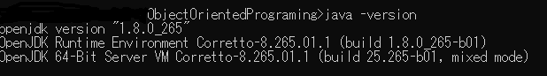

# Maven起動時に出たエラー一覧

#### CompilerException: 1.8.0_202は無効なターゲット・リリースです
> [ERROR] Failed to execute goal org.apache.maven.plugins:maven-compiler-plugin:3.6.1:compile (default-compile) on project ObjectOrientedPrograming: Fatal error compiling: 1.8.0_202は無効なターゲット・リリースです -> [Help 1]
org.apache.maven.lifecycle.LifecycleExecutionException: Failed to execute goal org.apache.maven.plugins:maven-compiler-plugin:3.6.1:compile (default-compile) on project ObjectOrientedPrograming: Fatal error compiling

このエラーは、JDKの指定がよろしくないとエラーメッセージが出ています。
#### 対処法
1. JAVA_HOMEに指定しているJDKのバージョンを確認する  


2. pom.xmlのファイルに指定した。プラグインのバージョンを確認する。
```
<plugin>
    <groupId>org.apache.maven.plugins</groupId>
    <artifactId>maven-compiler-plugin</artifactId>
    <version>3.6.1</version>
    <configuration>
        <!-- この部分が対応しているか確認(JDK1.8なら以下の設定) -->
        <source>1.8</source>
        <target>1.8</target>
    </configuration>
</plugin>
```
