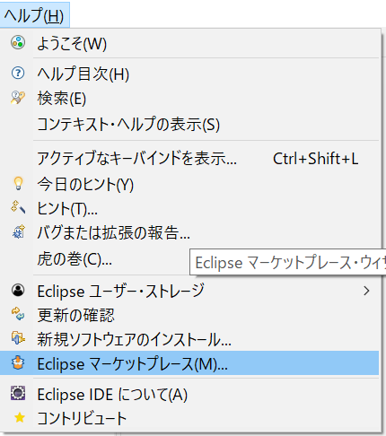
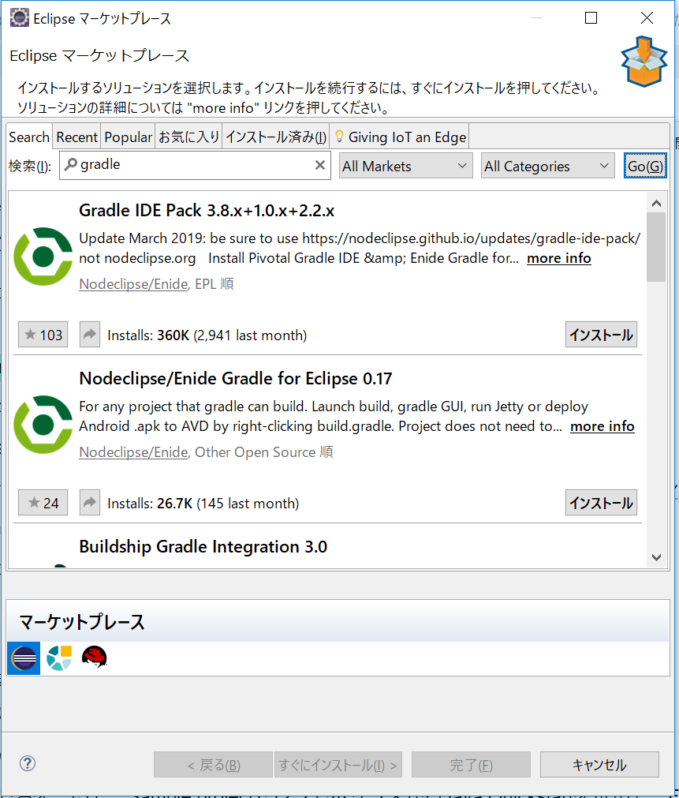
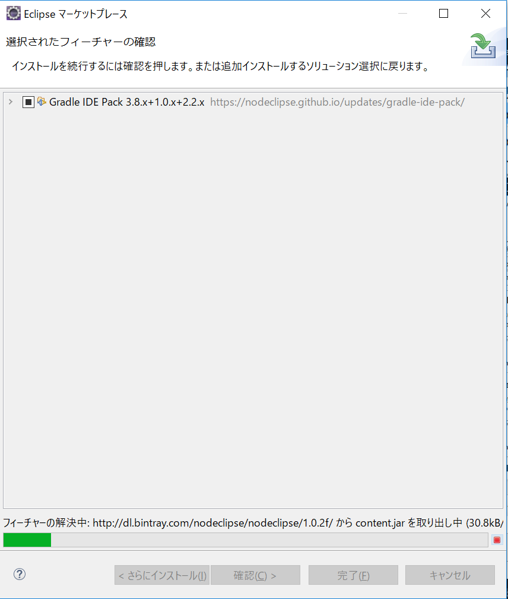
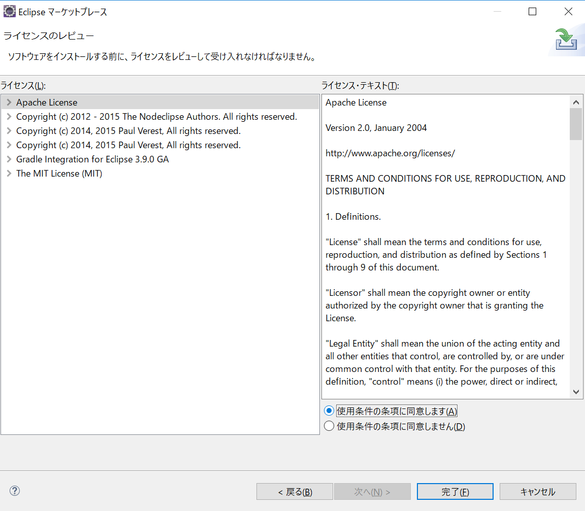
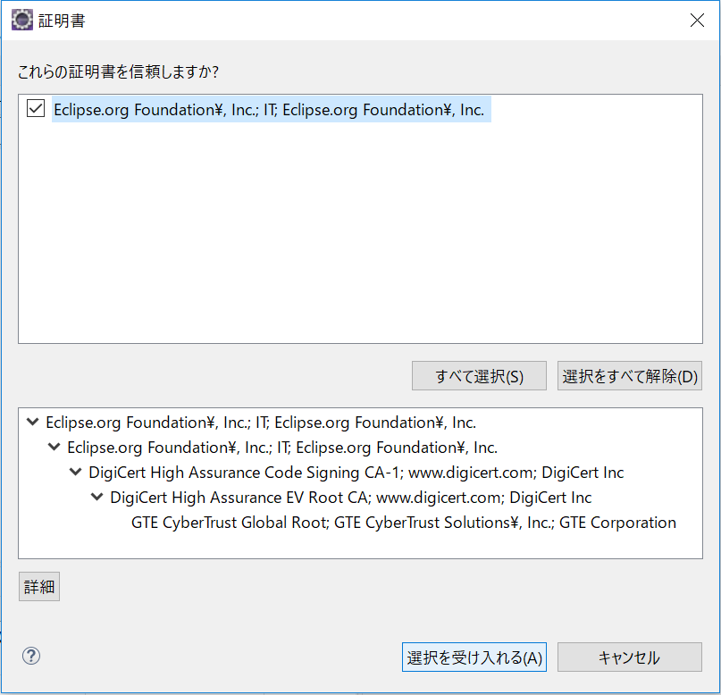

# Gradleの設定
流行りもあるので今回はGradleを導入してみようと思います。

**Gradle**
参考サイト:
* [日本語訳のサイト](http://gradle.monochromeroad.com/docs/userguide/userguide.html)
* [buildShip](https://github.com/eclipse/buildship/wiki/Migration-guide-from-STS-Gradle-to-Buildship)

Eclipseで使用するのには、とりあえずプラグインで行うようです。
1. Help > Eclipse Marketplace > SearchでGradleと入力

2. 検索部分に「gradle」と入力してGo

3. 検索結果のGradle IDE　Packをインストール
 ※すべてそのまま次へでOK
4. ライセンスに同意、OKします。
 
5. これも同様にOK

最後に再起動の確認ダイアログが出るのでこれもOK

そして、再起動したときにエラーが出たのですが、何度か起動したら治りました。ナゾな感じです。
