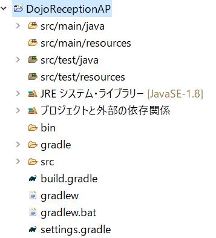

## Gradle Tutorial
参考サイト
* [Gradleのユーザーガイド](http://gradle.monochromeroad.com/docs/userguide/userguide.html)

# Exlipse + Gradle
EclipseでGradleのプロジェクトを作成して実行して見ました。

1. Eclipseのぱっけエクスプローラーで右クリックして「新規」⇒「Gradleプロジェクト」を選択

2. ダイアログが開くのでプロジェクト名を入力して「完了」

3. 下のような感じでプロジェクトの作成処理が走ります。

4. そしてプロジェクトが作成されると下のように表示されます。今回は「DojoReception」というプロジェクト名にしました。

しかし、作成したときのプロジェクト名がそのままパッケージ名になってしまうので、後々に変更することにします。
⇒Gradleの使い方とか常識とかがわからないので。。。
