# MAMPでウェブサーバー(for Windows)
ワードプレスを使用してレンタルサーバーを運用しているので、
テスト環境として、自分のPC上にレンタルサーバーと同じような環境を構築しようと考えました。

[MAC版の記事はこちら](https://zenryokuservice.com/wp/2020/01/01/mamp-%e8%b5%b7%e5%8b%95%e8%a8%ad%e5%ae%9a-%e3%80%9cwordpress%e3%81%ae%e3%83%86%e3%82%b9%e3%83%88%e7%92%b0%e5%a2%83%e3%82%92%e4%bd%9c%e3%82%8b%e3%80%9c/)に記載しています。

## インストーラーのダウンロード

## インストール
1. ダウンロードしたファイルを起動します。次へをクリック
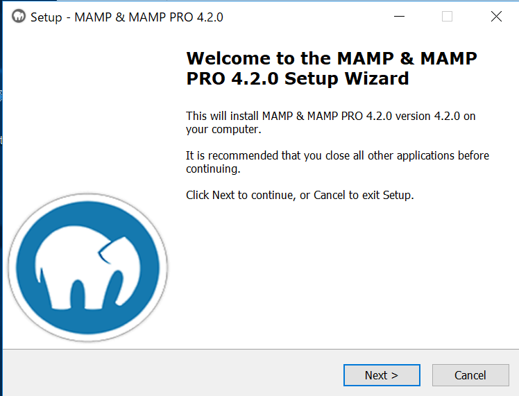

2. プロ(有償)は使用しないのでチェックを外します。次へをクリック
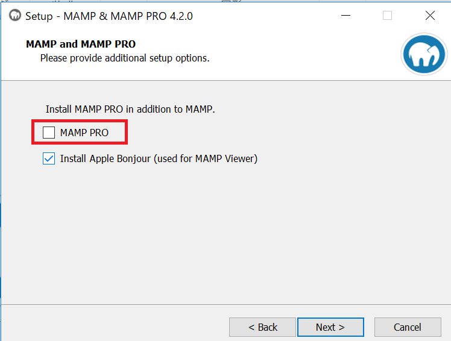

3. ライセンス条項に同意します。
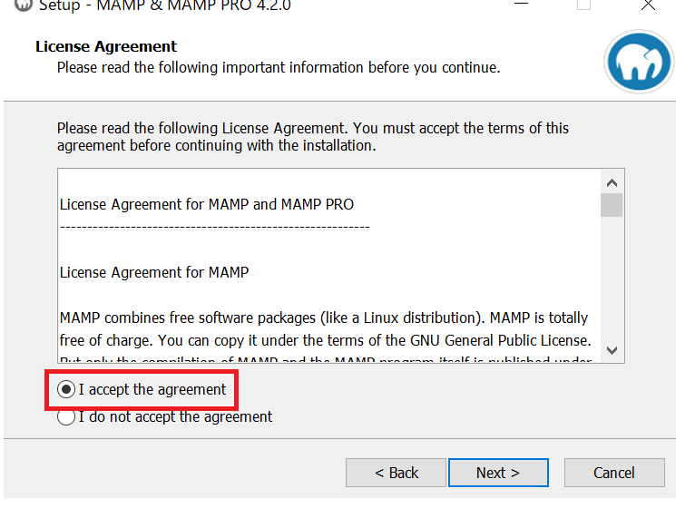

4. インストール先を指定します。
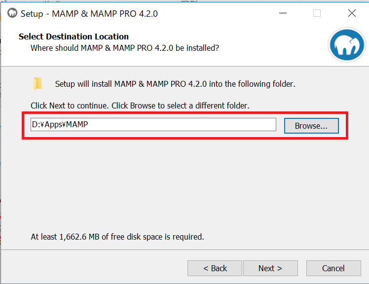

5. そのまま次へをクリック
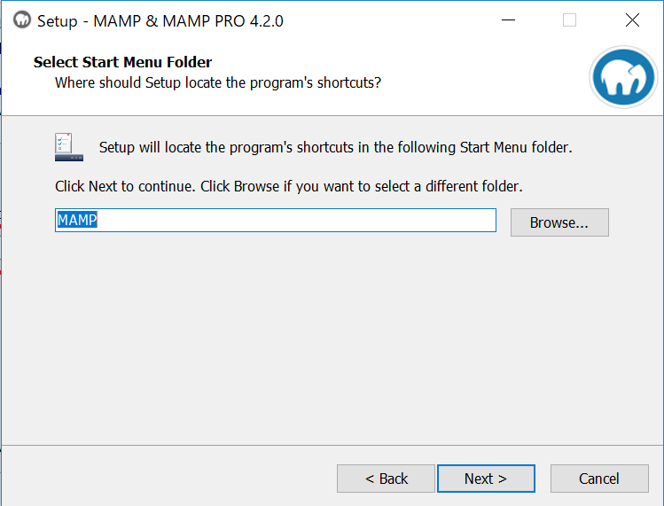

6. 同様に次へをクリック
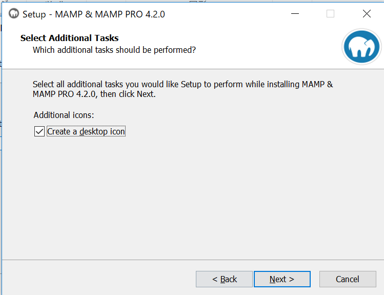

7. インストールのボタンが見えるのでそれをクリック

※インストール時にエラーが出ることがありましたが、これはダウンロードの失敗のようなので、Try ageinで再度行えば解消できるようです。しかし、それでもダメな場合は、インストーラを再度ダウンロードしてやり直してみてください。

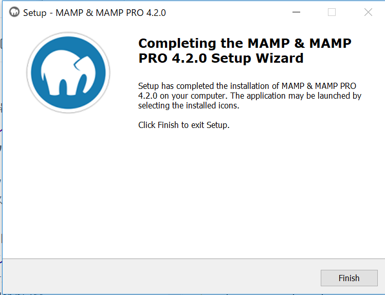
## サーバーの設定
1. MAMPを起動すると下のような画面が見れますので、環境設定を選択します。
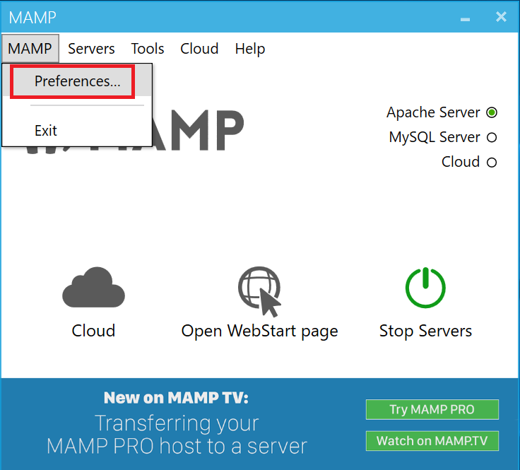

2. そしてドキュメントルート、サーバーを起動したときにURLでアクセスできるディレクトリのルートです。
具体的には、localhost:8080でアクセスしたときにindex.phpが開けると思いますが、このファイルが置いてあるディレクトリのことです。
このドキュメントルートを指定します。
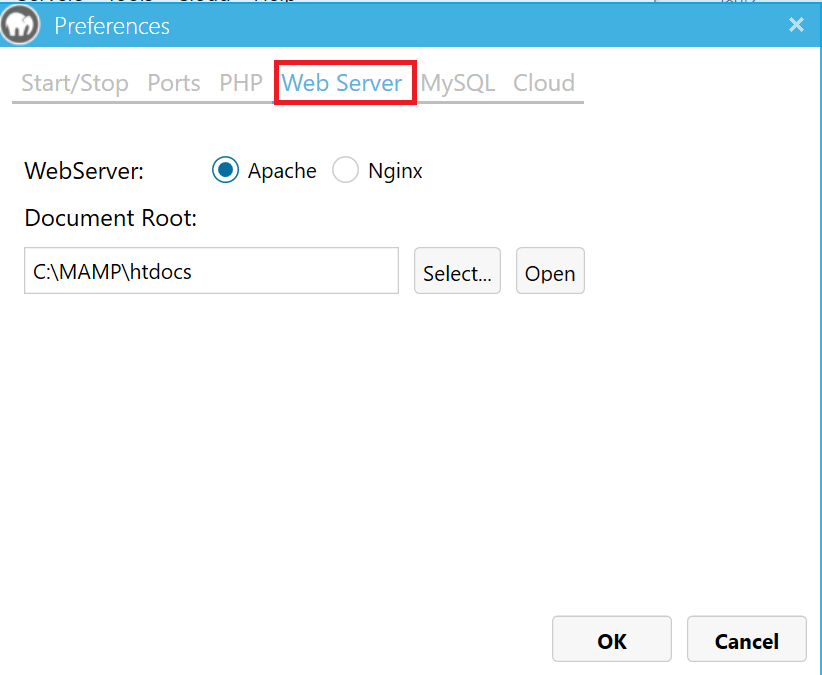
指定したときの例

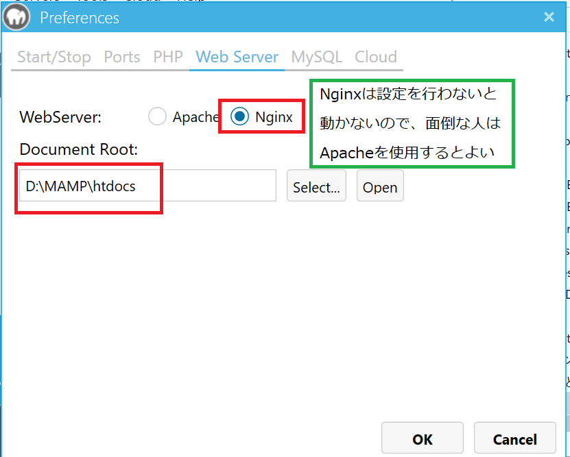
3. サーバーが起動するようです。※Nginxを使用するときは設定する項目が多くなるので、起動しませんでした。
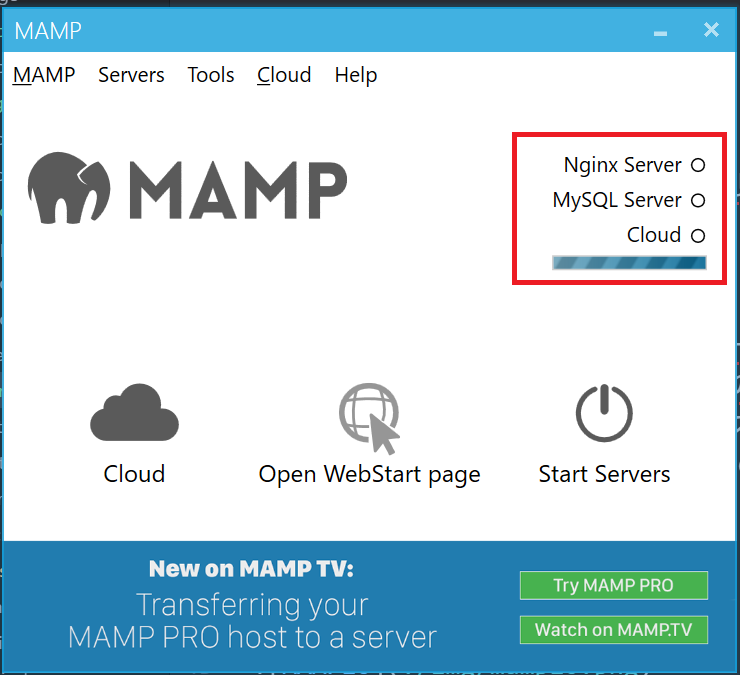

4. サーバーが起動したら、ブラウザで、localhost:80にアクセスしてみましょう
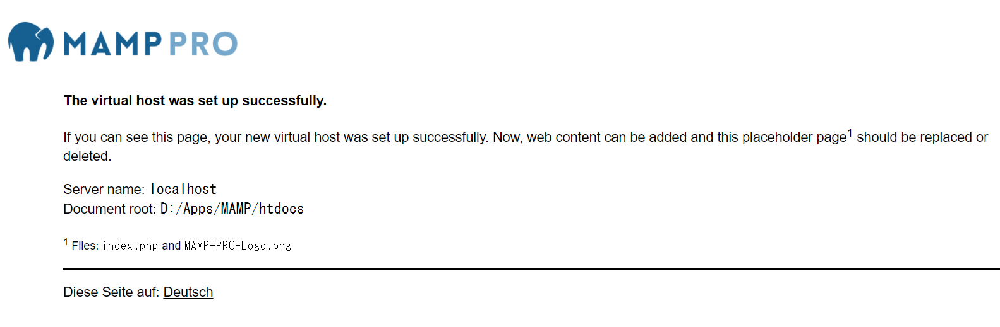
