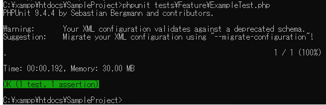

# PHPUnit
## インストール
1. [PHPUnitのダウンロード](https://phar.phpunit.de/phpunit.phar)を行う
2. ダウンロードした.pharファイルをXAMPPのPHP実行パス（C:\xampp\php\）直下へコピー
3. phpunit.batというテキストファイルを作る
-  テキストエディタを開き、``` @php "%~dp0phpunit.phar" %* ``` を記述
-  コマンドプロンプトを開き ``` phpunit --version ``` と入力


## PHPUnitの実行
PHPUnitのバージョン確認が出来たら、phpunit.xmlファイルのあるディレクトリで
次のようなコマンドを実行する ``` phpunit テストPHPのあるディレクトリまでのパス\テストファイル.php ```

