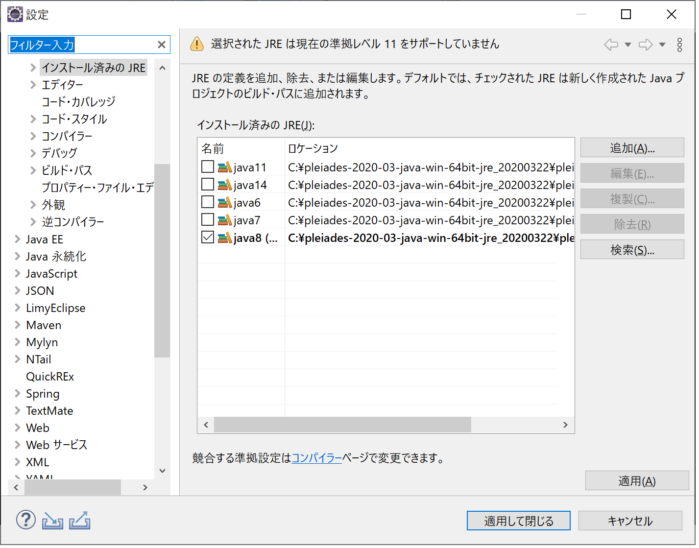
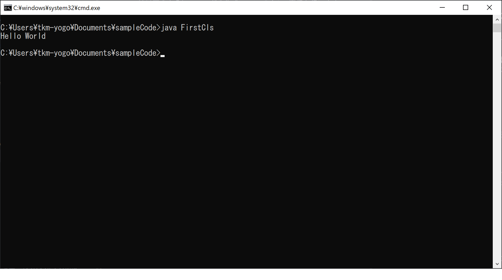

# 1章：ようこそJavaの世界へ
## 1.1 Javaによる開発の基礎知識

プログラムの書き方１------------------------------------------------------------------------------

### 1.1.1 開発の流れ
**①ソースコードの作成。**
```
public class FirstCls {
  public static void main(String[] args) {
    System.out.println("Hello World");
  }
}
```

**②コンパイル**
javaファイルをclassファイルに変換することです。下のコマンドを使用します。
```
javac FirstCls.java
```

**③実行**
作成したクラスファイルを実行します。下のコマンドを使用します。
```
java FirstCls
```

### 1.1.2 開発環境の整備
※Eclipseはインストール済みの想定。

#### 外観を変更する
1. **ウィンドウ→設定→一般→外観→色とテーマ**の順にクリック
2. ここで好きなテーマを選択する
※大半の人がデフォルトで使用している


#### 文字コードの変更(確認)
1. **ウィンドウ→設定→一般→ワークスペース**の順にクリック
2. 「テキスト・ファイル・エンコード」がUTF-8になっていることを確認

#### JDKの確認
1. **ウィンドウ→設定→一般→Java→インストール済みのJRE**の順にクリック
2. JDKを指定して、使用するJREを決定する


## 1.2 Javaプログラムの基本構造
### 1.2.1 プログラムの骨格
**ルール：クラス名とファイル名は同じ名前にする**
「クラスの中にメソッドがある」

```
/** クラスの説明 */
public class クラス名 {
  /** メソッドの説明 */
  public static void main(String[] args) {
    // 何かしらの処理
  }
}
```
* 中かっこ(「{」「}」)のことを「スコープ」と呼びます。スコープで囲っている部分を「ブロック」などと呼んだりします。

* この**スコープ(=「ブロック」)を開いたら(開始したら)、必ず閉じる(終了する)**ことを意識する

* 中かっこ(「{」「}」)で囲っている部分がそれぞれクラスの範囲、メソッドの範囲を決めている

上のサンプルコードでは「クラス名」クラスの中に「メインメソッド」がある

ちなみに、インデント(スペースやタブで位置をずらすこと)を入れないと、とても見にくい

何が見にくいというと、クラスの範囲と、メソッドの範囲を区別しずらいのです。

＜インデントなし＞
```
/** クラスの説明 */
public class クラス名 {
/** メソッドの説明 */
public static void main(String[] args) {
// 何かしらの処理
}
}
```
### 1.2.2 プログラムの書き方
Java言語(C言語も)の場合は、メインメソッドが起動しますので、クラスの中にメインメソッドを作成する
> Javaはメインメソッドが動く

1. どのようなプログラムを作りたいかを考えます。
2. プログラムの名前を決めます。
3. 「クラス名.java」という名前でファイルを作ります。
4. 下のような、ソースコードの外側を記述します。
```
/** クラスのJavaDocコメント */
public class クラス名 {
  /** メインメソッドのJavaDocコメント */
  public static void main(String[] args) {
    // 処理の中身：通常のコメント
    /*
     * これも通常のコメント、あまり使われない。
     */
  }
}
```
5. ソースコードの中身を描きます。
```
System.out.println("Hello World!");
```
##　1.2.5 mainメソッドの中身

* 上の骨格の「何かしらの処理」の部分に処理を描く。
* 処理は上から下へ進み、1行の中では左から右へ進む
* セミコロン「;」で1行が終わる
* ドット「．」は参照呼出し

```
public static void main(String[] args) {
  System.out.println("Hello World");
}
```
上のコードは、[System](https://docs.oracle.com/javase/jp/8/docs/api/java/lang/System.html)クラスから変数「out」を呼び出し、メソッド「println()」を呼び出している

#### 練習：SecondProgram
写してください。以下のコードを書いて動かしてください。

```
public class SecondCls {
  public static void main(String[] args) {
    System.out.println("*** Second Program ***");
    System.out.println("日記ソフト");
    System.out.println("終了します。");
  }
}
```

実行方法は以下の通り
1. SecondCls.javaファイルを作成する

2. 「ウィンドウズボタン＋R」を押下してコマンドプロンプトを開く


2. javacコマンドでクラスファイルを作成する  
    ```
    javac SecondCls.java
    ```

3. javaコマンドで作成したクラスファイルを事項する  
    ```
    java SecondCls
    ```

プログラムの書き方２------------------------------------------------------------------------------
## 1.3 変数宣言の文
### 1.3.1 変数宣言の文とは？
ズバリ下のように書きます。
1. 変数の宣言
```
// 「宣言」：データ型 変数名;
int hensuMei;
```
2. 変数の初期化
```
// 「初期化」データ型 変数名 = 代入するデータ
int dataGata = 0;
```


１と２の違いは、**宣言と同時に値を代入するかしないか**です。

**==変数の宣言と初期化==**
```
public static void main(String[] args) {
  // 変数の宣言
  int num;
  // 変数の代入
  num = 0;
  // 変数の初期化
  int age = 12;
  // 命令実行の文＝メソッドの呼び出し
  System.out.println("対象年齢は" + num + "～" + age + "です。");
}
```
* 「変数に値を代入するとき」は「=」を使用する。
* 「命令の文」は「メソッド呼び出し」を行う

### 1.3.2 変数の名前(識別子)
**==英語では==**  
変数＝Valiable

名前つけのルール
1. 予約語は使用しない
|     |     |     |     |     |
| --- | --- | --- | --- | --- |
| abstract | assert | boolean | break | byte |
| case | catch | char | class | const |
| continue | default | do | double | else |
| enum | extends | final | finally | float |
| for | goto | if | implements | import |
| instanceof | int | interface | long | native |
| new | package | private | protected | public |
| return | short | static | strictfp | super |
| switch | synchrnized | this | throw | throws |
| transient | try | void | volatile | while |

2. 宣言(初期化)済みの変数名は使用できない

3. 大文字・小文字は区別される

4. 変数名・メソッド名はキャメルケースを使用する
```
// 変数名のキャメルケース(頭を小文字にする)
int myAge;
// メソッド名のキャメルケース(頭を小文字にする)
public void methodName();
```

5. クラス名はアッパーキャメルケース
```
/** クラス名は頭を大文字にする */
public class ClassName {
}
```

6. 演算子で使用している文字、予約語は変数名(クラス名)として使用できない

**==計算処理==**
```
public static void main(String[] args) {
  // 足し算
  int tashizan = 1 + 1;
  // 引き算
  int hikizan = 1-1;
  // 掛け算
  int kakezan = 1 * 1;
  // 割り算
  int warizan = 1 / 1;
}
```

### 1.3.3 データ型
※あくまでも使用例として紹介しています。
**==プリミティブ型データの変数型==**
* **byte** ファイル・ネットワーク通信時に使用
* ＞**int** 整数データを格納するのに使用
* **long** 大きな整数値を格納するのに使用
* **float** 画像処理、3Dモデル描画時に使用
* ＞**double** 少数データを格納するのに使用
* **char** 1文字分のデータ、シングルクォーテーション「\`」で囲む

**==参照型データの変数型==**
* **String** 文字列
* そのほかJavaAPIや自作のクラス名
```
List<String> list; // List型の変数「list」
```

### 1.3.5 定数の利用
**変数には値を何度でも代入できる**ので、定数を使用して値を変更できないようにする。
```
final データ型 変数名 = 代入するデータ
```
**ルール：定数は大文字の変数名にする**
```
final int OVER_TEN = 0; // 値が10以上を示すフラグ
final int UNDER_TEN = 1; // 値が10以下を示すフラグ

```
#### 定数の使用例：フラグに使う
```
public static void main(String[] args) {

}
```

## 1.5 練習問題＋α
コマンドプロンプト上に下のような図を表示するプログラムを作成してください。
※ 「=」の数が、上下ともに20あります。
＜出力する図＞
====================
          *
        *   *
      *   *   *
          *
          *
      *   *   *
        *   *
          *
====================
