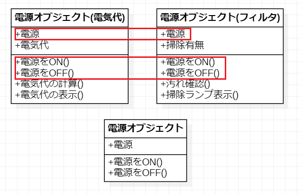

# オブジェクト指向コンセプト
## なぜオブジェクト指向か
### システム開発における課題
#### 開発期間の短縮
顧客の要求やサービスは、早いサイクルで変化します。そのためシステム開発に多くの時間を  
かける余裕がありません。それどころか、開発が進んでいる最中に、要求やサービスの内容が  
変わっても期間内の対応が求められます。  

つまり、仕様変更があっても開発期間が変わらないので、多くの開発者が会社にお泊りすることが  
多々ありました。

#### == 例 ==
開発期間：4/20 - 10/20 -> 半年間（６ヶ月）
設計：4/20 - 6/20
実装：6/21 - 8/20
テスト：8/21 - 10/20

上のようなスケジュールで、仕様変更は多々起きますが、

#### 実装している段階(6/30)に仕様変更が入った場合
仕様変更部分が初めからやり直しになります。具体的には下のようになります。
＜仕様変更しない部分＞
設計：4/20 - 6/20
実装：6/21 - 8/20
テスト：8/21 - 10/20

＜仕様変更部分＞
設計：6/30 - 6/20 -> 過ぎているので、なるべく早く実施
実装：6/21 - 8/20 -> 6/30 - 8/20
テスト：8/21 - 10/20


#### システムの仕様変更に伴うコストの削減
前述の通り、開発途中で顧客の要求する内容が変わることもありますが、そのたびに初めから  
作成していては、期間が延びるだけでなく、費用がかさみます。顧客は最小コストで最大限の  
成果を期待します。


この様な問題点に対応するためには、システム開発において、次のことを実現するべきです。

#### 実現するべきこと

1. 以前に作成したプログラムを再利用する
2. 大勢のエンジニアで共同開発を行う
3. プログラムの変更箇所をいち早く特定し対応する
4. あるプログラムの変更がほかのプログラムに影響しないようにする

もし、巨大な1本のプログラムとして構築したら、これらを実現するのは、困難です。しかし、システムを管理しやすい単位で分割し、それらを組み合わせる形式で構築すれば、これらを実現することができます。

この分割の単位をオブジェクトとするのが、オブジェクト指向による開発です。

具体的に、アジャイル開発というのが主流になってきていますが、これは、オブジェクト指向が理解できた上で行うべき開発方法です。

<br/>
<br/>
<br/>
<br/>
<br/>
<br/>

## オブジェクトとは
それでは、システム分割単位である「オブジェクト」とは、いったいどのようなものでしょうか。  
ここでは、「エアコン」を制御するプログラムを例にそれを見ていきます。

下の図ではエアコンが持つ情報や機能を書きだしたものです。「電源」は電源の情報(状態)、「設定温度」や「運転モード」は使う人が操作した情報(状態)を示すものです。
一方、「電源をON(あるいはOFF)にする」「運転モードを切り替える」「設定温度を変更する」などは、エアコンを操作するための機能です。
### エアコンを例にすると。。。

##### ＜エアコンの場合＞

***
表１＜エアコンの制御プログラム＞

| 係(役目) | 情報(状態) | 機能 |
| ------- | --------- | ---- |
| 電源係   | 電源      | 電源をON、OFFにする |
| 温度係　   | 設定温度      | 設定温度の変更 |
| 温度係　   | 現在の室温      | 現在の室温を測る |
| 運転係　   | 運転モード      | 運転モードを切り替える |
| 運転係　   | 運転モード      | 温度差によって動作を変える |

***
エアコンを制御するプログラムは、こうした情報(状態)を保持し、参照しつつ使う人の操作に応じてエアコンをどうさせます。
##### ＜ポイント＞
情報(状態)と機能は密接にむずびついて1つの係・役割を担い、それ以外の情報(状態), 機能から互いに独立しているということです。
そして、エアコンが操作されるとそれぞれの係は、互いに要求を行い、連携して動作します。

##### 運転モードの着替え時の場合
運転モードを「冷房」から「ドライ」に変更する操作が行われたら、「運転係」から「温度係」へ設定温度の変更をする「要求」が行われます。また、「運転係」は現在の室温と設定温度を確認しないと動作(冷やす、温める)を決められないので、「温度係」にそれらの情報(状態)を問い合わせます。

この場合、**「係」に相当するのが、システムにおけるオブジェクトです**。
また、「温度係」が電源のON/OFFを切り替えたり、「運転係」が設定温度を変更したりしません。
それぞれの係は自分のすべきことが明確に分かれています(**独立性**)。

子の係の独立性のおかげで、オブジェクト指向による開発では、作業もオブジェクトごとに独立して進めることができます。開発を終えたオブジェクトは、他のオブジェクトから簡単に利用することができます。また、おかしな動作を押する箇所が出ても、オブジェクト単位で調査・修正するので、利用しているオブジェクトへの影響を軽減することができます。
これにより上記の**実現するべき**点をかなえることが得できます。

## オブジェクト指向言語の機能
### 属性と操作
Java言語を使用した場合、オブジェクトをどのように表現するのか見ていきましょう。ここでもエアコンの制御プログラムを例に確認します。

先ほどの表(下の図)を見ながら読み進めてください。

***
表１＜エアコンの制御プログラム＞

| 係(役目) | 情報(状態) | 機能 |
| ------- | --------- | ---- |
| 電源係   | 電源      | 電源をON、OFFにする |
| 温度係　   | 設定温度      | 設定温度の変更 |
| 温度係　   | 現在の室温      | 現在の室温を測る |
| 運転係　   | 運転モード      | 運転モードを切り替える |
| 運転係　   | 運転モード      | 温度差によって動作を変える |

***

前節では、係がオブジェクトに相当することを説明しました。さらにオブジェクト指向では、上の図
にある**情報(状態)のことを属性**と呼び**機能のことを操作**と呼びます。
例えば、電源系(電源オブジェクト)は「電源」という属性と「電源をONにする」「電源をOFFにする」
という操作が一つのセットにな手出来ています。
温度係(温度オブジェクト)も運転係(運転オブジェクト)も同様です。

つまり、オブジェクトは**属性と操作を一体化する**ことで表現されます。

#### 属性と操作
属性と操作について詳しく見ていきましょう。属性は変数として、表現され、名前と値を持ちます。

* 属性「室内温度」⇒値「30度」
* 属性「設定温度」⇒値「27度」

**属性をプログラムで表現する場合の例**

```
/** 温度係 */
public class Temparature {
  /** 室内温度 */
  int roomTemparature;
  /** 設定温度 */
  int settingTemparature;

　/** コンストラクタ */
  public Temparature() {
    // 例なのでコンストラクタで値を設定する
    roomTemparature = 30;
    settingTemparature = 27;
  }  
}
```

操作は、他のオブジェクトや自分自身(自オブジェクト)から呼び出されることにより動作し、
そのオブジェクトの状態を変えたり、さらにそこからほかのオブジェクトの操作を呼び出したり
できます。下の図Aでは、温度オブジェクトに「設定温度を変更する」という操作(メソッド)
が定義されています。エアコンの設定温度を変更したい場合には、属性へ直接悪背うするのではなく
この操作を呼び出します。

**図A**


**属性と操作をプログラムで表現する場合の例**

```
/** 温度係 */
public class Temparature {
  /** 室内温度 */
  int roomTemparature;
  /** 設定温度 */
  int settingTemparature;

　/** コンストラクタ */
  public Temparature() {
    // 例なのでコンストラクタで値を設定する
    roomTemparature = 30;
    settingTemparature = 27;
  }

  /** 設定温度を変更する */
  public void setSettingTemparature(int setTamparature) {
    this.setTamparature = setTamparature;
  }
}
```

## カプセル化とデータ隠蔽
オブジェクト指向では、そのオブジェクトが持つ属性と操作を一体化して表現すると説明しましたが、
これを**カプセル化**と呼びます。

カプセル化には次のようなメリットがあります。
1. オブジェクトの内部構造を知る必要がない
2. 属性値の変更は、操作経由に制限できる
3. 操作名が同じなら、内部構造が変わっても利用する側にそれを意識させない
4. 属性に不整合な値が入らないよう、操作でチェックできる

エアコンの温度オブジェクトで、カプセル化のメリットを見ていきましょう。

エアコンの設定温度を変更する場合、リモコンなどから、エアコンの「設定温度を変更する」機能
を呼び出します。この時、エアコンの内部構造や制御プログラムなどを知る必要はありません(1)。

そして、それらに直接触れることもありません。ただリモコンで操作するだけです(2)。

もし、後継機種などで「設定温度を変更する」機能の仕組みが変わっても、操作方法が同じなら
そのことで困ることはないでしょう(3)。

さらに温度設定を100度にしたり、零下40度したりはできません。「設定温度を変更する」が、
そのような設定を受け入れないからです(4)。

また、2, 4により、属性を外部から保護することを**データの隠蔽**と呼びます。

**図B**


## クラスと継承
### クラス
今度は、電源オブジェクトについてみていきます。
前述では、伝げのぶじぇくとの情報(状態)として「電源」、機能として「電源をONにする」と
「電源をOFFにする」を取り上げました。しかし、エアコンの種類によっては、電源をつけると
電気代を表示する機能や、フィルタの汚れ具合を確認し掃除ランプを表示する機能がついている
ものもあります。
これらすべてを電源オブジェクトとして表現したとき、「共通している属性や機能」と
「独自に持っている属性や機能」とに分けられます。

まず、この共通している部分に着目し、土台となるひな型を作成します。
この作業を抽象化と呼びます。また抽象化した結果、オブジェクトを作成するための土台となる
**ひな型をクラス**と呼びます。

下の図は電源オブジェクト(電気代), 電源オブジェクト(フィルタ)の属性と機能をそれぞれ洗い出した
結果、共通項目が見つかった様子を表しています。

**図C**


こうしたオブジェクトの共通項目を集め、定義した門が一般的な「電源」クラスとなります。

## インスタンス化
クラスは、オブジェクトを作詞得するためのひな型です。つまり設計図にすぎません。
「電源」の設計図ができても、私たちが使える「モノ」ではないのです。
子の設計図であるクラスをもとにして、実際に使うことができる「モノ」にするにすることを
**インスタンス化**と呼びます。

例えば、下の図Dのようにエアコンを表現するためには、電源クラス、温度クラス、運転クラスが
必要です。それらをまとめるクラスとして、エアコンクラスが必要です。各クラスをもとにインスタンス化することで、それぞれオブジェクト(実際に使うことができる「モノ」)が作成され、実際のエアコンを表現することができます。


また、クラスをもとに複数のインスタンス化を行えば、複数のオブジェクトを作成することができます。
ふたつのエアコンオブジェクトが作成されれば、エアコンオブジェクトを二つ動かすことができます。

これらのオブジェクトは同じクラスから作成されているため、同じ属性・操作を持ちます、しかしエアコンオブジェクトは別々に動きます。

具体的には、上のエアコンオブジェクト二つをエアコンAとエアコンBとしたとき、Aの電源をONにしてBの電源をOFF似しておくこともできます。もちろんエアコンAは設定温度20度、エアコンBは設定温度30度として二つとも動かすことができます。

## 継承
先ほど説明した電源オブジェクトは、電気代を計算したり、ランプを表示する機能がついていません。
そして、この二つの機能を付けた電源オブジェクトを作成するときに定義する電源クラスを作成する
ためには、新たに電源クラスを作成しなくてもよいのです。

つまり、一度作成した電源クラスを拡張して新しいクラスを定義することができます。
これを**継承**と呼びます。

オブジェ駆使項では、継承の元となるクラスを**スーパークラス**(親クラス)と呼び、
拡張したクラスのことを**サブクラス**(子クラス)と呼びます

継承により定義されたサブクラスは、スーパークラスの属性、操作を受け継ぎます。
そのため、サブクラスでは独自に持つ属性、操作のみを定義するだけで済みます。
サブクラスをインスタンス化すれば、スーパークラスの属性・操作を引き継いだオブジェクトを
が生成されます。

下の図Cのように、共通項目を洗い出し、新たに拡張したクラスを作成する手段として**継承**が
あります。

**図C**


具体的には下のように実装します。

＜電源クラス＞
```
/** 電源クラス */
public class PowerSupply {
  /** 電源 */
  private boolean power;

  /** 電源ON */
  public void switchOn() {
    this.power = true;
  }  

  /** 電源OFF */
  public void switchOn() {
    this.power = false;
  }    
}
```
＜電源クラス(電気代)＞
```
/** 電源クラス(電気代) */
public class ElectricBillPowerSupply　{
  /** 電気代 */
  private int electricBill;

  /** 電気代計算 */
  public void calcBill() {
    // 電気代計算の処理
  }
  /** 電気代表示 */
  public void calcBill() {
    // 電気代表示の処理
  }
}
```

## インターフェースとポリモフィズム
私たちは日常でも、たくさんのオブジェクト(モノ)を利用しています。
それらの中には、全く物は別だが、同じ操作方法で利用できるものがあります。

例えば携帯電話はメーカー各社からたくさんの製品が開発・発売されていますが、「電話をかける」
や「電話を切る」という操作はマニュアルを見なくてもできるのではないでしょうか。
また、MDコンポ、CDコンポ、MP3プレーヤーはそれぞれ内部構造も再生する媒体も異なる機械
ですが、「再生」「停止」などの操作に迷わないと思います。

この様に、オブジェクトを利用する側に公開すべき操作をまとめたクラスの仕様のことを
**インターフェース**と呼びます。

また、共通のインターフェースを持つ操作でも、実際にはオブジェクトごとに振る舞いや動作が異なる
ことを**ポリモフィズム(多様性・多相性)**といいます。

同じ再生ボタンでも、MDコンポ、CDコンポ、MP3プレーヤーの内部で行われることはそれぞれ違います。
もし、MDコンポ、CDコンポ、MP3プレーヤーでインターフェースを統一させていないとしたらどうでしょう。

使用者は、音楽を聴くためのオブジェクトを変える度に違う操作をしなくてはいけません。
これでは面倒で使いづらいでしょう。

プログラムの作成でも同じことが言えます。処理内容は異なるが目的は同じという機能であれば、
オブジェクトに対して、共通のインターフェースを定義し、ポリモフィズムを実現することで、
操作方法が統一され、利便性を高めることができます。ほかのプログラムを再利用することも容易です。

また、後でプログラムを手直ししてでも、機能を呼び出す方法が変わらなければ、
それを呼び出すプログラムには、なにも影響しません。これもインターフェースのメリットの一つです。
