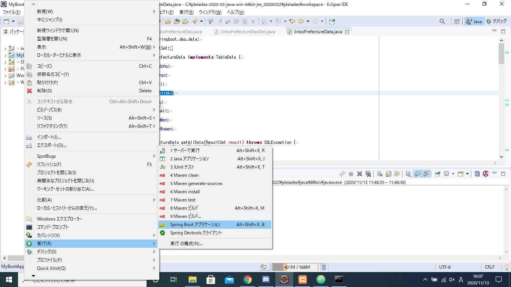

# SpringBootを始める
## 環境構築
#### 注意点
* JDK1.6以上のものを使用する

* 方法A:[Mavenをインストール](https://maven.apache.org/download.cgi)

* POMファイルに以下のタグを追加して「mvn install」
```
<dependencies>
    <dependency>
        <groupId>org.springframework.boot</groupId>
        <artifactId>spring-boot-starter-web</artifactId>
    </dependency>
</dependencies>
<build>
    <plugins>
        <plugin>
            <groupId>org.springframework.boot</groupId>
            <artifactId>spring-boot-maven-plugin</artifactId>
        </plugin>
    </plugins>
</build>
<!-- Add Spring repoistories -->
<!-- (you don't need this if you are using a .RELEASE version) -->
<repositories>
    <repository>
        <id>spring-snapshots</id>
        <url>http://repo.spring.io/snapshot</url>
        <snapshots><enabled>true</enabled></snapshots>
    </repository>
    <repository>
        <id>spring-milestones</id>
        <url>http://repo.spring.io/milestone</url>
    </repository>
</repositories>
<pluginRepositories>
    <pluginRepository>
        <id>spring-snapshots</id>
        <url>http://repo.spring.io/snapshot</url>
    </pluginRepository>
    <pluginRepository>
        <id>spring-milestones</id>
        <url>http://repo.spring.io/milestone</url>
    </pluginRepository>
</pluginRepositories>
```

* 方法B:[gradleをインストール](https://gradle.org/)

* build.gradleに、以下を記述する
```
buildscript {
    repositories {
        mavenCentral()
        maven { url "http://repo.spring.io/snapshot" }
        maven { url "http://repo.spring.io/milestone" }
    }
    dependencies {
        classpath("org.springframework.boot:spring-boot-gradle-plugin:1.0.0.RC5")
    }
}
apply plugin: 'java'
apply plugin: 'spring-boot'
jar {
    baseName = 'myproject'
    version =  '0.0.1-SNAPSHOT'
}
repositories {
    mavenCentral()
    maven { url "http://repo.spring.io/snapshot" }
    maven { url "http://repo.spring.io/milestone" }
}
dependencies {
    compile("org.springframework.boot:spring-boot-starter-web")
    testCompile("junit:junit")
}
```

* 作成したプロジェクトを起動する  

