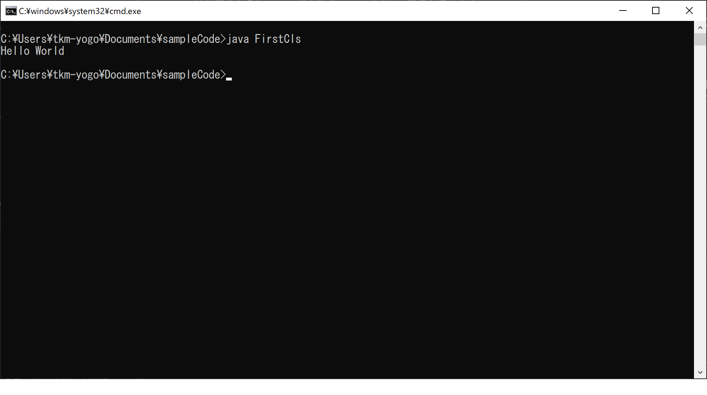

# 第一回
ハローワールドをコマンドプロンプトで実行する
* 普段Eclipseで実行しているJavaコマンドの意味(存在)を知る
* サンプルアプリ(Oracleチュートリアル)アプリを実行してみる。Oracle社の人のコードを見てみる。

## Hello World
まずは写経から入ります。以下のコードを書いて動かしてください。

```
public class FirstCls {
  public static void main(String[] args) {
    System.out.println("Hello World");
  }
}
```

実行方法は以下の通り
1. 上のコードを映してFirstCls.javaファイルを作成する

2. 「ウィンドウズボタン＋R」を押下してコマンドプロンプトを開く


2. javacコマンドでクラスファイルを作成する  
    ```
    javac FirstCls.java
    ```

3. javaコマンドで作成したクラスファイルを事項する  
    ```
    java FirstCls
    ```

## サンプルアプリ
1. 以下のZIPファイルをダウンロード
* [transformations.zip](https://docs.oracle.com/javase/jp/8/javafx/sample-apps/transformations.zip)

2. 展開後に/xylophone/src/xylophone/Xylophone.javaをEclipseプロジェクトにコピー、実行できるようにする

3. Eclipseプロジェクト/resporces/の下に/xylophone/src/xylophone/audioをコピー

4. 実行 ※エラーが出たら以下の部分を直してみる
Xylophone.java：67行目にエラーが出たとき
```
new AudioClip(Xylophone.class.getResource("audio/Note1.wav").toString());
```
の「audio/Note1.wav」を「/audio/Note1.wav」に修正してみる
