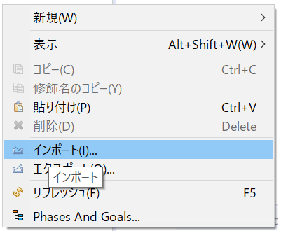
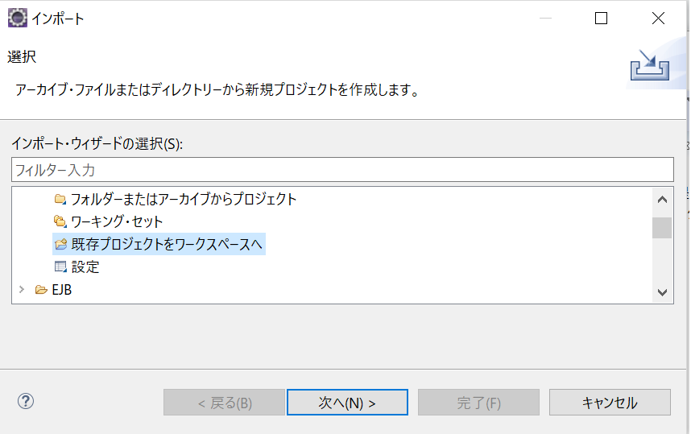
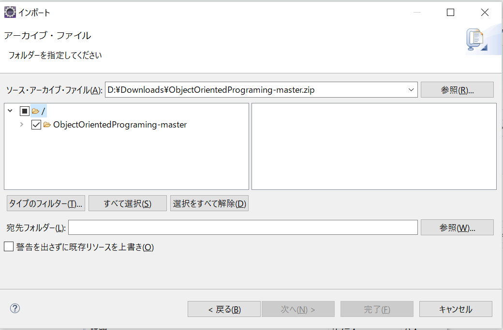

# 教科書の内容を深く復習する
## INDEX
1. [ハローワールド in コマンドプロンプト](./FIrst.md)
2. [文法の復習 in コマンドプロンプト + プログラム引数](./Second.md)
3. 標準入力を使用して文法の復習 in コマンドプロンプト
4. クラス導入
5. モンスタークラスと毒キノコクラスの作成
6. バトルシーンの作成

## プロジェクトのインポート
1. Eclipseを起動する
2. パッケージエクスプローラーを右クリック

3. インポートを選択

4. 既存のプロジェクトを選択

