# Google Classroomの使い方(教師編)
参考サイト: [GoogleClassroomヘルプ](https://support.google.com/edu/classroom/?hl=ja#topic=9049835)

1. クラスの作成方法
2. 資料を追加する
3. フォームの作成方法

## クラスの作成方法
1. [クラスを作成する](https://support.google.com/edu/classroom/answer/6020273?hl=ja&ref_topic=9049835)

 ＜入力する内容＞
 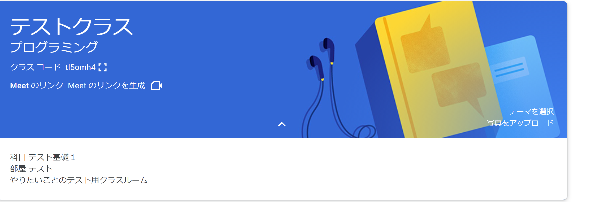

 ＜表示する内容＞
 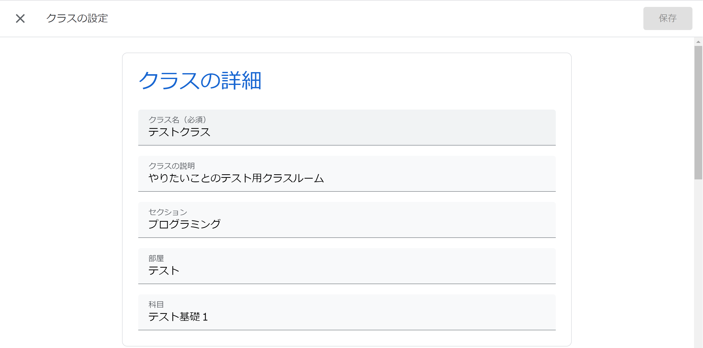

2. [生徒を招待する](https://support.google.com/edu/classroom/answer/6020282)

 * [招待リンクを使用して生徒を招待する](https://support.google.com/edu/classroom/answer/6020282#zippy=%2C%E6%8B%9B%E5%BE%85%E3%83%AA%E3%83%B3%E3%82%AF%E3%82%92%E4%BD%BF%E7%94%A8%E3%81%97%E3%81%A6%E7%94%9F%E5%BE%92%E3%82%92%E6%8B%9B%E5%BE%85%E3%81%99%E3%82%8B)
 * [招待メールを使用して生徒を招待する](https://support.google.com/edu/classroom/answer/6020282#zippy=%2C%E6%8B%9B%E5%BE%85%E3%83%A1%E3%83%BC%E3%83%AB%E3%82%92%E4%BD%BF%E7%94%A8%E3%81%97%E3%81%A6%E7%94%9F%E5%BE%92%E3%82%92%E6%8B%9B%E5%BE%85%E3%81%99%E3%82%8B)
 * [クラスコードを使用して生徒を招待する](https://support.google.com/edu/classroom/answer/6020282#zippy=%2C%E3%82%AF%E3%83%A9%E3%82%B9%E3%82%B3%E3%83%BC%E3%83%89%E3%82%92%E4%BD%BF%E7%94%A8%E3%81%97%E3%81%A6%E7%94%9F%E5%BE%92%E3%82%92%E6%8B%9B%E5%BE%85%E3%81%99%E3%82%8B)
 * [招待リンクまたはクラスコードを管理する](https://support.google.com/edu/classroom/answer/6020282#zippy=%2C%E6%8B%9B%E5%BE%85%E3%83%AA%E3%83%B3%E3%82%AF%E3%81%BE%E3%81%9F%E3%81%AF%E3%82%AF%E3%83%A9%E3%82%B9%E3%82%B3%E3%83%BC%E3%83%89%E3%82%92%E7%AE%A1%E7%90%86%E3%81%99%E3%82%8B)
 * [学校のドメイン外の生徒を招待する](https://support.google.com/edu/classroom/answer/6020282#zippy=%2C%E5%AD%A6%E6%A0%A1%E3%81%AE%E3%83%89%E3%83%A1%E3%82%A4%E3%83%B3%E5%A4%96%E3%81%AE%E7%94%9F%E5%BE%92%E3%82%92%E6%8B%9B%E5%BE%85%E3%81%99%E3%82%8B)

## 資料を追加する
1. 授業 -> 作成をクリックする
 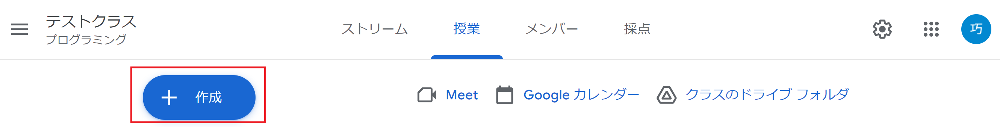
2. 作成するもの(タイプ)を選択する
 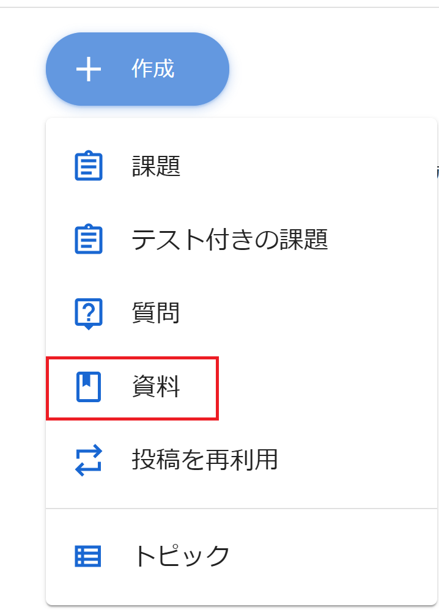
3. 必要項目を入力、アップする資料の選択
 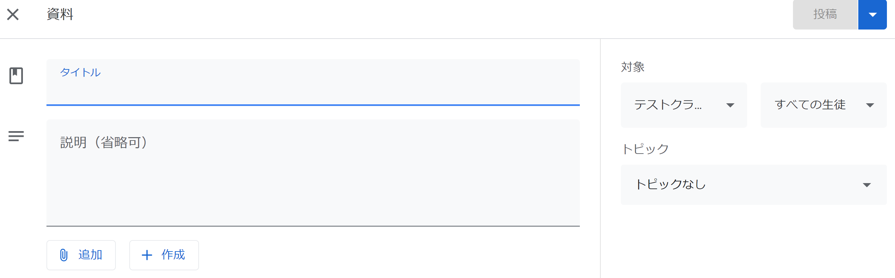

 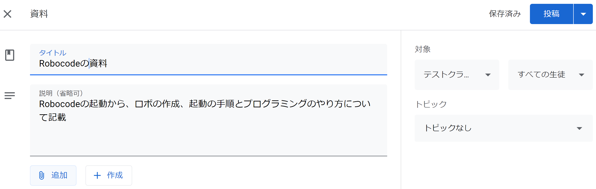

 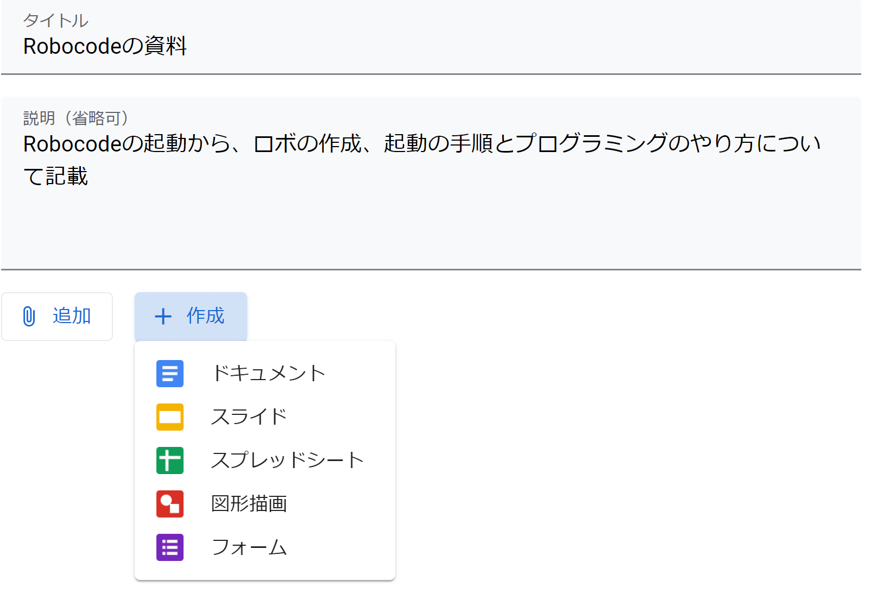

 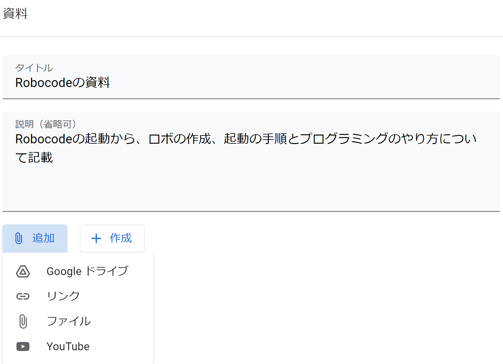

4. 作成後、下書き状態になっているので生徒からは見えないので投稿する
 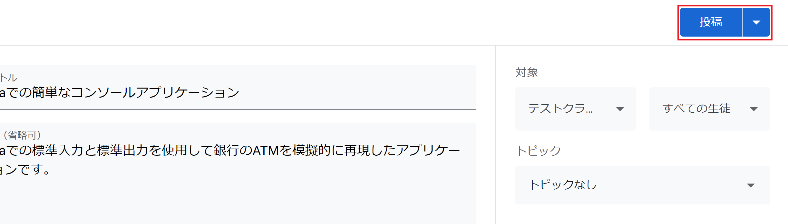

 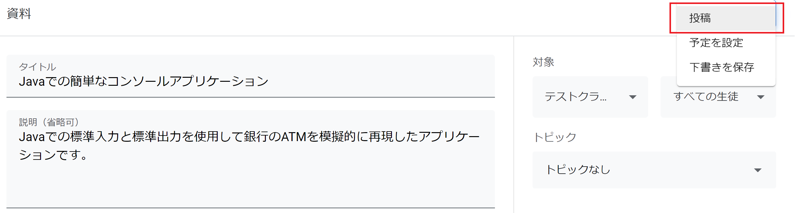

 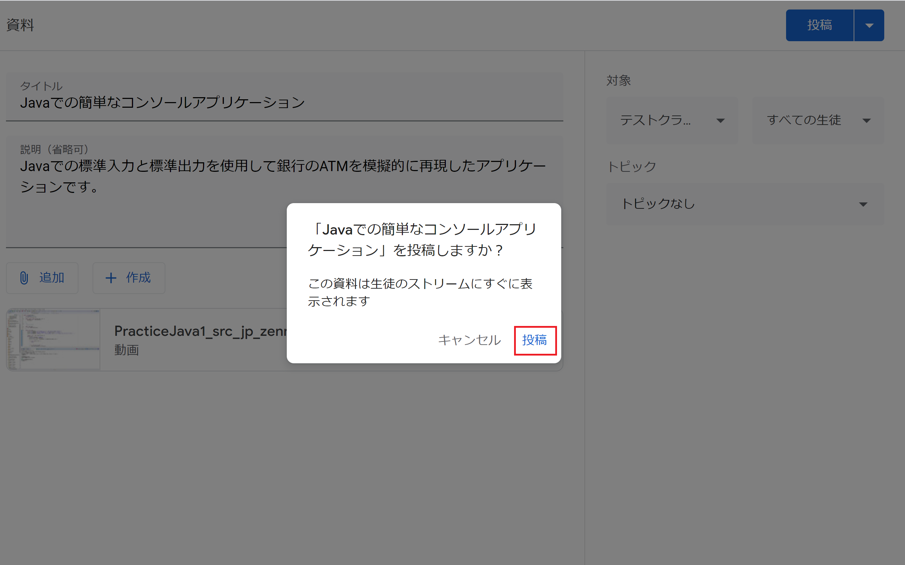

5. 投稿後は以下のようになる
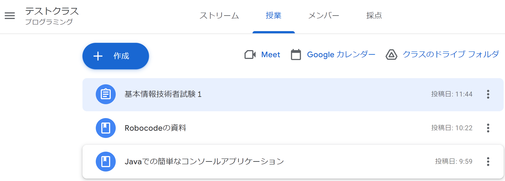

## フォームの作成方法
課題の作成
1. +作成 -> 課題をクリック
 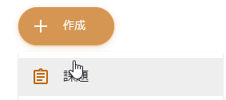

  **質問の追加**

2. 入力内容を書く
 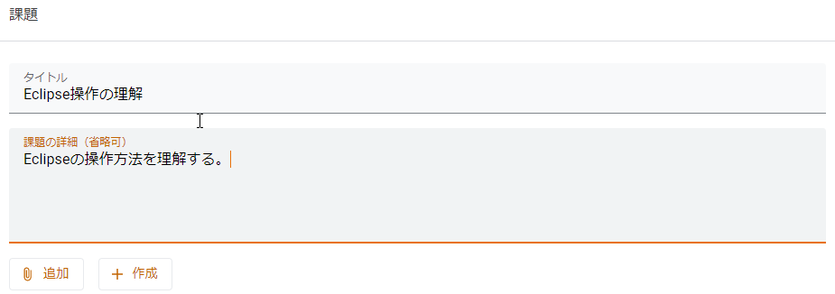

3. Formを選択する
 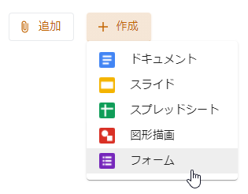

4. Formの内容を記述する
 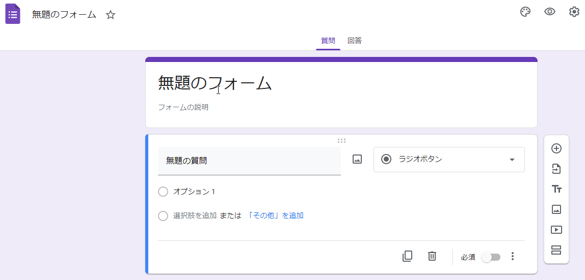

5. 問題と選択肢の作成
 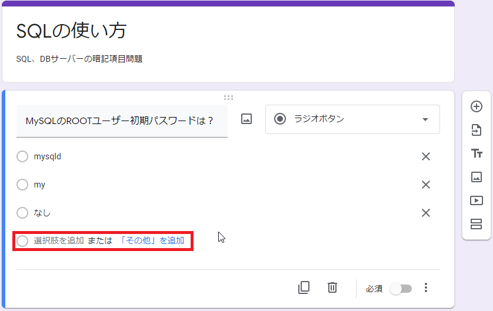

6. 入力が終わったら、保存されているので元画面に戻る
 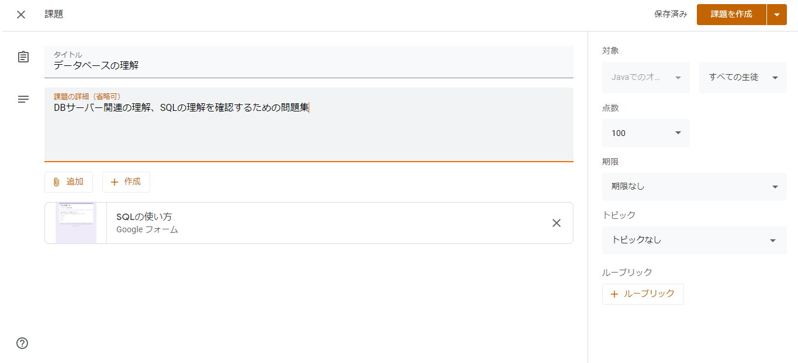

7. 課題の策区政をクリック
　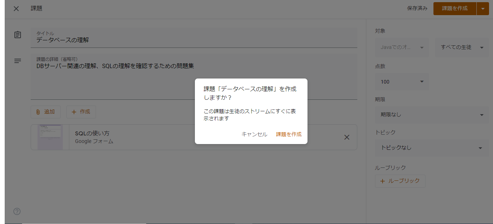

作成後
 

 
