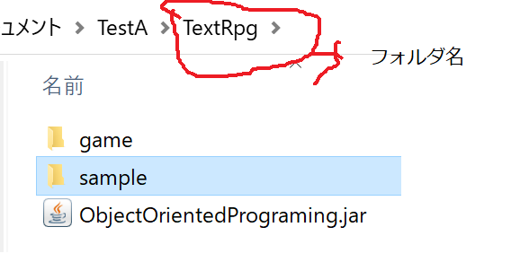
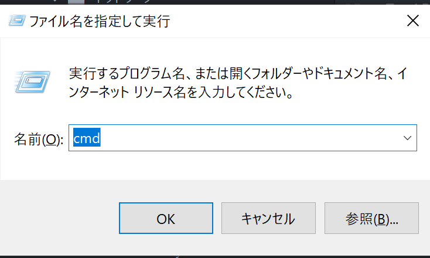

# Java言語とは
**概要**
Javaは世界中で使用されているプログラミング言語です。**主にスピードと安定性が重視される**システムの構築に使用されることが多い。

＜使用例＞
* 銀行: 顧客管理、預金口座管理などの基幹システムや決済を行うための他銀行との取引処理を行うシステム etc...
* 証券: 基幹システムをはじめ、証券取引を行うためのWebシステム、オペレーターが使用する取引が成立したかどうかを入力するシステム etc...
* 基幹システム: 会社さんが仕事をスムーズに行うためのシステム、主に在庫管理、勤怠管理、売上管理・・・業務に携わる機能を網羅している巨大システム etc...


## イントロダクション
Javaというプログラム言語では、大体のことができます。Webアプリケーション、スマホアプリ、通常のPCで動くアプリケーションなど。
Iotや、人工知能の分野にも使用することができます。

1. Webアプリケーション
   <iframe width="560" height="315" src="https://www.youtube.com/embed/LkjETT0ZKA8" title="YouTube video player" frameborder="0" allow="accelerometer; autoplay; clipboard-write; encrypted-media; gyroscope; picture-in-picture" allowfullscreen></iframe>
2. スマホアプリ
    <iframe width="560" height="315" src="https://www.youtube.com/embed/Eu5wAvbj4Nw" title="YouTube video player" frameborder="0" allow="accelerometer; autoplay; clipboard-write; encrypted-media; gyroscope; picture-in-picture" allowfullscreen></iframe>
3. 通常のPC
    <iframe width="560" height="315" src="https://www.youtube.com/embed/9XJicRt_FaI" title="YouTube video player" frameborder="0" allow="accelerometer; autoplay; clipboard-write; encrypted-media; gyroscope; picture-in-picture" allowfullscreen></iframe>
4. Iot
   <iframe width="596" height="335" src="https://www.youtube.com/embed/C0FK7d4dJ5k" title="YouTube video player" frameborder="0" allow="accelerometer; autoplay; clipboard-write; encrypted-media; gyroscope; picture-in-picture" allowfullscreen></iframe>
5. 人工知能
   <iframe width="560" height="315" src="https://www.youtube.com/embed/DLngS77atps" title="YouTube video player" frameborder="0" allow="accelerometer; autoplay; clipboard-write; encrypted-media; gyroscope; picture-in-picture" allowfullscreen></iframe>

## 実際に動かす。
上に挙げたような、大規模システムの構築は出来ないのでサンプルとして作成したTextRpgゲーム」をみながら理解していきます。

### ゲームの特徴
* ゲームブックのように、ストーリーを進めていき、最終的にゴール(エンディング)を迎える形のゲームが作れます。
* ストーリーは「Stroy.txt」に指定の形で記述することで、作成者が自由にストーリーを作成することができます。
* Job.xml, Monster.xml, Command.xmlなどのXMLファイルで使用する職業、コマンド、モンスターを定義することができます。

### サンプルについて
TextRpgフォルダの中に「game」と「sample」というフォルダがあります。
そして、  ObjectOrientedPrograming.jarファイルがあります。


＜動かし方＞
1. コマンドプロンプトを開く： ウィンドウズボタン + R を押下、「cmd」と入力してEnterキー


2. カレントディレクトリを移動して、TextRpgフォルダに移動する。

3. 次のコマンドをたたく「java -jar ObjectOrientedPrograming.jar game」

これで、サンプルストーリーを実行することができます。ちなみに「game」の部分を「sample」に変更して実行すると。
別なストーリーが起動します。sampleは、このプログラムを実装するのに使用した、テスト用のデータ、及びストーリーです。


#### gameを動かしてみる
1. TextRpgフォルダに移動して次のコマンド、「java -jar ObjectOrientedPrograming.jar game」を実行する。
2. gameフォルダ内のStory.txtの内容とプログラムを実行した結果を比べてみる。
3. Story.txtの内容を書き換えて、自分のオリジナルのストーリーを作成し実行する。

### ストーリーを作る
ゲームのストーリーは、シーンごとに作成します。例えば序章の場合小説のように文章を書くだけでよいですが、
このゲームでは、序章の部分を1つのシーンとして扱いますので下のように「枠」で囲う必要があります。

＜例1：単純にストーリーを表示する＞
```
0:A
# 第一章：ごぜんじあいに出る
むかしむかし、あるところに、おじいさんとおばあさんがいました。
ある日おじいさんは、山へしばかりに、おばあさんは川へせんたくに行きました。
おや？おじいさんか、おばあさんが、何かを見つけたようです。みつけたのはどちら？
<1:2>
1. おじいさん 1
2. おばあさん 2
END_SCENE 1

1:A
おじいさんが、しばかりをしていると、竹やぶに光る竹を見つけました。
ふしぎに思い、ちかずいてみると。。。
なんと、竹が光だし、そこに女の子があらわれました。
びっくりしたおじいさんは、こしをぬかしてギックリゴシになってしまいました。
END_SCENE 9

```
＜ポイント抜粋＞
* "0:A"の部分、"シーン番号:シーンタイプ(A-Z)"のように設定する。
  ・シーン番号は単純に数字　・シーンタイプはA～Zまでの記号を使用します。しかし現状ではシーンタイプ一覧のモノのみ有効です。
* "# 第一章：ごぜんじあいに出る"の部分、"# "(シャープとスペース)で始まる行はコメント行です。
* 「END_SCENE XXX」という指定は、このシーンの次にシーンインデックス「XXX」に移動するという意味になります。例: "END_SCENE 2"であればシーンインデックス2に移動する。という意味になります。

### シーンインデックス
1-999までの数字を設定することができる。次画面のシーンインデックスに「C」を指定することでゲーム終了する。


### シーンタイプ一覧
A: ストーリー表示用のシーンを表す。このシーンに<1:X>とつけることで、選択肢を設定することができる。
B: アイテムショップのシーンを表す。
C: ステータス変化のシーンを表す。
D: アイテム、武器防具の類を取得するシーンを表す。
F: 戦闘シーンを表す。<monster:モンスター番号>のタグを使用することでモンスターを指定することができる。
G: プレーヤー作成のシーンを表す。
