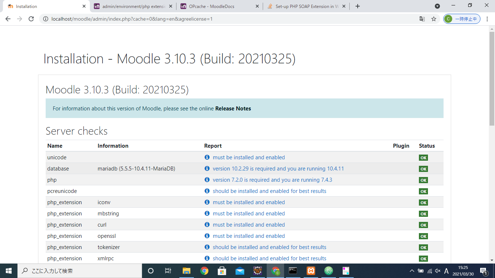
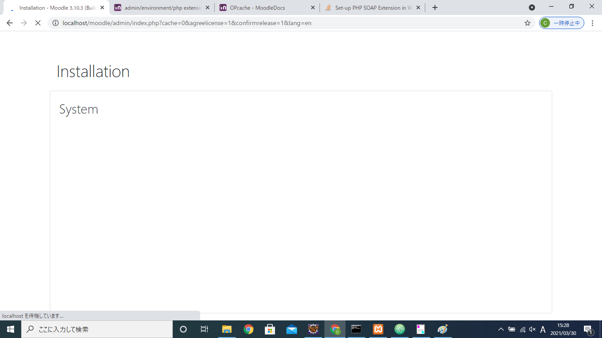

# Moodleを使用するための準備

## Moodleの入手
 [こちらのURLよりZIPをダウンロード](https://download.moodle.org/)

## 設定の変更
展開後のmoodleフォルダ直下にある以下のファイルを修正する

#### config.php
展開したフォルダmoodleの直下にあるconfig.phpを変更する
以下はMariaDB(MySQL)を使用した場合
```php
$CFG->dbtype    = 'mariadb';
$CFG->dblibrary = 'native';
```

XAMMPの直下にあるPHPフォルダ
##### php.ini
下の項目に関して、「；」でコメントアウトされているのでそれを外す。
もしくは、値を修正する。

```
extension = php_xmlrpc.dll
extension=intl

zend_extension = php_opcache.dll

[intl]
intl.default_locale = en_utf8
intl.error_level = E_WARNING

[opcache]
opcache.enable = 1
opcache.memory_consumption = 128
opcache.max_accelerated_files = 10000
opcache.revalidate_freq = 60

; Required for Moodle
opcache.use_cwd = 1
opcache.validate_timestamps = 1
opcache.save_comments = 1
opcache.enable_file_override = 0


```

下のように、OKばかりになります。
問題があると、「Check」とか「Error」などが出ます。




下のほうにある「Continue」をクリックするとインストールが始まります。

