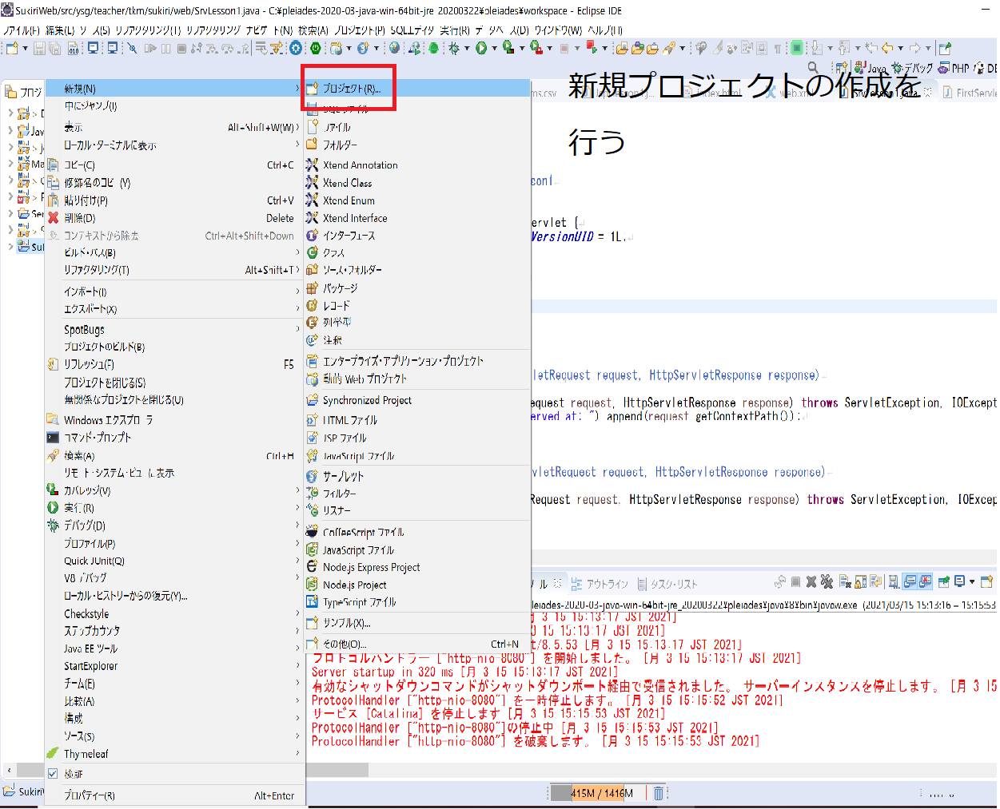
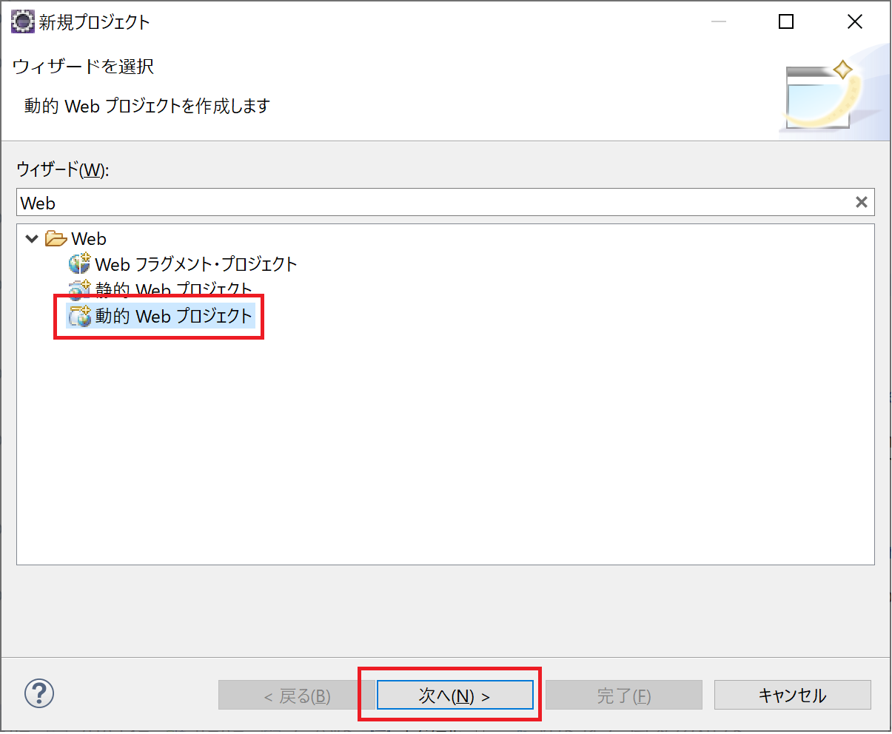
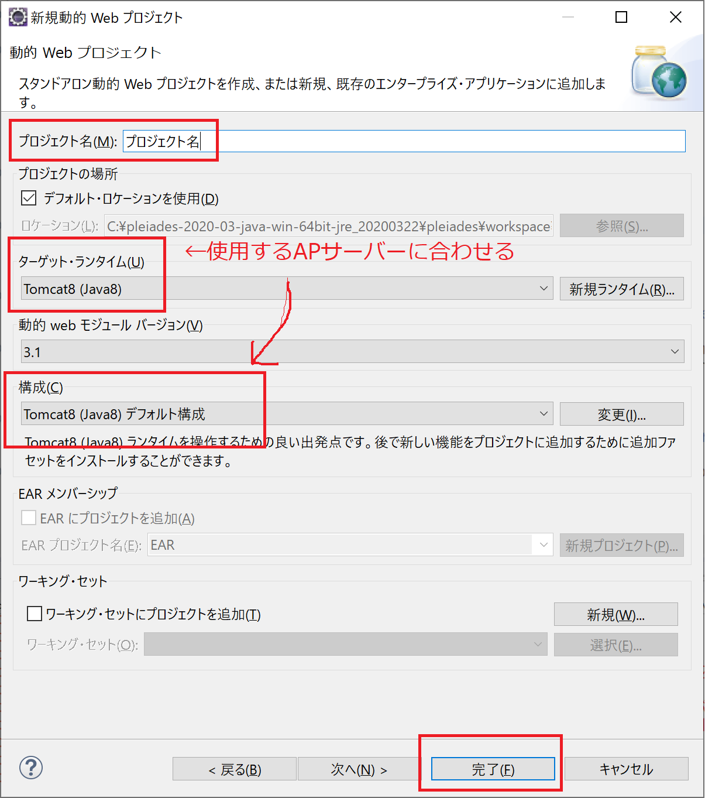
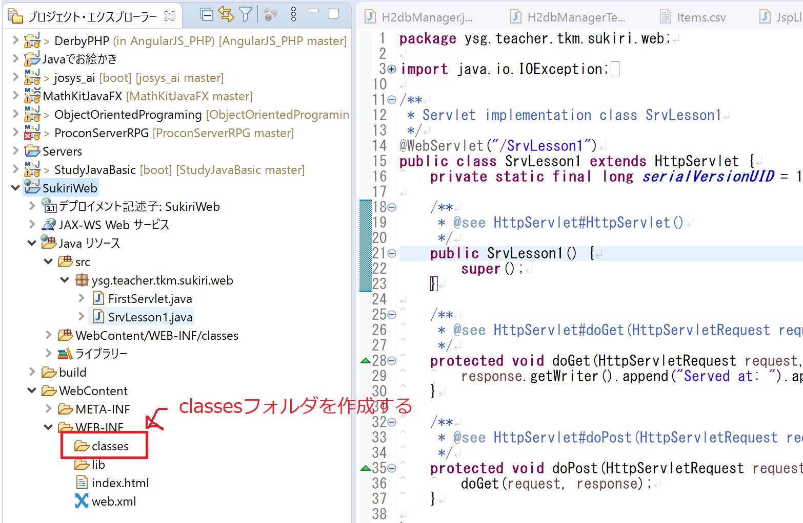
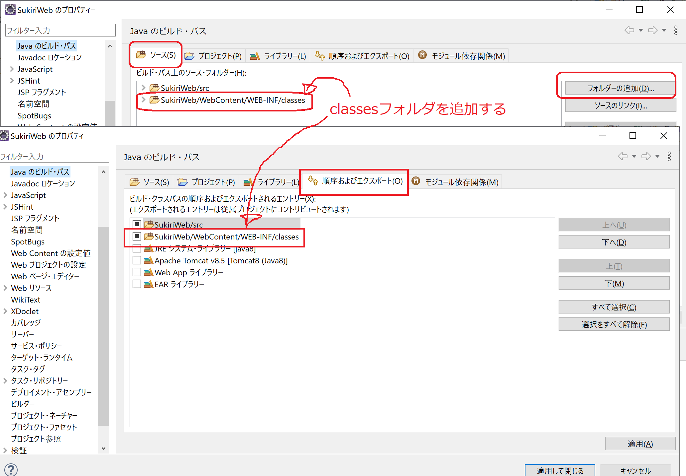
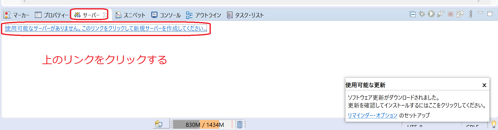
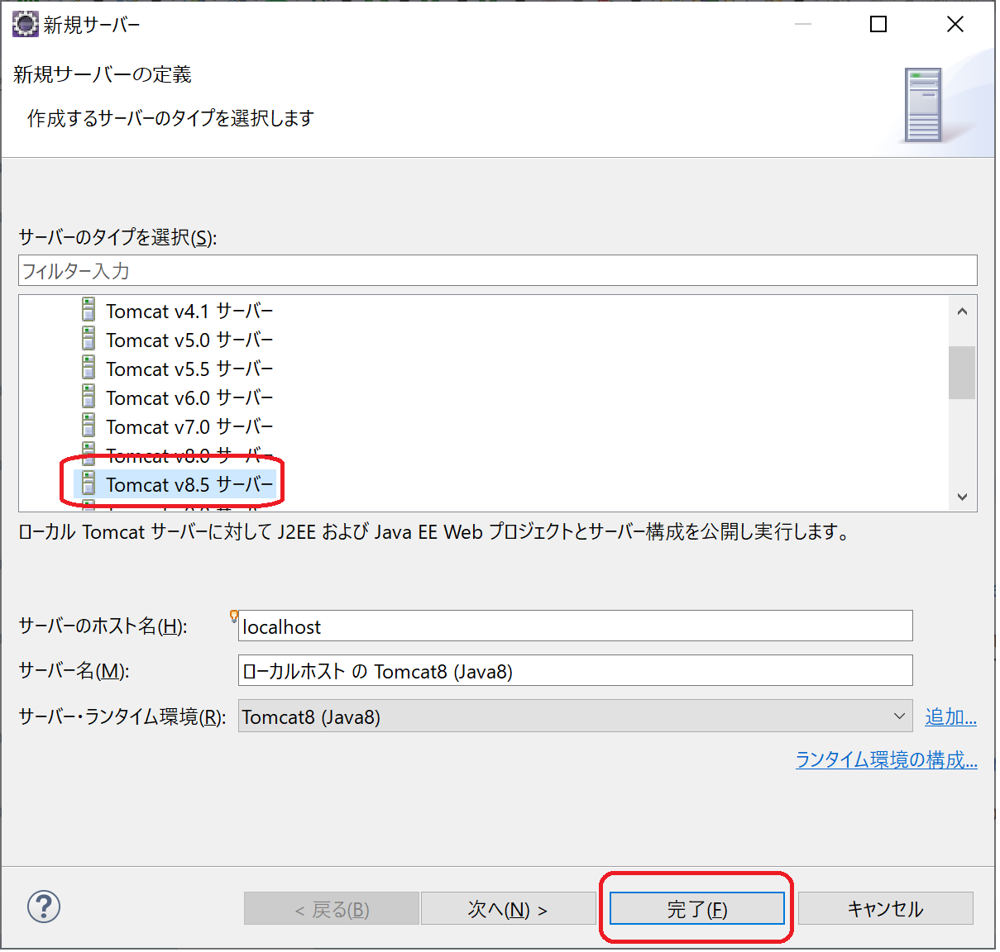
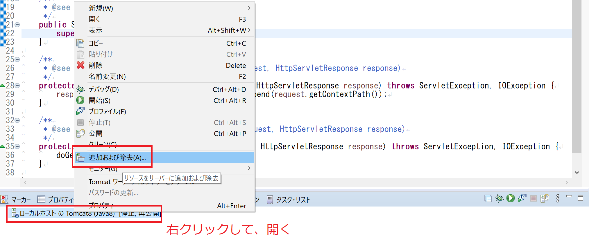
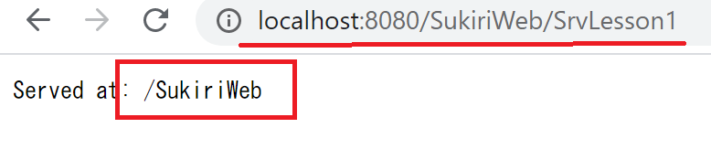

# Tomcat in Eclipse with Servlet
Tomcatを使用して、HttpServletを使用した少しだけ低レベルなサーブレットを実装してみます。

### 具体的に・・・
下のようなイメージのアプリケーションを作成します。

・自分のPC上でアプリケーション・サーバーを動かす
・いつものブラウザで、アプリケーション・サーバーにアクセス
・指定したサーブレットクラスを動かす。
・新しいURLの指定し方やり方


## 環境構築(Eclipseのプロジェクト)
1. プロジェクトを新規で作成する






2. 作成したプロジェクトにフォルダーを追加します。
「classesフォルダ」を作成し以下のようにビルドパスに追加する




3. Serveltクラスを作成する

4. サーバーを追加する(Tomcat8.XXXX)




5. 作成したプロジェクトをサーバーに追加する


6. サーバーを起動する。

7. 作成したサーブレットが動くことを確認。


```java
public class HelloServlet extends HttpServlet {

	/** GETリクエスト */
	@Override
	protected void doGet(HttpServletRequest request
			, HttpServletResponse response) throws ServletException, IOException {
		String message = "Hello World";
		String uri = request.getRequestURI();
		System.out.println(getServletContext().getRealPath("/"));


		StringBuilder bb = new StringBuilder();
		bb.append("<html>");
		bb.append("<head>");
		bb.append("<title>ハローサーブレット</title>");
		bb.append("</head>");
		bb.append("<body>");
		bb.append("DBから取得したデータ</br>");

		// 占いの結果
		String[] keka = new String[] {"長スッキリ", "スッキリ", "最悪 "};
		int idx = (int)(Math.random() * 3);
		bb.append(keka[idx]);
		bb.append("</body>");
		bb.append("</html>");

    // レスポンスの返却
		response.setContentType("text/html; charset=UTF-8");
		PrintWriter out = response.getWriter();
		out.append(bb.toString());
	}

	/** POSTリクエスト */
	/**
	 * @see HttpServlet#doPost(HttpServletRequest request, HttpServletResponse response)
	 */
	protected void doPost(HttpServletRequest request, HttpServletResponse response) throws ServletException, IOException {
		doGet(request, response);
	}
}
```
