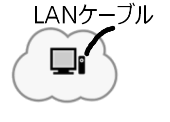
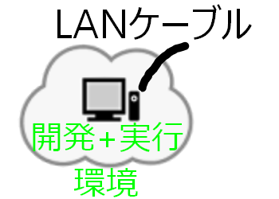
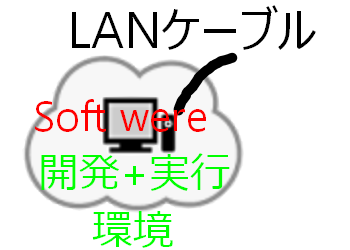

## AWSを始める
AWSを始めるにあたり、券捻転があります。以下の部分です。
1. AWSは1年無料だが、その後どうなるかわからない。
2. AWSの使い方と料金体系がわからない
3. 根本的によくわからない

これらに対して儀門弟を解決、使い方などをまとめます。

## AWSの1年無料に関して
1年無料は良いが、そのあとはどうなるのか？これに関して調べました。
[参考サイト](https://aws.amazon.com/jp/premiumsupport/knowledge-center/free-tier-expiring/)

＜結論＞
> 料金を発生させたくない場合は、アカウントのリソースを削除、停止、終了する必要があります。必要であれば、いつでもアカウントを解約できます。

ということなので、終了したらサービスの停止、解約をすればよいということでした。

しかし、2021-08-15現在では、「[常に無料](https://aws.amazon.com/jp/free/?trkCampaign=acq_paid_search_brand&trk=ps_a134p000006gTZqAAM&sc_campaign=acquisition_JP&sc_channel=ps&sc_publisher=google&sc_category=core&sc_country=JP&sc_geo=JP&sc_outcome=devadopt&sc_detail=%2Baws%20%2B%E7%84%A1%E6%96%99&sc_content=Cost_bmm&sc_segment=487544183239&sc_medium=ACQ-P|PS-GO|Brand|Desktop|SU|AWS|Core|JP|JP|Text|dx&ef_id=CjwKCAjw092IBhAwEiwAxR1lRk3AQCmqmPTtBAaxo8unHT2F1NnrzXRxwTeq9A0dSqjxSOXzgcM3CRoCy8UQAvD_BwE:G:s&s_kwcid=AL!4422!3!487544183239!b!!g!!%2Baws%20%2B%E7%84%A1%E6%96%99&gclid=CjwKCAjw092IBhAwEiwAxR1lRk3AQCmqmPTtBAaxo8unHT2F1NnrzXRxwTeq9A0dSqjxSOXzgcM3CRoCy8UQAvD_BwE&all-free-tier.sort-by=item.additionalFields.SortRank&all-free-tier.sort-order=asc&awsf.Free%20Tier%20Types=tier%23always-free&awsf.Free%20Tier%20Categories=*all)」という枠があるようです。

# AWS CloudFoundationを学ぶ
＜学習内容＞
* クラウドコンピューティングについて
* AWSの料金体系
*
*
*

## クラウドコンピューティングについて
### クラウドコンピューティングとは
* コンピューティング能力
* データベース
* ストレージ(記憶領域)
* アプリケーション
* その他のITリソース

上記の、機能をオンデマンド、かつ、インターネット経由で提供する。従量制の料金で提供するサービス

### クラウドサービスモデル
* IaaS(Infra structure as a Service): サービスとしてのインフラストラクチャ(PC本体、ﾈｯﾄﾜｰｸの機能)
  **ITリソースの制御性が最も高い**、セットアップ済みのPCとLAN(ﾈｯﾄﾜｰｸ)が利用できるイメージ
  

* Paas(Platform as a Service): サービスとしてのプラットフォーム、加えて開発環境、実行環境が利用できるイメージ
  基盤インフラストラクチャ(ハードウェア、OS)の管理が必要ないのでアプリケーションのデプロイや管理に集中できる。
  

* SaaS(Softwere as a Service): サービスとしてのソフトウェア、出来上がったアプリケーション(Soft were)を利用できるイメージ
  **特定のソフトウェアの使用方法のみを考慮するだけでよい**、出来上がったソフトウェアの管理のみでよい
  

### クラウドコンピューティングのデプロイモデル
＜デプロイモデル＞
* クラウド: アプリケーションを実行するすべてがクラウド上で実行される、クラウド上でアプリケーションの作成、リソースの拡張、変更が可能な、デプロイ方法
* ハイブリッド: 既存のインフラストラクチャとアプリケーションを、クラウドベースのリソースに接続する、デプロイ方法
* オンプレミス(プライベートクラウド): 物理的なシステムをAWSクラウドに接続し、機能を提供する、デプロイ方法

これらのデプロイモデルは、ユーザーに合わせてデプロイ(ITリソースの配置(インストール))方法をAWSが用意しているということ。

＜具体例＞
* クラウドを利用する: ITリソース(サーバー、ﾈｯﾄﾜｰｸなど)を持っていないがウェブサービスを提供したいと思う人が利用するケース
* ハイブリッド:　ITリソースは持っているが、AWSのクラウドと連携したい時
* オンプレミス: 自前のITリソースをクラウド上にアップして、自前のサービスを提供する。プライベートクラウドとも呼ばれるのは、AWSクラウドからほぼ独立しているから。

## AWSの料金体系
＜基本3要素＞
1. コンピューティング: 時間(秒単位)で課金する。インスタンスタイプによって料金が違う
2. ストレージ: GB(ギガバイト)単位で課金する
3. データ転送: 送信料によって課金する、受信に関しては課金しない。基本的にはGB単位で課金する

＜支払方法＞
1. 従量課金制
2. 予約支払い
※ 使用量が増えるほど割引になる

### AWSでの無料サービス
* Amazon VPC
* Elastic Beanstalk**
* Auto Scaling**
* AWS CloudFoundation**
* AWS Identity and Access Management(IAM)※日本では「アイアム」と呼んでいるらしい
※「**」のついているサービスに関しては、併せて使用する他のサービスで料金が発生する

### AWSの操作・テクニカルサポート
* AWS Management Console: 管理画面
* Billing Cost Management Console: 使用した料金の詳細から概要までわかる
* テクニカルアカウントマネージャー(TAM): エンターブライズサポートプランのみで使用可能
　ベーシック(無料)、デベロッパー、ビジネス、エンターブライズの4サポートがある
* AWS Trusted Advisor: 利用方法が適切かどうか判定してくれるサービス

### AWS Organizationについて
AWSのアカウント管理サービス：組織でAWSのアカウントを複数使用するときに便利なサービス

## AWS グローバルインフラストラクチャ
2021-08-17現在では世界に22のリージョンがある。
＜AWSグローバルインフラストラクチャの構成要素＞
・リージョン
・アベイラビリティーゾーン
・POP(Point Of Presence)

### リージョン
物理的、地理的エリアを示すもの。以下のもので構成される。
耐震性、安定性の観点からリージョンは互いに分離されている。
・2以上のアベイラビリティーゾーンで構成
・リージョン間の通信はAWSのバックボーンネットワークを使用
・レプリケート：複製するという意味

#### アベイラビリティーゾーン
1つ以上のデータセンターで構成される

### リージョンの選択
・データガバナンスと法的要件に注意
・アクセスする速度は地理的に近い方がよい
・CloundPingなどのウェブサイトでテストできる
・全てのリージョンで全てのAWSサービスが使用できるわけではない

### POP(Point Of Presence)
世界中に展開されたAWS用のDNSでサービスとしては以下のものがある。
・Amazon Route 53
・AWS Shield
・AWS Web Application Firewall

### AWSグローバルインフラストラクチャの特徴
・伸縮自在(スケーラブル)、要件に応じて使用したい容量を動的に使用できる
・耐障害性、団長性が組み込まれているので、一つ壊れても予備が動く形で保全する

### AWSサービスとカテゴリ
**<ルートカテゴリ>**

| AWSの基盤サービス | プラットフォームサービス | アプリケーション |
| ---------------- | ---------------------- | --------------- |
| コンピューティング | データベース            | 仮想デスクトップ |
| ネットワーク      | 分析                    | コラボレーションと共有 |
| ストレージ        | アプリケーションサービス | - |
|        -         | デプロイとマネジメント   | -  |
|        -         | モバイルサービス        | - |

**<カテゴリ>**

| | | | | | |
| --- | ---- | ----- | --- | ----- | --- |
| 分析 | アプリケーション統合 | AR及びVR | ブロックチェーン | ビジネスアプリケーション | **コンピューティング** |
| **コスト管理** | カスタマーとのつながり | **データベース** | 管理者用ツール | エンドユーザーコンピューティング | Game Tech |
| IoT | Machine Learning  | **マネジメントとガバナンス** | メディアサービス | 以降と転送 | モバイル |
| **ネットワークとコンテンツ配信** | ロボット工学 | 人工衛星 | **セキュリティアイデンティティ、コンプライアンス** | **ストレージ** |

※ガバナンス：統治・支配・管理を示す
#### ストレージサービス
・Amazon S3(Simple Strage Service): 代表的なストレージサービス  
・Amazon EBS(Elastic Block Store): EC2で書するためのブロックストレージ  
・Amazon EFS(Elastic File System): 動的なﾈｯﾄﾜｰｸファイルシステム(NFS)

#### コンピューティングサービス
＜EC2＞　※「Amazon ～」とはじまるものは省略している、下のものは「Amazon Auto Scaling」になる。  
・Auto Scaling: EC2インスタンス(作成した仮想PC)の容量を動的に追加・削除してくれる  
・Elastic Container Service: Dockerコンテナをサポートしている。Dockerコンテナを使用できるということ  
・EC2 Container Registory: Dockerコンテナの保存・管理・デプロイといった開発プロセスを簡易化する  
・AWS　Elastic Beanstalk: Apache, IISなどのウェブサーバーにアプリケーションをデプロイするサービス  
・AWS Lamda : 細かい管理をせずにコードが実行されたときにのみ課金される ※使ってみないとわからない  

#### データベースサービス
※「Amazon ～」とはじまるものは省略している  
・Relational Database Service(RDS): データサイズなどの容量を自動で調整してくれる。バッチなども自動で行ってくれる  
・Aurora: MySQL, PostgreSQLと互換性がある  
・Red Shift: AWS内に保存されているデータを検索できる  
・DynamoDB: NoSQL DB

#### ネットワークサービス
※「Amazon ～」とはじまるものは省略している

| サービス名 | 概要 |
| --------- | ---- |
| VPC | ユーザー定義の仮想ﾈｯﾄﾜｰｸでAWSリソースを起動することができる |
| Elastic Load Balancing | AWS用のロードバランサ、負荷を減らすための仕組みのこと |
| Cloud Front | コンテンツ配信ﾈｯﾄﾜｰｸ(CDN)、データ、動画、アプリケーション、APIを全世界に配信 |
| AWS Transit Gateway | オンプレミス環境と「Amazon VPC」を接続するプライベートクラウド |
| Route 53 | エンドユーザーを適切なページに導くためのDNS。 |
| AWS Direct Connect | データセンター、オフィスからAWSまでの専用プライベートﾈｯﾄﾜｰｸを確立する方法 |
| AWS VPN | 安全なプライベートネットワークトンネルを提供する |

#### セキュリティ アイデンティティ コンプライアンス
※「Amazon ～」とはじまるものは省略している

| サービス名 | 概要 |
| --------- | ---- |
| AWS Identity and Access Management(IAM) | サービスとリソースの安全な管理を提供する |
| AWS Organization | アカウントで使用できるサービスを制限することができる |
| Congnit | ユーザー認証、アクセスコントロールをウェブ、モバイルに追加できる|
| AWS Artifact | セキュリティレポート |
| AWS Key Management Service | 暗号化キーの作成管理ができる |
| AWS Shield | AWSで実行中のサービスを保護する |

#### AWSのコスト管理
・AWSのコストと使用状況レポート  
・AWS Badgets: 予算を超えそうなときに警告などを出してくれる  
・AWS Const Explorer: 使用コストを可視化してくれる  

##### AWSのマネジメントとガバナンスサービス
※「Amazon ～」とはじまるものは省略している

| サービス名 | 概要 |
| --------- | ---- |
| AWS マネジメントコンソール | 管理用画面を提供する |
| AWS Config | リソースのイベントリ、変更、追跡に役立つ |
| Cloud Watch | リソースとアプリケーションを監視できる |
| AWS Auto Scaling | リソースの拡大縮小を自動で行ってくれる |
| AWS コマンドラインインターフェース | AWSサービスを管理する統合サービス |
| AWS Trusted Advisor | パフォーマンスとセキュリティを最適化するオンラインツール |
| AWS Wel-Architected Tool | ワークロードの確認と改善に役立つ |
| AWS Clound Trail | ユーザーアクティビティとAPIの使用状況をAWSアカウント全体で追跡する |
