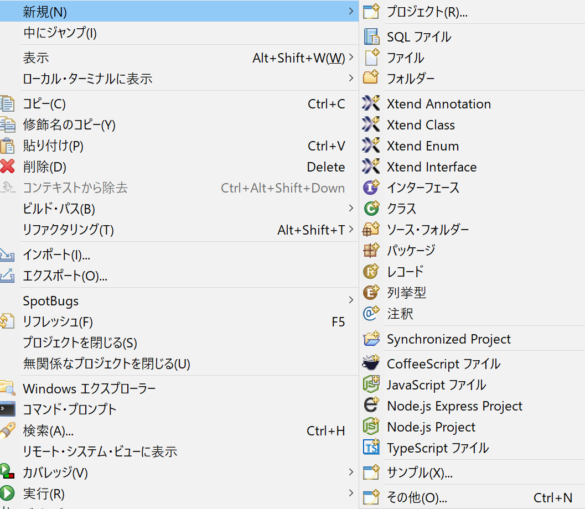
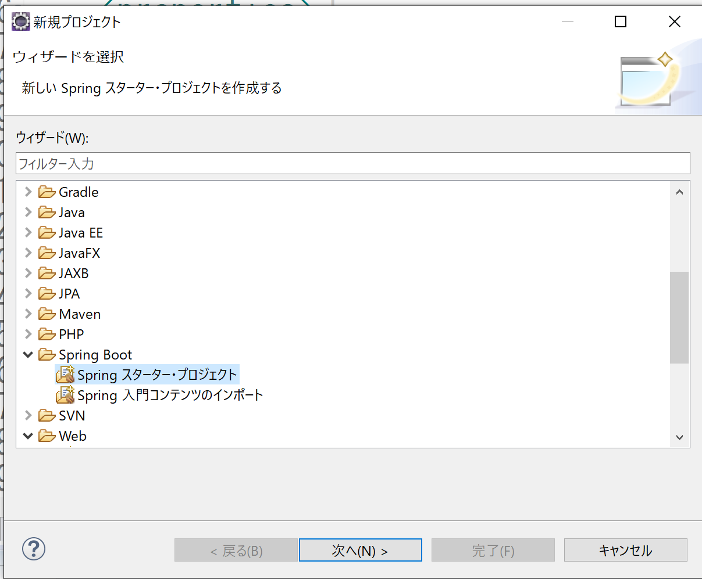
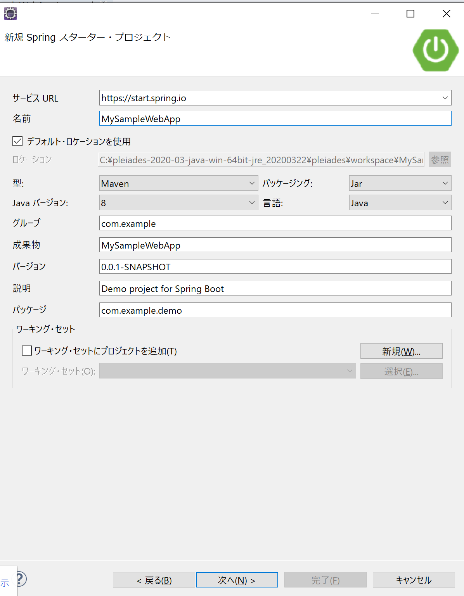
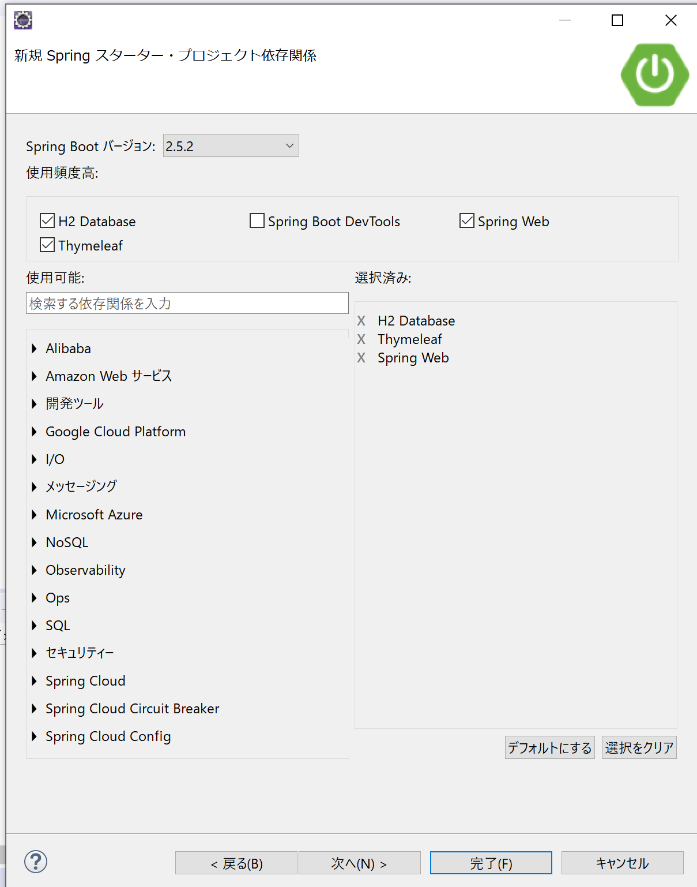
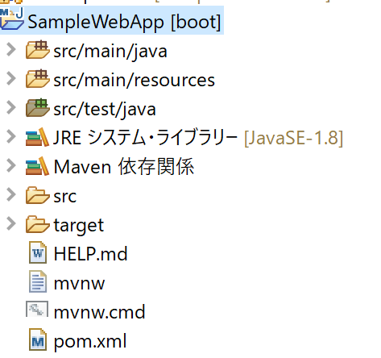
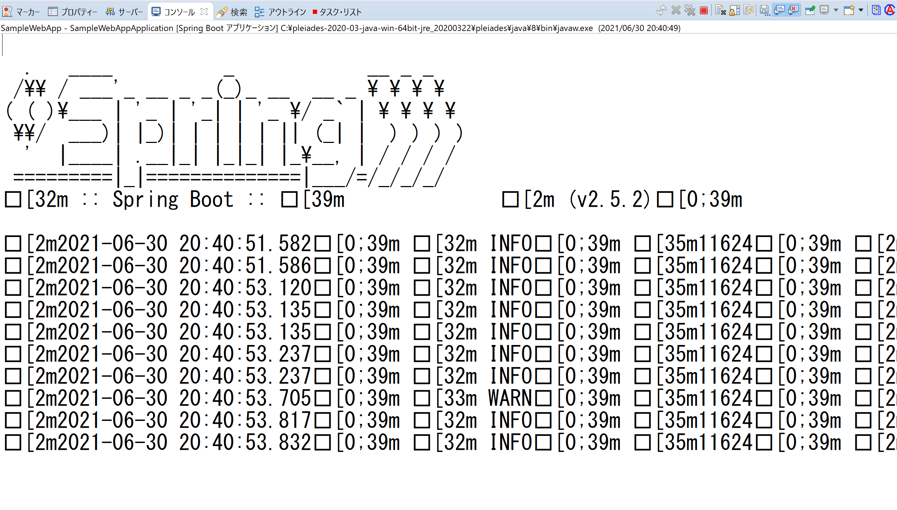
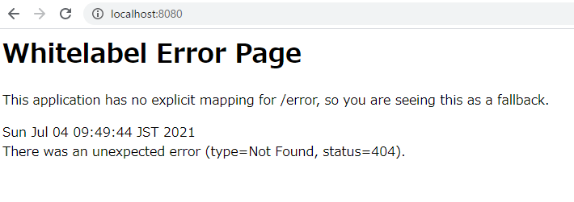

# SpringBootの準備
使用するIDE(開発ツール)は[EclipseのAll in One](https://mergedoc.osdn.jp/)です。

## プロジェクトの作成
Eclipseを起動してから、下のようにプロジェクトを右クリックし「新規」をクリック以下の手順に従います。

1. Springスタータープロジェクトを選択し、「次へ」をクリック

2. プロジェクトの名前などを入力する。使用するJDKによって「Javaバージョン」の値を変更する
　※JDK1.8であれば「8」を選択する

3. 使用するDBやフレームワーク(ツール)を選択する、今回はDBに「H2DB」、画面の作成に「Thymleaf」を使用するのでそれぞれのチェックボックスにチェックを入れる
そして、**Spring Webにチェック**を入れる

4. 最後に完了を押下する

※画像には「MySampleWebbApp」とあったが、**「SampleWebApp」プロジェクトを作成した形**で手順を進めます。

作成したプロジェクトは下のような形でEclipseのプロジェクトエクスプローラー、もしくは、パッケージエクスプローラーに表示されるはずです。
作成後のプロジェクト名が「MySampleWebbApp」になっていますが、**「SampleWebbApp」での作成も確認**しています。

プロジェクトを作成したばかりの状態では、バックグラウンド処理で何かしらのインストールが走っているので、ちょっと待ちます。

最後にプロジェクトを右クリック、実行、Spring Bootアプリケーションをクリック
これだけで、セットアップは完了です。

ブラウザにアクセスすると下のようなエラーページが見れます。何も作成していないのでこれでよいのです。

