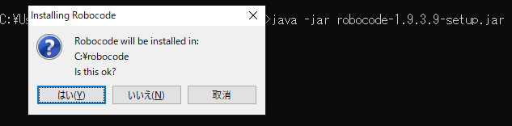
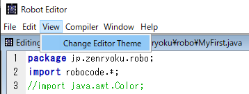

## Robocodeのインストール
1. [プログラムソースは、ここからダウンロード](http://sourceforge.net/projects/robocode/files/)
   

2. [インストーラーは、ここからダウンロード](https://sourceforge.net/projects/robocode/files/robocode/1.9.3.9/)

3. [Robotクラスのメソッドの説明(JavaDoc)はこちら](http://www.solar-system.tuis.ac.jp/Java/robocode_api/robocode/Robot.html)

4. [RobocodeのWiki(英語だけど色々書いている)](https://robowiki.net/wiki/Main_Page)


# Robocodeは無料ゲーム
早い話が[OSS](https://ja.wikipedia.org/wiki/%E3%82%AA%E3%83%BC%E3%83%97%E3%83%B3%E3%82%BD%E3%83%BC%E3%82%B9%E3%82%BD%E3%83%95%E3%83%88%E3%82%A6%E3%82%A7%E3%82%A2)ということです。※オープン・ソース・ソフトウェア＝無料で使用できるアプリケーション


## インストールについて
SourceForgeからダウンロードしたら下のようなファイルがダウンロードできます。
> robocode-1.9.3.9-setup.jar

このファイルは実行可能JARファイルです。しかし、ダブルクリックで実行できなかったので、自分はコマンドで実行しました。下のようにコマンドを叩きます。


＜実行コマンド＞
* ```java -jar robocode-1.9.3.9-setup.jar```

コマンドの内容としては、下の通りです。
* javaコマンドでJavaを起動したりできます。
* -jarオプションをつけてjarファイルaaの実行を行います。
* このオプションをつけてJARファイルを指定すると実行できます。

下のような感じです。


## Roboを作る
インストールしたアプリを起動します。


このアイコンをクリックすると起動できます。


そして、プログラムを作成します。


起動したら、ソースエディタを起動します。初めにプログラムのファイル名(クラス名)を決めます。


そして、作成するファイルを配置するパッケージ名を決めます。


そして、Javaコードが生成されます。


しかし、文字のサイズが小さいので、文字の大きさを変更します。





上のような手順で、サイズを変更します。

そして、お待ちかねプログラムコードです。

### Java Code
```java
package jp.zenryoku.robo;
import robocode.*;
//import java.awt.Color;

// API help : https://robocode.sourceforge.io/docs/robocode/robocode/Robot.html

/**
 * MyFirstProgram - a robot by (your name here)
 */
public class MyFirstProgram extends Robot
{
	/**
	 * run: MyFirstProgram's default behavior
	 */
	public void run() {
		// Initialization of the robot should be put here

		// After trying out your robot, try uncommenting the import at the top,
		// and the next line:

		// setColors(Color.red,Color.blue,Color.green); // body,gun,radar

		// Robot main loop
		while(true) {
			// Replace the next 4 lines with any behavior you would like
			ahead(100);
			turnGunRight(360);
			back(100);
			turnGunRight(360);
		}
	}

	/**
	 * onScannedRobot: What to do when you see another robot
	 */
	public void onScannedRobot(ScannedRobotEvent e) {
		// Replace the next line with any behavior you would like
		fire(1);
	}

	/**
	 * onHitByBullet: What to do when you're hit by a bullet
	 */
	public void onHitByBullet(HitByBulletEvent e) {
		// Replace the next line with any behavior you would like
		back(10);
	}

	/**
	 * onHitWall: What to do when you hit a wall
	 */
	public void onHitWall(HitWallEvent e) {
		// Replace the next line with any behavior you would like
		back(20);
	}
}
```

全体を眺めると、慣れていない人には「なんじゃこりゃー」となるかもしれませんが、一部分のみを見てみましょう。runメソッドです。
```java
	/**
	 * run: MyFirstProgram's default behavior
	 */
	public void run() {
		// Initialization of the robot should be put here

		// After trying out your robot, try uncommenting the import at the top,
		// and the next line:

		// setColors(Color.red,Color.blue,Color.green); // body,gun,radar

		// Robot main loop
		while(true) {
			// Replace the next 4 lines with any behavior you would like
			ahead(100);
			turnGunRight(360);
			back(100);
			turnGunRight(360);
		}
	}
```

そして、コメントを見てみます、英語です。。。

こんな時はGoogle翻訳で訳しましょう。
* ```run: MyFirstProgram's default behavior```


この様に、分解してみていけば、ある程度は何とかなります。
Javaの基本などを学習するのもよいと思います。
[Javaの学習フロー(こんな順序で学習するとよいのでは？)](https://zenryokuservice.com/wp/java-basic-flow-to-learn/)

そして、作成したコードは保存しないと残りません。


保存するのを忘れないようにしましょう。筆者は、再度クラスを作成することになりました。

## 動きを確認する
プログラムを初めて組む人もそうでない人も初めてRobocodeを実装するとなると、どのような動きをするのかコードを書いて動かしてみないことには、どのように動くか実際のところはわかりません。

早い話が、実装したコードを動かしてみないことには何も始まらないということです。

具体的に、どのように実装を進めていくのか？これは人それぞれですが、サンプルとして自分のやり方を紹介します。

## 初めてのRobocode
実装経験のないフレームワークやプログラムコードのカスタマイズを行うときには、既存アプリケーションの起動確認をするのが、手っ取り早い方法です。
なので、まずはサンプルバトルを起動しました。一番上の動画です。

そして、サンプルバトルは起動したので、大まかにどんな動きをするか確認できました。

次は、実際の動きとコードを比較してみましょう。

作成したコードは、コンパイルして。。。


結果の確認。。。


プログラムの実行をしてみます。ここでのポイントは、デフォルトの動き「runメソッドの動きに注目する」というところです。

他のメソッドのコメントを見ると以下のようになっています。実装されているメソッドは4つありました。
1. run: MyFirstProgram's default behavior -> MyFirstProgramのデフォルトの動作
2. onScannedRobot: What to do when you see another robot -> 別のロボットを見たときの対処方法
3. onHitByBullet: What to do when you're hit by a bullet -> 弾丸に当たったときの対処方法
4. onHitWall: What to do when you hit a wall -> 壁にぶつかったときの対処方法

<iframe width="560" height="315" src="https://www.youtube.com/embed/q3SgW-DgAJ0" frameborder="0" allow="accelerometer; autoplay; clipboard-write; encrypted-media; gyroscope; picture-in-picture" allowfullscreen></iframe>

### JavaDocをみる
[JavaDoc](https://robocode.sourceforge.io/docs/robocode/robocode/Robot.html)を見てどんなメソッドがあるか確認します。やはり、英語です。そして翻訳機能に頼ります。
＜原文＞
> The basic robot class that you will extend to create your own robots.
Please note the following standards will be used:
heading - absolute angle in degrees with 0 facing up the screen, positive clockwise. 0 <= heading < 360.
bearing - relative angle to some object from your robot's heading, positive clockwise. -180 < bearing <= 180
All coordinates are expressed as (x,y).
All coordinates are positive.
The origin (0,0) is at the bottom left of the screen.
Positive x is right.
Positive y is up.

＜翻訳＞
> 独自のロボットを作成するために拡張する基本的なロボットクラス。
次の標準が使用されることに注意してください。
見出し-絶対角度（度単位）。0は画面を上に向け、正の時計回りです。
0 &lt;= 機首方位 &lt; 360。
方位-ロボットの機首方位からのオブジェクトに対する相対角度、時計回りに正。
-180 &lt; 方位 &lt;=  180
すべての座標は（x、y）として表されます。
すべての座標は正です。
原点（0,0）は画面の左下にあります。
正のxは正しいです。
正のyが上がっています。

日本語が少しおかしいですが、大体のところは。。。
いや、補足します。
> 正のxは正しいです。
正のyが上がっています。

の部分に関して、「Xは正しい -> 右方向」「yは縦方向」に置き換えて読みましょう。※つたない英語力なので細かい部分はご容赦ください。

ここまでで、基本的なRobocodeの動きを確認する事ができると思います。

あとは、JavaDocを見ながら(翻訳しながら)使えそうなメソッドを使用してみることです。

ちなみに、自分が気になったメソッドは下のものです。
* [fireBullet(double power)](https://robocode.sourceforge.io/docs/robocode/robocode/Robot.html#fireBullet-double-)

弾を打つとエネルギーを消費するが大きなダメージを与えられるようです。

こんなところで。。。導入編を終わりにしたいと思います。

## コードを変更して動かす
自動生成されたコードで動かした場合は、すでに確認したので、次は自分で修正したコードで動かしてみようと思います。

```java
public void run() {
		// Initialization of the robot should be put here

		// After trying out your robot, try uncommenting the import at the top,
		// and the next line:

		// setColors(Color.red,Color.blue,Color.green); // body,gun,radar

		// Robot main loop
		while(true) {
			// Replace the next 4 lines with any behavior you would like
			ahead(100);
			turnGunRight(360);
			back(100);
			turnGunRight(360);
		}
	}```
このコードは、デフォルトの動きを設定しています。なので、この動きを変えてみようと思います。
```// Robot main loop
while(true) {
	// Replace the next 4 lines with any behavior you would like
	ahead(1000);
	turnGunRight(90);
	back(500);
	turnGunRight(90);
}```
1. aheadの引数を100から1000に修正
2. turnGunRightの引数を360から90に修正
3. backも同様に500に修正

実行してみます。
<iframe width="560" height="315" src="https://www.youtube.com/embed/KcLiCnfiEX0" frameborder="0" allow="accelerometer; autoplay; clipboard-write; encrypted-media; gyroscope; picture-in-picture" allowfullscreen></iframe>

これでは、戦いになりませんね。。。

## 次に考えること
ある程度の操作ができることはわかりました。
他のメソッドに関しても同様に修正して動かしてみましょう。

そして、自分が気になったのは、壁にぶつかったときの動きを何とかしたいと思ったので、そのように実装します。

### 壁にぶつかったとき
コメントを頼りにします。

修正するコードは下のものです。

```java
/**
 * onHitWall: What to do when you hit a wall
 */
public void onHitWall(HitWallEvent e) {
	// Replace the next line with any behavior you would like
	back(20);
}```

コードを言葉にすると「壁にぶつかったとき(onHitWall())、20下がる(back(20))」とあるので、向きを変える方向で、修正したいと思います。

それっぽいメソッドを[JavaDoc](https://robocode.sourceforge.io/docs/robocode/robocode/Robot.html)から探します。
次のようなメソッドがあったので、早速実装します。


```/**
 * onHitWall: What to do when you hit a wall
 */
public void onHitWall(HitWallEvent e) {
	// Replace the next line with any behavior you would like
	turnRight(90);
}```

<iframe width="560" height="315" src="https://www.youtube.com/embed/aHQKzzF36w0" frameborder="0" allow="accelerometer; autoplay; clipboard-write; encrypted-media; gyroscope; picture-in-picture" allowfullscreen></iframe>

しかし、右に曲がるだけではイマイチでした。


## 情報収集をする
実装した各イベントに対応するメソッドに渡されている引数の値を表示します。

コンソールに出力する方法はこちらの動画にアップしております。
<iframe width="560" height="315" src="https://www.youtube.com/embed/Na2BbkmTJT8" frameborder="0" allow="accelerometer; autoplay; clipboard-write; encrypted-media; gyroscope; picture-in-picture" allowfullscreen></iframe>

各メソッドの処理内容が知りたいときには[JavaDocを見るのが一番](https://robocode.sourceforge.io/docs/robocode/)です。

### スキャンしたとき
＜引数にあるクラス(Event)＞
[ScannedRobotEvent](https://robocode.sourceforge.io/docs/robocode/robocode/ScannedRobotEvent.html)

＜使用できるメソッド例＞
```out.println("Bearing: " + e.getBearing());
out.println("Distance: " + e.getDistance());
out.println("Energy: " + e.getEnergy());```

### 弾に当たったとき
＜引数にあるクラス(Event)＞
[HitByBulletEvent](https://robocode.sourceforge.io/docs/robocode/robocode/HitByBulletEvent.html)

＜使用できるメソッド例＞
```out.println("Bearing: " + e.getBearing());
out.println("Bearing#power: " + e.getBullet().getPower());
out.println("Heading: " + e.getHeading());
```

### 壁に当たったとき
＜引数にあるクラス(Event)＞
[HitWallEvent](https://robocode.sourceforge.io/docs/robocode/robocode/HitWallEvent.html)

＜使用できるメソッド例＞
```out.println("Bearing: " + e.getBearing());
out.println("BearingRadians: " + e.getBearingRadians());
```

＜出力内容(一部抜粋)＞
> *** onScannedRobot ***
Bearing: -33.82512154957675
Distance: 281.41020026543913
Energy: 0.20000000000001172
*** onHitByBullet ***
Bearing: -33.47367916773932
Bearing#power: 1.0
Heading: 121.41321926877121
*** onHitWall ***
Bearing: 115.11310156348944
BearingRadians: 2.009102634465523


## APIを読んでいて発見したこと
1. **turnRight(e.getBearing()) を実行すれば、 ロボットは弾丸が飛んできた方向を向くことになります。**

## 実行可能なメソッド(コマンド)


|返り値|メソッド名|振る舞い(処理の内容)|
| ---- | ------- | ---------------- |
|void|ahead(double distance)|ロボットを前方に移動させます。|
|void|back(double distance)|ロボットを後方に移動させます。|
|void|doNothing()|このロボットの今回の順番では、何も動作を行いません。|
|void|finalize()|システムによって呼び出され、ロボットのクリーンアップ (終結処理) を行います。|
|void|fire(double power)|弾丸を発射します。|
|Bullet|fireBullet(double power)|弾丸を発射します。|
|double|getBattleFieldHeight()|現在のバトルフィールドの高さを取得します。|
|double|getBattleFieldWidth()|現在のバトルフィールドの幅を取得します。|
|double|getEnergy()|ロボットの現在のエネルギーを戻します。|
|double|getGunCoolingRate()|大砲の冷却速度を戻します。|
|double|getGunHeading()|大砲の向きを 360 度形式で戻します。|
|double|getGunHeat()|大砲の現在の熱さを戻します。|
|double|getHeading()|ロボットの現在の向きを 360 度形式で戻します。|
|double|getHeight()|ロボットの高さを戻します。|
|String|getName()|ロボットの名前を戻します。|
|int|getNumRounds()|現在のバトルのラウンド数を戻します。|
|int|getOthers()|敵ロボットの残り台数を戻します。|
|double|getRadarHeading()|レーダーの向きを 360 度形式で戻します。|
|int|getRoundNum()|現在のラウンドが、 バトルの第何ラウンドかを戻します (1～getNumRounds() の範囲)|
|long|getTime()|現在のゲーム時刻を戻します。|
|double|getVelocity()|このロボットの移動速度を戻します。|
|double|getWidth()|ロボットの幅を戻します。|
|double|getX()|ロボットの X 座標の位置を戻します。|
|double|getY()|ロボットの Y 座標の位置を戻します。|
|void|onBulletHit(BulletHitEvent event)|このロボットが発射したいずれかの弾丸が他のロボットに当たったとき、 このメソッドが呼び出されます。|
|void|onBulletHitBullet(BulletHitBulletEvent event)|このロボットが発射したいずれかの弾丸が他の弾丸に当たったとき、 このメソッドが呼び出されます。|
|void|onBulletMissed(BulletMissedEvent event)|このロボットが発射したいずれかの弾丸がはずれたとき (壁に当たったとき)、 このメソッドが呼び出されます。|
|void|onDeath(DeathEvent event)|このメソッドは、ロボットが死んだときに呼び出されます。 このイベントが通知されるようにするには、 ロボットのコードでこのメソッドをオーバーライドする必要があります。|
|void|onHitByBullet(HitByBulletEvent event)|このロボットに弾丸が命中したとき、このメソッドが呼び出されます。|
|void|onHitRobot(HitRobotEvent event)|このロボットが他のいずれかのロボットと衝突したとき、 このメソッドが呼び出されます。|
|void|onHitWall(HitWallEvent event)|このロボットが壁に衝突したとき、このメソッドが呼び出されます。|
|void|onRobotDeath(RobotDeathEvent event)|このメソッドは、 他のいずれかのロボットが死んだときに呼び出されます。 このイベントが通知されるようにするには、 ロボットのコードでこのメソッドをオーバーライドする必要があります。|
|void|onScannedRobot(ScannedRobotEvent event)|このロボットが他のロボットを発見したとき、 このメソッドが呼び出されます。|
|void|onWin(WinEvent event)|このロボットがバトルに勝ったとき、このメソッドが呼び出されます。|
|void|resume()|stop() による停止中の動作があれば、その動作を再開します。|
|void|run()|各ロボットのメイン・メソッド。|
|void|scan()|他のロボットを探します。|
|void|setAdjustGunForRobotTurn(boolean newAdjustGunForRobotTurn)|ロボットが回転するときに、 大砲が自動的に逆方向に回転するように設定します。|
|void|setAdjustRadarForGunTurn(boolean newAdjustRadarForGunTurn)|大砲が回転するときに、 レーダーが自動的に逆方向に回転するように設定します。|
|void|setAdjustRadarForRobotTurn(boolean newAdjustRadarForRobotTurn)|ロボットが回転するときに、 レーダーが自動的に逆方向に回転するように設定します。|
|void|setColors(Color robotColor, Color gunColor, Color radarColor)|このメソッドは、ロボットの色を設定するために呼び出します。|
|void|stop()|動作をすべて停止し、 後で resume() 呼び出しを使って再開できるよう、保存します。|
|void|stop(boolean overwrite)|動作をすべて停止し、 後で resume() 呼び出しを使って再開できるよう、保存します。|
|void|turnGunLeft(double degrees)|ロボットの大砲を回転させます。|
|void|turnGunRight(double degrees)|ロボットの大砲を回転させます。|
|void|turnLeft(double degrees)|ロボットを回転させます。|
|void|turnRadarLeft(double degrees)|ロボットのレーダーを回転させます。|
|void|turnRadarRight(double degrees)|ロボットのレーダーを回転させます。|
|void|turnRight(double degrees)|ロボットを回転させます。
