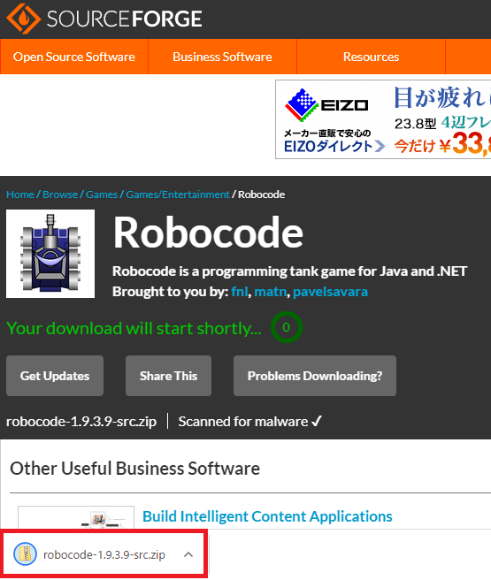

## Robocodeのインストール
1. [ソースは、ここからダウンロード](http://sourceforge.net/projects/robocode/files/)
   

2. [起動ファイルは、ここからダウンロード](https://sourceforge.net/projects/robocode/files/robocode/1.9.3.9/)

3. [Robotクラスのメソッドはこちら](http://www.solar-system.tuis.ac.jp/Java/robocode_api/robocode/Robot.html)

4. [RobocodeのWiki](https://robowiki.net/wiki/Main_Page)

5. 
