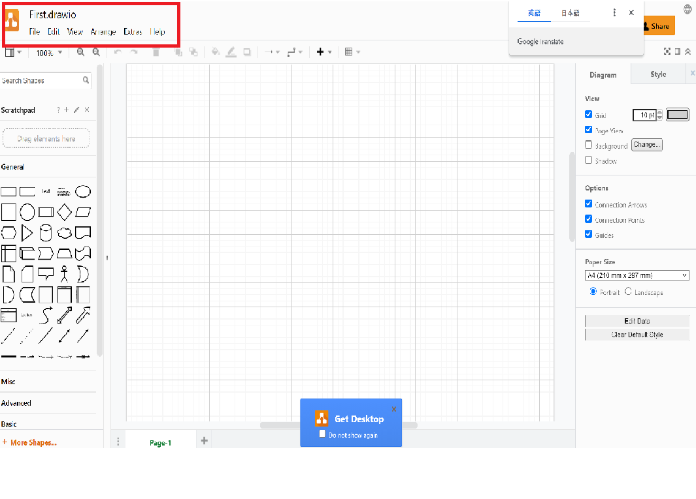
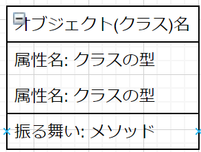

# UMLの学習１: 初めてのUML

**INDEX**
1. UMLとは
2. UMLの種類
3. UMLを使う理由
4. オブジェクト図を書いてみよう

## 1.[UMLとは](https://ja.wikipedia.org/wiki/%E7%B5%B1%E4%B8%80%E3%83%A2%E3%83%87%E3%83%AA%E3%83%B3%E3%82%B0%E8%A8%80%E8%AA%9E)
UML、英: Unified Modeling Language）は、主にオブジェクト指向分析や設計のための、記法の統一がはかられた（Unified）モデリング言語（Modeling Language）である
統一されているのは構文に相当する記法だけで、仕様を表現するような意味が形式的に与えられていない図もあるので、**形式仕様記述言語ではない**。

**つまり**
世界共通のモデリング言語で、プログラムの構造、振る舞い、相互関係を表現するための言語(表記方法)。

## 2.UMLの種類(ダイアグラムの種類)
UMLは、作成するプログラムを表現するために、以下の13の図(ダイアグラム)を使用する。 ※今後増える可能性はある。
それぞれの図に対する書き方のルールを統一したものなので、これらの図にはそれぞれ下のような名前がついている。

[参考ページ](https://ja.wikipedia.org/wiki/%E7%B5%B1%E4%B8%80%E3%83%A2%E3%83%87%E3%83%AA%E3%83%B3%E3%82%B0%E8%A8%80%E8%AA%9E)
1. 	構造図
 * クラス図: システムを構成するクラス（概念）とそれらの間に存在する関連の構造を表現する。ユーザの視点から、システムを構成する物や概念を表す。
  
 * コンポーネント図: 物理的な構成要素 (ファイル、ヘッダ、ライブラリ、モジュール、実行可能ファイルやパッケージなど) からシステムの構造を表現する。
  
 * オブジェクト図: クラスを実体化して生成されたオブジェクト同士の関係を表現する。
 
 * コンポジット構造図: クラスやコンポーネントの内部構造を詳細に表現する。特に、構成要素を入れ子で表現することができる。
 
 * ディプロイメント図: ハードウェアとアプリケーションとの関係を図示したもの。
 
 * パッケージ図: パッケージ同士の依存関係を描画することで論理的なグルーピングをするための図で、クラス図の一部である。パッケージは、慣例的にはディレクトリ構造のように表すことができる。パッケージ図では、システムを論理的な階層構造に分解するのに役立つ。
 

2. 	振る舞い図
 * アクティビティ図: フローチャートである。
 
 * ステートマシン図: 状態遷移図である。
 
 * ユースケース図: システムの機能などを、ユーザの視点などを含めた「ユースケース」として図示するもの。これを、有効に活用することにより、システムの全体像を開発者とユーザが一緒に評価しやすくなる、であるとか、完成後のシステムがユーザの要望に合わないという問題を軽減できる、といったように主張される。
  

3. 	相互作用図
 * シーケンス図: オブジェクト間のメッセージの流れを時系列に表す。図の中に時間の流れが存在するため、イベントの発生順序やオブジェクト間の生存時間を記述することができる。
 
 * タイミング図: システムを構成する要素の状態遷移と、要素間のメッセージ送受信のタイミングを同時に表現する。ステートマシン図と相互作用図の性質を併せ持つ。
 
 * コミュニケーション図（コラボレーション図）: オブジェクト間のメッセージのやり取りを示す。シーケンス図とは、異なりオブジェクトを中心に記述する。UML2.xから一部の表記変更と共にコラボレーション図から、コミュニケーション図に名称が変更された。
 
 * インタラクション概要図: 複数の相互作用が、条件によって分岐するような複雑なシステムの相互作用を表現する。
 

## 3.UMLを使う理由
### そもそもUMLとはなんなのだろうか？
プログラムを作成し実現したい機能があったとします。そのプログラムをどのように作成するか？を細かく全て言葉で伝えるのはとても大変です。
もちろん、文章を使用して、図も使用して、いろんな方法がありますが、これらの方法をまとめ、世界共通のものを作ってしまうのが1番効率的です。
それでできたのがUMLです。

言葉を変えていうならば、**先人たちが提唱してきたオブジェクト指向開発技法のモデル表記法を1つにまとめた**ものなのです。

UMLには、以下のような特徴があります。
1. 図で書いた方がわかりやすい
2. もの(オブジェクト)と、もの(オブジェクト)の**関連を**表す
3. もの(オブジェクト)と、もの(オブジェクト)の**やりとり(振る舞い)を**表す
2. もの(オブジェクト)と、もの(オブジェクト)の**相互作用を**表す

### まずは使ってみよう(Astahを使用して学習します)
1. Astahを起動する
  
2. クラス図を作成する
  
3. オブジェクト図の場合は「インスタンス仕様」を使う
  
4. 作成すると下のような形
  

### まずは使ってみよう２(他のツールdraw.ioの場合)
1. ブラウザ(ChromeやEadgeなど)を開き[draw.io](http://draw.io)を開きましょう。
 

2. 「Create New Diagram」をクリックしましょう。
 

3. 「Blank Diagram」を選択してみましょう。
 

これでUMLを書く準備ができました。

上のオブジェクトを選択(クリック)して描画していきます。

### オブジェクト図のサンプル
例えば、ステージの上にいるジミ・ヘンドリックスをオブジェクト図で表現してみます。

## 4.オブジェクト図を書いてみよう
オブジェクト図の基本単位は「オブジェクト」になります。
このオブジェクトをどのように書いたら良いか？下のように書きます。

※**クラス名は省略して書くこともできます**。

なお、使用するUMLツールは、上記の[draw.io](http://draw.io)とします。

### チャレンジ１
PGボックス株式会社に務めている、三井太郎さんの所有する携帯をUMLで表現してみましょう。
登場する人物(オブジェクト)は以下の3つになります。
* 会社: クラス名は「Company」とする
* 三井太郎さん: クラス名は「Human」とする
* 携帯: クラス名は「Phone」とする

## 5.オブジェクトって何？
オブジェクトとは、**何かしらのモノ**です。この「何かしらの」というところがややこしいのですが、
結論的には、「なんでもオブジェクト」です。大まかに下のように分類できます。

＜オブジェクトの分類表＞

| 物理的オブジェクト | 概念的オブジェクト |
| ---------------- | ----------------- |
| XXさんの手帳      | 夏休みの予定       |
| XXオフィスビル    | 会社(会社は法人であり、実体がありません) |
| ノートPC          | PC内のデータ(デジタルデータで物理的なものではありません) |

### オブジェクト指向とは
**ソフトウェアとオブジェクトの集まりとして構成し、それらがメッセージによって協力し合いプログラムを動かす**
という考えかた。

### オブジェクト(クラス)の中身
オブジェクト(クラス)は下の3つを持っています。
1. 名前 ※Javaの場合はクラス名
2. プロパティ(属性) ※Javaの場合はフィールド変数
3. 振る舞い ※Javaの場合はメソッド

これを図にすると**クラス図**になります。これに関しては後々に学習しますがイメージだけでも触れておきます。

上の＜オブジェクトの分類表＞にあるものを表現するのであれば、下のように表現できます。
オブジェクト図では、「モノ」と「モノ」の関係がわかればよいので属性や振る舞いを記載しません。
これに対して、**クラス図**では、オブジェクトの中身も表現します。なので上記の3つも記載します。

#### クラス図(オブジェクトを表現したときの)例
<XXさんの手帳>
XXさんを表現するオブジェクト(クラス)があり、XXさんが保有している手帳なので手帳は真ん中の部分に書きます。

