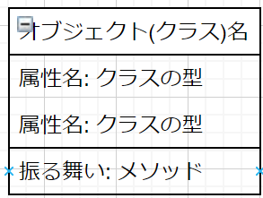
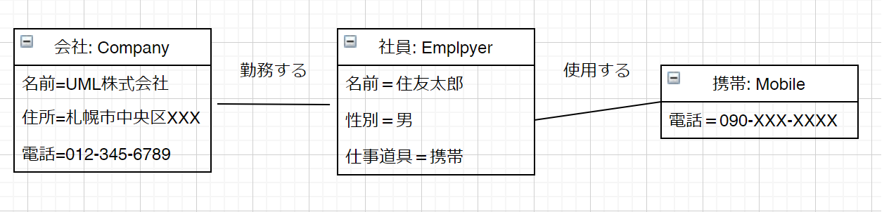
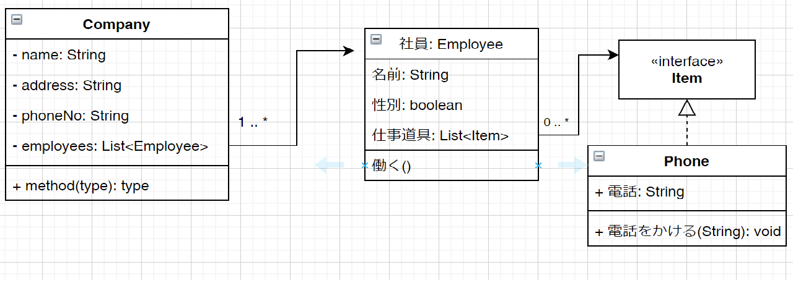
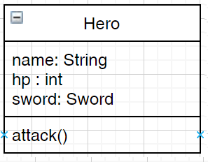

# モデルとは
プラモデル、プロトタイプモデル、趣味レーションモデル、設計モデル、ビジネスモデルなどいろいろあるが、
共通点は**いずれも本物ではないが、ある一面は本物に近いということ**です。

早い話が**物事(何かしらの対象)を単純化したもの**ということです。

| モデルの例 | 説明 |
| --------- | ---- |
| プラモデル | 飾りが目的で、外観が本物に似ている事を重視する。中身は空っぽでよい |
| 模型飛行機 | 飛ばすことを目的としている模型飛行機は、ゴムの力でプロペラを回し、飛ばせるようにします。外観は異なっていて問題ありません。 |
| 設計モデル | 本物の飛行機を作るための設計図もモデルです。飛行機の様々な側面を図にして作成するための資料にします。 |

**INDEX**
1. UMLのダイアグラム
2. オブジェクトとは何か？
3. クラスの持ち物

### オブジェクトモデル
[参考ページ](https://kotobank.jp/word/%E3%82%AA%E3%83%96%E3%82%B8%E3%82%A7%E3%82%AF%E3%83%88%E3%83%A2%E3%83%87%E3%83%AB-2069)
> プログラムと関連するデータをまとめたオブジェクトを、ひとつのモデルとして把握する考え方。たとえば、オブジェクト指向プログラミングでは、個々のモデルを組み合わせてプログラミングを行うため、ソースコードの作成後も全体を整理して把握できる。

参考ページの文言のように、プログラムを作るときに使用するのは「オブジェクトモデル」のことであり、モデル(物事を単純化したもの)というのはJava言語の場合だと
クラスを示すことになる。

この「クラス」=「モデル」=「オブジェクト」の関連や振る舞い、メッセージのやり取りを表現するのがUMLということです。

**メッセージのやり取り**というのは、Mainメソッドから作成したクラスをインスタンス化(new)するとか、ブラウザのURL部分に「localhost:8080」と入力して画面を表示するということです。
※「localhost:8080」と入力するとSpringBootが裏側でコントローラークラスを呼び出してくれます。このように**クラスやメソッドを呼び出す**事を呼び出し(メッセージを送る)といいます。実際に送るメッセージ内容はメソッドの引数に渡すもの(オブジェクト)のことです。

## 1.UMLのダイアグラム
以下13のダイアグラムがあります。
[参考ページ](https://ja.wikipedia.org/wiki/%E7%B5%B1%E4%B8%80%E3%83%A2%E3%83%87%E3%83%AA%E3%83%B3%E3%82%B0%E8%A8%80%E8%AA%9E)
1. 	構造図
 * クラス図: システムを構成するクラス（概念）とそれらの間に存在する関連の構造を表現する。ユーザの視点から、システムを構成する物や概念を表す。
  
 * コンポーネント図: 物理的な構成要素 (ファイル、ヘッダ、ライブラリ、モジュール、実行可能ファイルやパッケージなど) からシステムの構造を表現する。
  
 * オブジェクト図: クラスを実体化して生成されたオブジェクト同士の関係を表現する。
 
 * コンポジット構造図: クラスやコンポーネントの内部構造を詳細に表現する。特に、構成要素を入れ子で表現することができる。
 
 * ディプロイメント図: ハードウェアとアプリケーションとの関係を図示したもの。
 
 * パッケージ図: パッケージ同士の依存関係を描画することで論理的なグルーピングをするための図で、クラス図の一部である。パッケージは、慣例的にはディレクトリ構造のように表すことができる。パッケージ図では、システムを論理的な階層構造に分解するのに役立つ。
 

2. 	振る舞い図
 * アクティビティ図: フローチャートである。
 
 * ステートマシン図: 状態遷移図である。
 
 * ユースケース図: システムの機能などを、ユーザの視点などを含めた「ユースケース」として図示するもの。これを、有効に活用することにより、システムの全体像を開発者とユーザが一緒に評価しやすくなる、であるとか、完成後のシステムがユーザの要望に合わないという問題を軽減できる、といったように主張される。
  

3. 	相互作用図
 * シーケンス図: オブジェクト間のメッセージの流れを時系列に表す。図の中に時間の流れが存在するため、イベントの発生順序やオブジェクト間の生存時間を記述することができる。
 
 * タイミング図: システムを構成する要素の状態遷移と、要素間のメッセージ送受信のタイミングを同時に表現する。ステートマシン図と相互作用図の性質を併せ持つ。
 
 * コミュニケーション図（コラボレーション図）: オブジェクト間のメッセージのやり取りを示す。シーケンス図とは、異なりオブジェクトを中心に記述する。UML2.xから一部の表記変更と共にコラボレーション図から、コミュニケーション図に名称が変更された。
 
 * インタラクション概要図: 複数の相互作用が、条件によって分岐するような複雑なシステムの相互作用を表現する。
 

## 2.オブジェクトとは何か？
オブジェクトとは、**何かしらのモノ**です。この「何かしらの」というところがややこしいのですが、
結論的には、「なんでもオブジェクト」です。

ただ、なんでもよいといっても、ちゃんと人が認識できる必要があるのでオブジェクトを表現するときには、以下のような特徴を書きだします。
1. 名前
2. 状態
3. 振る舞い(操作)

これらを書きだすとUMLでは、下のような図になります。(クラス図です)


### オブジェクトとクラスの違い
いろんな書籍で「オブジェクト」と「クラス」の違いについて記載していますが、重要なことではないと思います。
まとめると下のようなことです。

> オブジェクトは、インスタンスのこと
クラスは、インスタンスの元になる設計図のこと

これでよいと思います。インスタンスのこと以外にも、プログラムの話をしている最中に出てくる「オブジェクト」という言葉は、「何かしらの対象(インスタンスやクラス)」として使われることが多いように思います。

しかし、オブジェクト図とクラス図は明確な違いがあります。
オブジェクト図は具体的な値を持っている状態で描かれるのに対して、クラス図は抽象的になります。

＜オブジェクト図＞


＜クラス図＞


## 3.クラスの持ち物
クラスは下のものを持ちます。
1. 名前 ※Javaの場合はクラス名
2. 属性(状態) ※Javaの場合はフィールド変数
3. 操作(振る舞い) ※Javaの場合はメソッド

クラスとオブジェクトの違いは、**インスタンス化されているかいないか**です。
しかし、これらを言葉で表現するときに明確な区別はつけません。

### クラス(オブジェクト)の責務
クラス(オブジェクト)は責務を持ち外部からのメッセージで呼び出します。
プログラムで書くと下のようになります。

#### 自分で作成した「勇者」クラスの責務
下のような「勇者クラス」を作成しました。このクラスは次の属性を持っています。
* 名前(name): String
* HP(hp): int
* 武器(Sword): Sword

＜クラス図＞



ズバリ、勇者を部分的に表現した「モデル」です。
この「勇者クラス」は目的があって、プログラマによって作成されます。
プログラマはこの「勇者クラス」にRPGゲーム内で**「勇者を表現する」という役割(責務)**を持たせます。

下のコードだと勇者が表現しきれていないのですが、「XXXの攻撃」とか「XXXは10のダメージを受けた」という表示は行うことができます。

```java
public class Hero {
	private String name;
	private int hp;
	private Sword sword;

	public Hero() {
		name = "ミナト";
		hp = 100;
		// 装備なし
		sword = null;
	}

	/** 権を装備する勇者 */
	public Hero(String name, Sword sword) {
		name = "ミナト";
		hp = 100;
		// 装備なし
		this.sword = sword;
	}

	public void attack() {
		System.out.println(name + "は攻撃した");
		System.out.println("敵に5のダメージ");
	}

	/////// GetterとSetter は省略///////////////////

}
```
#### 説明
勇者を表すHeroクラスの説明です。
* 「勇者」を表すために属性(フィールド変数)に名前、HP、剣(武器)を持たせます。
* 「勇者」はモンスターと戦うので、「たたかう」という操作を行います。

#### 自分で作成した「Main」クラスの責務
次は、上で作成した勇者クラスを動かすためのクラス「Mainクラス」について見てみます。

```java
public class Main {
  public static void main(String[] args) {
  	Sword sword = new Sword();
  	sword.setName("炎の剣");
  	sword.setDamage(20);

  	Hero hero = new Hero();
  	hero.setSword(sword);

  	System.out.println("現在の武器は" + hero.getSword().getName() + "です");
  }
}
```
#### 説明
メインメソッドの説明。
* 勇者クラスをインスタンス化してSwordクラスをセット(装備)しています。
* Swordクラスは剣(ソード)を表現しているクラスです。もちろん**責務は「剣を表す」事**です。
* 勇者が装備している武器をコンソール(標準出力)に表示します。

### Webアプリケーションの場合
次は、Webアプリケーションを作成したときのケースを見てみましょう。
俗にいう**MVCモデル**という概念です。これは下のように3つの役割(責務)を持つクラス(オブジェクト)を下のように分類しアプリケーションを作成するという設計手法です。

* **M(Model)**: ここでいう「モデル」とは「データモデル」のことです。DBのテーブルを表現するクラス(Entity)やDBにアクセス(Daoなど)、計算などの処理を行うクラスを分類します。
* **V(View)**: ブラウザに表示するHTMLを生成するJSP、Thymeleafで作成したHTMLのことです。コントローラークラスからデータを受け取り表示します。
* **C(Controller)**: コントローラークラスのことです。Viewからリクエストを受け、どの画面に遷移するか、どのような処理をするかなどの操作(コントロール)を行うクラスを分類します。


ここで、**分類する**という表現をしましたが、これは例ですが、次のようなWebアプリケーションを作成したときにM、V、Cに責務を分担してクラスを作成するとわかりやすいプログラムになります。
**例**
次のような画面があるWebアプリケーションを作成したとき、各画面のHTMLが**ビュー**(View)になります。
※tymeleafでHTMLを使用したとき

1. ログイン画面(login.html)
2. 一覧画面(listView.html)
3. 登録画面(add.html)

ここで、画面ごとに**コントローラー**クラスは3つ作成します。
* LoginController(ログインコントローラー)
* ListViewController(一覧コントローラー)
* AddController(登録コントローラー)

それぞれの画面に対してリクエストを受けたときのコントロールを行うクラスたちになります。

そして、DBアクセスするために**モデル**を作成します。
* User(Entityクラス)
* UserDao(Daoクラス)

Userクラスは、DBに作成したテーブルを表現していてDBのデータを格納します。
UserDaoは、DBに作成したユーザーテーブルへのデータ操作(CRUD)を行うためのクラスです。

このように、**M(Model), V(View), C(Controller)**というように役割分担を行いアプリケーションを作成すると
プログラムを見直すときや、デバックするときに処理を追いかけやすくなります。

**パッケージングの例**
* **jp.sample**
  Main.java
* **jp.sample.controller**
  LoginController.java
  ListViewController.java
  AddController.java
* **jp.sample.model**
  User.java
  UserDao.java

#### SpringBootのコントローラークラスの責務

```java
@Controller
public class HelloController {
  /** 悪性巣したかしてないか */
  private boolean isAccessed;

	@Autowired
	private MyRepostory repository;

	@RequestMapping(value = "/",method = RequestMethod.GET)
	@ResponseBody
	public ModelAndView getA(//@ModelAttribute("postlist") MyData2 mydata3,
			ModelAndView mav) {
		// アクセスされた
    isAccessed = true;
		mav.setViewName("Framework");
		mav.addObject("title","Mydata");
		mav.addObject("datalist",new MyData2());
		List<MyData> data = repository.findAll();
		mav.addObject("formModel",data);

		return mav;

	}
  @RequestMapping(value = "/", method = RequestMethod.POST)
  @Transactional(readOnly = false)
  @ResponseBody
  public ModelAndView postA(@ModelAttribute("datalist") MyData mydata,ModelAndView mav) {
    repository.save(mydata);
    return new ModelAndView("redirect:/");
  }


}
```

#### 説明
HelloControllerクラスの説明です。
* HelloControllerクラスはリクエストを受け付け処理を行う責務を持っています
* 属性として、isAccessedを持っていて、アクセスがあった(メソッドが動いた)時にtrueに変わります
* 同様に、属性として、MyRepostoryを持っていて、DBにアクセス、データの取得などを行います
　これは、状態を表すものではありませんが「DB操作をするため」に持っているものです。
* 操作としては、①URLが「/」(http://localhost/)がリクエストされた時は「getA」が動く
  同様に、②POST送信で「/」がリクエストされたときは「postA」が動く

【補足】
属性として「状態」を表すものは、「isAccessed」ですが、アクセスが離れた後の処理がありません。

\@Controllerを付けたクラスの責務としては、リクエストを受けたときの処理を行う。というものになります。
※SpringBootを使用
