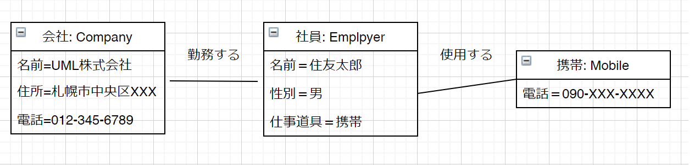
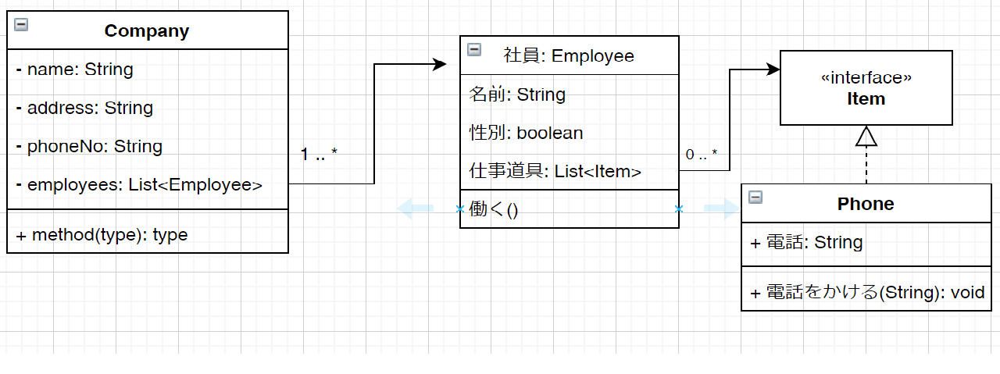

# クラス図の書き方
クラス図の基本になるクラスは下のように書きます。


そして、オブジェクト図では属性、操作を表示する必要があるときに書けばよいので下のように書きます。


具体的に書くと下のようになります。
＜オブジェクト図A＞


＜クラス図A＞


## 属性の書き方
属性は英語では**Attribute**といいます。プロパティと呼ぶこともありますが、属性と言った方がわかりやすいです。
これの書き方は、Javaプログラムを思い出してほしいのですが、クラスHumanを例にすると下のようになります。

＜UMLで書くHumanクラス＞


＜Javaプログラムで書くHumanクラス＞
```java
public class Human {
	/** 名前 */
	protected String name;
	/** 職業 */
	protected String job;
	/** 年齢 */
	protected int age;
	/** 性別 */
	protected boolean sex;

	public void escape() {
		// 処理内容が決まっていないので空実装
	}

	public void attack() {
		// 処理内容が決まっていないので空実装
	}
}
```
＜アクセス修飾子について＞

| 記号 | Java | 意味 |
| ---- | --- | ---- |
| + | public | どこからでも参照可能 |
| - | private | クラス内からのみ参照可能 |
| # | protected | 継承関係のあるクラスから参照可能 |

クラスを書くときに、フィールド変数(=属性)とメソッド(操作)を書きます。プログラムでもUMLでも同じですが、UMLにはプログラムは書きません。


## リンクの多重度
オブジェクト図とクラス図の例を見てみるとオブジェクト(クラス)とオブジェクト(クラス)の間に線があります。
これを「リンク」といいます。

しかし、会社をオブジェクト図にすると社員が1000人いるような会社は図に書ききれません。
なので、クラス図で表します、ここで使用しているリンクについている「1 .. \*」は**多重度**を表します。

クラス図Aの場合は、会社(Company)が一つに対して、社員が複数となります。このような関係を**one-to-many**といい「1 .. *」と書きます。

同様に、「0 .. \*」は**zero-to-many**といいます。

表にすると下のようになります。

| 表記 | 意味 |
| ---- | --- |
| 1 | リンクするオブジェクトが一つ |
| 0 .. 1 | リンクするオブジェクトが1つか存在しないか |
| * | リンクするオブジェクトが複数存在するか存在しない |
| 0 .. * | 「*」と同じ |
| 1 .. * | リンクするオブジェクトが必ず1つ以上存在する |

＜例＞


### クラスの継承とインターフェースの実装
クラスを継承するときの書き方です。


## クラス階層(継承関係)について
アプリケーションを作成していく途中で「似たような機能だけど微妙に処理が違う」という処理が沢山出てきます。
このような時には、クラスを階層化(継承関係を作成)すると作業効率が上がり、ソースも読みやすくなります。

### RPGゲームのキャラクターを作成する場合
毎度おなじみのゲームです。登場するキャラクターは下のものに限定します。
* 勇者
* シーフ
* 魔法使い

これらのクラスを作成するときに、全て別々に作成するよりも下のように継承関係を作った方が簡単に作成することができます。
クラス図にすると下のようになります。


細かい部部に関しては省いております。

ここでもJavaプログラムで表現してみます。

1. Humanクラスに各キャラクターが共通して持つ属性を定義してしまいます。
```java
public class Human {
	/** 名前 */
	protected String name;
	/** 職業 */
	protected String job;
	/** 年齢 */
	protected int age;
	/** 性別 */
	protected boolean sex;

	public void escape() {
		// 処理内容が決まっていないので空実装
	}

	public void attack() {
		// 処理内容が決まっていないので空実装
	}
}
```

2. その他の属性は各キャラクター固有のものなのでそのクラスに定義します。※UML上では何も書いていませんが。。。

  ＜勇者＞
  ```java
  public class Hero extends Human {
  }
  ```

  ＜シーフ＞
  ```java
  public class Shief extends Human {
  }
  ```

  ＜魔法使い＞
  ```java
  public class Magician extends Human {
  }
  ```

これらは全て共通する属性・操作のみを持った状態のクラスになります。
違うのはクラス名だけです。
つまり、親クラスで定義されているフィールド変数とメソッドは子クラスでも使用することができるということです。

ただし、アクセス修飾子が「private」になっている場合は子クラスから参照(使用)することができません。

ここから、各キャラクターの固有属性・操作を追加します。

例えば下のような実装もできます、

＜勇者＞
```java
public class Hero extends Human {
  @Override
  public void attack() {
    System.out.println("勇者の攻撃、誰かに5のダメージ");
  }
}
```

＜シーフ＞
```java
public class Shief extends Human {
  /** 盗みが成功するとTRUE */
  public boolean steal() {
    System.out.println("シーフは誰かから何かを盗んだ");
    return true;
  }
}
```

＜魔法使い＞
```java
public class Magician extends Human {
  public void magic() {
    System.out.println("魔法使いは誰かに何かの魔法をかけた");
  }
}
```

細かい処理が決まっていないので、各メソッドには引数も返り値も決まっていません。
※シーフは盗みが成功するとTRUEを返す「steal()」を実装しています。

#### 継承する意味の補足
継承関係を作ったとき、＜勇者クラス＞は、次のコードと同じ意味になります。

＜**サンプル**＞

```java
public class HeroSample {
	/** 名前 */
	protected String name;
	/** 職業 */
	protected String job;
	/** 年齢 */
	protected int age;
	/** 性別 */
	protected boolean sex;

	public void escape() {
		// 処理内容が決まっていないので空実装
	}

	public void attack() {
    System.out.println("勇者の攻撃、誰かに5のダメージ");
	}
}
```

### is - aの関係
ここまで見てみると「Human(人間)」というカテゴリに「勇者」「シーフ」「魔法使い」が入っている形になります。
このように「勇者は人間です」ということが言える関係のことを「is-aの関係」と呼びます。

まとめると、「A is-a B」としたときに「AはBのグループに入る」ということです。

## 抽象クラス
※astahには"{abstract}"を表記することができない

抽象クラスは、単純に**通常のクラスに「抽象メソッド」を持たせることができるクラス**です。
そして、「new」して使用することができません。通常のクラスの場合はしたのように「new」して使用することができます。

```java
public static void main(String[] args) {
  // 通常のクラス
  Hero hero = new Hero();
  hero.attack();

  // 抽象クラス
  Human human = new Human(); -> ここでビルドエラーになる。
}
```
「new Human()」と書いてある部分でビルドエラーになるのは、抽象クラスは「new」できないルールになっているからです。

具体的にはどのように使うのか？これを以下に示します。

### Humanクラスを考える
このHumanクラスは、継承して使用することを目的としています。なぜなら「勇者」「シーフ」などに共通する属性・操作を持たせた**抽象的なクラス**
だからです。

しかし、上のHumanくらすは通常のクラスになっています。説明の順序的な問題でこのように書きました。

ここから具体的に抽象クラスに変更して行こうと思います。

1. ただ単に抽象クラスに変更する。「**class**」の前に「**abstract**」をつけただけです。
```java
public abstract class Human {
	/** 名前 */
	protected String name;
	/** 職業 */
	protected String job;
	/** 年齢 */
	protected int age;
	/** 性別 */
	protected boolean sex;

	public void escape() {
		// 処理内容が決まっていないので空実装
	}

	public void attack() {
		// 処理内容が決まっていないので空実装
	}
}
```

2. 抽象メソッドを作る。「人間」だけでは「どのように」逃げる(escape)のか、攻撃(attack)するのか、わかりませんのでこれを抽象メソッドにします。
```java
public abstract class Human {
	/** 名前 */
	protected String name;
	/** 職業 */
	protected String job;
	/** 年齢 */
	protected int age;
	/** 性別 */
	protected boolean sex;

	public abstract void escape();

	public abstract void attack();
}
```

3. 抽象メソッドはオーバーライドして実現する。「実現」というのは処理の中身を書くということです。処理を書くことで「実際にどう動くのか？」を明確にします。
```java
public class Hero extends Human {

	@Override
	public void escape() {
		System.out.println("勇者は、にげだした");
	}

	@Override
	public void attack() {
    System.out.println("勇者の攻撃、誰かに5のダメージ");
	}
}
```

4. この状態で、勇者固有の処理を追加してやれば、まともな勇者クラスになります。
```java
public class Hero extends Human {
  /** 勇者固有の処理 */
	public void destiny() {
		System.out.println("勇者は、なんとか魔王を倒し、世界に平和を取り戻した。");
	}

	@Override
	public void escape() {
		// TODO 自動生成されたメソッド・スタブ

	}

	@Override
	public void attack() {
		// TODO 自動生成されたメソッド・スタブ

	}
}
```

## 多様性：インターフェースを使う
次のようなことをイメージしてください。電源スイッチがあり、電球が**A.1960年代のもの**と**B.2000年代のもの**と**C.現代のLED電球**があったとします。

＜電球＞


＜ソケット＞


＜スイッチ＞


ここで、スイッチをONにすると電球に明かりがつくという前提で、この関係をクラス図で示してみます。


このような形で「電球」という抽象的な概念の下に「60年代の電球」というような具体的なモノを作ることでるぐーピングできるのもありますが
**名前は同じでも実際の動きが違う**モノをプログラムで表現(実装)することができます。

このような表現(実装)のことを「ポリモーフィズム(多様性・多態性)」と呼びます。

もちろん、今のような実装は**抽象クラスを用いてもできます**、ただ今回は「明かりをつける(**lighting()**)」という処理のみを作成したかったのでインターフェースを使用しました。
