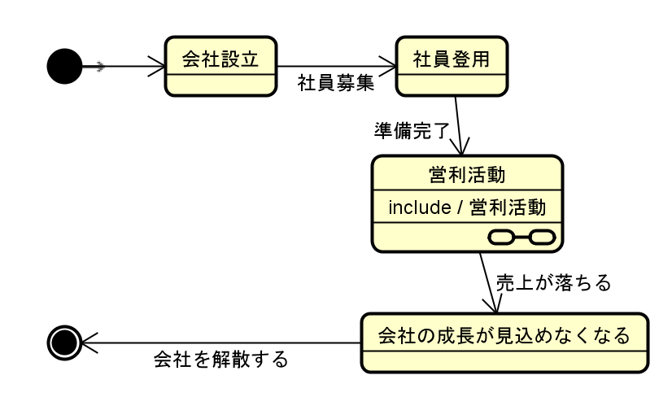
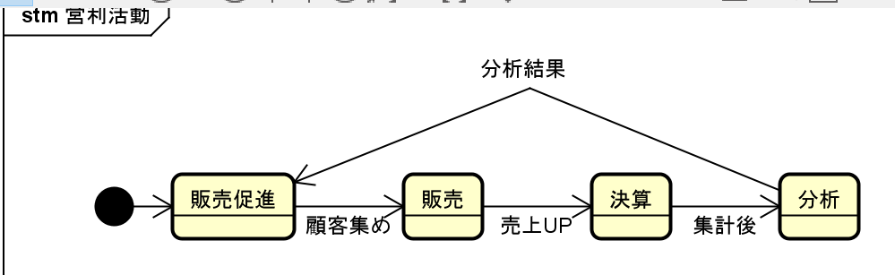
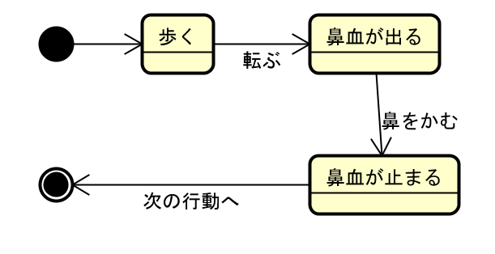

# ステートマシン図の書き方
ステートマシン図とは、状態を表すための図です。イメージにあるのは会社を運用するときの状態遷移を示しています。
※実際には、各部署でそれぞれの業務を行う会社が多いです。

## イメージ
<図A>

<図B>

ステートマシン図に子供を作ることもできる、上記の「営利活動」は図Aを大本にして、子供の図(営利活動の詳細)を示しているのが図Bになる。

## 内容に関して
1. 開始状態を表す
  

2. 終了状態を表す
  

3. 各状態を表す
  

4. イベント
  

イベント(トリガー)は、その状態が変化するきっかけになる物事を示す。
例えば、以下のような状態変化があります。

