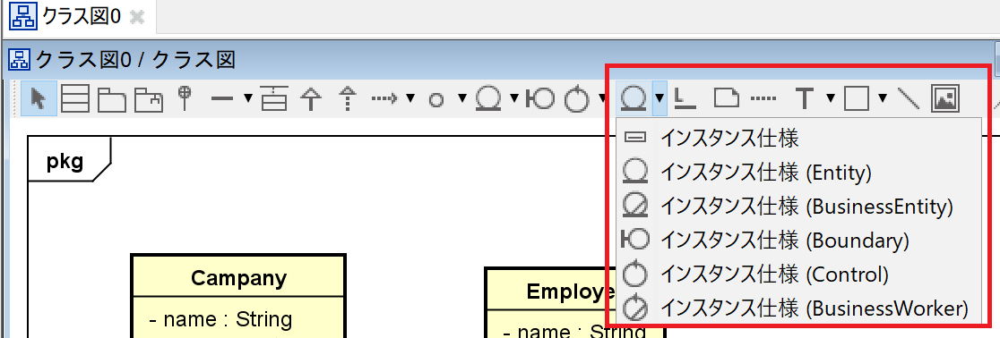
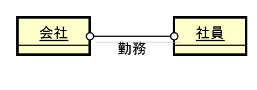

# Astahの使い方
UMLを描くためのツールです。しかし、このAstahに関しては、無料での手桔梗が終わってしまったため、古いバージョンのものを使用します。

他にも、次のようなものがあります。
* [StarUML](https://www.draw.io/)
* [Cacoo](https://cacoo.com)
* [gliffy](https://www.gliffy.com)

### まずは使ってみよう
1. Astahを起動する

  
2. クラス図を作成する

  
3. オブジェクト図の場合は「インスタンス仕様」を使う

  
4. 作成すると下のような形

  

## 新規作成
1. 新規に作成するときは下のような画面が見れます。

2. 次に「クラス図」を選択します。

3. クラス図のテンプレートが表示されます。赤枠で囲っているものはパッケージを示します。前回作成したSpringBootのパッケージです。

### クラスの追加方法
1. をクリックし、適当な場所をクリックします。

2. クラスの図(ダイアグラム)が出来たらそこに必要な情報を書き込みます。

3. 新しいクラスを作成したときは、下のように新規作成します。

4. 前回作成したものを大まかに書くと下のようになります。

